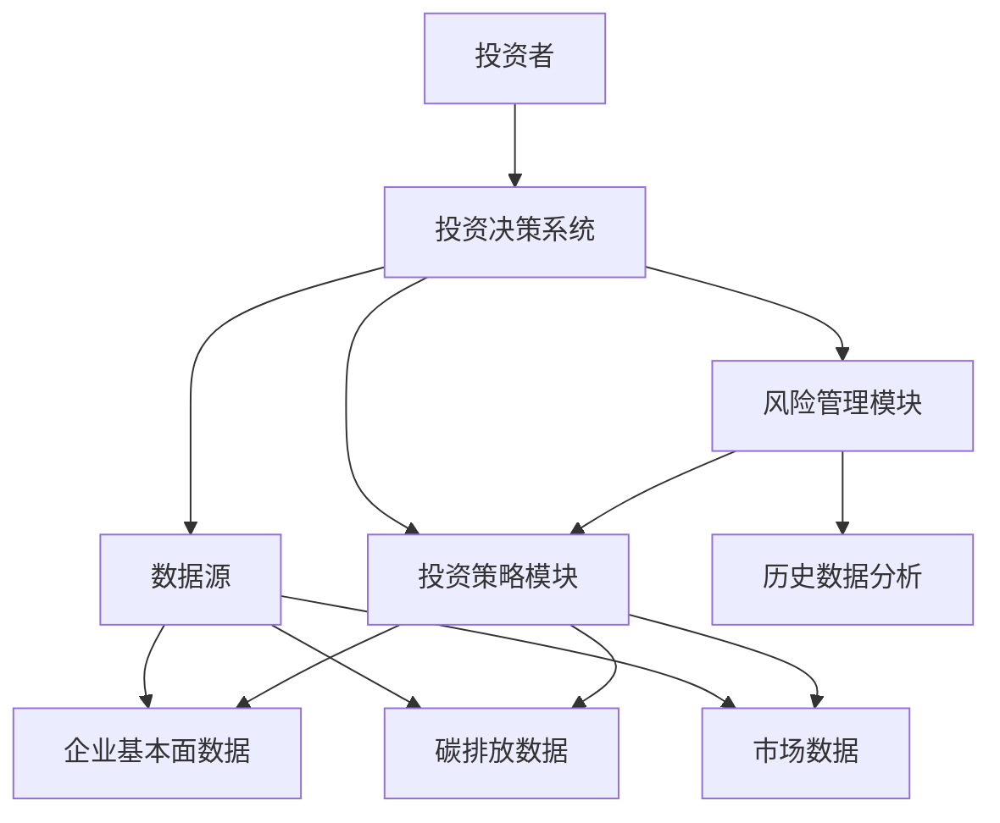

                 

# 巴菲特-芒格的碳中和投资策略：环保与盈利的平衡

## 关键词：巴菲特，芒格，碳中和，投资策略，环保盈利平衡

## 摘要：本文深入探讨巴菲特和芒格的投资哲学，分析碳中和对投资策略的影响，结合长期投资与环保企业评估，构建碳中和投资系统架构，并通过具体案例展示投资实战，强调环保与盈利的平衡。

---

## 正文

### 第一部分：巴菲特与芒格的投资理念

#### 第1章：巴菲特与芒格的投资哲学

##### 1.1 巴菲特的价值投资理念

- **价值投资的定义**：价值投资是通过深入分析企业的基本面，寻找市场低估的投资标的。巴菲特强调购买优秀的企业，而非市场的短期波动。

- **核心要素**：包括企业盈利能力、财务状况、竞争优势和管理团队。

- **长期投资原则**：巴菲特坚持长期持有优质资产，避免频繁交易，减少交易成本和税务负担。

##### 1.2 芒格的多元思维模型

- **复数思维模型**：芒格强调跨学科思考，将多个领域的知识整合，形成多维度的决策框架。

- **决策逻辑**：芒格认为投资决策需要考虑概率、风险和时间因素，避免过度自信和认知偏差。

- **风险管理**：芒格注重下行风险控制，强调安全边际，避免重大损失。

### 第二部分：碳中和与投资策略

#### 第2章：碳中和的基本概念与目标

##### 2.1 碳中和的定义与实现路径

- **碳中和**：指通过减少温室气体排放和增加碳汇，使二氧化碳的净排放量为零。

- **实现路径**：包括能源转型、碳捕获技术、绿色金融等。

##### 2.2 碳中和对投资的影响

- **经济影响**：碳中和推动全球经济向绿色转型，催生新能源、环保技术等领域的机会。

- **行业变革**：能源、交通、工业等领域将面临重大变革，传统高碳行业可能面临转型压力。

- **投资机会**：环保技术、可再生能源等领域成为新的投资热点。

### 第三部分：巴菲特与芒格的碳中和投资策略

#### 第3章：长期投资策略与碳中和结合

##### 3.1 长期投资策略的核心要素

- **长期视角**：巴菲特和芒格的长期投资策略关注企业的可持续发展，与碳中和的目标一致。

- **环保企业评估**：评估企业的碳排放、环保技术应用和可持续发展能力，选择具有长期竞争优势的环保企业。

##### 3.2 碳中和对投资策略的优化

- **环保企业的财务评估**：结合企业的碳排放数据、环保投资和政策影响，进行财务分析。

- **风险管理**：考虑碳中和政策对企业的影响，优化投资组合的风险管理。

### 第四部分：碳中和投资策略的系统设计

#### 第4章：系统分析与架构设计

##### 4.1 系统架构图

##### 4.2 系统功能模块

- **数据收集**：整合企业财务数据、碳排放数据和市场信息。

- **分析模块**：利用算法评估企业的环保表现和投资价值。

- **决策引擎**：基于分析结果，生成投资建议。

### 第五部分：项目实战

#### 第5章：投资实战分析

##### 5.1 投资特斯拉案例

- **市场环境分析**：特斯拉作为电动汽车领导者，符合碳中和趋势。

- **竞争优势**：技术领先、品牌影响力和成本优势。

- **投资回报**：长期持有特斯拉股票，获得显著收益。

---

## 结论

巴菲特和芒格的投资策略强调长期价值和风险管理，与碳中和的目标高度契合。通过评估环保企业的可持续发展能力，投资者可以在追求盈利的同时，为环保事业贡献力量。

### 作者

作者：AI天才研究院/AI Genius Institute & 禅与计算机程序设计艺术 /Zen And The Art of Computer Programming

