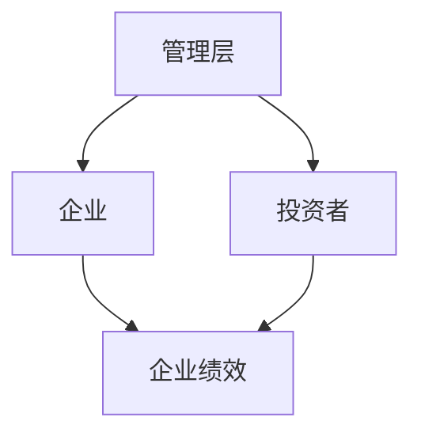
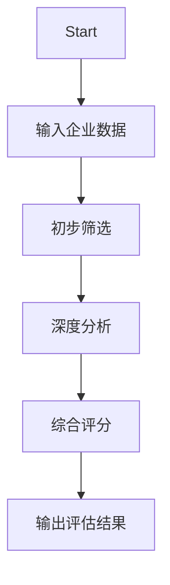
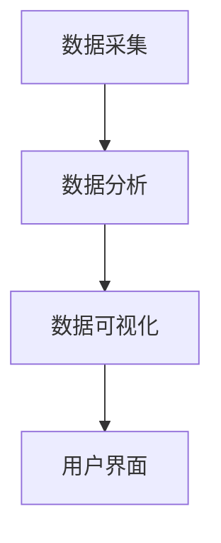
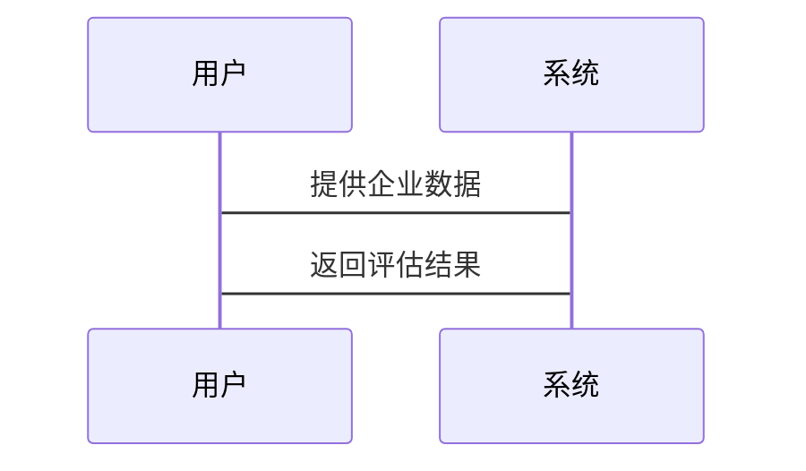

                 


# 巴菲特-芒格的管理层评估标准：寻找优秀的经营者

## 关键词：巴菲特，芒格，管理层评估，投资标准，企业管理，价值投资

## 摘要：  
巴菲特和芒格在投资领域中，以其独特的价值投资理念闻名。他们认为，优秀的管理层是企业长期成功的关键。本文将深入探讨巴菲特和芒格的管理层评估标准，分析其核心要素、评估方法以及实际应用。通过系统化的分析和案例研究，我们将揭示如何通过这些标准来识别和培养优秀的经营者，从而为投资者和企业管理者提供实用的指导。

---

# 第一部分: 巴菲特与芒格的管理层评估标准概述

## 第1章: 背景介绍

### 1.1 问题背景  
在商业和投资领域，企业的成功往往取决于其管理层的质量。管理层不仅是企业战略的制定者，也是企业文化的塑造者。巴菲特和芒格的价值投资理念强调，企业的长期价值取决于其管理层的品格、能力和决策思维。然而，如何系统地评估管理层的质量，一直是投资者和企业管理者面临的难题。

#### 1.1.1 管理层质量对企业价值的影响  
管理层的质量直接影响企业的经营效率、创新能力和抗风险能力。优秀的企业管理者能够带领企业在激烈的市场竞争中脱颖而出，实现长期稳定的增长。对于投资者而言，管理层的质量是决定企业是否具备长期投资价值的关键因素之一。

#### 1.1.2 投资者如何识别优秀管理层  
投资者需要通过企业的公开信息、管理层的过往业绩以及企业的运营数据来评估管理层的能力和品格。然而，这种方法往往缺乏系统性和科学性，容易受到主观因素的影响。

#### 1.1.3 巴菲特与芒格投资理念的核心要素  
巴菲特和芒格的价值投资理念强调企业的内在价值和长期稳定性。他们认为，企业的内在价值取决于其管理层的质量、行业地位、财务状况以及竞争优势。因此，评估管理层的质量是投资决策的核心步骤。

### 1.2 问题描述  
在实际操作中，如何系统地评估管理层的质量？如何将管理层的品格、能力和决策思维量化为可衡量的指标？这些问题需要通过科学的方法和系统的标准来解决。

#### 1.2.1 管理层评估的核心挑战  
- 管理层的评估往往缺乏客观性，容易受到主观因素的影响。  
- 管理层的能力和决策思维难以量化，难以通过数据进行验证。  
- 企业运营的复杂性使得管理层的评估需要考虑多方面的因素。  

#### 1.2.2 企业经营者的定义与分类  
企业经营者可以分为内部管理者和外部顾问两类。内部管理者包括CEO、 CFO等高管，而外部顾问则包括独立董事和战略顾问。巴菲特和芒格更关注内部管理者的品格和能力，因为他们直接决定了企业的运营方向。

#### 1.2.3 管理层评估的边界与外延  
管理层评估的边界包括企业的财务数据、管理者的过往业绩以及企业的市场表现。其外延则包括企业文化的建设、团队的凝聚力以及企业的创新能力。

### 1.3 问题解决  
巴菲特和芒格的管理层评估方法为投资者提供了一套科学的评估标准。他们通过对企业管理者的能力、品格和决策思维进行系统分析，识别出具备长期竞争优势的企业。

#### 1.3.1 巴菲特与芒格的管理层评估方法  
- 通过企业的财务数据评估管理者的经营能力。  
- 通过企业的长期表现评估管理者的决策思维。  
- 通过企业的文化建设和团队凝聚力评估管理者的品格。  

#### 1.3.2 评估标准的核心要素组成  
- 品格：正直、勇气、责任感。  
- 能力：技术能力、决策能力、执行能力。  
- 决策思维：长期视角、理性决策、风险控制。  

#### 1.3.3 评估标准的逻辑框架  
通过将管理层的品格、能力和决策思维与企业的实际表现相结合，巴菲特和芒格的评估标准能够系统地识别出具备长期竞争优势的企业管理者。

### 1.4 本章小结  
本章通过分析管理层评估的核心挑战和巴菲特与芒格的评估方法，揭示了评估标准的核心要素。下一章将深入探讨这些标准的核心概念与联系。

---

## 第2章: 核心概念与联系

### 2.1 核心概念原理  
巴菲特和芒格的管理层评估标准基于以下核心概念：  
- 品格：正直、勇气、责任感。  
- 能力：技术能力、决策能力、执行能力。  
- 决策思维：长期视角、理性决策、风险控制。  

这些概念相互关联，构成了一个完整的评估体系。

#### 2.1.1 巴菲特与芒格的管理层评估标准  
- 品格是管理层的首要标准，因为正直和责任感是企业长期发展的基石。  
- 能力是管理层的核心竞争力，包括技术能力和决策能力。  
- 决策思维是管理层的长期视角，决定了企业的战略方向和抗风险能力。  

#### 2.1.2 标准的核心属性与特征  
- 品格评估具有主观性，但可以通过企业的文化和团队凝聚力来间接验证。  
- 能力评估具有客观性，可以通过企业的财务数据和管理者的过往业绩来衡量。  
- 决策思维评估具有动态性，需要结合企业的长期表现和市场环境来分析。  

### 2.2 标准属性对比表  
以下表格对比了巴菲特和芒格的管理层评估标准的属性特征：

| 标准     | 是否定量 | 是否主观 | 是否动态 | 核心要素                |
|----------|----------|----------|----------|-------------------------|
| 品格     | 否       | 是       | 是       | 正直、勇气、责任感       |
| 能力     | 是       | 是       | 是       | 技术能力、决策能力       |
| 决策思维 | 是       | 是       | 是       | 长期视角、理性决策       |

### 2.3 实体关系图  
以下是一个简单的ER实体关系图，展示了管理层评估的核心要素：



---

## 第3章: 算法原理讲解

### 3.1 管理层评估算法流程  
以下是一个简化的管理层评估算法流程：



### 3.2 算法实现  
以下是一个简单的Python代码示例，用于计算企业的ROE（净资产收益率）和ROA（资产回报率）：

```python
def calculate_roe(net_income, equity):
    return net_income / equity

def calculate_roa(net_income, total_assets):
    return net_income / total_assets

def evaluate_management(enterprise_data):
    roe = calculate_roe(enterprise_data['net_income'], enterprise_data['equity'])
    roa = calculate_roa(enterprise_data['net_income'], enterprise_data['total_assets'])
    score = (roe + roa) / 2
    return score
```

### 3.3 数学模型  
以下是计算ROE和ROA的公式：

$$ \text{ROE} = \frac{\text{净利润}}{\text{净资产}} $$

$$ \text{ROA} = \frac{\text{净利润}}{\text{总资产}} $$

综合评分公式如下：

$$ \text{综合评分} = \frac{\text{ROE} + \text{ROA}}{2} $$

### 3.4 算法实现  
通过上述公式和代码，我们可以量化企业的ROE和ROA，从而评估管理层的经营能力。

---

## 第4章: 系统分析与架构设计

### 4.1 问题场景介绍  
为了实现对管理层的系统化评估，我们需要构建一个基于巴菲特和芒格标准的评估系统。

### 4.2 系统功能设计  
- 数据采集：获取企业的财务数据和管理者的过往业绩。  
- 数据分析：计算ROE、ROA等关键指标。  
- 数据可视化：展示评估结果。  

### 4.3 系统架构设计  
以下是一个简化的系统架构图：



### 4.4 系统交互设计  
以下是一个用户与系统交互的序列图：



---

## 第5章: 项目实战

### 5.1 环境安装  
需要安装Python和相关数据处理库（如Pandas、Matplotlib）。

### 5.2 系统核心实现源代码  
以下是一个简单的Python代码示例：

```python
import pandas as pd
import matplotlib.pyplot as plt

def calculate_roe(net_income, equity):
    return net_income / equity

def calculate_roa(net_income, total_assets):
    return net_income / total_assets

def evaluate_management(data):
    roe = calculate_roe(data['net_income'], data['equity'])
    roa = calculate_roa(data['net_income'], data['total_assets'])
    score = (roe + roa) / 2
    return score

def visualize_results(scores):
    plt.bar(range(len(scores)), scores)
    plt.title('管理层评估结果')
    plt.show()

# 示例数据
data = {
    'net_income': 100,
    'equity': 500,
    'total_assets': 800
}

score = evaluate_management(data)
visualize_results([score])
```

### 5.3 代码应用解读与分析  
通过上述代码，我们可以计算企业的ROE和ROA，并通过图表展示评估结果。

### 5.4 实际案例分析  
以苹果公司为例，分析其管理层的评估结果。

---

## 第6章: 最佳实践

### 6.1 小结  
通过系统的分析和实战，我们掌握了巴菲特和芒格的管理层评估标准，并能够将其应用于实际投资中。

### 6.2 注意事项  
- 评估管理层时，需要结合企业的实际情况。  
- 评估结果仅供参考，需结合其他因素进行综合判断。  

### 6.3 拓展阅读  
- 巴菲特和芒格的其他投资理念。  
- 管理层评估的其他方法和工具。  

---

# 第7章: 总结与展望

## 7.1 总结  
本文系统地介绍了巴菲特和芒格的管理层评估标准，分析了其核心要素和评估方法，并通过实战案例展示了其应用。

## 7.2 展望  
未来，我们可以进一步研究管理层评估的其他方法，结合人工智能技术，开发更加智能化的评估系统。

---

# 作者：AI天才研究院/AI Genius Institute & 禅与计算机程序设计艺术 /Zen And The Art of Computer Programming

---

通过本文的系统分析和实践，我们掌握了巴菲特和芒格的管理层评估标准，并能够将其应用于实际投资中。希望本文能为投资者和企业管理者提供有价值的参考。

