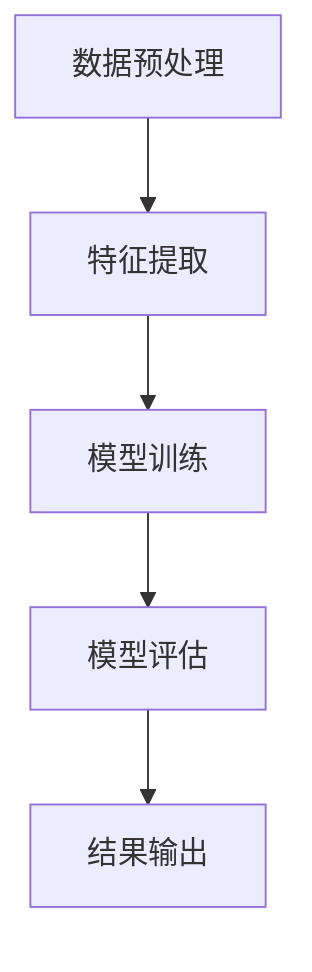
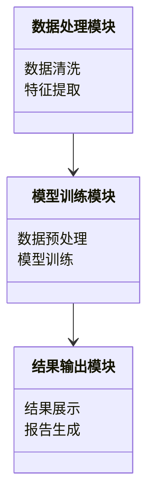

                 


# 巴菲特-芒格的精准医疗AI投资：个性化治疗的新时代

> 关键词：巴菲特，芒格，精准医疗，人工智能，投资策略，个性化治疗

> 摘要：本文探讨了巴菲特和芒格的投资理念如何与人工智能技术相结合，推动精准医疗的发展。文章详细分析了AI在精准医疗中的应用，包括疾病诊断、治疗方案制定和药物研发。通过介绍核心算法、系统架构和实际案例，本文展示了AI如何帮助投资者做出更明智的决策，从而实现个性化治疗的新时代。

---

## 第一部分：背景介绍

### 第1章：精准医疗与AI的结合

#### 1.1 背景介绍

##### 1.1.1 精准医疗的定义与特点

精准医疗是一种基于患者个体特征（如基因、环境和生活方式）的治疗方式，旨在提供更有效的治疗方案。其特点是高度个性化，治疗效果最大化，副作用最小化。

##### 1.1.2 AI在精准医疗中的作用

人工智能通过处理大量数据，帮助医生进行疾病预测、诊断和治疗方案优化。AI能够分析基因数据、病历记录和药物反应，辅助医生做出更精准的决策。

##### 1.1.3 巴菲特和芒格投资理念的结合

巴菲特的价值投资和芒格的多元思维模型为AI医疗投资提供了独特的视角。通过长期价值投资和跨领域思考，投资者可以在AI医疗领域找到高潜力项目。

---

### 第2章：核心概念与联系

#### 2.1 核心概念

##### 2.1.1 AI在精准医疗中的核心应用

- 疾病诊断：AI通过分析医学影像和实验室数据，辅助医生进行疾病诊断。
- 治疗方案制定：AI根据患者基因和病史，推荐个性化治疗方案。
- 药物研发：AI加速药物发现过程，降低研发成本。

##### 2.1.2 核心概念的联系

- 数据：AI需要大量数据进行训练，数据质量直接影响模型效果。
- 模型：算法是AI的核心，不同算法适用于不同应用场景。
- 结果：AI输出的结果需要医生进行最终判断，确保治疗方案的安全性和有效性。

#### 2.2 概念结构与核心要素

以下是精准医疗AI投资的核心要素：

- 数据来源：基因数据、病历记录、药物反应。
- AI技术：机器学习、深度学习、自然语言处理。
- 投资策略：价值投资、风险管理、长期视角。

---

### 第3章：算法原理

#### 3.1 机器学习模型

##### 3.1.1 监督学习

监督学习通过训练数据预测目标变量。例如，使用线性回归预测患者的疾病风险。

##### 3.1.2 无监督学习

无监督学习发现数据中的隐藏结构。例如，使用聚类分析将患者分为不同风险组。

##### 3.1.3 深度学习

深度学习通过多层神经网络提取数据特征。例如，使用卷积神经网络分析医学影像。

#### 3.2 算法流程

以下是AI医疗诊断的流程图：



#### 3.3 数学公式

以下是线性回归的数学模型：

$$ y = \beta_0 + \beta_1x + \epsilon $$

其中，y是目标变量，x是自变量，β是系数，ε是误差项。

---

### 第4章：系统架构

#### 4.1 系统功能设计

以下是系统功能模块：



#### 4.2 系统架构设计

以下是系统架构图：


---

### 第5章：项目实战

#### 5.1 实际案例分析

##### 5.1.1 糖尿病诊断系统

- 环境安装：安装Python、TensorFlow、Keras。
- 数据预处理：清洗和标注糖尿病患者数据。
- 模型训练：使用随机森林算法进行分类。
- 结果分析：评估模型准确率、召回率和F1分数。

##### 5.1.2 代码实现

以下是糖尿病诊断系统的代码示例：

```python
import pandas as pd
from sklearn.ensemble import RandomForestClassifier
from sklearn.metrics import accuracy_score, recall_score, f1_score

# 加载数据
data = pd.read_csv('diabetes.csv')

# 数据预处理
data.dropna(inplace=True)
X = data.drop('Outcome', axis=1)
y = data['Outcome']

# 模型训练
model = RandomForestClassifier()
model.fit(X, y)

# 预测
y_pred = model.predict(X)

# 评估指标
accuracy = accuracy_score(y, y_pred)
recall = recall_score(y, y_pred)
f1 = f1_score(y, y_pred)

print(f'Accuracy: {accuracy}')
print(f'Recall: {recall}')
print(f'F1 Score: {f1}')
```

---

## 第六部分：小结

### 6.1 总结

本文详细探讨了巴菲特和芒格的投资理念如何与AI技术结合，推动精准医疗的发展。通过分析核心算法、系统架构和实际案例，展示了AI在个性化治疗中的潜力。

### 6.2 注意事项

- 数据隐私和安全是AI医疗的重要问题。
- 模型的可解释性和泛化能力需要进一步研究。
- 投资者需关注AI技术的长期发展和风险。

### 6.3 未来展望

随着AI技术的进步，精准医疗将更加个性化和高效。投资者应继续关注技术发展，寻找高潜力的AI医疗项目。

---

作者：AI天才研究院 & 禅与计算机程序设计艺术

