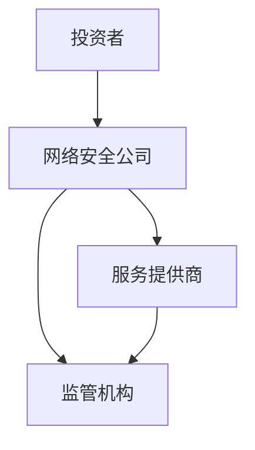
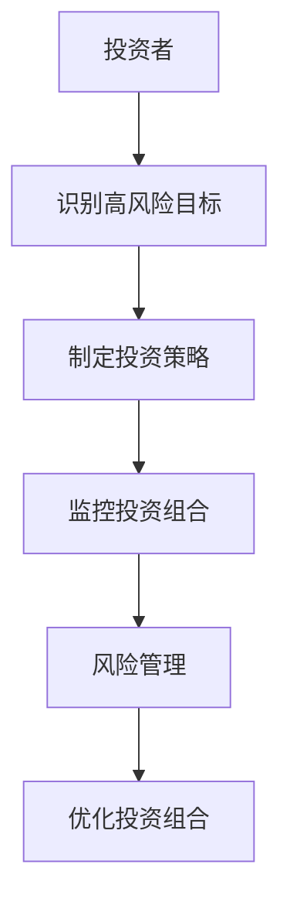
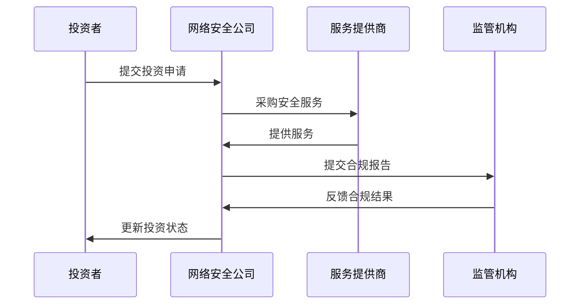

                 

# 巴菲特-芒格的网络安全投资：数字时代的新型风险

## 关键词：巴菲特，芒格，网络安全投资，风险管理，价值投资，安全边际

## 摘要： 巴菲特和芒格的投资理念在网络安全领域具有重要的应用价值。随着数字化时代的到来，网络安全成为企业和个人面临的主要风险之一。本文将详细探讨巴菲特和芒格的价值投资理念如何应用于网络安全投资，并分析网络安全投资中的风险管理策略。通过分析网络安全投资的核心概念、数学模型和实际案例，本文将揭示数字时代新型风险的应对之道。

---

# 第一部分：背景介绍

## 第1章：巴菲特与芒格的投资理念

### 1.1 巴菲特与芒格的简介

#### 1.1.1 巴菲特的投资理念
巴菲特的价值投资理念强调长期持有、安全边际和内在价值。他注重企业的基本面分析，寻找具有持续竞争优势和良好管理的公司。他的投资策略基于对公司的深入了解，而不是市场的短期波动。

#### 1.1.2 芒格的智慧与决策思维
芒格的“格栅理论”强调多学科思维模型，通过广泛的阅读和思考，构建知识框架，避免决策中的认知偏差。他的思维方式注重逻辑推理和长期判断，而非短期利益。

#### 1.1.3 两人合作的投资模式
巴菲特和芒格的合作模式基于相互信任和互补优势。芒格为巴菲特提供决策支持，巴菲特为芒格提供资金和资源，两人共同评估投资机会，制定投资策略。

### 1.2 网络安全投资的背景与趋势

#### 1.2.1 数字化转型带来的风险
随着企业数字化转型的推进，网络安全风险也在不断增加。企业依赖于数字化系统，这些系统成为黑客攻击的目标。数据泄露、系统瘫痪等问题对企业声誉和财务造成巨大损失。

#### 1.2.2 网络安全的重要性
网络安全是保障企业数据安全、客户信任和业务连续性的关键。随着云计算、物联网和人工智能技术的普及，网络安全威胁也在变得更加复杂和多样。

#### 1.2.3 网络安全投资的必要性
为了应对日益复杂的网络安全威胁，企业需要加大对网络安全的投资。这包括技术投入、人才引进和风险管理。网络安全投资已成为企业战略的重要组成部分。

---

# 第二部分：网络安全投资的核心概念与联系

## 第2章：网络安全的核心概念

### 2.1 网络安全的定义与分类

#### 2.1.1 网络安全的定义
网络安全是指保护计算机系统、网络和数据免受未经授权的访问、破坏或泄露的活动。它涵盖技术、管理和政策等多个方面。

#### 2.1.2 网络安全的分类
网络安全可以分为以下几类：
1. **网络设备安全**：保护路由器、交换机等网络设备免受攻击。
2. **网络安全协议**：如HTTPS、SSH等协议的安全性。
3. **数据安全**：保护数据的机密性、完整性和可用性。
4. **应用安全**：确保应用程序免受漏洞攻击。
5. **身份验证与访问控制**：管理用户权限和认证方式。

### 2.2 网络安全投资的属性特征对比

#### 2.2.1 投资标的的特征对比
| 特征               | 传统投资             | 网络安全投资       |
|--------------------|----------------------|---------------------|
| 资产类型           | 股票、债券、房地产   | 网络技术、数据     |
| 投资周期           | 中长期              | 短期至中长期       |
| 风险来源           | 市场波动、经济周期   | 网络攻击、技术漏洞 |
| 收益来源           | 股息、资本增值      | 技术创新、服务收入 |

#### 2.2.2 投资回报的特征对比
| 特征               | 传统投资             | 网络安全投资       |
|--------------------|----------------------|---------------------|
| 回报周期           | 中长期              | 短期至中长期       |
| 回报稳定性         | 较低                | 较高               |
| 影响因素           | 利率、通货膨胀      | 网络威胁、技术创新 |

#### 2.2.3 投资风险的特征对比
| 特征               | 传统投资             | 网络安全投资       |
|--------------------|----------------------|---------------------|
| 风险来源           | 市场波动、经济周期   | 网络攻击、技术漏洞 |
| 风险控制           | 多样化投资组合      | 定期安全测试、漏洞修复 |
| 风险应对           | 保险、对冲           | 技术防护、合规管理 |

---

## 第3章：网络安全投资的实体关系架构

### 3.1 实体关系图

### 3.2 网络安全投资的流程

---

# 第三部分：网络安全投资的数学模型与算法

## 第4章：数学模型与算法

### 4.1 贴现现金流模型（DCF）

#### 4.1.1 DCF模型的定义
DCF模型是一种用于评估公司内在价值的方法。通过预测公司未来的现金流，并将其贴现为现值，以确定其合理价格。

#### 4.1.2 DCF模型的公式
$$ V = \frac{CF_1}{(1 + r)^1} + \frac{CF_2}{(1 + r)^2} + \dots + \frac{CF_n}{(1 + r)^n} $$

其中：
- \( V \) 是公司价值
- \( CF_i \) 是第 \( i \) 年的现金流
- \( r \) 是贴现率

#### 4.1.3 应用场景
DCF模型适用于评估网络安全公司的内在价值，尤其是在公司具有稳定的现金流和可预测的未来增长的情况下。

### 4.2 网络安全风险评估模型

#### 4.2.1 风险评估模型的定义
网络安全风险评估模型用于量化网络安全风险，帮助企业识别潜在威胁并制定应对策略。

#### 4.2.2 风险评估模型的公式
$$ R = P \times I \times V $$
其中：
- \( R \) 是风险值
- \( P \) 是威胁的概率
- \( I \) 是威胁的严重性
- \( V \) 是资产的价值

#### 4.2.3 应用场景
该模型适用于评估企业网络安全系统的整体风险，帮助企业在投资决策中考虑潜在威胁。

---

# 第四部分：项目实战与案例分析

## 第5章：项目实战

### 5.1 项目背景

#### 5.1.1 项目介绍
假设我们投资于一家提供云安全服务的公司，目标是评估其内在价值和投资风险。

### 5.2 系统功能设计

#### 5.2.1 领域模型

#### 5.2.2 系统架构设计

#### 5.2.3 系统接口设计
1. 投资者与网络安全公司之间的接口：资金投入、数据交换。
2. 网络安全公司与服务提供商之间的接口：服务采购、技术支持。
3. 网络安全公司与监管机构之间的接口：合规报告、监管反馈。

#### 5.2.4 系统交互流程

---

## 第6章：最佳实践与注意事项

### 6.1 投资经验总结

#### 6.1.1 长期投资的重要性
网络安全是一个长期的投资领域，需要耐心和信心。技术进步和市场需求的变化会不断推动网络安全行业的发展。

#### 6.1.2 风险管理的关键性
在网络安全投资中，风险管理是核心。投资者需要定期评估投资组合的风险，并采取措施降低潜在损失。

### 6.2 小结

#### 6.2.1 投资策略的优化
通过不断学习和实践，优化投资策略，提高投资回报率。

#### 6.2.2 注意事项
- 避免短期投机，注重长期价值。
- 保持对市场的敏感性，及时调整投资策略。
- 加强对网络安全技术的理解，提升投资决策的准确性。

---

# 作者：AI天才研究院 & 禅与计算机程序设计艺术

