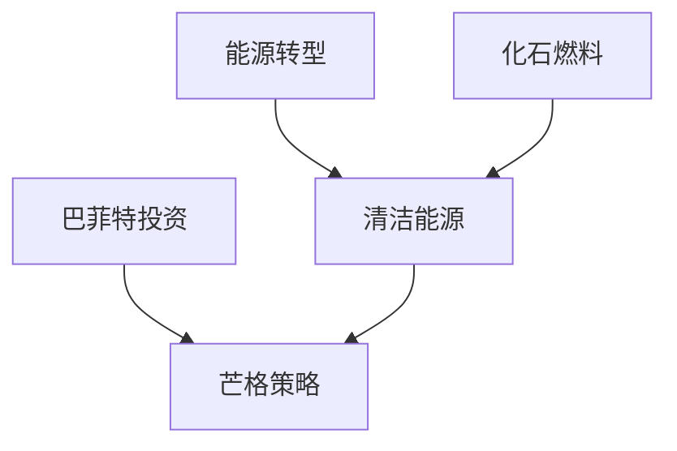
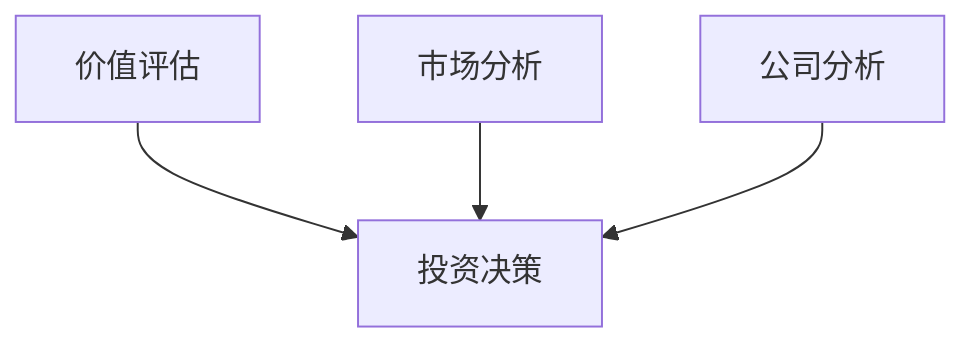
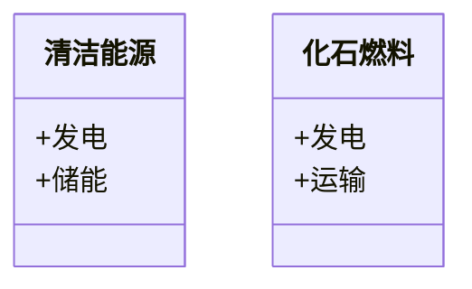
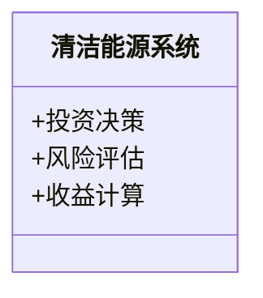

                 


# 巴菲特-芒格的能源转型投资：从化石燃料到清洁能源

## 关键词：巴菲特，芒格，能源转型，清洁能源，化石燃料

## 摘要：本文深入探讨了巴菲特和芒格在能源转型中的投资策略，分析了他们如何从化石燃料转向清洁能源，并通过数学模型和实际案例展示了这些投资的逻辑和潜在回报。

---

### 第一部分：能源转型的背景与挑战

#### 第1章：能源转型的背景与挑战

##### 1.1 能源转型的背景介绍
- **全球能源结构的演变**：从化石燃料到清洁能源的转变是全球趋势，主要驱动因素包括环境问题和技术创新。
- **环境问题与能源转型的必要性**：气候变化、空气污染和化石燃料的不可再生性推动了能源转型。
- **能源转型的目标与路径**：减少碳排放，提高可再生能源的使用比例，实现可持续发展。

##### 1.2 巴菲特与芒格的投资理念
- **巴菲特的价值投资策略**：注重长期价值和公司基本面，寻找低估的投资标的。
- **芒格的多元思维模型**：强调跨学科思考，从多个角度评估投资风险和机会。
- **合作的投资风格**：巴菲特和芒格结合各自的优势，注重长期稳健回报。

##### 1.3 能源转型与投资的结合
- **清洁能源的市场机遇**：太阳能、风能等可再生能源的快速发展带来了投资机会。
- **化石燃料的转型需求**：随着环保政策的加强，化石燃料行业面临转型压力。
- **巴菲特与芒格的布局**：通过投资清洁能源公司和逐步减少对化石燃料的依赖，实现投资组合的优化。

---

#### 第2章：能源转型的核心概念与联系

##### 2.1 能源转型的核心概念
- **清洁能源与化石燃料的对比**：
  | 属性 | 清洁能源 | 化石燃料 |
  |------|---------|----------|
  | 环保性 | 高      | 低       |
  | 可持续性 | 高      | 低       |
  | 经济性 | 中高     | 中高      |
- **能源转型的驱动因素**：技术进步、政策支持和市场需求。

##### 2.2 巴菲特与芒格投资策略的关联
- **价值投资与能源转型的契合**：寻找被低估的清洁能源公司，长期持有以获得收益。
- **多元思维模型的应用**：从技术、政策、市场等多个角度评估清洁能源投资的风险和机会。
- **能源转型投资的核心要素**：技术创新、政策支持和市场需求。

##### 2.3 实体关系图


---

#### 第3章：巴菲特与芒格的能源转型投资策略

##### 3.1 巴菲特的能源投资布局
- **化石燃料投资**：过去主要投资于石油和天然气公司，但现在逐步减少。
- **清洁能源投资**：投资于太阳能、风能等项目，关注技术领先和市场潜力的公司。
- **能源转型的逻辑**：基于长期环保趋势和经济利益，逐步淘汰化石燃料投资。

##### 3.2 芒格的能源投资布局
- **化石燃料的评价**：认为化石燃料虽然利润高，但风险较高，尤其是环保政策的影响。
- **清洁能源的看法**：认为是未来趋势，值得长期投资，但需谨慎评估公司的技术实力和市场地位。
- **投资策略的差异**：芒格更注重风险控制，巴菲特更注重价值发现。

##### 3.3 投资策略对比
- **异同点**：巴菲特注重长期价值，芒格注重风险控制；两者都注重基本面和技术可行性。
- **合作与分工**：巴菲特负责资金投入和长期战略，芒格负责风险评估和策略优化。

---

#### 第4章：清洁能源的投资分析与决策模型

##### 4.1 数学模型
- **收益计算公式**：
  $$收益 = 投资额 \times (收益率 - 通货膨胀率)$$
- **风险评估公式**：
  $$风险 = 标准差 \times 投资额$$

##### 4.2 算法原理


##### 4.3 系统架构设计


---

#### 第5章：系统分析与架构设计

##### 5.1 问题场景介绍
- **市场环境**：政策支持和技术进步推动清洁能源发展。
- **投资场景**：巴菲特和芒格如何在清洁能源领域应用其投资策略。
- **投资挑战**：技术不确定性、政策风险和市场波动。

##### 5.2 系统功能设计


---

#### 第6章：项目实战

##### 6.1 环境安装
- 安装Python和数据分析库，如NumPy和Pandas。

##### 6.2 代码实现
```python
def calculate_profit(investment, yield_rate, inflation_rate):
    return investment * (yield_rate - inflation_rate)

def calculate_risk(investment, std_deviation):
    return investment * std_deviation
```

##### 6.3 案例分析
- 投资某太阳能公司，计算其收益和风险。

##### 6.4 代码解读
- 展示如何通过代码量化投资决策，评估清洁能源项目的收益和风险。

---

#### 第7章：最佳实践、小结、注意事项和拓展阅读

##### 7.1 最佳实践
- **分散投资**：避免过度集中，降低风险。
- **关注政策**：了解环保政策的变化，及时调整投资策略。
- **技术评估**：选择技术领先、市场潜力大的清洁能源项目。

##### 7.2 小结
- 总结全文，强调能源转型的重要性和巴菲特、芒格投资策略的可借鉴性。

##### 7.3 注意事项
- **避免盲目跟风**：投资者应根据自身情况调整策略。
- **长期视角**：能源转型是长期过程，需耐心和坚持。

##### 7.4 拓展阅读
- 推荐相关书籍和资源，帮助读者深入理解能源转型和投资策略。

---

### 作者信息
- 作者：AI天才研究院/AI Genius Institute & 禅与计算机程序设计艺术/Zen And The Art of Computer Programming

