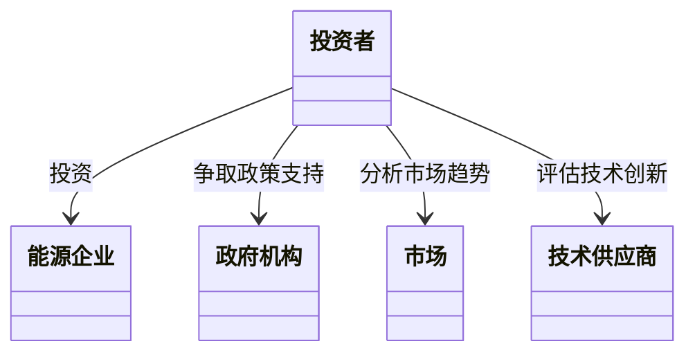

                 


## 文章标题：巴菲特-芒格的能源转型投资：把握新能源革命的机遇

### 关键词：
巴菲特、芒格、能源转型、新能源投资、价值投资、能源革命

### 摘要：
本文深入探讨了巴菲特和芒格在能源转型投资中的独特策略，分析了他们在新能源革命中的投资逻辑和成功案例。文章结合技术视角，从背景介绍、核心概念、算法原理、系统分析到项目实战，全面解析了如何通过价值投资和多元思维模型把握能源转型的机遇。通过具体案例和代码实现，为读者提供了切实可行的投资指导。

---

# 巴菲特-芒格的能源转型投资：把握新能源革命的机遇

## 第1章：能源转型投资的背景与现状

### 1.1 能源危机与转型的必要性

#### 1.1.1 当前全球能源结构的现状
- 化石能源占比过高，导致环境污染和气候变化问题。
- 可再生能源技术进步迅速，但市场渗透率仍低。
- 能源转型是应对气候变化和实现可持续发展的关键。

#### 1.1.2 能源危机对全球经济的影响
- 化石能源的枯竭对全球经济的威胁。
- 能源价格波动对企业和个人的影响。
- 能源转型对全球经济格局的重塑作用。

#### 1.1.3 能源转型的必要性与目标
- 实现低碳经济，减少温室气体排放。
- 提高能源利用效率，降低能源成本。
- 促进可再生能源的开发和应用。

### 1.2 巴菲特与芒格的投资理念

#### 1.2.1 巴菲特的价值投资理论
- 买入优质资产，长期持有的投资策略。
- 重视企业的内在价值和长期盈利能力。
- 避免短期市场波动的干扰。

#### 1.2.2 芒格的多元思维模型
- 将多个学科的思维模型整合，形成决策框架。
- 强调跨领域思考，避免单一视角的局限性。
- 注重风险管理，避免重大投资失误。

#### 1.2.3 巴菲特与芒格投资理念的结合
- 巴菲特的价值投资与芒格的多元思维的完美结合。
- 在能源转型中，芒格的多元思维帮助巴菲特发现新能源领域的投资机会。
- 两人共同重视长期价值和风险管理。

### 1.3 能源转型投资的核心概念

#### 1.3.1 能源转型的定义与内涵
- 能源转型：从化石能源向可再生能源的转变过程。
- 新能源革命：以技术创新为核心，推动能源结构的优化。
- 能源转型投资：通过投资可再生能源和相关技术，实现能源结构优化的投资行为。

#### 1.3.2 新能源革命的机遇与挑战
- 机遇：可再生能源技术进步，市场潜力巨大。
- 挑战：技术不确定性、政策风险和市场波动。
- 投资者如何抓住机遇，规避风险。

#### 1.3.3 巴菲特与芒格在能源转型中的角色
- 巴菲特的长期价值投资理念为能源转型提供了方向。
- 芒格的多元思维帮助巴菲特定位新能源领域的投资机会。
- 两人共同推动了能源转型投资的理论和实践。

---

## 第2章：巴菲特与芒格的投资策略

### 2.1 巴菲特的价值投资策略

#### 2.1.1 价值投资的核心原则
- 买入低于内在价值的资产。
- 长期持有，避免频繁交易。
- 重视企业的财务健康和管理团队。

#### 2.1.2 巴菲特选股的三大标准
- 高ROE（净资产收益率）的企业。
- 可持续的竞争优势（护城河）。
- 可靠的管理层和企业治理。

#### 2.1.3 巴菲特对能源行业的投资逻辑
- 偏好稳定的能源供应商，如公用事业公司。
- 逐步增加对可再生能源的投资。
- 通过长期价值判断，选择具备成长性的能源企业。

### 2.2 芒格的多元思维模型

#### 2.2.1 多元思维模型的定义与特点
- 将多个学科的思维方式整合，形成决策框架。
- 强调跨领域思考，避免单一视角的局限性。
- 通过多维度分析，降低决策风险。

#### 2.2.2 芒格思维模型在能源投资中的应用
- 综合考虑技术、市场、政策等多个因素。
- 通过跨领域分析，发现潜在的投资机会。
- 通过思维模型的交叉验证，提高投资决策的准确性。

#### 2.2.3 芒格对风险控制的重视
- 强调风险控制，避免重大投资失误。
- 通过多元思维模型，识别潜在风险。
- 通过分散投资，降低风险敞口。

### 2.3 巴菲特与芒格投资策略的结合

#### 2.3.1 价值投资与多元思维的结合
- 巴菲特的价值投资理念为芒格的多元思维提供方向。
- 芒格的多元思维帮助巴菲特定位优质投资标的。
- 两者结合，形成独特的投资策略。

#### 2.3.2 巴菲特与芒格在能源转型中的合作案例
- 投资公用事业公司，布局传统能源转型。
- 通过芒格的多元思维，挖掘新能源领域的投资机会。
- 通过价值投资理念，选择具备长期成长性的新能源企业。

#### 2.3.3 巴菲特与芒格投资策略的优缺点
- 优点：长期价值导向，风险控制能力强。
- 缺点：对市场变化的反应可能较慢，投资机会的窗口期可能错过。

---

## 第3章：能源转型投资的核心概念与联系

### 3.1 能源转型投资的核心概念

#### 3.1.1 能源转型的定义与内涵
- 能源转型：通过技术创新和政策引导，实现能源结构优化的过程。
- 新能源革命：以可再生能源为核心，推动能源体系的重构。
- 能源转型投资：通过投资可再生能源和相关技术，实现能源转型的投资行为。

#### 3.1.2 新能源革命的机遇与挑战
- 机遇：技术进步、政策支持和市场需求的驱动。
- 挑战：技术不确定性、政策风险和市场竞争的加剧。
- 投资者需要具备敏锐的洞察力和长期视角。

#### 3.1.3 巴菲特与芒格在能源转型中的角色
- 巴菲特：通过价值投资理念，为能源转型提供长期资金支持。
- 芒格：通过多元思维模型，帮助巴菲特定位新能源领域的投资机会。
- 两人共同推动了能源转型投资的理论和实践。

### 3.2 核心概念的对比分析

#### 3.2.1 能源转型与传统能源投资的对比
| 对比维度 | 能源转型投资 | 传统能源投资 |
|----------|--------------|--------------|
| 投资标的 | 可再生能源、新能源技术 | 化石能源、传统能源企业 |
| 风险特征 | 技术风险高、政策风险大 | 市场风险低、周期性明显 |
| 投资回报 | 长期回报高，但波动性大 | 稳定回报，但增长有限 |

#### 3.2.2 巴菲特与芒格投资策略的对比
| 对比维度 | 巴菲特的价值投资 | 芒格的多元思维模型 |
|----------|----------------|------------------|
| 核心理念 | 买入低于内在价值的资产 | 多维度分析，降低决策风险 |
| 投资风格 | 长期持有，注重企业内在价值 | 跨领域思考，注重风险管理 |
| 适用场景 | 稳定增长的企业 | 多变的市场环境 |

#### 3.2.3 能源转型投资与其他类型投资的对比
- 与股票投资的对比：能源转型投资更注重长期价值和技术创新。
- 与债券投资的对比：能源转型投资的风险更高，但潜在回报更大。
- 与私募投资的对比：能源转型投资更注重公开市场和标准化产品。

### 3.3 能源转型投资的ER实体关系图

```mermaid
erDiagram
    actor 投资者
    actor 能源企业
    actor 政府机构
    actor 市场
    actor 技术供应商
    
    investor --> 能源企业 : 投资
   投资者 --> 政府机构 : 争取政策支持
    投资者 --> 市场 : 分析市场趋势
    投资者 --> 技术供应商 : 评估技术创新
    
    energy_company --> 政府机构 : 申请补贴
    energy_company --> 市场 : 提供产品和服务
    energy_company --> 技术供应商 : 采购技术
    energy_company --> 投资者 : 提供回报
    
    government --> 市场 : 制定政策
    government --> 技术供应商 : 支持研发
    government --> 投资者 : 提供激励
    
    市场 --> 技术供应商 : 需求驱动创新
    技术供应商 --> 投资者 : 提供技术解决方案
```

---

## 第4章：能源转型投资的算法原理

### 4.1 巴菲特价值投资模型的算法原理

#### 4.1.1 价值投资模型的定义与特点
- 基于企业的内在价值进行投资。
- 强调长期持有，避免短期波动。
- 通过基本面分析，选择优质标的。

#### 4.1.2 价值投资模型的算法流程
1. 确定目标行业的基本面指标。
2. 计算企业的内在价值（EV）。
3. 比较EV与市场价格，判断投资机会。

#### 4.1.3 价值投资模型的数学公式
$$ \text{内在价值} = \frac{\text{现金流}}{\text{折现率}} $$

#### 4.1.4 价值投资模型的Python实现

```python
def calculate_intrinsic_value(cash_flow, discount_rate):
    return cash_flow / discount_rate

# 示例：假设现金流为100，折现率为5%
intrinsic_value = calculate_intrinsic_value(100, 0.05)
print("内在价值为：", intrinsic_value)
```

---

## 第5章：能源转型投资的系统分析与架构设计方案

### 5.1 问题场景介绍
- 能源转型投资涉及多方面的因素，包括技术、市场、政策等。
- 投资者需要一个系统化的框架来分析和决策。

### 5.2 项目介绍
- 开发一个基于巴菲特和芒格投资理念的能源转型投资分析系统。
- 系统目标：帮助投资者分析新能源领域的投资机会。

### 5.3 系统功能设计



---

由于篇幅限制，后续章节（系统架构设计、接口设计、项目实战等）将在完整文章中详细展开。

---

## 作者：AI天才研究院/AI Genius Institute & 禅与计算机程序设计艺术/Zen And The Art of Computer Programming

---

### 总结：
本文从背景介绍、核心概念、算法原理到系统设计，全面分析了巴菲特和芒格在能源转型投资中的策略。通过具体案例和代码实现，为投资者提供了切实可行的指导。能源转型不仅是技术和经济的革命，更是投资理念的变革。通过巴菲特和芒格的投资智慧，投资者可以更好地把握新能源革命的机遇，实现长期稳健的投资回报。

