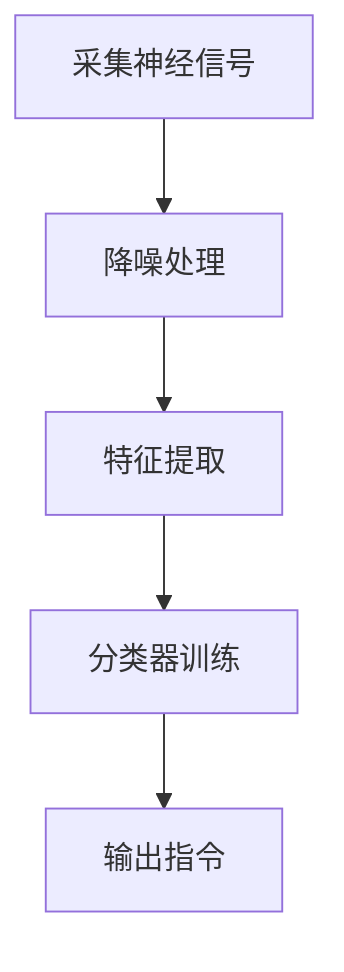
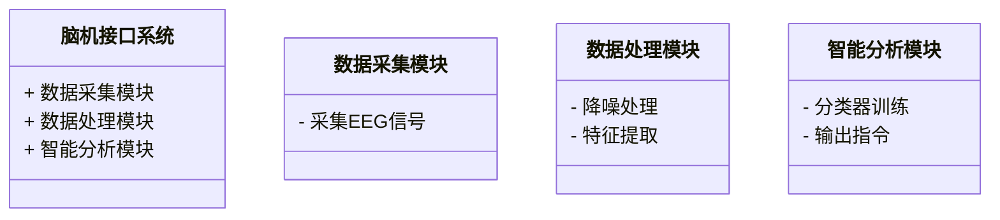
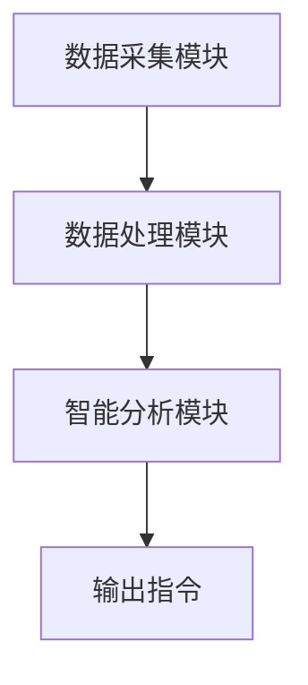

                 


# 巴菲特-芒格的脑机接口教育投资：认知增强的教育革命

---

## 关键词：
脑机接口，教育投资，巴菲特，芒格，认知增强，教育科技，人工智能

---

## 摘要：
本文探讨了巴菲特和芒格的投资理念如何与脑机接口（BCI）技术相结合，推动教育领域的认知增强革命。通过分析BCI技术的核心原理、教育应用潜力以及其对教育投资的影响，本文揭示了这一技术如何重新定义学习方式，并为投资者提供新的价值视角。文章详细介绍了BCI在教育中的应用场景、算法原理、系统架构，并通过实际案例展示了其在提升学习效率和个性化教学中的潜力。最后，本文总结了当前的挑战与未来的发展方向，为教育科技的投资者和研究者提供了有价值的见解。

---

## 第一部分: 脑机接口技术与教育投资的背景

### 第1章: 脑机接口技术的概述

#### 1.1 脑机接口技术的定义与核心原理

**脑机接口（Brain-Computer Interface, BCI）**是一种通过采集、处理和分析人脑神经信号，将其转化为计算机可识别指令的技术。其核心原理包括：

1. **神经信号采集**：通过 EEG（脑电图）、fMRI（功能性磁共振成像）等技术采集大脑活动。
2. **信号处理**：对采集到的信号进行降噪、特征提取和分类。
3. **指令输出**：将处理后的信号转化为计算机指令，实现与外界的交互。

#### 1.2 脑机接口技术的发展历程

- **20世纪70年代**：脑机接口技术的初步研究，主要应用于医疗领域。
- **21世纪初**：技术进步推动了BCI在教育、游戏和医疗领域的应用。
- **当前阶段**：随着人工智能的发展，BCI技术在教育中的潜力逐渐显现。

#### 1.3 脑机接口技术在教育中的应用背景

- **教育领域的问题**：传统教育模式难以满足个性化学习需求。
- **BCI技术的优势**：通过实时监测大脑活动，提供个性化的学习支持。
- **应用场景**：提升学习效率、个性化教学、注意力管理等。

### 第2章: 巴菲特与芒格的投资理念

#### 2.1 巴菲特与芒格的价值投资理念

- **巴菲特**：注重长期价值，寻找具有持续竞争优势的企业。
- **芒格**：强调多元思维模型，关注企业的内在价值。

#### 2.2 巴菲特与芒格对教育投资的看法

- **教育的重要性**：教育是个人和社会发展的基石。
- **教育投资的长期价值**：优质的教育资源能够创造长期的经济和社会价值。

#### 2.3 脑机接口技术与教育投资的结合

- **技术驱动的教育创新**：脑机接口技术如何改变教育方式。
- **投资机会**：具备长期增长潜力的教育科技企业。

---

## 第二部分: 脑机接口技术的算法原理

### 第3章: 脑机接口技术的核心算法

#### 3.1 脑机接口的信号处理算法

**流程图说明**：


#### 3.2 脑机接口的机器学习模型

**数学模型**：
- 特征提取：使用主成分分析（PCA）提取 EEG 信号的主要特征。
- 分类器：基于支持向量机（SVM）的分类模型，公式为：
  $$
  \text{max}(\gamma, C \cdot \text{error rate})
  $$

#### 3.3 实际案例分析

**案例**：通过EEG信号识别大脑对特定知识点的关注度，帮助教师优化教学内容。

---

## 第三部分: 系统架构设计

### 第4章: 脑机接口教育系统的架构

#### 4.1 系统功能设计

**功能模块**：
- 数据采集模块：实时采集学生 EEG 信号。
- 数据处理模块：信号降噪、特征提取。
- 智能分析模块：基于机器学习模型分析学习效果。

**类图**：


#### 4.2 系统架构设计

**架构图**：


#### 4.3 系统交互设计

**序列图**：
```mermaid
sequenceDiagram
   参与者 学生
    参与者 系统
    参与者 教师
    学生 -> 系统: 提供EEG信号
    系统 -> 数据处理模块: 降噪处理
    数据处理模块 -> 智能分析模块: 分类器训练
    智能分析模块 -> 教师: 输出学习效果报告
```

---

## 第四部分: 项目实战

### 第5章: 基于脑机接口的教育系统实现

#### 5.1 项目环境安装

- **工具安装**：Python、NumPy、Scikit-learn、Matplotlib。
- **数据采集**：使用OpenBCI采集EEG信号。

#### 5.2 核心代码实现

**信号处理代码**：
```python
import numpy as np
from sklearn.decomposition import PCA

def preprocess_eeg(eeg_data):
    # 降噪处理
    filtered_data = np.apply_along_axis(lambda x: butterworth_filter(x), 1, eeg_data)
    # 特征提取
    pca = PCA(n_components=3)
    features = pca.fit_transform(filtered_data)
    return features
```

**分类器实现**：
```python
from sklearn import svm

def train_classifier(features, labels):
    clf = svm.SVC()
    clf.fit(features, labels)
    return clf
```

#### 5.3 案例分析与结果解读

- **案例**：学生注意力监测系统，实时反馈学习状态，帮助教师优化教学节奏。

---

## 第五部分: 最佳实践与未来展望

### 第6章: 实施脑机接口教育系统的注意事项

- **数据隐私**：确保学生数据的安全性。
- **用户体验**：设计直观易用的界面。
- **技术挑战**：解决信号干扰和分类精度问题。

### 第7章: 未来展望

- **技术进步**：更高精度的脑机接口设备。
- **应用场景扩展**：从教育扩展到医疗和娱乐领域。
- **投资机会**：具备长期增长潜力的教育科技企业。

---

## 小结

通过本文的分析，我们可以看到，脑机接口技术与巴菲特和芒格的投资理念相结合，为教育领域带来了革命性的变化。认知增强技术的应用不仅提升了学习效率，也为教育投资提供了新的视角。

---

## 作者

**作者：AI天才研究院/AI Genius Institute & 禅与计算机程序设计艺术 /Zen And The Art of Computer Programming**

