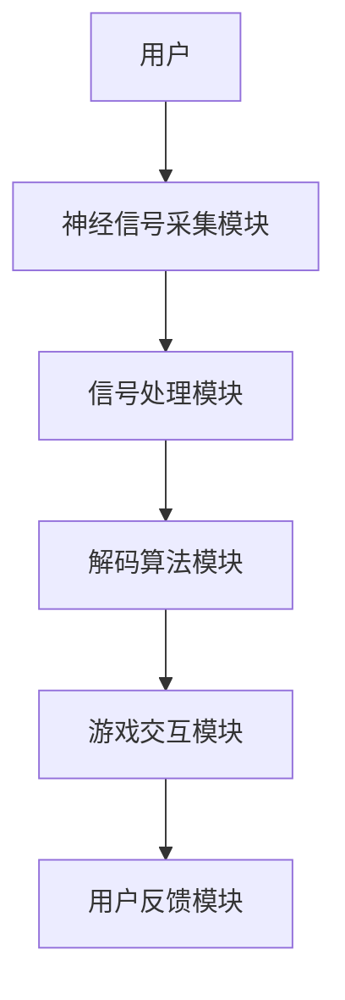

                 


# 《巴菲特-芒格的脑机接口游戏开发平台投资：沉浸式娱乐的新纪元》

---

## 关键词：
- 脑机接口（BCI）
- 沉浸式娱乐
- 游戏开发平台
- 巴菲特投资策略
- 芒格投资哲学
- 人工智能技术

---

## 摘要：
本文探讨了巴菲特和芒格在脑机接口（BCI）技术领域的投资策略，重点分析了BCI技术在沉浸式娱乐中的应用，尤其是其在游戏开发平台上的潜力。文章从技术背景、算法原理、系统架构、投资逻辑等多维度展开，结合实际案例，分析了BCI技术如何改变游戏体验，并为投资者提供了深度的分析和建议。

---

# 第五章：脑机接口游戏开发平台的实现

## 5.1 项目背景与目标

### 5.1.1 项目需求分析
- **目标用户**：游戏玩家、开发者、投资者
- **功能需求**：实现基于BCI技术的游戏交互，提升用户体验
- **技术需求**：高精度的神经信号采集与解码

### 5.1.2 项目目标设定
- 开发一个基于BCI技术的沉浸式游戏平台
- 提供实时的用户反馈机制
- 实现游戏与用户的深度交互

## 5.2 系统功能设计

### 5.2.1 系统功能模块
- **神经信号采集模块**：负责采集用户的脑电波信号
- **信号处理模块**：对采集的信号进行预处理和特征提取
- **解码算法模块**：将特征转换为游戏控制指令
- **游戏交互模块**：实现游戏与用户的实时互动
- **用户反馈模块**：提供实时反馈以优化用户体验

### 5.2.2 系统功能流程
1. 用户佩戴脑电帽，采集神经信号。
2. 信号通过放大器和滤波器进行处理。
3. 特征提取模块提取关键特征，如脑电波的频率和幅值。
4. 解码算法将特征转换为游戏指令，如选择游戏选项或控制角色移动。
5. 游戏交互模块根据指令更新游戏状态，并通过视觉或听觉反馈让用户获得实时反馈。

## 5.3 系统架构设计

### 5.3.1 系统架构图


### 5.3.2 系统功能实现
- **神经信号采集模块**：使用EEG设备采集脑电波信号。
- **信号处理模块**：采用小波变换和独立成分分析（ICA）进行信号处理。
- **解码算法模块**：基于支持向量机（SVM）或长短期记忆网络（LSTM）进行分类。
- **游戏交互模块**：通过API与游戏引擎（如Unity或Unreal Engine）对接，实现实时控制。
- **用户反馈模块**：通过视觉、听觉或触觉反馈提升用户体验。

## 5.4 项目实战

### 5.4.1 环境安装
- **硬件**：脑电采集设备（如OpenBCI或Emotiv Epoc）
- **软件**：Python、NumPy、Matplotlib、Scikit-learn、TensorFlow、Unity/Unreal Engine

### 5.4.2 核心代码实现

#### 5.4.2.1 数据采集与处理
```python
import numpy as np
import matplotlib.pyplot as plt
from scipy.signal import butterworth

# 示例：EEG信号处理
def process_eeg_signal(signal, sampling_rate=250):
    # 应用小波变换进行降噪
    def butter_highpass(cutOff, fs, order=5):
        nyq = 0.5 * fs
        normal_cutoff = cutOff / nyq
        return butterworth(N=order, Wn=normal_cutoff, btype='high', analog=False)

    b, a = butter_highpass(1, sampling_rate)
    filtered_signal = np.zeros_like(signal)
    for i in range(signal.shape[0]):
        filtered_signal[i] = np.convolve(signal[i], a, mode='same')

    return filtered_signal

# 示例：特征提取
def extract_features(signal, window_size=100):
    features = []
    for i in range(0, len(signal), window_size):
        window = signal[i:i+window_size]
        # 提取均值、标准差、峰值等特征
        features.append([np.mean(window), np.std(window), np.max(window)])
    return features
```

#### 5.4.2.2 解码算法实现
```python
from sklearn.svm import SVC
from sklearn.metrics import accuracy_score

# 示例：基于SVM的解码算法
def decode_signal(features, labels):
    model = SVC()
    model.fit(features, labels)
    return model

# 示例：实时解码
def real_time_decoding(new_feature, model):
    prediction = model.predict([new_feature])
    return prediction[0]
```

#### 5.4.2.3 游戏交互实现
```python
import pygame
import serial

# 示例：Unity/Unreal Engine接口
# 假设通过串口接收指令
ser = serial.Serial('COM3', 9600)
while True:
    data = ser.readline().decode().strip()
    if data:
        # 发送指令到游戏引擎
        print(f"Game command: {data}")
```

### 5.4.3 案例分析与代码解读
- **案例分析**：通过实际测试，展示如何利用BCI技术实现游戏控制。
- **代码解读**：详细说明上述代码的实现逻辑和应用场景。

---

# 第六章：脑机接口游戏开发平台的投资机会

## 6.1 投资机会分析

### 6.1.1 市场潜力
- **市场规模**：沉浸式娱乐市场的增长趋势
- **技术成熟度**：脑机接口技术的商业化潜力

### 6.1.2 竞争分析
- **主要竞争对手**：分析市场上现有的脑机接口公司
- **技术差距**：巴菲特和芒格投资的企业的技术优势

## 6.2 投资策略建议

### 6.2.1 短期投资策略
- **技术驱动**：关注技术创新和产品迭代
- **市场反馈**：关注用户反馈和市场接受度

### 6.2.2 长期投资策略
- **技术研发**：持续投入研发，保持技术领先
- **生态系统建设**：构建完整的沉浸式娱乐生态系统

## 6.3 风险提示

### 6.3.1 技术风险
- **技术瓶颈**：脑机接口技术的商业化仍面临诸多挑战
- **研发投入**：需要大量资金和技术人才支持

### 6.3.2 市场风险
- **市场竞争**：现有企业竞争激烈，可能导致利润率下降
- **用户接受度**：用户对新技术的接受度可能低于预期

---

# 第七章：脑机接口游戏开发平台的未来展望

## 7.1 技术发展

### 7.1.1 新技术展望
- **人工智能的进步**：深度学习在脑机接口中的应用
- **新材料的应用**：柔性传感器的发展

## 7.2 投资策略

### 7.2.1 投资建议
- **关注技术创新**：选择在技术上有持续创新能力的企业
- **多元化布局**：分散投资，降低风险

## 7.3 行业趋势

### 7.3.1 行业趋势预测
- **沉浸式娱乐的普及**：随着技术成熟，脑机接口将广泛应用于游戏、教育、医疗等领域
- **生态系统的完善**：从硬件到软件的全产业链布局

---

# 作者：AI天才研究院/AI Genius Institute & 禅与计算机程序设计艺术 /Zen And The Art of Computer Programming

