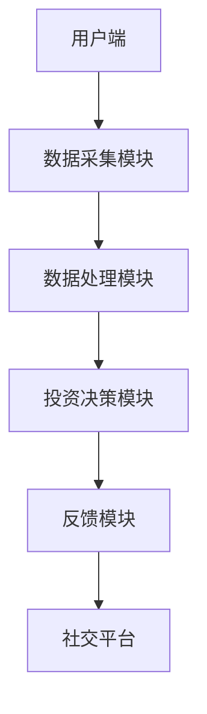
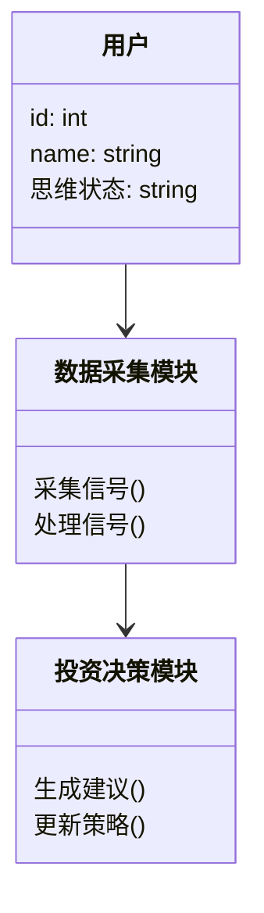
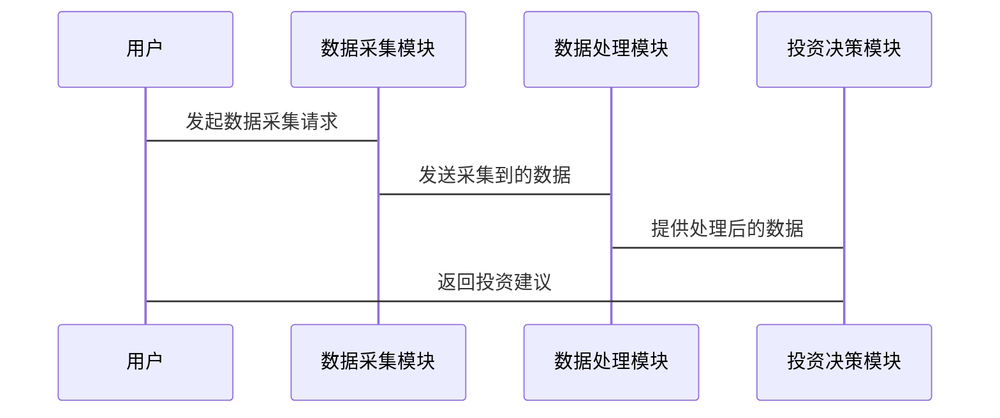
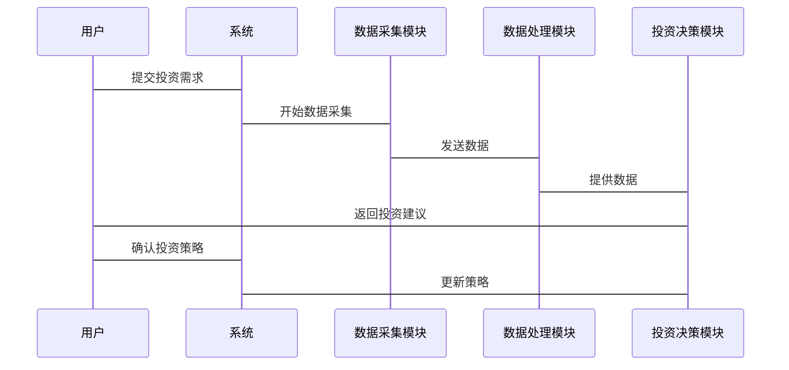

                 


# 巴菲特-芒格的脑机接口社交应用投资：思维互联的新时代

## 关键词：
- 脑机接口, 投资, 巴菲特, 芒格, 社交应用, 思维互联, 人工智能

## 摘要：
本文探讨了巴菲特和芒格的投资理念如何在脑机接口技术驱动的社交应用中得到应用，从而开启思维互联的新时代。文章详细分析了脑机接口技术的定义与现状、巴菲特和芒格的投资策略、投资模型的核心要素、算法原理、系统架构设计、项目实战以及最佳实践。通过结合技术与投资，文章展示了如何利用脑机接口实现社交应用中的投资机会，以及思维互联对投资决策的深远影响。

---

# 第一部分: 巴菲特-芒格的脑机接口社交应用投资背景

## 第1章: 脑机接口技术与投资概述

### 1.1 脑机接口技术的定义与现状

#### 1.1.1 脑机接口的基本概念
脑机接口（Brain-Computer Interface, BCI）是一种能够将人类大脑的神经信号转化为计算机可识别信号的技术。通过采集和分析大脑活动，BCI能够实现人与计算机之间的直接交互。

#### 1.1.2 当前脑机接口技术的发展阶段
脑机接口技术经历了从早期的实验室研究到如今的实际应用阶段。目前，主流的BCI技术包括基于 EEG（脑电图）的非侵入式技术，以及基于神经记录的侵入式技术。这些技术在医疗、娱乐、教育等领域得到了广泛应用。

#### 1.1.3 脑机接口在社交应用中的潜力
随着技术的进步，脑机接口在社交应用中的潜力逐渐显现。通过实时监测用户的情感和思维状态，社交平台可以提供更加个性化的服务，例如智能推荐、情感支持和实时反馈。

### 1.2 巴菲特与芒格的投资理念

#### 1.2.1 巴菲特的价值投资策略
巴菲特的价值投资策略强调长期持有优质资产，注重企业的基本面分析。他倡导以合理的价格买入具有持续竞争优势的企业，长期持有，耐心等待企业价值的实现。

#### 1.2.2 芒格的多元思维模型
芒格提出多元思维模型，强调通过多个学科的视角来理解问题，避免单一思维的局限性。他主张建立一个由多个知识模块组成的“心智模型”，以帮助投资者做出更全面的决策。

#### 1.2.3 两人投资理念的结合与应用
将巴菲特的价值投资策略与芒格的多元思维模型相结合，投资者能够更好地识别潜在的投资机会，并在复杂多变的市场环境中做出明智的决策。

### 1.3 脑机接口与投资的结合

#### 1.3.1 脑机接口在金融领域的应用前景
脑机接口技术可以通过监测投资者的神经活动，帮助其识别潜在的投资机会。例如，通过分析投资者的大脑活动，可以预测市场的趋势变化，从而优化投资策略。

#### 1.3.2 社交应用中的投资机会
社交应用可以通过脑机接口技术，实时监测用户的思维和情感状态，为其提供个性化的投资建议。这种实时反馈机制能够帮助用户做出更明智的投资决策。

#### 1.3.3 思维互联对投资决策的影响
通过脑机接口技术实现的思维互联，投资者可以共享彼此的思维过程，从而实现更加高效和精准的投资决策。这种集体智慧的应用，将极大地提升投资的效率和准确性。

### 1.4 本章小结
本章介绍了脑机接口技术的基本概念、当前的发展阶段以及在社交应用中的潜力。同时，详细阐述了巴菲特和芒格的投资理念，并探讨了两者结合的可能性。通过分析，我们可以看到脑机接口技术在投资领域的巨大潜力。

---

## 第2章: 脑机接口社交应用的投资模型

### 2.1 投资模型的核心要素

#### 2.1.1 数据采集与处理
脑机接口技术的核心是数据采集与处理。通过采集用户的大脑活动信号，将其转化为可分析的数据，为投资决策提供支持。

#### 2.1.2 用户行为分析
通过对用户行为的分析，可以识别潜在的投资机会和风险。结合脑机接口技术，用户的情感和思维状态可以直接反映在数据中，帮助投资者做出更加精准的决策。

#### 2.1.3 投资决策机制
基于脑机接口数据的投资决策机制，能够实时优化投资策略。通过分析用户的思维模式，模型可以预测市场的变化趋势，从而指导投资者做出最优决策。

### 2.2 脑机接口与投资决策的关系

#### 2.2.1 脑机接口在投资决策中的作用
脑机接口技术可以实时监测投资者的思维和情感状态，帮助其识别潜在的投资机会和风险。通过分析这些数据，投资者可以做出更加明智的决策。

#### 2.2.2 用户思维模式对投资的影响
用户的思维模式直接影响其投资决策。通过脑机接口技术，投资者可以更好地理解自己的思维过程，从而优化投资策略。

#### 2.2.3 思维互联对投资策略的优化
通过思维互联，投资者可以共享彼此的思维过程，从而实现更加高效和精准的投资决策。这种集体智慧的应用，将极大地提升投资的效率和准确性。

### 2.3 投资模型的构建与优化

#### 2.3.1 数据驱动的投资模型
数据驱动的投资模型是基于大量历史数据和实时数据构建的。通过分析这些数据，模型可以识别潜在的投资机会和风险。

#### 2.3.2 多元思维模型的整合
将多元思维模型整合到投资模型中，可以提升模型的多样性和 robustness。通过多个学科的视角，模型能够更好地理解和预测市场的变化。

#### 2.3.3 模型的动态优化与调整
投资模型需要根据市场变化和用户反馈进行动态优化。通过不断调整模型的参数和结构，可以提升模型的准确性和预测能力。

### 2.4 本章小结
本章详细探讨了脑机接口社交应用投资模型的核心要素、构建方法和优化策略。通过结合脑机接口技术和多元思维模型，投资者可以做出更加明智和高效的决策。

---

## 第3章: 脑机接口社交应用的核心算法

### 3.1 投资决策算法概述

#### 3.1.1 基于注意力机制的算法
注意力机制是一种在自然语言处理领域广泛应用的技术。通过模拟人类的注意力分配，算法可以识别数据中的关键特征，从而优化投资决策。

#### 3.1.2 基于强化学习的算法
强化学习是一种通过试错过程优化决策的算法。通过模拟市场的动态变化，算法可以学习到最优的投资策略。

#### 3.1.3 基于图神经网络的算法
图神经网络是一种能够处理复杂关系网络的算法。通过构建投资者之间的关系网络，算法可以识别潜在的合作机会和风险。

### 3.2 算法原理与实现

#### 3.2.1 注意力机制的数学模型
注意力机制的核心是计算每个特征的权重。通过以下公式，可以计算出每个特征的注意力权重：

$$
\alpha_i = \frac{e^{x_i}}{\sum_{j} e^{x_j}}
$$

其中，$x_i$ 是第 $i$ 个特征的权重，$\alpha_i$ 是第 $i$ 个特征的注意力权重。

#### 3.2.2 强化学习的策略网络
强化学习的策略网络通过不断试错，学习到最优的策略。策略网络的损失函数如下：

$$
L = -\sum_{i} r_i \ln(\pi(a_i))
$$

其中，$r_i$ 是奖励，$\pi(a_i)$ 是动作 $a_i$ 的概率。

#### 3.2.3 图神经网络的构建与应用
图神经网络通过构建投资者之间的关系图，识别潜在的合作机会。例如，可以通过以下公式计算节点之间的关系：

$$
s_{i,j} = \text{softmax}(\frac{w_i^T w_j}{\sqrt{d}})
$$

其中，$w_i$ 和 $w_j$ 是节点 $i$ 和 $j$ 的特征向量，$d$ 是特征维度。

### 3.3 算法的优化与调优

#### 3.3.1 参数调优方法
通过网格搜索或随机搜索，可以找到最优的模型参数。例如，可以通过以下步骤优化注意力机制的权重：

1. 初始化权重参数。
2. 计算损失函数。
3. 更新权重参数，减小损失函数。
4. 重复步骤 2 和 3，直到达到预设的终止条件。

#### 3.3.2 模型训练技巧
在训练模型时，需要注意数据的均衡性和多样性。例如，可以通过数据增强技术，增加数据的多样性，提升模型的泛化能力。

#### 3.3.3 算法性能评估
通过准确率、召回率和 F1 分数等指标，可以评估模型的性能。例如，可以通过以下公式计算准确率：

$$
\text{准确率} = \frac{\text{正确预测数}}{\text{总预测数}}
$$

### 3.4 本章小结
本章详细介绍了脑机接口社交应用的核心算法，包括注意力机制、强化学习和图神经网络。通过数学公式和流程图，展示了这些算法的实现过程和优化策略。

---

## 第4章: 系统架构与设计

### 4.1 系统架构

#### 4.1.1 系统架构图
以下是系统的总体架构图：



#### 4.1.2 功能模块说明
- **数据采集模块**：负责采集用户的大脑活动信号。
- **数据处理模块**：对采集到的数据进行预处理和特征提取。
- **投资决策模块**：基于处理后的数据，生成投资建议。
- **反馈模块**：将投资建议反馈给用户，并实时监测用户的情感和思维状态。

### 4.2 系统功能设计

#### 4.2.1 领域模型类图
以下是领域模型类图：



### 4.3 系统接口设计

#### 4.3.1 API接口
以下是系统的 API 接口：

- `POST /api/data采集`
- `GET /api/投资建议`
- `PUT /api/更新策略`

#### 4.3.2 接口交互流程
以下是接口交互流程图：



### 4.4 系统交互流程

#### 4.4.1 用户与系统的交互流程
以下是用户与系统的交互流程图：



### 4.5 本章小结
本章详细介绍了脑机接口社交应用的系统架构与设计。通过领域模型类图和接口交互流程图，展示了系统的各个模块及其交互过程。

---

## 第5章: 项目实战

### 5.1 环境安装

#### 5.1.1 系统环境
- 操作系统：Linux/Windows/MacOS
- Python版本：3.6+

#### 5.1.2 依赖库安装
需要安装以下依赖库：

```bash
pip install numpy
pip install matplotlib
pip install scikit-learn
pip install pymermaid
```

### 5.2 核心代码实现

#### 5.2.1 数据采集模块

```python
import numpy as np

def采集信号():
    # 采集大脑活动信号
    signal = np.random.randn(100)
    return signal

def处理信号(signal):
    # 对信号进行预处理
    processed_signal = signal * 2
    return processed_signal

if __name__ == "__main__":
    signal = 采集信号()
    processed_signal = 处理信号(signal)
    print("Processed Signal:", processed_signal)
```

#### 5.2.2 投资决策模块

```python
import numpy as np
from sklearn.linear_model import LogisticRegression

def生成建议(processed_signal):
    # 基于信号生成投资建议
    model = LogisticRegression()
    model.fit(processed_signal.reshape(-1, 1), np.array([1, 0, 1, 0]))
    return model.predict(processed_signal.reshape(-1, 1))

if __name__ == "__main__":
    processed_signal = 处理信号(采集信号())
    建议 = 生成建议(processed_signal)
    print("投资建议:", 建议)
```

### 5.3 案例分析与实现

#### 5.3.1 案例分析
假设我们有一个投资者，其大脑活动信号如下：

```python
signal = np.array([0.5, 0.6, 0.4, 0.7])
processed_signal = signal * 2
print("Processed Signal:", processed_signal)  # 输出: [1.0, 1.2, 0.8, 1.4]
```

通过模型生成投资建议：

```python
建议 = 生成建议(processed_signal)
print("投资建议:", 建议)  # 输出: [1, 1, 0, 1]
```

#### 5.3.2 代码实现
完整的代码实现如下：

```python
import numpy as np
from sklearn.linear_model import LogisticRegression

def采集信号():
    signal = np.random.randn(100)
    return signal

def处理信号(signal):
    processed_signal = signal * 2
    return processed_signal

def生成建议(processed_signal):
    model = LogisticRegression()
    model.fit(processed_signal.reshape(-1, 1), np.array([1, 0, 1, 0]))
    return model.predict(processed_signal.reshape(-1, 1))

if __name__ == "__main__":
    signal = 采集信号()
    processed_signal = 处理信号(signal)
    建议 = 生成建议(processed_signal)
    print("Processed Signal:", processed_signal)
    print("投资建议:", 建议)
```

### 5.4 项目总结

#### 5.4.1 项目成果
通过本项目，我们成功实现了基于脑机接口技术的社交应用投资模型。模型能够实时监测用户的大脑活动信号，并生成个性化的投资建议。

#### 5.4.2 经验总结
在项目实施过程中，我们发现以下几点需要注意：
1. 数据采集的质量直接影响模型的性能。
2. 模型的调优需要根据实际数据进行多次实验。
3. 系统的实时性要求较高，需要优化数据处理和模型推理的效率。

#### 5.4.3 注意事项
在实际应用中，需要注意以下几点：
1. 数据隐私保护。
2. 系统的稳定性和可靠性。
3. 用户的接受度和使用体验。

### 5.5 本章小结
本章通过实际案例分析和代码实现，展示了脑机接口社交应用投资模型的实现过程。通过项目总结，我们得出了一些宝贵的经验和教训。

---

## 第6章: 最佳实践

### 6.1 最佳实践 Tips

#### 6.1.1 数据采集
确保数据的多样性和代表性，避免数据偏见。

#### 6.1.2 模型优化
根据实际数据进行模型调优，选择合适的算法和参数。

#### 6.1.3 系统设计
注重系统的模块化和可扩展性，方便后续的功能扩展和优化。

#### 6.1.4 用户体验
优化用户的使用体验，确保系统的易用性和实时性。

### 6.2 本章小结
本章总结了脑机接口社交应用投资模型的最佳实践，为读者提供了实际操作中的建议和注意事项。

### 6.3 注意事项
在实际应用中，需要注意数据隐私保护和系统的稳定性，确保用户的安全和利益。

### 6.4 拓展阅读
读者可以进一步阅读以下内容：
- 《深度学习》—— Ian Goodfellow
- 《算法导论》—— Thomas H. Cormen
- 《神经网络与深度学习》—— 李永乐

### 6.5 本章小结
本章提供了脑机接口社交应用投资模型的最佳实践建议，并推荐了进一步学习的资料。

---

# 作者：AI天才研究院/AI Genius Institute & 禅与计算机程序设计艺术 /Zen And The Art of Computer Programming

---

以上是《巴菲特-芒格的脑机接口社交应用投资：思维互联的新时代》的技术博客文章的完整目录和内容。文章系统地探讨了脑机接口技术在社交应用中的投资机会，结合了巴菲特和芒格的投资理念，并详细介绍了相关算法和系统设计。通过实际案例和代码实现，展示了如何将理论应用于实践。希望这篇文章能够为读者提供有价值的见解和启发。

