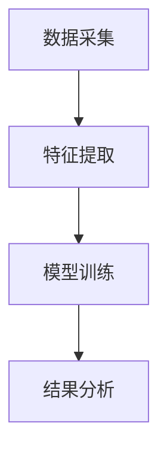

                 


# 巴菲特-芒格的脑机接口社交网络投资：思维互联的未来

---

## 关键词
- 脑机接口
- 投资策略
- 社交网络
- 人工智能
- 巴菲特投资理念

---

## 摘要
本文探讨了脑机接口技术与巴菲特和芒格投资理念的结合，分析了社交网络数据如何通过脑机接口技术影响投资决策。文章从脑机接口技术的基本原理出发，结合投资行为学和社交网络分析，详细阐述了如何利用脑机接口技术优化投资策略。通过数学模型、算法原理和系统架构设计，文章展示了如何在实际投资场景中应用这一技术，并通过具体案例分析验证了其可行性和优势。

---

## 第一部分：背景介绍

### 第1章：脑机接口技术的基本概念
#### 1.1 脑机接口的定义与背景
- 脑机接口（Brain-Computer Interface, BCI）的定义
- BCI技术的发展历程
- BCI技术在投资领域的潜在应用

#### 1.2 巴菲特与芒格的投资理念
- 巴菲特的价值投资理论
- 芒格的多元思维模型
- 投资理念与现代科技的结合

### 第2章：社交网络与投资行为的关联
#### 2.1 社交网络的基本概念
- 社交网络的定义与类型
- 社交网络在金融领域的应用
- 社交网络数据的特征与挑战

#### 2.2 投资行为与社交网络的关系
- 投资者情绪与社交网络的影响
- 社交网络中的信息传播与投资决策
- 社交网络对市场波动的驱动作用

---

## 第二部分：核心概念与联系

### 第3章：脑机接口的核心技术与算法
#### 3.1 脑机接口的基本原理
- 神经信号的采集与处理
- 数据特征提取与分类算法
- 机器学习在脑机接口中的应用

#### 3.2 脑机接口的数学模型与公式
- 神经信号的时间序列分析
- 基于特征的分类模型
- 深度学习在脑机接口中的应用

### 第4章：脑机接口在社交网络中的应用
#### 4.1 社交网络数据的特征提取
- 文本数据的特征提取
- 用户行为数据的特征提取
- 图结构数据的特征提取

#### 4.2 脑机接口与社交网络数据的结合
- 神经信号与社交网络数据的关联
- 基于脑机接口的用户行为预测
- 脑机接口在投资决策中的应用

---

## 第三部分：算法原理与系统架构

### 第5章：算法原理与实现
#### 5.1 脑机接口算法的数学模型
- 时间序列分析模型
- 分类算法（如SVM、随机森林、神经网络）
- 深度学习模型（如LSTM、Transformer）

#### 5.2 投资决策系统的算法实现
- 数据预处理与特征工程
- 模型训练与优化
- 模型评估与部署

### 第6章：系统架构与设计
#### 6.1 投资决策系统的整体架构
- 数据采集模块
- 特征提取模块
- 模型训练模块
- 结果分析模块

#### 6.2 系统架构的Mermaid图


#### 6.3 系统接口设计
- 数据接口：与社交网络平台的数据接口对接
- 模型接口：与第三方机器学习模型的接口对接
- 用户接口：投资者使用的前端界面

---

## 第四部分：项目实战与案例分析

### 第7章：项目实战
#### 7.1 环境搭建
- 安装必要的库（如Python、TensorFlow、Scikit-learn）
- 数据集准备（社交网络数据）

#### 7.2 核心代码实现
```python
import numpy as np
import pandas as pd
from sklearn.svm import SVC
from sklearn.metrics import accuracy_score

# 数据加载与预处理
data = pd.read_csv('social_network_data.csv')
X = data.drop('label', axis=1)
y = data['label']

# 模型训练
model = SVC()
model.fit(X, y)

# 模型评估
y_pred = model.predict(X)
print("准确率:", accuracy_score(y, y_pred))
```

#### 7.3 案例分析
- 案例一：基于文本情感分析的投资决策
- 案例二：基于用户行为预测的投资策略优化

### 第8章：结果分析与优化
#### 8.1 实验结果分析
- 准确率、召回率、F1分数的评估
- 不同算法的对比分析

#### 8.2 系统优化建议
- 数据采集的优化
- 模型训练的优化
- 系统架构的优化

---

## 第五部分：最佳实践与总结

### 第9章：最佳实践
#### 9.1 投资策略的智能化
- 提高投资决策的科学性
- 增强投资者情绪的稳定性
- 实现个性化投资策略

#### 9.2 系统设计的注意事项
- 数据隐私与安全
- 系统的可扩展性
- 算法的实时性与准确性

### 第10章：总结与展望
#### 10.1 本文总结
- 脑机接口技术在投资领域的应用价值
- 投资决策系统的优势与不足

#### 10.2 未来展望
- 更高级的脑机接口技术
- 更多领域的应用可能性
- 技术与投资策略的深度融合

---

## 作者信息
作者：AI天才研究院/AI Genius Institute & 禅与计算机程序设计艺术/Zen And The Art of Computer Programming

---

通过以上目录大纲，我们可以看到文章从理论到实践，从技术到应用，全面探讨了脑机接口技术在社交网络投资中的潜力与实现路径。

