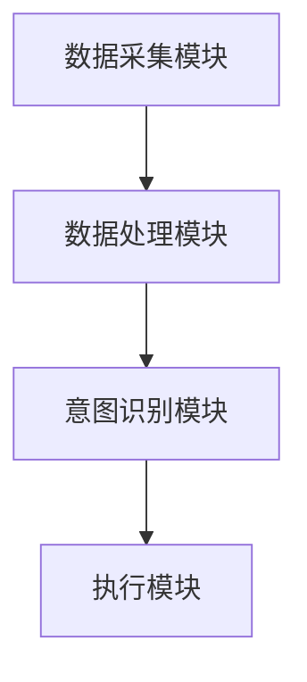

                 

# 巴菲特-芒格的脑机接口隐私保护投资：数字人权的新前沿

**关键词**：巴菲特, 芒格, 脑机接口, 隐私保护, 数字人权, 投资策略, 技术与法律

**摘要**：本文探讨了巴菲特和芒格在脑机接口技术中的隐私保护投资策略，分析了这一领域对数字人权的影响。文章从脑机接口的基本原理和隐私保护的重要性入手，结合两位投资者的哲学和策略，详细分析了技术与投资的结合，最后提出了未来展望和注意事项。

---

# 第一部分：脑机接口与隐私保护的背景与基础

## 第1章：脑机接口技术概述

### 1.1 脑机接口的基本概念

#### 1.1.1 脑机接口的定义
脑机接口（Brain-Computer Interface, BCI）是一种通过采集、处理和分析大脑神经信号，将大脑意图转化为外部设备操作的技术。它连接了人类思维与数字世界，被誉为“人与机器的桥梁”。

#### 1.1.2 脑机接口的核心技术原理
- **信号采集**：通过电极采集大脑电信号，如EEG（脑电图）。
- **信号处理**：对采集的信号进行滤波、降噪和特征提取。
- **意图识别**：利用机器学习模型将信号转化为具体意图，如控制机械臂。

#### 1.1.3 脑机接口的应用领域
- 医疗：帮助瘫痪患者恢复肢体功能。
- 娱乐：非侵入式游戏控制。
- 工作：提升工作效率，如用思维控制计算机。

### 1.2 隐私保护的重要性

#### 1.2.1 隐私保护的基本概念
隐私保护是保障个人数据不被未经授权访问或滥用的法律和伦理原则。

#### 1.2.2 数字时代隐私保护的挑战
- 数据量激增，隐私泄露风险增加。
- 技术进步带来更复杂的隐私威胁。

#### 1.2.3 脑机接口与隐私保护的特殊性
- 数据敏感性：脑机接口采集的是大脑电信号，涉及个人隐私。
- 技术复杂性：需要处理复杂的信号和数据，保护难度大。

---

## 第2章：脑机接口技术的数学模型与算法原理

### 2.1 脑机接口的基本数学模型

#### 2.1.1 信号处理的数学模型
- **滤波器设计**：使用傅里叶变换进行信号频域分析。
- **特征提取**：利用小波变换提取信号特征。

#### 2.1.2 机器学习在脑机接口中的应用
- **分类算法**：如支持向量机（SVM）和随机森林（Random Forest）。
- **深度学习**：如卷积神经网络（CNN）用于处理时间序列数据。

#### 2.1.3 神经网络在脑机接口中的作用
- **神经网络结构**：如循环神经网络（RNN）用于处理时间序列数据。
- **训练过程**：通过大量数据训练模型，优化分类准确率。

### 2.2 隐私保护的数学模型

#### 2.2.1 数据加密的数学基础
- **加密算法**：如AES（高级加密标准）和RSA（公钥加密）。
- **同态加密**：允许在加密状态下进行数据计算。

#### 2.2.2 数据脱敏的数学方法
- **数据替换**：如将敏感数据替换为随机值。
- **数据扰动**：如添加噪声，保护数据隐私。

#### 2.2.3 隐私计算的数学模型
- **隐私保护计算**：如联邦学习（Federated Learning），在不共享数据的情况下进行模型训练。

---

## 第3章：脑机接口系统的架构设计

### 3.1 系统架构概述

#### 3.1.1 系统组成模块
- **数据采集模块**：采集大脑电信号。
- **数据处理模块**：对信号进行预处理和特征提取。
- **意图识别模块**：将信号转化为具体意图。
- **执行模块**：将意图转化为实际操作。

#### 3.1.2 各模块之间的关系
- 数据流：从采集到处理，再到识别和执行。
- 依赖关系：各模块协同工作，确保系统高效运行。

#### 3.1.3 系统的整体架构图（Mermaid图）

### 3.2 隐私保护的系统设计

#### 3.2.1 数据采集与处理的隐私保护
- **隐私保护技术**：在数据采集阶段，使用加密技术保护数据。
- **数据匿名化**：对采集的数据进行匿名化处理，防止身份识别。

#### 3.2.2 数据传输的隐私保护
- **加密传输**：使用TLS协议进行数据加密传输。
- **安全通道**：确保数据在传输过程中不被截获或篡改。

#### 3.2.3 数据存储的隐私保护
- **数据加密存储**：对存储的数据进行加密，防止数据泄露。
- **访问控制**：严格控制数据访问权限，防止未经授权的访问。

---

# 第二部分：巴菲特与芒格的投资哲学与策略

## 第4章：巴菲特与芒格的投资理念

### 4.1 巴菲特的投资哲学

#### 4.1.1 巴菲特的价值投资理念
- **长期投资**：关注企业的长期价值，而非短期波动。
- **安全边际**：在投资中留有安全边际，降低风险。

#### 4.1.2 巴菲特的长期投资策略
- **企业基本面分析**：关注企业的财务状况、行业地位和竞争优势。
- **价值评估**：通过内在价值评估，寻找被低估的投资标的。

#### 4.1.3 巴菲特对风险管理的重视
- **分散投资**：通过分散投资降低风险。
- **避免杠杆**：避免使用高杠杆，降低风险敞口。

### 4.2 芒格的多元思维模型

#### 4.2.1 芒格的多元思维模型概述
- **跨学科思维**：将不同学科的知识融合，形成多元思维。
- **决策框架**：通过多元思维模型帮助做出更好的决策。

#### 4.2.2 芒格的决策框架
- **逆向思维**：从反面思考问题，避免从众心理。
- **第二层思维**：考虑市场参与者的心理和行为。

#### 4.2.3 芒格的逆向思维
- **避免错误**：通过逆向思维避免常见的投资错误。
- **寻找机会**：在别人恐慌时寻找机会。

## 第5章：巴菲特与芒格在脑机接口领域的投资策略

### 5.1 脑机接口领域的投资机会

#### 5.1.1 脑机接口技术的市场潜力
- **医疗领域**：脑机接口在医疗康复中的应用前景广阔。
- **娱乐领域**：非侵入式脑机接口技术将推动游戏和娱乐产业的发展。
- **工业领域**：脑机接口技术将提升工业自动化水平。

#### 5.1.2 脑机接口领域的投资热点
- **核心技术研发**：投资于脑机接口技术的核心研发公司。
- **应用开发**：投资于脑机接口技术的应用开发公司。
- **隐私保护技术**：投资于隐私保护技术的研发和应用。

#### 5.1.3 脑机接口技术的未来发展趋势
- **技术融合**：脑机接口技术将与人工智能、大数据等技术深度融合。
- **应用扩展**：脑机接口技术将拓展到更多领域，如教育、社交等。

### 5.2 巴菲特与芒格的投资策略分析

#### 5.2.1 巴菲特对脑机接口技术的长期价值判断
- **长期价值**：脑机接口技术将对人类社会产生深远影响，具有长期投资价值。
- **竞争优势**：投资于具有技术优势和市场竞争力的公司。

#### 5.2.2 芒格的多元思维模型在脑机接口投资中的应用
- **跨学科分析**：结合神经科学、计算机科学和法律等多学科知识，全面评估投资机会。
- **逆向思维**：在脑机接口技术的早期阶段寻找投资机会，避免竞争激烈。

#### 5.2.3 巴菲特与芒格对脑机接口隐私保护技术的投资偏好
- **隐私保护技术**：重视隐私保护技术的研发和应用，投资于具有隐私保护优势的公司。
- **合规性**：关注脑机接口技术的法律合规性，避免法律风险。

---

# 第三部分：脑机接口隐私保护的法律与伦理问题

## 第6章：脑机接口隐私保护的法律与伦理挑战

### 6.1 法律框架

#### 6.1.1 数据隐私法律
- **GDPR**：《通用数据保护条例》（欧盟）对数据隐私的严格保护。
- **CCPA**：《加州消费者隐私法案》（美国）对数据隐私的保护。

#### 6.1.2 脑机接口技术的法律合规性
- **数据采集合法性**：确保数据采集符合相关法律法规。
- **用户同意**：获得用户的明确同意，确保数据使用合法。

### 6.2 伦理问题

#### 6.2.1 隐私权与知情权
- **隐私权**：用户有权控制自己的数据不被滥用。
- **知情权**：用户有权了解数据的使用方式和目的。

#### 6.2.2 数据安全与伦理
- **数据安全**：确保数据在采集、传输和存储过程中的安全性。
- **伦理合规**：在数据使用过程中遵循伦理规范，避免对用户造成伤害。

---

# 第四部分：案例分析与未来展望

## 第7章：案例分析

### 7.1 巴菲特与芒格投资的脑机接口公司

#### 7.1.1 公司简介
- **公司名称**：例如，Neuralink（埃隆·马斯克创立的脑机接口公司）。
- **技术特点**：专注于侵入式脑机接口技术，应用于医疗康复和人机交互。

#### 7.1.2 投资策略
- **长期投资**：巴菲

