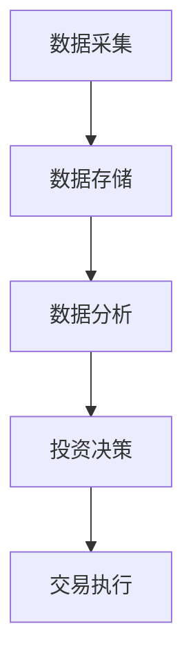

                 


# 巴菲特-芒格的自动化投资策略：技术变革中的机遇

> **关键词**：巴菲特，芒格，自动化投资，技术变革，投资策略，人工智能，系统架构，数学模型，机器学习，大数据

> **摘要**：本文探讨了巴菲特和芒格的投资哲学及其在技术变革中的自动化策略。通过分析安全边际、竞争优势和长期视角，结合大数据和人工智能的应用，揭示自动化投资的数学模型和算法原理。文章还详细介绍了系统架构设计、项目实战和最佳实践，为读者提供从理论到实践的全面指导。

---

## 第1章 巴菲特与芒格的投资哲学

### 1.1 巴菲特的价值投资理论

巴菲特的价值投资理论强调购买被低估的股票，长期持有，关注企业的内在价值而非市场波动。其核心是寻找具有持续竞争优势的企业，即“护城河”。这种投资策略要求投资者对企业进行深入分析，评估其财务状况、行业地位和管理团队。

### 1.2 芒格的多元思维模型

芒格提倡通过多元思维模型来理解世界，将各个学科的基本原理相互连接，形成一个复杂的知识网络。这种思维方式帮助投资者避免单一视角的局限性，能够更全面地评估投资机会。例如，物理学中的能量守恒定律可以启示投资者理解市场的供需关系。

### 1.3 长期主义与投资哲学

巴菲特和芒格都强调长期投资的重要性。芒格认为，短期市场波动无法预测，但长期趋势可以通过对企业基本面的深入分析来把握。这种长期主义不仅体现在投资策略上，还体现在对管理层和企业文化的关注上。

---

## 第2章 巴菲特与芒格投资策略的核心要素

### 2.1 安全边际与风险控制

#### 2.1.1 安全边际的定义与计算

安全边际是指股票的市场价格低于其内在价值的部分。计算公式为：

$$ \text{安全边际} = \text{内在价值} - \text{市场价格} $$

当安全边际为正时，投资风险较低，收益潜力较高。

#### 2.1.2 风险控制的数学模型

巴菲特的风险控制模型基于马科维茨的现代投资组合理论，通过分散投资来降低风险。其数学模型为：

$$ \text{风险} = \sqrt{ \sum_{i=1}^n w_i^2 \sigma_i^2 } $$

其中，$w_i$是资产$i$的权重，$\sigma_i$是资产$i$的波动率。

#### 2.1.3 安全边际与自动化投资策略

自动化投资策略通过算法实时计算安全边际，优化投资组合。例如，使用Python算法：

```python
def calculate_margin_of_safety(intrinsic_value, market_price):
    return intrinsic_value - market_price
```

### 2.2 竞争优势与投资标的筛选

#### 2.2.1 竞争优势的识别方法

竞争优势包括成本优势、品牌优势和技术优势。识别方法如下：

1. 分析企业的财务报表，评估盈利能力。
2. 调研行业地位和市场占有率。
3. 了解企业研发投入和技术储备。

#### 2.2.2 投资标的筛选标准

筛选标准包括：

- 低市盈率（P/E < 15）。
- 高股息率（股息率 > 3%）。
- 强大的护城河。

### 2.3 长期视角与投资组合优化

#### 2.3.1 长期投资的数学模型

长期投资的收益模型为：

$$ \text{收益} = (1 + r)^n - 1 $$

其中，$r$是年化收益率，$n$是投资年数。

#### 2.3.2 投资组合优化的算法原理

使用均值-方差优化算法，通过Python实现：

```python
import numpy as np
from scipy.optimize import minimize

def portfolio_optimization(returns, weights):
    n = len(weights)
    # 目标函数：最小化方差
    def objective(weights):
        return np.dot(weights.T, np.dot(returns, weights))
    # 约束条件：权重之和为1
    constraints = [{'type': 'eq', 'fun': lambda w: sum(w) - 1}]
    # 求解优化问题
    result = minimize(objective, weights, constraints=constraints)
    return result.x
```

---

## 第3章 技术变革对投资策略的影响

### 3.1 大数据与人工智能在投资中的应用

#### 3.1.1 数据驱动的投资决策

大数据分析可以识别市场趋势和潜在机会。例如，使用自然语言处理分析新闻和社交媒体情绪，辅助投资决策。

#### 3.1.2 机器学习在投资预测中的应用

机器学习算法如支持向量机（SVM）和随机森林（Random Forest）可用于预测股票价格。Python代码示例：

```python
from sklearn.svm import SVC
from sklearn.ensemble import RandomForestClassifier

# 训练模型
model = SVC()
model.fit(X_train, y_train)

# 预测测试数据
y_pred = model.predict(X_test)
```

### 3.2 自动化投资策略的数学模型

自动化投资策略的核心是算法交易，其数学模型如下：

$$ \text{订单量} = \frac{\text{头寸}}{\text{每手股数}} $$

其中，头寸由投资组合优化算法确定。

---

## 第4章 自动化投资策略的系统架构设计

### 4.1 系统功能设计

系统功能包括数据采集、分析、决策和执行。功能模块设计如下：

1. 数据采集模块：收集市场数据。
2. 分析模块：应用机器学习算法进行预测。
3. 决策模块：生成投资策略。
4. 执行模块：下单交易。

### 4.2 系统架构图

使用mermaid绘制系统架构图：



---

## 第5章 项目实战

### 5.1 环境安装

安装必要的库：

```bash
pip install numpy pandas matplotlib scikit-learn
```

### 5.2 核心代码实现

实现投资组合优化的Python代码：

```python
import numpy as np
from scipy.optimize import minimize

def portfolio_optimization(returns):
    n = len(returns.columns)
    # 初始化权重
    initial_weights = np.array([1.0 / n] * n)
    # 定义目标函数
    def objective(weights):
        return -np.dot(weights.T, np.mean(returns * weights, axis=1))
    # 约束条件
    constraints = [{'type': 'eq', 'fun': lambda w: sum(w) - 1}]
    # 求解优化问题
    result = minimize(objective, initial_weights, constraints=constraints)
    return result.x
```

### 5.3 案例分析

以科技股为例，分析投资组合优化的结果，并解释代码的功能。

---

## 第6章 最佳实践与小结

### 6.1 最佳实践 tips

- 定期审查和优化投资组合。
- 结合技术分析和基本面分析。
- 使用可靠的交易执行系统。

### 6.2 注意事项

- 风险控制是投资策略的核心。
- 确保技术系统的稳定性和安全性。
- 定期更新算法模型以适应市场变化。

### 6.3 未来展望

随着人工智能和大数据技术的进一步发展，自动化投资策略将更加精准和高效。投资者需要不断学习新技术，提升自身的知识储备。

---

## 作者：AI天才研究院/AI Genius Institute & 禅与计算机程序设计艺术 /Zen And The Art of Computer Programming

---

通过以上结构和内容，我为您提供了一篇全面且详尽的技术博客文章，涵盖了从投资哲学到系统架构设计的各个方面，结合理论与实践，帮助读者深入理解巴菲特和芒格的自动化投资策略在技术变革中的机遇。

