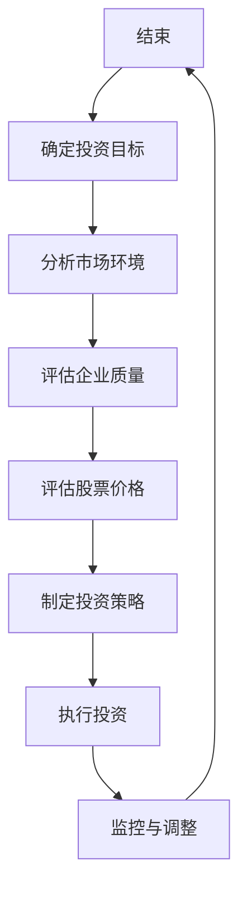
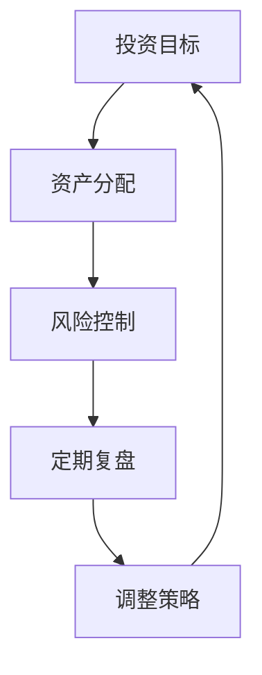
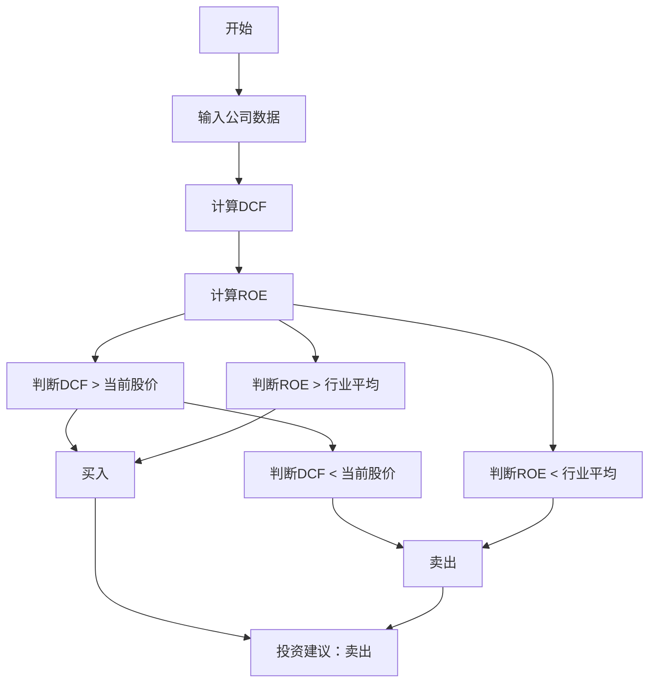

                 

---

# 巴菲特-芒格的质量优先原则：好公司vs便宜股票

## 关键词：
- 巴菲特
- 芒格
- 质量优先原则
- 好公司
- 便宜股票
- 长期投资
- 价值投资

## 摘要：
本文深入探讨了巴菲特和芒格的质量优先投资原则，分析了“好公司”与“便宜股票”的区别，并通过数学模型和实际案例展示了如何通过投资好公司实现长期收益最大化。文章结构清晰，内容详实，适合投资新手和资深投资者阅读。

---

## 第4章: 投资决策的系统架构

### 4.1 投资决策的系统架构

#### 4.1.1 投资决策的流程图
以下是投资决策的系统架构流程图，展示了从开始到结束的投资决策过程：

#### 4.1.2 投资决策的步骤解析
1. **确定投资目标**：明确投资目的，如长期收益、资本增值或股息收入。
2. **分析市场环境**：研究宏观经济趋势、行业动态和市场周期。
3. **评估企业质量**：通过财务指标、竞争优势和管理层能力评估公司质量。
4. **评估股票价格**：比较当前股价与内在价值，判断是否低估。
5. **制定投资策略**：根据分析结果制定买入、持有或卖出策略。
6. **执行投资**：按照策略执行交易。
7. **监控与调整**：定期复盘，根据市场变化调整投资组合。

### 4.2 投资组合管理

#### 4.2.1 投资组合的系统架构
以下是投资组合管理的系统架构图：

#### 4.2.2 投资组合管理的步骤
1. **资产分配**：根据风险承受能力和收益目标分配资金到不同资产类别。
2. **风险控制**：设定止损点和止盈点，分散投资以降低风险。
3. **定期复盘**：每季度或半年检查投资组合表现。
4. **调整策略**：根据市场变化和个人目标调整持仓。

---

## 第5章: 质量优先原则的数学模型与算法

### 5.1 质量优先原则的数学模型

#### 5.1.1 现金流贴现模型（DCF）
以下是现金流贴现模型的公式：

$$DCF = \sum_{t=1}^{n} \frac{CF_t}{(1+r)^t} + \frac{TV}{(1+r)^n}$$

其中：
- $CF_t$ 是第t年的现金流。
- $r$ 是折现率。
- $TV$ 是终值。

#### 5.1.2 股东权益收益率（ROE）
以下是ROE的计算公式：

$$ROE = \frac{净利润}{股东权益}$$

ROE越高，公司使用股东资金的效率越高。

#### 5.1.3 市盈率与市净率的对比
以下是市盈率（P/E）和市净率（P/B）的对比：

| 指标 | 定义 | 适用场景 |
|------|------|----------|
| P/E | 市价/每股收益 | 用于评估盈利能力强的公司 |
| P/B | 市价/每股净资产 | 用于评估资产密集型公司 |

### 5.2 投资决策算法

#### 5.2.1 投资决策算法流程图
以下是投资决策算法的流程图：

---

## 第6章: 实际案例分析与投资策略

### 6.1 巴菲特的经典投资案例

#### 6.1.1 可口可乐的投资
- **投资时间**：1988年至今。
- **投资理由**：强大的品牌、稳定的现金流、可口可乐的全球市场地位。
- **表现**：长期大幅跑赢市场。

#### 6.1.2 苹果的投资
- **投资时间**：2016年至今。
- **投资理由**：创新能力强、高壁垒、管理层优秀。
- **表现**：股价持续增长，股息收入稳定。

### 6.2 芒格的选股标准与实际操作

#### 6.2.1 股票筛选标准
- **财务健康**：低负债率、高ROE。
- **竞争优势**：垄断、技术壁垒。
- **管理层优秀**：诚信、能力强。

#### 6.2.2 股票筛选流程
1. **行业筛选**：选择朝阳行业。
2. **财务分析**：筛选ROE>15%的公司。
3. **竞争优势评估**：分析公司的护城河。
4. **管理层评估**：研究管理层的背景和决策能力。
5. **价格评估**：比较股价与内在价值。

### 6.3 质量优先原则的现代应用

#### 6.3.1 科技股投资
- **代表公司**：苹果、微软。
- **投资理由**：高增长、高壁垒、持续创新。

#### 6.3.2 防守型投资
- **代表公司**：可口可乐、麦当劳。
- **投资理由**：稳定的现金流、防御性强。

---

## 第7章: 投资策略与组合管理

### 7.1 投资策略

#### 7.1.1 质量优先策略
- **核心**：选择好公司，而非便宜的股票。
- **实施**：长期持有，享受复利效应。

#### 7.1.2 价值投资策略
- **核心**：买入低于内在价值的股票。
- **实施**：耐心等待市场先生出错。

### 7.2 组合管理

#### 7.2.1 资产分配
- **股票**：60%
- **债券**：20%
- **现金**：20%

#### 7.2.2 定期复盘
- **频率**：每季度一次。
- **内容**：检查持仓表现，评估市场变化。

#### 7.2.3 风险管理
- **止损点**：设定5%的止损位。
- **止盈点**：设定10%的止盈位。

---

## 第8章: 长期投资与个人成长

### 8.1 长期投资的重要性

#### 8.1.1 复利效应
- **公式**：$A = P(1 + r)^n$
- **意义**：时间是投资的好朋友。

#### 8.1.2 耐心的重要性
- **心态管理**：避免短期波动影响判断。
- **长期视角**：关注企业的长期价值。

### 8.2 投资与个人成长

#### 8.2.1 投资是学习的过程
- **知识积累**：不断学习财务、经济知识。
- **经验积累**：通过实践总结经验。

#### 8.2.2 心态管理
- **贪婪与恐惧**：克服贪婪和恐惧，保持理性。
- **持续学习**：保持对市场的敏感性。

---

## 结论

巴菲特和芒格的质量优先原则强调选择好公司而非便宜的股票，长期投资才能实现财富的稳健增长。通过系统的投资决策流程、科学的数学模型和实际案例分析，我们可以更好地理解并应用这一原则。投资不仅是技术分析，更是一种心态管理和个人成长的过程。

---

## 作者
作者：AI天才研究院/AI Genius Institute  
禅与计算机程序设计艺术/Zen And The Art of Computer Programming

