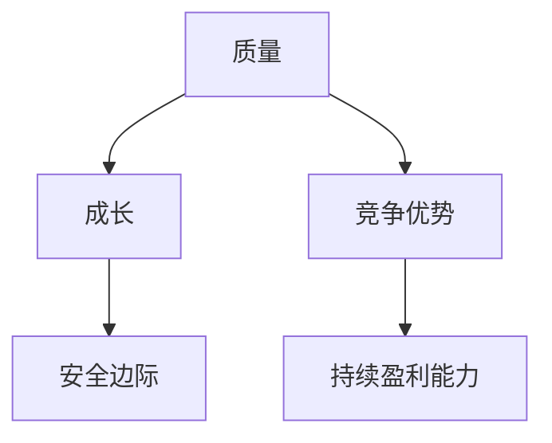
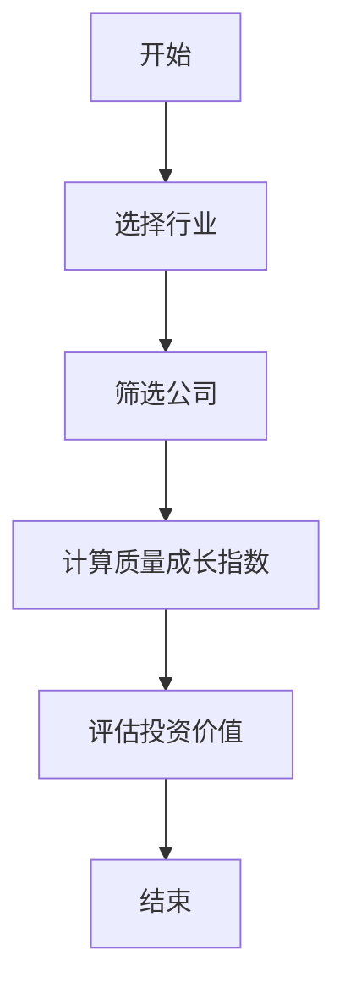
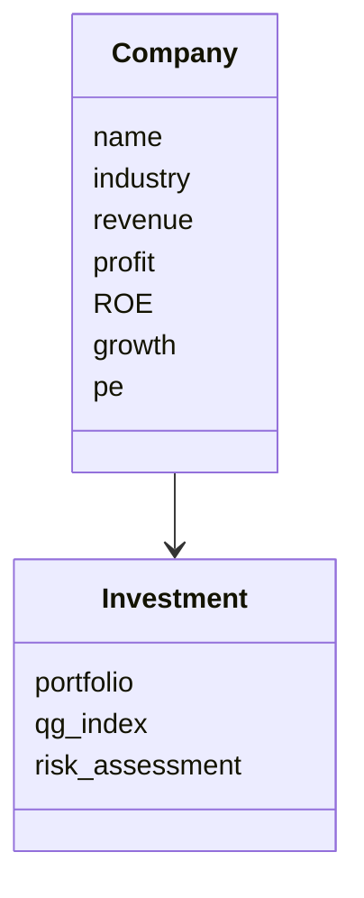
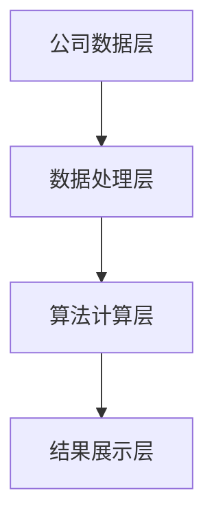

                 


# 巴菲特-芒格的质量成长理论：寻找高质量且能持续成长的公司

## 关键词：
- 巴菲特
- 芒格
- 质量成长理论
- 投资策略
- 财务分析
- 价值投资

## 摘要：
本文系统阐述巴菲特和芒格的质量成长理论，探讨如何通过寻找高质量且能持续成长的公司来实现长期投资价值。从理论基础、核心概念、数学模型、系统架构到实战案例，层层剖析，为读者提供一套科学的投资分析方法。

---

# 第1章 巴菲特与芒格的投资理念概述

## 1.1 巴菲特与芒格的生平简介

### 1.1.1 巴菲特的生平与投资理念
沃伦·巴菲特（Warren Buffett）是世界著名投资者，秉持价值投资理念，强调安全边际和长期盈利能力。他通过分析公司基本面，寻找具有持续竞争优势的企业。

### 1.1.2 芒格的生平与投资哲学
查理·芒格（Charlie Munger）是巴菲特的长期合作伙伴，倡导多元思维模型，注重对公司管理层、行业地位和财务健康进行全面评估。

### 1.1.3 巴菲特与芒格的合作历程
两人自1959年起合作，芒格帮助巴菲特扩展投资视野，巴菲特则为芒格提供实际操作经验，共同形成独特投资哲学。

## 1.2 巴菲特-芒格投资理念的核心思想

### 1.2.1 价值投资的定义与特点
价值投资强调购买低于内在价值的股票，长期持有。特点包括注重安全边际、关注公司基本面、分散投资。

### 1.2.2 成长投资的定义与特点
成长投资侧重于投资具有高成长潜力的企业，强调未来收益的高增长。特点包括高市盈率、高ROE、高增长率。

### 1.2.3 质量成长理论的提出与演变
结合价值与成长投资，注重企业质量与成长性的统一，寻找兼具竞争优势和持续增长能力的企业。

## 1.3 质量成长理论的定义与特点

### 1.3.1 质量成长理论的定义
综合考虑公司质量（竞争优势、财务健康）和成长性（营收、利润增长率）的投资策略。

### 1.3.2 质量成长理论的核心要素
- **质量**：ROE、ROA、净利率等财务指标。
- **成长**：收入增长率、净利润增长率等。
- **安全边际**：估值低于内在价值。

### 1.3.3 质量成长理论与传统投资理论的区别
传统价值投资忽视成长性，成长投资忽视质量，而质量成长理论两者兼顾。

## 1.4 质量成长理论的应用范围

### 1.4.1 质量成长理论的适用场景
适用于寻找长期投资目标，评估企业内在价值，优化投资组合。

### 1.4.2 质量成长理论的局限性
周期性波动、短期市场波动、信息不全可能影响判断。

### 1.4.3 质量成长理论的未来发展趋势
结合人工智能、大数据，形成更精准的投资模型。

---

# 第2章 质量成长理论的核心概念与联系

## 2.1 质量成长理论的核心概念

### 2.1.1 质量的定义与衡量标准
质量指企业内在价值，包括竞争优势、财务健康和管理层能力。衡量标准有ROE、ROA、净利率等。

### 2.1.2 成长的定义与衡量标准
成长指企业未来收益增长潜力，衡量标准有收入增长率、净利润增长率。

### 2.1.3 安全边际的定义与作用
安全边际指股票价格低于其内在价值部分，能缓冲短期市场波动风险。

## 2.2 质量与成长的关系分析

### 2.2.1 质量与成长的正相关性
优质企业往往具备较高的成长潜力，高成长企业通常需要较高的质量。

### 2.2.2 质量与成长的权衡与平衡
成长型企业可能质量不高，质量高的企业可能增速较慢。需在两者之间找到平衡点。

### 2.2.3 质量与成长的动态变化
行业周期、竞争环境变化会影响质量和成长的动态平衡。

## 2.3 质量成长理论的ER实体关系图



---

# 第3章 质量成长理论的数学模型与算法原理

## 3.1 质量成长理论的数学模型

### 3.1.1 质量成长指数的定义
质量成长指数（QG）是衡量公司质量与成长性的综合指标。

### 3.1.2 质量成长指数的计算公式
$$ QG = \frac{ROE \times (1 + g)}{P} $$
其中，QG是质量成长指数，ROE是净资产收益率，g是年增长率，P是市盈率。

## 3.2 质量成长理论的算法流程



## 3.3 质量成长理论的Python实现

### 3.3.1 数据获取与处理
```python
import pandas as pd

# 获取行业数据
df = pd.read_csv('industry_data.csv')
```

### 3.3.2 质量成长指数计算
```python
def calculate_qg(roe, growth, pe):
    return (roe * (1 + growth)) / pe

# 示例计算
roe = 15%
growth = 10%
pe = 15
qg_index = calculate_qg(roe, growth, pe)
print(qg_index)
```

---

# 第4章 质量成长理论的系统分析与架构设计

## 4.1 问题场景介绍
目标是构建一个基于质量成长理论的投资分析系统，帮助投资者筛选具备高质量和持续成长潜力的企业。

## 4.2 系统功能设计

### 4.2.1 领域模型设计


### 4.2.2 系统架构设计


## 4.3 系统接口设计

### 4.3.1 数据接口
- 输入：公司基本面数据（ROE、营收增长率等）。
- 输出：质量成长指数。

### 4.3.2 用户接口
- 输入：行业选择、筛选条件。
- 输出：符合条件的公司列表、投资建议。

---

# 第5章 质量成长理论的项目实战

## 5.1 项目环境安装

### 5.1.1 安装Python环境
```bash
python --version
pip install pandas
```

### 5.1.2 安装数据可视化库
```bash
pip install matplotlib
```

## 5.2 系统核心实现源代码

### 5.2.1 数据处理
```python
import pandas as pd

# 读取数据
df = pd.read_csv('companies.csv')

# 计算质量成长指数
df['qg_index'] = df.apply(lambda x: (x['ROE'] * (1 + x['growth'])) / x['pe'], axis=1)
```

### 5.2.2 数据可视化
```python
import matplotlib.pyplot as plt

plt.figure(figsize=(10,6))
plt.scatter(df['growth'], df['qg_index'])
plt.xlabel('Growth Rate (%)')
plt.ylabel('QG Index')
plt.title('Quality Growth Analysis')
plt.show()
```

## 5.3 项目实战分析

### 5.3.1 苹果公司案例分析
- 财务指标：ROE=25%，营收增长率=8%，净利润增长率=10%，市盈率=20。
- 计算QG指数：(25 × 1.1) / 20 = 1.375。

### 5.3.2 优缺点分析
- 优势：高ROE、高增长率。
- 劣势：市盈率较高，需关注估值风险。

---

# 第6章 质量成长理论的最佳实践与小结

## 6.1 学习与应用要点

### 6.1.1 学习要点
- 理解质量与成长的平衡。
- 掌握数学模型和算法。
- 实践案例分析。

### 6.1.2 应用要点
- 确定投资目标。
- 选择合适工具。
- 持续跟踪与调整。

## 6.2 投资注意事项

### 6.2.1 风险控制
- 分散投资。
- 定期评估。

### 6.2.2 市场环境
- 注意周期性波动。
- 关注行业趋势。

## 6.3 拓展阅读

### 6.3.1 推荐书籍
- 《巴菲特致股东的信》。
- 《投资的艺术》。

### 6.3.2 推荐博客与网站
- 巴菲特频道。
- 芒格投资思想库。

---

# 作者：AI天才研究院/AI Genius Institute & 禅与计算机程序设计艺术 /Zen And The Art of Computer Programming

---

通过以上结构，文章详细介绍了巴菲特和芒格的质量成长理论，从理论到实践，结合数学模型和系统设计，为读者提供了全面的指导。

