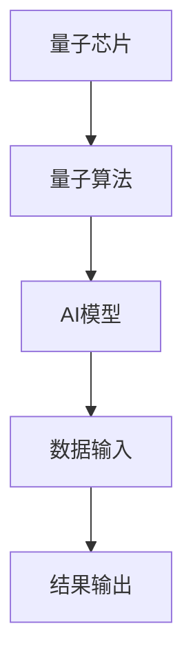

                 

# 巴菲特-芒格的量子人工智能芯片投资：AI革命的新引擎

---

## 关键词
- 巴菲特
- 芒格
- 量子计算
- 人工智能芯片
- 投资策略
- 风险管理
- 量子AI

---

## 摘要
本文深入探讨了巴菲特和芒格的投资理念与量子人工智能芯片投资的结合。通过分析量子计算的核心原理、人工智能芯片的技术发展以及两者在AI革命中的协同效应，文章揭示了这一领域的投资机会。结合巴菲特的价值投资理论和芒格的多元思维模型，文章提出了系统化的投资策略，并通过实际案例展示了如何在量子AI芯片领域进行风险管理与资产配置。最后，文章展望了量子AI芯片的未来发展趋势，为投资者提供了实用的建议。

---

## 第一章：量子计算与人工智能芯片的背景介绍

### 1.1 量子计算的核心原理
量子计算依赖于量子比特（qubit）的叠加态和纠缠态，能够在特定问题上远超经典计算机。例如，优化问题和机器学习任务可以通过量子算法显著加速。

#### 量子计算的基本原理
- **量子比特**：与经典比特不同，量子比特可以同时处于多个状态的叠加态。
- **量子叠加**：通过叠加，量子计算机可以在同一时间处理多种可能性。
- **量子纠缠**：纠缠的量子比特能够实现信息的快速传递。

### 1.2 人工智能芯片的发展历程
人工智能芯片从GPU到专用AI芯片（如TPU）的发展，再到量子AI芯片的创新，体现了技术的不断进步。

#### 人工智能芯片的分类
- **GPU**：通用性高，适合多种AI任务。
- **TPU**：专用加速器，优化特定AI模型。
- **量子AI芯片**：结合量子计算优势，提升AI性能。

---

## 第二章：量子计算在AI中的应用

### 2.1 量子算法与AI任务
量子算法在优化问题和机器学习中的应用展示了其潜力。

#### 量子算法的数学模型
- **量子优化算法**：用于解决NP难问题，如旅行商问题。
- **量子机器学习**：利用量子叠加和纠缠进行特征提取。

---

## 第三章：巴菲特-芒格的投资理念

### 3.1 价值投资与长期视角
巴菲特的价值投资强调企业基本面分析和长期持有。

#### 价值投资的关键要素
- **企业护城河**：企业的竞争优势。
- **管理层能力**：管理层的诚信与决策能力。
- **内在价值**：企业未来现金流的现值。

### 3.2 多元思维模型
芒格的多元思维模型强调跨学科思考，以全面评估投资机会。

---

## 第四章：量子AI芯片的投资机会

### 4.1 技术驱动的投资机会
量子计算与AI的结合为投资者提供了新的增长点。

#### 量子AI芯片的市场参与者
- **IBM**：领先的量子计算研究者。
- **谷歌**：量子AI芯片的创新者。
- **英特尔**：传统芯片转型的代表。

### 4.2 投资策略与风险管理
- **资产配置**：平衡风险与收益。
- **风险管理**：通过分散投资降低风险。

---

## 第五章：系统架构与设计

### 5.1 量子AI系统的架构设计
- **硬件层**：量子芯片与经典计算单元的协同。
- **软件层**：量子算法与AI框架的集成。
- **接口层**：API的设计与调用。

#### 系统架构图

---

## 第六章：项目实战与案例分析

### 6.1 IBM量子计算投资案例
分析IBM的量子计算项目，评估其技术优势和市场潜力。

#### 投资回报分析
- **技术评估**：量子比特数量与稳定性。
- **市场反馈**：客户应用案例与合作情况。

---

## 第七章：最佳实践与未来展望

### 7.1 投资策略总结
- **长期视角**：关注技术趋势与企业竞争优势。
- **风险管理**：分散投资，严格评估。

### 7.2 未来趋势
量子计算与AI的深度融合将推动技术革命，投资者需持续关注技术创新与市场动态。

---

## 作者：AI天才研究院 & 禅与计算机程序设计艺术

---

### 附录：相关术语解释
- **量子比特（Qubit）**：量子计算的基本单位，能够处于多个状态的叠加。
- **叠加态（Superposition）**：量子比特同时处于多个状态的能力。
- **纠缠态（Entanglement）**：两个或多个量子比特之间形成的信息关联。

---

通过以上结构，文章系统地探讨了巴菲特和芒格的投资理念在量子AI芯片中的应用，结合技术分析和实际案例，为投资者提供了全面的指导和深度的见解。

