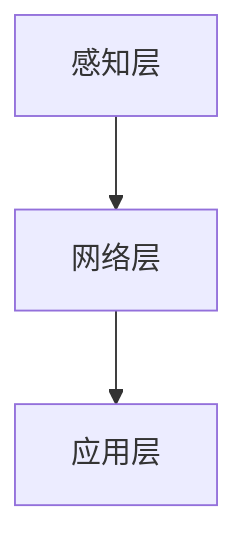

                 


```markdown
# 巴菲特-芒格的量子传感器网络投资：物联网的下一代基础设施

> 关键词：量子传感器网络，物联网，巴菲特投资理念，芒格思维模型，下一代基础设施

> 摘要：本文探讨了量子传感器网络如何成为物联网的下一代基础设施，以及巴菲特和芒格的投资理念如何在这一领域应用。通过详细分析量子传感器网络的技术原理、系统架构、算法设计和实际案例，结合价值投资和多元思维模型，为读者提供了全面的视角，展示了如何将先进技术与投资策略结合，推动物联网的发展。

---

# 第一章：引言

## 1.1 量子传感器网络的定义与重要性
- 量子传感器的基本概念
- 量子传感器在物联网中的应用潜力
- 量子传感器网络的优势：高灵敏度、低能耗、高速数据处理

## 1.2 巴菲特和芒格的投资理念
- 巴菲特的价值投资理论：寻找具有长期价值的企业
- 芒格的多元思维模型：跨学科视角下的投资决策
- 投资理念与量子传感器网络的结合

## 1.3 物联网的发展与挑战
- 物联网的现状及未来趋势
- 传统物联网的局限性：数据处理能力不足、安全性问题
- 量子传感器网络如何解决这些问题

---

# 第二章：量子传感器网络的核心技术

## 2.1 量子传感器的工作原理
- 量子叠加与纠缠的基本原理
- 量子传感器如何利用量子特性进行数据采集

## 2.2 量子传感器网络的架构
- 分层架构：感知层、网络层、应用层
- 各层的功能与交互方式

## 2.3 量子传感器的数据处理算法
- 量子叠加算法：提高数据处理速度
- 量子纠缠算法：增强数据关联性

---

# 第三章：巴菲特-芒格投资理念的深度解析

## 3.1 巴菲特的价值投资策略
- 长期价值投资的核心原则
- 如何识别具有长期潜力的企业

## 3.2 芒格的多元思维模型
- 多元思维模型的构成要素
- 如何将多元思维模型应用于量子传感器网络的投资决策

## 3.3 量子传感器网络的投资机会
- 量子传感器网络在各行业的应用前景
- 如何评估量子传感器网络企业的投资价值

---

# 第四章：量子传感器网络的系统架构设计

## 4.1 系统功能设计
- 感知层：量子传感器的数据采集
- 网络层：数据的传输与处理
- 应用层：数据的分析与应用

## 4.2 系统架构图


## 4.3 接口与交互设计
- API接口的设计：数据传输的标准格式
- 用户与系统的交互流程

---

# 第五章：量子传感器网络的项目实战

## 5.1 环境安装与配置
- 操作系统与工具的安装
- 量子传感器硬件的部署

## 5.2 核心代码实现
```python
import qubit

def quantum_sensor_network():
    qubit.register()  # 注册量子传感器
    data = qubit.measure()  # 获取数据
    return data

if __name__ == "__main__":
    print(quantum_sensor_network())
```

## 5.3 代码解读与分析
- 每行代码的功能说明
- 代码的可扩展性与优化空间

## 5.4 实际案例分析
- 某行业应用案例：智能交通系统的量子传感器网络部署
- 数据处理结果与投资回报分析

---

# 第六章：最佳实践与投资策略

## 6.1 投资策略
- 确定投资目标：选择具有技术优势和市场潜力的量子传感器网络企业
- 风险管理：分散投资，降低风险

## 6.2 小结
- 量子传感器网络的优势与潜力
- 如何将投资理念与技术应用相结合

## 6.3 注意事项
- 技术风险：量子传感器网络的技术成熟度
- 市场风险：市场需求的变化

## 6.4 拓展阅读
- 推荐书籍与论文
- 行业报告与技术动态

---

# 作者信息

作者：AI天才研究院 & 禅与计算机程序设计艺术

---

# 结语

通过本文的详细分析，我们展示了量子传感器网络在物联网中的潜力，以及如何将巴菲特和芒格的投资理念应用于这一领域。希望读者能够从技术与投资的双重视角，理解量子传感器网络的重要性，并抓住这一领域的投资机会。
```

