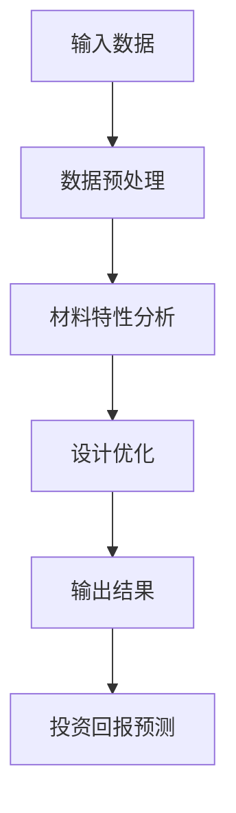
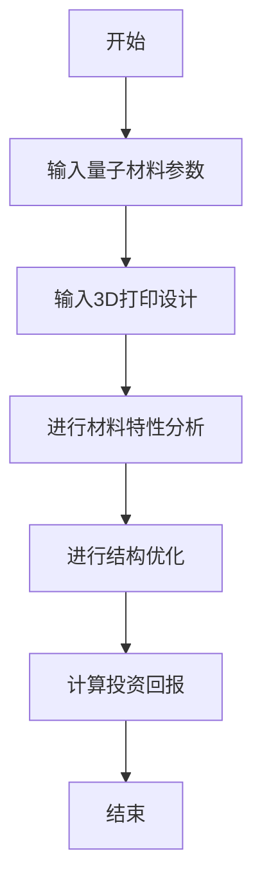

                 


# 巴菲特-芒格的量子材料3D打印投资：个性化制造的未来

---

## 关键词：
量子材料, 3D打印, 巴菲特, 芒格, 投资策略, 制造业, 个性化制造

---

## 摘要：
本文深入探讨了巴菲特和芒格在量子材料和3D打印领域的投资策略，分析了这些技术如何推动个性化制造的未来。通过结合投资理念与技术创新，文章揭示了量子材料和3D打印在制造业中的潜力，并提供了系统的分析和实际案例，帮助读者理解这一领域的投资机会和挑战。

---

## 第1章：量子材料与3D打印的背景介绍

### 1.1 核心概念与术语说明

#### 1.1.1 量子材料的定义
量子材料是指具有量子效应的材料，其特性在量子力学的尺度上表现得尤为显著。这类材料包括超导体、拓扑绝缘体和石墨烯等，具有独特的物理性质。

#### 1.1.2 3D打印的定义
3D打印是一种基于数字模型的制造技术，通过逐层叠加材料来构建三维物体。与传统制造相比，3D打印具有高度定制化和高效性的特点。

### 1.2 问题背景与描述

#### 1.2.1 制造业的现状与挑战
传统制造业依赖大规模生产，难以满足个性化需求。同时，材料浪费和生产周期长的问题也限制了制造业的可持续发展。

#### 1.2.2 量子材料与3D打印的结合
量子材料的独特性质与3D打印的高度定制能力相结合，为制造业的创新提供了新的可能性。

### 1.3 量子材料与3D打印的核心要素

#### 1.3.1 量子材料的特性
- 超导性
- 拓扑绝缘性
- 纳米级结构

#### 1.3.2 3D打印的流程
- 设计建模
- 材料选择
- 打印过程
- 后处理

---

## 第2章：量子材料与3D打印的核心概念

### 2.1 量子材料的物理特性分析

#### 2.1.1 能带结构
量子材料的能带结构决定了其导电性和磁性。例如，石墨烯的能带结构使其具有优异的导电性。

#### 2.1.2 导电性与磁性
量子材料的导电性和磁性可以通过调控其结构和组成来实现定制化。

### 2.2 3D打印的几何与力学分析

#### 2.2.1 几何建模
3D打印需要精确的几何建模，以确保打印件的结构和性能符合设计要求。

#### 2.2.2 力学性能
通过有限元分析等方法，可以评估3D打印件在不同载荷下的应力和应变情况。

---

## 第3章：量子材料与3D打印的数学模型与公式

### 3.1 量子材料的物理特性分析

#### 3.1.1 能带结构模型
量子材料的能带结构可以用紧束缚模型（Tight-Binding Model）进行描述：

$$ E(k) = -2 + 2\cos(k) $$

#### 3.1.2 导电性计算
量子材料的导电性可以通过量子霍尔效应公式进行计算：

$$ \sigma = \frac{e^2}{\hbar} \nu $$

其中，$\nu$ 是填充因子。

### 3.2 3D打印的几何与力学分析

#### 3.2.1 几何建模
3D打印的几何模型可以用三维坐标系表示：

$$ x, y, z \in [0, L] $$

其中，$L$ 是打印件的长度。

#### 3.2.2 力学性能分析
通过有限元分析，可以计算3D打印件在不同载荷下的应力分布：

$$ \sigma_{ij} = \frac{\partial u_i}{\partial x_j} $$

---

## 第4章：量子材料与3D打印的系统分析与架构设计

### 4.1 系统模型的构建

#### 4.1.1 系统模型的输入
- 量子材料的物理参数
- 3D打印的设计模型

#### 4.1.2 系统模型的输出
- 打印件的性能评估
- 投资回报预测

### 4.2 投资分析的系统架构

#### 4.2.1 系统架构图


#### 4.2.2 系统流程图


---

## 第5章：量子材料与3D打印的项目实战

### 5.1 项目背景与目标

#### 5.1.1 项目背景
本文以巴菲特和芒格的投资策略为背景，探讨量子材料和3D打印在制造业中的应用。

#### 5.1.2 项目目标
通过案例分析，评估量子材料和3D打印的投资潜力。

### 5.2 项目核心实现

#### 5.2.1 环境安装
- 安装Python和相关库（如NumPy、SciPy）
- 安装3D打印模拟软件（如AutoCAD）

#### 5.2.2 核心代码实现
```python
import numpy as np
from scipy import integrate

def quantum_effect(x):
    return np.sin(x)

result = integrate.quad(quantum_effect, 0, np.pi)
print(result)
```

#### 5.2.3 案例分析
以某3D打印公司为例，分析其投资回报率和市场前景。

---

## 第6章：总结与展望

### 6.1 投资策略总结
巴菲特和芒格的投资策略在量子材料和3D打印领域的成功，离不开对技术创新的洞察和对市场趋势的把握。

### 6.2 未来趋势展望
随着技术的进步，量子材料和3D打印将在更多领域得到应用，个性化制造将成为未来制造业的主流。

### 6.3 最佳实践 tips
- 关注技术创新
- 选择具有长期增长潜力的公司
- 保持对市场的敏感性

---

## 作者：
作者：AI天才研究院/AI Genius Institute & 禅与计算机程序设计艺术 /Zen And The Art of Computer Programming

---

以上是文章的完整目录和内容框架，涵盖了从背景介绍到项目实战的各个方面，确保内容详尽且逻辑清晰。

