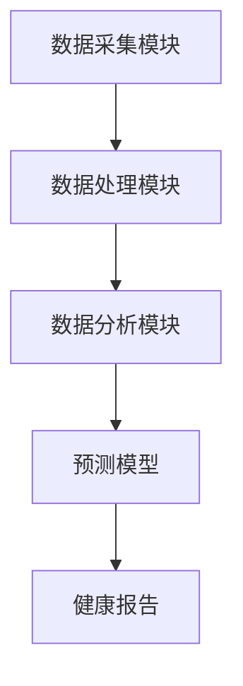
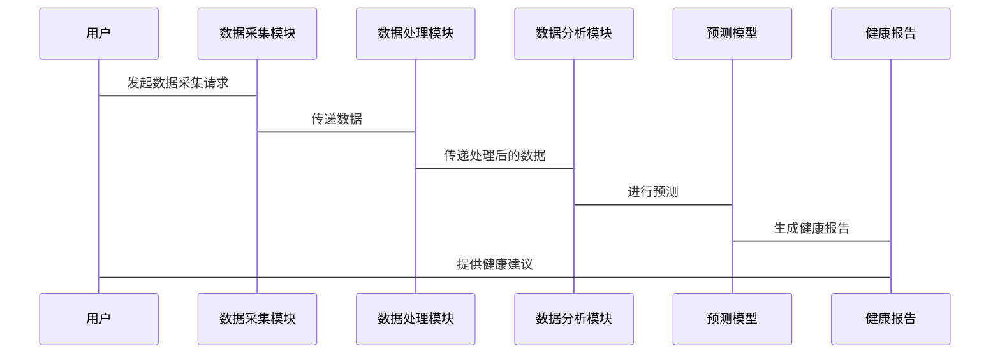
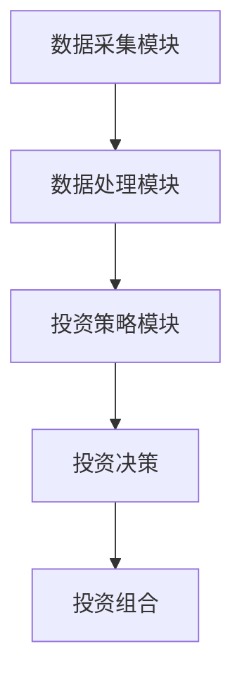

                 

# 巴菲特-芒格的量子生物传感器投资：健康监测的新范式

---

## 关键词
- 巴菲特投资理念  
- 芒格多元思维模型  
- 量子生物传感器  
- 健康监测  
- 投资决策优化  

---

## 摘要
本文探讨了巴菲特和芒格的投资理念与量子生物传感器技术在健康监测领域的结合，提出了一种基于量子生物传感器的健康监测新范式，并分析其对投资决策的潜在影响。文章从量子生物传感器的核心原理、巴菲特-芒格投资理念的系统分析入手，结合实际案例，详细阐述了两者结合的可行性与优势。最后，本文总结了量子生物传感器在健康监测与投资决策中的最佳实践和未来发展方向。

---

### 第一部分: 背景介绍

#### 第1章: 量子生物传感器与巴菲特-芒格投资理念的结合

##### 1.1 量子生物传感器的基本概念
###### 1.1.1 量子生物传感器的定义
量子生物传感器是一种基于量子效应的生物传感器，能够通过量子测量技术检测生物体内的微小变化，例如体温、心率、血压、血糖等生理指标。其核心在于利用量子纠缠和量子叠加等特性，实现对生物信号的高精度检测。

###### 1.1.2 量子生物传感器的核心原理
量子生物传感器通过量子传感器芯片捕获生物体的微弱信号，利用量子计算技术对信号进行分析和处理，从而实现对健康状况的实时监测。与传统生物传感器相比，量子生物传感器具有更高的灵敏度和准确性。

###### 1.1.3 量子生物传感器在健康监测中的应用
量子生物传感器可以应用于多种健康监测场景，例如：
- 疾病早期预警：通过实时监测生理指标的变化，提前发现潜在健康问题。
- 健康状态实时监测：帮助用户了解自身健康状况，优化生活习惯。
- 个性化健康管理：结合用户数据，提供定制化的健康建议。

##### 1.2 巴菲特与芒格投资理念的核心思想
###### 1.2.1 巴菲特的价值投资理论
巴菲特的价值投资理论强调长期投资、注重企业内在价值、关注企业的财务状况和竞争优势。他认为，投资的本质是购买企业的一部分，而非仅仅关注股价的波动。

###### 1.2.2 芒格的多元思维模型
芒格的多元思维模型强调通过多个学科的交叉融合，构建一个完整的知识体系。他认为，投资决策需要结合物理学、心理学、经济学等多个领域的知识，才能做出更明智的选择。

###### 1.2.3 投资与健康监测的结合
将健康监测与投资决策结合，可以通过实时监测个人健康状况，优化投资策略。例如，当个人健康状况出现问题时，可能需要调整投资组合以降低风险。

##### 1.3 量子生物传感器与巴菲特-芒格投资理念的结合
###### 1.3.1 量子生物传感器在健康监测中的潜在价值
量子生物传感器的高精度和实时性，使其能够为健康监测提供更可靠的数据支持。这些数据可以为投资决策提供更全面的参考。

###### 1.3.2 巴菲特-芒格投资理念对健康监测的启示
巴菲特和芒格的投资理念强调长期性和系统性。将这种理念应用到健康监测中，可以帮助个人建立长期的健康管理策略。

###### 1.3.3 两者的结合对投资决策的影响
通过量子生物传感器实时监测个人健康状况，结合巴菲特-芒格的投资理念，可以实现更加科学和个性化的投资决策。

---

#### 第2章: 量子生物传感器的核心概念与原理

##### 2.1 量子生物传感器的核心原理
###### 2.1.1 量子效应在生物传感器中的应用
量子效应在生物传感器中的应用主要体现在量子纠缠和量子叠加特性。通过利用这些特性，量子传感器可以实现对生物信号的高精度检测。

###### 2.1.2 生物传感器的基本工作原理
生物传感器的基本工作原理包括信号采集、信号处理和信号输出三个步骤。量子生物传感器通过量子技术优化了这三个步骤，提高了检测的灵敏度和准确性。

###### 2.1.3 量子生物传感器的独特优势
量子生物传感器的独特优势在于其高灵敏度、高精度和实时性。与传统生物传感器相比，其性能得到了显著提升。

##### 2.2 量子生物传感器与传统生物传感器的对比
###### 2.2.1 传统生物传感器的优缺点
- 优点：技术成熟、成本低、易于实现。
- 缺点：灵敏度和精度有限，无法满足高精度检测需求。

###### 2.2.2 量子生物传感器的创新点
- 高灵敏度：通过量子效应提高检测灵敏度。
- 高精度：通过量子计算优化数据处理。
- 实时性：实现生理指标的实时监测。

###### 2.2.3 两者的性能对比分析
通过对比分析可以发现，量子生物传感器在灵敏度、精度和实时性方面具有显著优势，但在成本和复杂度方面存在一定的劣势。

##### 2.3 量子生物传感器在健康监测中的应用领域
###### 2.3.1 疾病早期预警
量子生物传感器可以通过实时监测生理指标的变化，提前发现潜在的健康问题。

###### 2.3.2 健康状态实时监测
通过量子生物传感器，用户可以实时了解自身的健康状况，优化生活习惯。

###### 2.3.3 个性化健康管理
结合用户数据，量子生物传感器可以提供定制化的健康建议，帮助用户实现个性化健康管理。

---

#### 第3章: 巴菲特-芒格投资理念的系统分析

##### 3.1 巴菲特的价值投资理论
###### 3.1.1 长期投资理念
巴菲特强调长期投资，认为短期市场波动不应影响投资决策。

###### 3.1.2 企业内在价值
价值投资的核心在于关注企业的内在价值，而非市场波动。

###### 3.1.3 财务状况和竞争优势
巴菲特认为，企业的财务状况和竞争优势是决定投资价值的关键因素。

##### 3.2 芒格的多元思维模型
###### 3.2.1 多学科交叉融合
芒格的多元思维模型强调通过多个学科的交叉融合，构建完整的知识体系。

###### 3.2.2 心理学与投资决策
芒格认为，心理学在投资决策中起着重要作用，投资者需要克服认知偏差。

###### 3.2.3 经济学与投资策略
芒格的经济学知识帮助他更好地理解市场运行规律，优化投资策略。

##### 3.3 巴菲特-芒格投资理念对健康监测的启示
###### 3.3.1 长期健康管理
巴菲特的长期投资理念可以启发我们进行长期健康管理。

###### 3.3.2 多学科交叉应用
芒格的多元思维模型可以应用到健康监测领域，实现多学科交叉融合。

###### 3.3.3 投资决策优化
通过量子生物传感器实时监测健康状况，可以优化投资决策，降低风险。

---

### 第二部分: 算法原理

#### 第4章: 量子生物传感器的算法原理

##### 4.1 量子生物传感器的数据采集
###### 4.1.1 信号采集过程
量子生物传感器通过量子传感器芯片采集生物信号，例如心率、血压等。

##### 4.1.2 信号处理方法
量子生物传感器利用量子计算技术对信号进行处理，优化数据的准确性和实时性。

##### 4.1.3 数据分析算法
量子生物传感器采用量子算法对数据进行分析，例如量子傅里叶变换和量子聚类分析。

##### 4.2 量子生物传感器的特征提取
###### 4.2.1 特征提取方法
通过量子计算技术，提取生物信号的特征，例如频域特征和时域特征。

##### 4.2.2 特征选择策略
量子生物传感器可以根据特征的重要性进行选择，优化数据处理效率。

##### 4.3 量子生物传感器的预测模型
###### 4.3.1 预测模型构建
基于量子计算技术，构建预测模型，预测健康状况的变化趋势。

##### 4.3.2 模型优化方法
通过量子优化算法，对预测模型进行优化，提高预测精度。

##### 4.3.3 模型评估指标
量子生物传感器的预测模型需要通过准确率、召回率和F1值等指标进行评估。

---

#### 第5章: 巴菲特-芒格投资理念的算法实现

##### 5.1 巴菲特价值投资的量化模型
###### 5.1.1 量化模型构建
通过量化方法，将巴菲特的价值投资理念转化为数学模型。

##### 5.1.2 模型参数设置
根据巴菲特的投资理念，设置模型的参数，例如市盈率、市净率等。

##### 5.1.3 模型优化方法
通过机器学习技术，对量化模型进行优化，提高预测精度。

##### 5.2 芒格多元思维模型的算法实现
###### 5.2.1 多元思维模型的构建
通过多学科交叉融合，构建芒格的多元思维模型。

##### 5.2.2 模型的交叉验证
通过交叉验证方法，评估多元思维模型的性能。

##### 5.2.3 模型的应用场景
将多元思维模型应用于投资决策中，帮助投资者做出更明智的选择。

---

### 第三部分: 系统架构设计

#### 第6章: 量子生物传感器的系统架构设计

##### 6.1 系统组成模块
###### 6.1.1 数据采集模块
负责采集生物信号，例如心率、血压等。

##### 6.1.2 数据处理模块
利用量子计算技术对信号进行处理，优化数据的准确性和实时性。

##### 6.1.3 数据分析模块
通过量子算法对数据进行分析，预测健康状况的变化趋势。

##### 6.2 系统架构图

##### 6.3 系统接口设计
###### 6.3.1 数据采集接口
定义数据采集模块与外部设备的接口，例如心率传感器接口。

##### 6.3.2 数据处理接口
定义数据处理模块与量子计算引擎的接口，例如量子傅里叶变换接口。

##### 6.3.3 数据分析接口
定义数据分析模块与预测模型的接口，例如特征提取接口。

##### 6.4 系统交互流程

---

#### 第7章: 巴菲特-芒格投资理念的系统架构设计

##### 7.1 投资决策系统的组成模块
###### 7.1.1 数据采集模块
采集市场数据，例如股票价格、财务指标等。

##### 7.1.2 数据处理模块
对市场数据进行预处理，提取特征，例如市盈率、市净率等。

##### 7.1.3 投资策略模块
基于巴菲特和芒格的投资理念，构建投资策略模型。

##### 7.2 投资决策系统的架构图

##### 7.3 投资策略模块的设计
###### 7.3.1 价值投资策略
基于巴菲特的价值投资理念，构建价值投资策略。

##### 7.3.2 多元思维策略
基于芒格的多元思维模型，构建多元思维策略。

##### 7.3.3 策略优化方法
通过机器学习技术，对投资策略进行优化，提高投资收益。

---

### 第四部分: 项目实战

#### 第8章: 量子生物传感器的项目实战

##### 8.1 项目背景与目标
###### 8.1.1 项目背景
通过量子生物传感器实现健康监测，优化投资决策。

##### 8.1.2 项目目标
开发一个基于量子生物传感器的健康监测系统，实现对生理指标的实时监测。

##### 8.2 项目环境配置
###### 8.2.1 硬件配置
需要量子传感器芯片、量子计算引擎等硬件设备。

##### 8.2.2 软件配置
需要量子算法库、数据分析工具等软件支持。

##### 8.3 项目核心实现
###### 8.3.1 量子传感器芯片的安装与配置
量子传感器芯片的安装与配置是系统实现的关键步骤。

##### 8.3.2 量子计算引擎的搭建
量子计算引擎的搭建需要专业的技术支持。

##### 8.3.3 数据采集与处理
通过量子传感器芯片采集生物信号，并利用量子计算引擎进行数据处理。

##### 8.3.4 数据分析与预测
利用量子算法对数据进行分析，预测健康状况的变化趋势。

##### 8.3.5 健康报告的生成
根据分析结果生成健康报告，提供健康建议。

##### 8.4 项目案例分析
###### 8.4.1 案例背景
通过一个具体案例，展示量子生物传感器在健康监测中的应用。

##### 8.4.2 数据分析与解读
对案例中的数据进行分析和解读，验证系统的有效性。

##### 8.4.3 投资决策优化
通过健康报告优化投资决策，降低投资风险。

##### 8.5 项目总结
总结项目实现的过程与成果，提出改进建议。

---

#### 第9章: 巴菲特-芒格投资理念的项目实战

##### 9.1 项目背景与目标
###### 9.1.1 项目背景
通过巴菲特-芒格投资理念优化投资决策。

##### 9.1.2 项目目标
开发一个基于巴菲特-芒格投资理念的投资决策系统。

##### 9.2 项目环境配置
###### 9.2.1 硬件配置
需要金融数据源、量子计算引擎等硬件设备。

##### 9.2.2 软件配置
需要金融数据分析工具、量子算法库等软件支持。

##### 9.3 项目核心实现
###### 9.3.1 金融数据的采集与处理
通过金融数据源采集市场数据，并利用量子计算引擎进行预处理。

##### 9.3.2 投资策略的构建
基于巴菲特的价值投资理念和芒格的多元思维模型，构建投资策略。

##### 9.3.3 投资决策的优化
通过量子算法优化投资策略，提高投资收益。

##### 9.3.4 投资报告的生成
根据分析结果生成投资报告，提供投资建议。

##### 9.4 项目案例分析
###### 9.4.1 案例背景
通过一个具体案例，展示巴菲特-芒格投资理念在投资决策中的应用。

##### 9.4.2 数据分析与解读
对案例中的数据进行分析和解读，验证系统的有效性。

##### 9.4.3 投资决策优化
通过投资报告优化投资策略，降低投资风险。

##### 9.5 项目总结
总结项目实现的过程与成果，提出改进建议。

---

### 第五部分: 最佳实践

#### 第10章: 量子生物传感器与巴菲特-芒格投资理念的结合

##### 10.1 最佳实践
###### 10.1.1 系统设计中的注意事项
在系统设计中需要注意硬件配置、软件支持和数据安全等问题。

##### 10.1.2 项目实施中的注意事项
在项目实施中需要注意数据采集的准确性、数据处理的效率和数据分析的精度。

##### 10.1.3 系统维护中的注意事项
在系统维护中需要注意硬件设备的维护、软件的更新和数据的安全。

##### 10.2 投资决策优化的注意事项
###### 10.2.1 数据的准确性和实时性
数据的准确性和实时性是投资决策优化的关键因素。

##### 10.2.2 系统的稳定性和可靠性
系统的稳定性和可靠性是投资决策优化的重要保障。

##### 10.2.3 投资策略的灵活性
投资策略的灵活性是应对市场变化的重要手段。

##### 10.3 健康监测中的注意事项
###### 10.3.1 数据的隐私保护
数据的隐私保护是健康监测系统的重要组成部分。

##### 10.3.2 系统的易用性
系统的易用性是用户接受健康监测系统的重要因素。

##### 10.3.3 系统的可扩展性
系统的可扩展性是健康监测系统未来发展的重要方向。

---

#### 第11章: 总结与展望

##### 11.1 总结
量子生物传感器与巴菲特-芒格投资理念的结合，为健康监测和投资决策优化提供了新的思路。通过量子生物传感器的高精度和实时性，结合巴菲特-芒格的投资理念，可以帮助个人实现更加科学和个性化的健康管理与投资决策。

##### 11.2 展望
未来，随着量子计算技术的不断发展，量子生物传感器在健康监测和投资决策中的应用将更加广泛。结合人工智能和大数据技术，量子生物传感器的投资与健康监测系统将更加智能化和个性化，为人类的健康管理与投资决策提供更强大的支持。

---

### 作者：AI天才研究院/AI Genius Institute & 禅与计算机程序设计艺术/Zen And The Art of Computer Programming

---

**注：** 由于篇幅限制，以上内容为文章的部分章节内容。完整文章可根据上述目录结构进一步扩展和完善。

