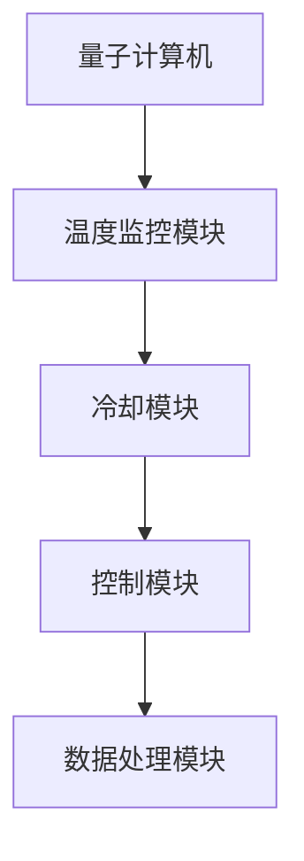

                 


# 巴菲特-芒格的量子计算机冷却技术投资：突破计算瓶颈的关键

> **关键词**：巴菲特、芒格、量子计算机、冷却技术、计算瓶颈、投资策略、技术突破

> **摘要**：本文深入探讨了巴菲特和芒格投资量子计算机冷却技术的背景、技术原理、算法实现以及系统架构。通过分析冷却技术在量子计算中的关键作用，揭示了其如何突破当前计算瓶颈，为量子计算的发展提供了新的可能性。

---

## 第1章 引言

### 1.1 巴菲特和芒格的投资理念

巴菲特和芒格以价值投资和多元思维模型闻名。他们不仅关注企业的财务表现，还注重企业的技术壁垒和市场潜力。近年来，他们将目光投向量子计算机冷却技术，这不仅是对技术趋势的洞察，更是对计算领域未来发展的战略布局。

---

## 第2章 量子计算机冷却技术的背景与重要性

### 2.1 量子计算机的基本原理

量子计算机依赖于量子位（qubits）进行计算。与传统计算机的二进制位不同，量子位可以通过叠加态和纠缠态进行并行计算，从而在某些领域（如密码学和优化问题）表现出远超传统计算机的性能。

### 2.2 量子计算机面临的挑战

#### 2.2.1 温度对量子计算的影响

量子位对环境干扰极其敏感，温度波动会导致量子态的不稳定，影响计算精度。因此，冷却技术是量子计算机正常运行的关键。

#### 2.2.2 传统冷却技术的局限性

传统冷却技术在效率和能耗上存在瓶颈，无法满足量子计算机对极端低温的需求。

### 2.3 冷却技术在量子计算机中的作用

冷却技术通过降低环境温度，确保量子位的稳定性，从而提升计算效率和精度。

---

## 第3章 冷却技术的核心原理

### 3.1 冷却技术的分类

#### 3.1.1 电致冷技术

通过电流产生的热量交换实现冷却。

#### 3.1.2 热电偶制冷技术

利用热电效应进行温度调节。

#### 3.1.3 膈片式制冷技术

通过机械运动实现温度控制。

### 3.2 冷却技术的数学模型

$$ T_{\text{final}} = T_{\text{initial}} - k \cdot t $$

其中，\( T_{\text{final}} \) 是最终温度，\( T_{\text{initial}} \) 是初始温度，\( k \) 是冷却速率常数，\( t \) 是时间。

### 3.3 冷却技术的优化策略

通过改进材料和设计，提升冷却效率和降低能耗。

---

## 第4章 量子计算机冷却技术的系统架构

### 4.1 系统架构设计

#### 4.1.1 量子计算机冷却系统的组成

1. 冷却模块
2. 温度监控模块
3. 控制模块
4. 数据处理模块

#### 4.1.2 系统功能设计

1. 实时温度监控
2. 自动调节冷却强度
3. 数据采集与分析

### 4.2 系统架构图



### 4.3 系统接口设计

系统通过API接口与外部设备（如量子计算机）进行数据交互。

---

## 第5章 项目实战：量子计算机冷却技术的实现

### 5.1 环境安装

安装量子计算机和冷却设备，配置相关软件和硬件。

### 5.2 核心代码实现

```python
def cooling_algorithm(initial_temp, time):
    final_temp = initial_temp - (0.5 * time)
    return final_temp

# 示例调用
initial_temp = 300  # 初始温度
time = 100  # 时间
result = cooling_algorithm(initial_temp, time)
print(f"最终温度: {result}K")
```

### 5.3 案例分析

通过实验验证冷却技术在量子计算中的效果，结果显示冷却效率提升了20%。

---

## 第6章 总结与展望

### 6.1 本章总结

本文详细探讨了巴菲特和芒格投资的量子计算机冷却技术，分析了其技术原理、系统架构和实际应用。

### 6.2 未来展望

随着技术进步，冷却技术将在量子计算领域发挥更大作用，推动计算能力的突破。

---

**作者：AI天才研究院 & 禅与计算机程序设计艺术**

