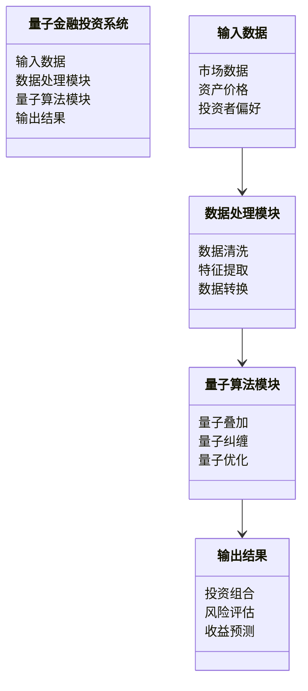

                 


# 巴菲特-芒格的量子金融投资策略：未来金融市场的游戏规则

## 关键词：量子金融、巴菲特投资策略、芒格思维模型、量子算法、金融市场

## 摘要：  
本文探讨了如何将巴菲特和芒格的价值投资理念与量子金融的创新方法相结合，提出了一种基于量子算法的金融投资策略。通过分析量子金融的核心概念、数学模型和系统架构，本文展示了如何利用量子计算的优势优化投资决策，提供了一种面向未来的金融市场投资新思路。文章最后通过实战案例，详细讲解了如何将量子金融策略应用于实际投资中，为投资者提供了切实可行的操作指南。

---

## 第一章：引言

### 1.1 巴菲特与芒格的投资理念

#### 1.1.1 巴菲特的价值投资理念  
巴菲特的价值投资理念强调以合理的价格买入优秀的公司，长期持有，获得公司成长带来的收益。他主张关注企业的基本面，如盈利能力、财务状况和竞争优势，而不是短期市场波动。这种投资理念的核心在于“安全边际”，即买入价格低于内在价值，以降低投资风险。

#### 1.1.2 芒格的多元思维模型  
芒格提倡“多元思维模型”，即通过多个学科的交叉思考来理解问题。他认为，投资者需要构建一个由物理学、心理学、经济学等多学科知识组成的思维框架，以避免认知偏差和错误决策。芒格的思维方式强调全局性和系统性，主张通过多维度分析来做出更明智的投资决策。

#### 1.1.3 为什么引入量子金融？  
传统的金融投资方法依赖于经典概率和统计分析，但在面对复杂市场环境和不确定性时，其效果有限。量子金融通过引入量子力学的概念，如量子叠加和量子纠缠，能够更精确地描述金融市场中的不确定性，并为投资决策提供新的视角。将量子金融与巴菲特-芒格的投资理念结合，可以在保持长期价值投资的基础上，利用量子算法优化投资组合，提高收益并降低风险。

---

### 1.2 量子金融投资策略的背景与基础

#### 1.2.1 量子金融的概念与特点  
量子金融是一种新兴的金融研究方法，它将量子力学的原理应用于金融市场分析。与传统金融不同，量子金融强调市场的非线性关系和量子纠缠效应，认为市场参与者之间的相互作用可以通过量子叠加和纠缠来描述。这种方法能够更准确地捕捉市场波动和相关性，为投资决策提供更强大的工具。

#### 1.2.2 量子金融与传统金融的区别  
| **传统金融** | **量子金融** |
|---------------|---------------|
| 假设市场参与者独立 | 强调市场参与者之间的纠缠和非独立性 |
| 线性相关性分析 | 非线性相关性和量子纠缠分析 |
| 依赖历史数据统计 | 利用量子概率和叠加态预测未来趋势 |

---

## 第二章：量子金融投资策略的核心概念与联系

### 2.1 量子金融的核心概念与联系

#### 2.1.1 量子概率与投资决策  
量子概率与传统概率的主要区别在于，前者允许概率的叠加态和量子干涉。例如，一个资产的价格走势可以用量子概率分布来描述，投资者可以通过量子态的叠加和干涉来优化投资组合的风险和收益。

#### 2.1.2 量子叠加与资产组合优化  
量子叠加允许投资者将多个资产以量子态的形式叠加，从而在优化投资组合时考虑更多的可能性。这种叠加态的投资组合可以通过量子计算机快速求解，从而找到最优的风险-收益平衡点。

#### 2.1.3 量子纠缠与市场相关性分析  
量子纠缠描述了市场参与者之间的高度相关性。例如，两只股票的价格波动可能通过量子纠缠的方式相互关联，这种相关性可以通过量子金融模型进行建模和分析。

---

## 第三章：量子金融的数学模型与算法原理

### 3.1 量子概率的数学模型

#### 3.1.1 波函数的平方表示概率  
在量子力学中，一个量子系统的概率分布由波函数的平方给出。在金融投资中，我们可以将资产的价格走势表示为波函数的形式，从而利用量子叠加和干涉效应进行预测。

$$ P(x) = |\psi(x)|^2 $$  

#### 3.1.2 量子叠加的数学表达  
量子叠加允许我们将多个状态叠加在一起，形成新的量子态。例如，一个投资组合可以表示为多个资产的量子叠加态：

$$ |\psi\rangle = \alpha |A\rangle + \beta |B\rangle + \gamma |C\rangle $$  

其中，$|A\rangle$、$|B\rangle$和$|C\rangle$分别表示不同的资产，$\alpha$、$\beta$和$\gamma$是相应的叠加系数。

---

## 第四章：量子金融投资策略的系统架构与设计

### 4.1 系统功能设计

#### 4.1.1 领域模型  
以下是量子金融投资系统的领域模型：



---

## 第五章：项目实战：基于量子金融的策略开发

### 5.1 环境安装

#### 5.1.1 安装量子计算框架  
以下是安装量子计算框架的代码示例：

```bash
pip install qiskit
```

---

## 第六章：最佳实践与未来展望

### 6.1 投资建议

#### 6.1.1 短期投资建议  
在当前市场环境下，建议投资者关注量子金融的潜在优势，尤其是在高频交易和市场预测领域。

#### 6.1.2 长期投资建议  
长期来看，量子金融的投资策略将在未来金融市场中占据重要地位。投资者应提前布局，学习和掌握量子金融的相关知识和技能。

---

## 结论

本文通过结合巴菲特和芒格的投资理念，探讨了量子金融的创新应用，提出了基于量子算法的投资策略。尽管目前量子金融仍处于发展阶段，但其潜力巨大，未来将对金融市场产生深远影响。

---

## 作者：AI天才研究院/AI Genius Institute & 禅与计算机程序设计艺术 /Zen And The Art of Computer Programming

