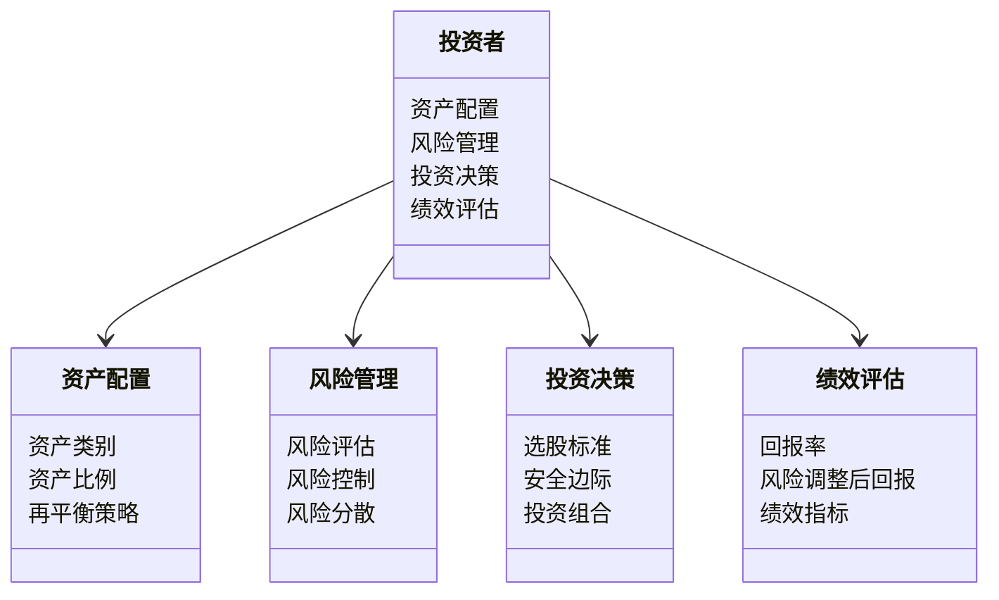
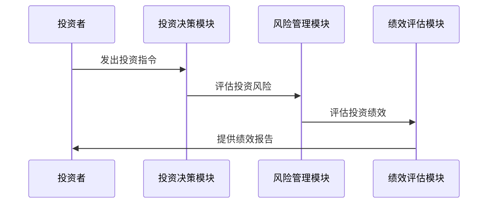

                 


# 巴菲特-芒格的长期主义：为什么耐心是最佳投资策略

## 关键词：长期主义, 巴菲特, 芮格, 投资策略, 耐心, 风险管理, 价值投资

## 摘要：长期主义是一种以耐心和纪律为核心的投资策略，强调长期稳定回报而非短期收益。巴菲特和芒格通过其独特的价值投资理念和多元思维模型，展示了耐心在投资中的重要性。本文将详细探讨长期主义的背景、核心原则、数学模型以及实际应用，帮助读者理解为何耐心是最佳投资策略。

---

# 第一部分：长期主义的背景与核心理念

## 第1章：长期主义的定义与背景

### 1.1 长期主义的定义

#### 1.1.1 长期主义的起源与演变

长期主义（Long-termism）是一种投资和生活哲学，强调关注长远目标而非短期利益。这一概念起源于20世纪初，随着巴菲特和芒格的成功投资案例，逐渐被广泛认可。长期主义的核心在于通过耐心和纪律实现可持续的回报，而非追求短期的高收益。

#### 1.1.2 长期主义的核心特征

长期主义具有以下核心特征：
- **耐心**：长期主义者不追求短期收益，而是愿意等待最佳投资机会。
- **纪律**：遵循既定的投资策略和原则，避免情绪化决策。
- **价值导向**：关注企业的内在价值，而非市场的短期波动。
- **风险管理**：注重保护本金，避免高风险投资。

#### 1.1.3 长期主义与短期主义的对比

| 特征 | 长期主义 | 短期主义 |
|------|----------|----------|
| 目标 | 长期稳定回报 | 短期高收益 |
| 风险偏好 | 低风险 | 高风险 |
| 决策依据 | 价值评估 | 市场情绪 |

### 1.2 巴菲特与芒格的长期主义哲学

#### 1.2.1 巴菲特的投资理念

沃伦·巴菲特（Warren Buffett）是价值投资的代表人物。他强调购买具有强大护城河（经济护城河）的企业，关注企业的内在价值而非市场波动。巴菲特认为，投资的最终目标是找到那些能够持续创造价值的企业，并长期持有。

#### 1.2.2 芒格的多元思维模型

查理·芒格（Charlie Munger）提出了多元思维模型（Multidisciplinary Thinking Model），强调将不同学科的知识结合起来，形成全面的视角。芒格认为，投资者需要从多个角度分析问题，避免单一思维的局限性。

#### 1.2.3 巴菲特与芒格长期主义的共同点

巴菲特和芒格的长期主义都强调：
- 长期价值的创造。
- 对企业的深入了解和分析。
- 耐心和纪律的投资策略。

### 1.3 长期主义在投资中的重要性

#### 1.3.1 长期主义与投资回报的关系

长期主义通过关注企业的内在价值和长期增长潜力，能够在市场波动中实现稳定的回报。研究表明，长期持有优质资产的投资组合，其回报率显著高于频繁交易的投资组合。

#### 1.3.2 长期主义在市场波动中的稳定性

市场波动是短期投资者的敌人，而长期主义者能够在市场波动中保持冷静，抓住优质资产的价值回归机会。

#### 1.3.3 长期主义对投资者心态的影响

长期主义要求投资者具备强大的心理素质，能够在市场恐慌中坚持自己的投资策略，避免被短期波动所左右。

---

## 第2章：巴菲特与芒格的投资策略

### 2.1 巴菲特的价值投资理念

#### 2.1.1 价值投资的定义与核心要素

价值投资是一种通过分析企业的内在价值，寻找市场价格低于内在价值的投资策略。核心要素包括：
- 企业的财务状况。
- 企业的竞争优势。
- 企业的管理团队。

#### 2.1.2 巴菲特的“护城河”概念

护城河是指企业在行业中形成的竞争优势，能够防止竞争对手侵蚀其市场份额。例如，可口可乐的全球品牌影响力和分销网络就是其强大的护城河。

#### 2.1.3 巴菲特的选股标准

巴菲特选股的五个标准：
1. 企业具有强大的护城河。
2. 企业具备良好的财务状况。
3. 企业管理层诚实可靠。
4. 企业具有长期增长潜力。
5. 股票价格低于内在价值。

#### 2.1.4 巴菲特的数学模型

巴菲特的内在价值公式：
$$
\text{内在价值} = \sum_{t=1}^{\infty} \frac{\text{现金流}_t}{(1 + r)^t}
$$
其中，\( r \) 是折现率，代表投资者要求的回报率。

#### 2.1.5 巴菲特的经典案例：可口可乐

巴菲特于1988年开始投资可口可乐，因为他认为可口可乐具备强大的品牌优势和持续的现金流。

### 2.2 芮格的多元思维模型

#### 2.2.1 多元思维模型的定义

多元思维模型是一种通过多个学科的视角分析问题的方法。芒格认为，投资者需要从物理学、心理学、经济学等多个角度分析企业的价值。

#### 2.2.2 芮格的思维模型的具体应用

芒格的多元思维模型包括以下步骤：
1. 确定问题的核心。
2. 从多个学科中寻找相关的知识。
3. 综合分析，得出结论。

#### 2.2.3 芮格的数学模型

芒格的多元思维模型可以表示为：
$$
\text{综合分析} = \sum_{i=1}^{n} \text{学科}_i
$$
其中，\( n \) 是学科的数量。

#### 2.2.4 芮格的经典案例：喜马拉雅山脉

芒格通过多元思维模型分析喜马拉雅山脉的地质结构，发现其稳定性，从而支持长期的投资决策。

### 2.3 巴菲特与芒格的长期合作

#### 2.3.1 巴菲特与芒格的合作模式

巴菲特和芒格的合作模式是芒格担任副主席，负责投资决策的分析和建议，而巴菲特负责最终的决策。

#### 2.3.2 巴菲特与芒格的互补性

巴菲特的选股能力和芒格的多元思维模型相辅相成，使得他们的投资策略更加稳健。

#### 2.3.3 巴菲特与芒格的成功案例

巴菲特和芒格共同投资的公司包括可口可乐、IBM、苹果等，这些投资都取得了长期的稳定回报。

---

## 第3章：长期主义的核心原则

### 3.1 耐心与纪律

#### 3.1.1 耐心在投资中的重要性

耐心是长期主义的核心，投资者需要等待最佳的投资机会，而不是盲目跟风。

#### 3.1.2 纪律在投资决策中的作用

纪律是长期主义的保障，投资者需要遵循既定的投资策略，避免情绪化决策。

#### 3.1.3 如何培养耐心与纪律

投资者可以通过以下方式培养耐心和纪律：
1. 设定明确的投资目标。
2. 坚持学习和分析，提高投资能力。
3. 避免短期市场的干扰，保持冷静。

### 3.2 风险管理

#### 3.2.1 风险管理的定义与核心要素

风险管理是指在投资过程中，识别、评估和控制风险的过程。核心要素包括：
- 风险评估。
- 风险控制。
- 风险分散。

#### 3.2.2 巴菲特与芒格的风险管理策略

巴菲特和芒格的风险管理策略包括：
1. 避免高风险投资。
2. 保持足够的安全边际。
3. 分散投资组合的风险。

#### 3.2.3 如何在投资中控制风险

投资者可以通过以下方式控制风险：
1. 选择具有强大护城河的企业。
2. 保持合理的杠杆率。
3. 定期评估投资组合的风险。

### 3.3 价值创造

#### 3.3.1 价值创造的定义

价值创造是指通过投资优质资产，实现资产的长期增值。

#### 3.3.2 巴菲特与芒格的价值观

巴菲特和芒格的价值观强调企业的内在价值和长期增长潜力。

#### 3.3.3 如何通过投资创造价值

投资者可以通过以下方式创造价值：
1. 投资具有强大竞争优势的企业。
2. 选择具有长期增长潜力的行业。
3. 保持对企业的深入了解和分析。

---

## 第4章：长期主义的数学模型与公式

### 4.1 投资回报的数学模型

#### 4.1.1 投资回报的计算公式

投资回报率的计算公式为：
$$
\text{投资回报率} = \frac{\text{投资收益}}{\text{初始投资}} \times 100\%
$$

#### 4.1.2 复利计算公式

复利计算公式为：
$$
A = P \times (1 + r)^n
$$
其中，\( A \) 是最终金额，\( P \) 是初始本金，\( r \) 是年利率，\( n \) 是年数。

#### 4.1.3 投资回报与时间的关系

复利效应说明，投资回报与时间呈正相关，长期投资能够带来更高的回报。

### 4.2 价值评估的数学模型

#### 4.2.1 股票内在价值的计算公式

股票的内在价值可以通过现金流折现法（DCF）计算：
$$
\text{内在价值} = \sum_{t=1}^{n} \frac{\text{现金流}_t}{(1 + r)^t}
$$
其中，\( r \) 是折现率，\( n \) 是预测的年数。

#### 4.2.2 市盈率与市净率的计算公式

市盈率（P/E）的计算公式为：
$$
\text{市盈率} = \frac{\text{股价}}{\text{每股收益}}
$$

市净率（P/B）的计算公式为：
$$
\text{市净率} = \frac{\text{股价}}{\text{每股净资产}}
$$

#### 4.2.3 价值评估的数学模型

价值评估的数学模型包括：
1. 现金流折现法（DCF）。
2. 市盈率法。
3. 市净率法。

### 4.3 风险管理的数学模型

#### 4.3.1 风险调整后的回报计算公式

风险调整后的回报计算公式为：
$$
\text{风险调整后回报} = \text{预期回报} - \text{风险溢价}
$$

#### 4.3.2 风险系数的计算公式

风险系数可以通过夏普比率（Sharpe Ratio）计算：
$$
\text{夏普比率} = \frac{\text{预期回报} - \text{无风险回报}}{\text{投资组合标准差}}
$$

---

## 第5章：长期主义的系统架构设计

### 5.1 问题场景介绍

长期主义的投资策略需要构建一个稳定的投资系统，包括投资决策、风险管理、资产配置和绩效评估等模块。

### 5.2 系统功能设计

#### 5.2.1 领域模型（领域模型Mermaid类图）



### 5.3 系统架构设计

#### 5.3.1 系统架构设计（系统架构Mermaid架构图）

```mermaid
contextDiagram
    participant 投资者
    participant 投资决策模块
    participant 风险管理模块
    participant 绩效评估模块
   投资者 -> 投资决策模块: 发出投资指令
   投资决策模块 -> 风险管理模块: 评估投资风险
   风险管理模块 -> 绩效评估模块: 评估投资绩效
   绩效评估模块 -> 投资者: 提供绩效报告
```

### 5.4 系统接口设计

#### 5.4.1 系统接口设计

1. 投资者与投资决策模块的接口：投资者向投资决策模块发出投资指令。
2. 投资决策模块与风险管理模块的接口：投资决策模块向风险管理模块提供投资风险评估。
3. 风险管理模块与绩效评估模块的接口：风险管理模块向绩效评估模块提供风险评估结果。
4. 绩效评估模块与投资者的接口：绩效评估模块向投资者提供投资绩效报告。

### 5.5 系统交互设计

#### 5.5.1 系统交互设计（系统交互Mermaid序列图）



---

## 第6章：长期主义的项目实战

### 6.1 环境安装

#### 6.1.1 系统环境

投资者需要具备以下环境：
1. 财务分析工具（如Excel、Python）。
2. 投资组合管理软件（如M1 Finance、Personal Capital）。
3. 数据源（如Yahoo Finance、Morningstar）。

#### 6.1.2 工具安装

安装必要的工具：
1. Python编程语言。
2. 数据分析库（Pandas、NumPy）。
3. 可视化工具（Matplotlib、Seaborn）。

### 6.2 系统核心实现源代码

#### 6.2.1 投资组合管理代码

```python
import pandas as pd
import numpy as np

def calculate_sharpe_ratio(returns, risk_free_rate):
    """
    计算夏普比率
    """
    excess_returns = returns - risk_free_rate
    sharpe_ratio = np.mean(excess_returns) / np.std(excess_returns)
    return sharpe_ratio

def calculate_sortino_ratio(returns, risk_free_rate):
    """
    计算索提诺比率
    """
    downside_returns = returns[returns < 0]
    sortino_ratio = np.mean(returns) / np.std(downside_returns)
    return sortino_ratio

def main():
    # 示例数据
    returns = pd.read_csv('returns.csv')
    risk_free_rate = 0.05
    print(f"夏普比率：{calculate_sharpe_ratio(returns, risk_free_rate)}")
    print(f"索提诺比率：{calculate_sortino_ratio(returns, risk_free_rate)}")

if __name__ == "__main__":
    main()
```

#### 6.2.2 价值评估代码

```python
import pandas as pd
import numpy as np

def calculate_intrinsic_value(enterprise_value, free_cash_flow, discount_rate):
    """
    计算企业内在价值（简化模型）
    """
    intrinsic_value = enterprise_value / (free_cash_flow / (1 + discount_rate))
    return intrinsic_value

def main():
    enterprise_value = 1000000
    free_cash_flow = 100000
    discount_rate = 0.08
    print(f"内在价值：{calculate_intrinsic_value(enterprise_value, free_cash_flow, discount_rate)}")

if __name__ == "__main__":
    main()
```

### 6.3 代码应用解读与分析

#### 6.3.1 投资组合管理代码解读

上述代码展示了如何计算夏普比率和索提诺比率，帮助投资者评估投资组合的风险调整后回报。

#### 6.3.2 价值评估代码解读

上述代码展示了如何计算企业的内在价值，帮助投资者识别市场价格低于内在价值的投资机会。

### 6.4 实际案例分析

#### 6.4.1 案例分析

假设投资者关注某公司，其财务数据如下：
- 企业价值：1000万美元
- 自由现金流：100万美元
- 折现率：8%

计算该公司的内在价值：
$$
\text{内在价值} = \frac{10000000}{(1000000 / (1 + 0.08))} = 10800000
$$
由于市场价格低于内在价值，投资者可以考虑买入该股票。

### 6.5 项目小结

通过实际案例分析，投资者可以更好地理解长期主义的数学模型和实际应用，从而做出更明智的投资决策。

---

## 第7章：长期主义的最佳实践与小结

### 7.1 最佳实践 tips

1. **坚持长期主义**：避免短期市场的干扰，耐心等待最佳投资机会。
2. **深入分析企业**：关注企业的内在价值和竞争优势。
3. **分散投资风险**：通过多元化投资降低风险。
4. **持续学习**：不断更新知识，提高投资能力。

### 7.2 小结

长期主义是一种以耐心和纪律为核心的投资策略，通过关注企业的内在价值和长期增长潜力，能够在市场波动中实现稳定的回报。巴菲特和芒格的成功案例证明了长期主义的有效性，投资者可以通过学习和实践，掌握长期主义的精髓，实现财富的长期增值。

---

## 作者：AI天才研究院 & 禅与计算机程序设计艺术

