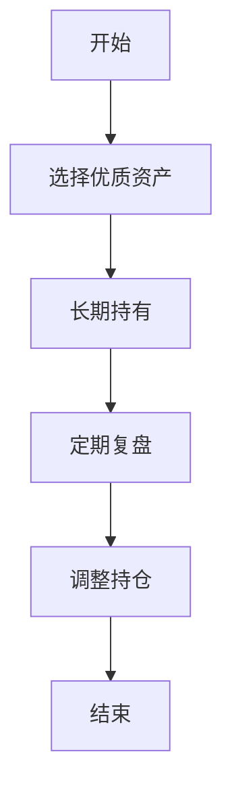
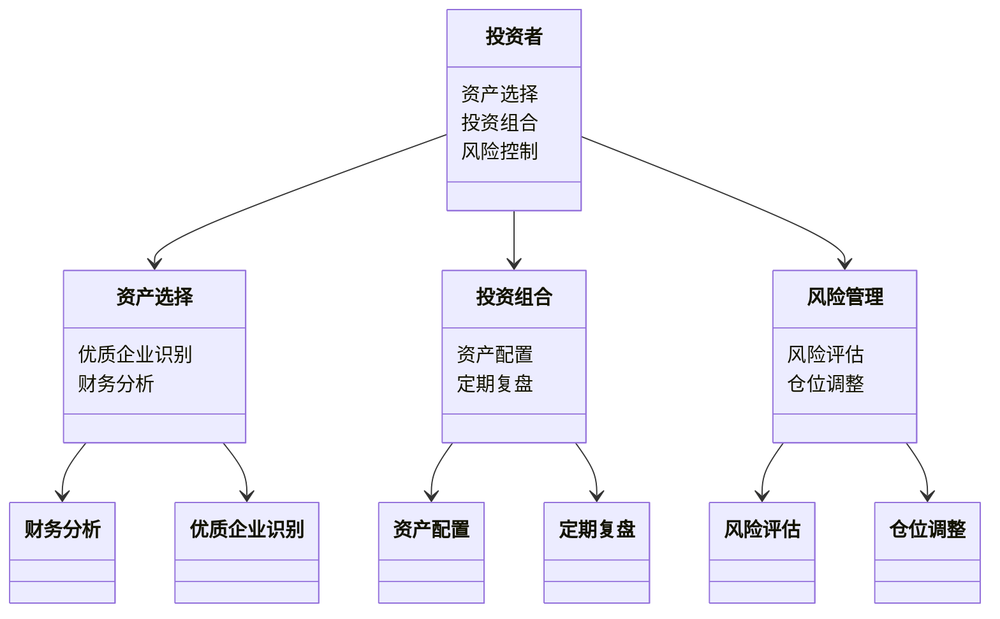
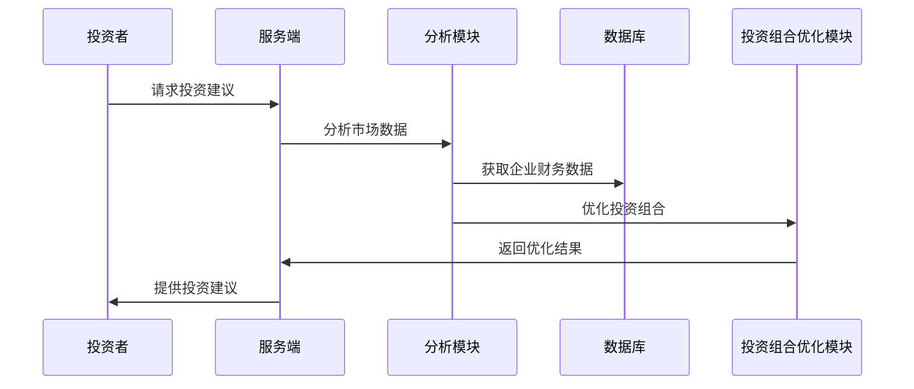

                 


# 巴菲特-芒格的长期持有策略：减少交易成本的智慧

> 关键词：巴菲特，芒格，长期持有策略，投资成本，交易成本，价值投资

> 摘要：本文深入分析了巴菲特和芒格的长期持有策略，探讨了该策略如何通过减少交易成本来实现投资的成功。文章从长期持有策略的背景、核心概念、算法原理、系统架构设计、项目实战等方面展开，结合实际案例和数学模型，详细阐述了长期持有策略的优势及其在实际投资中的应用。

---

## 第1章：长期持有策略的背景介绍

### 1.1 问题背景与问题描述
在投资领域，交易成本是一个不容忽视的重要因素。频繁的买卖操作不仅会产生佣金、税费等显性成本，还可能带来隐性成本，如交易决策的时间成本和心理成本。传统投资策略往往忽视了这些成本对投资收益的长期影响，导致投资者在追求短期收益的过程中，反而降低了整体收益。

### 1.2 长期持有策略的定义与外延
长期持有策略是一种以长期视角进行投资的策略，强调通过持有优质资产来实现资本增值。该策略的核心在于减少交易频率，降低交易成本，从而最大化投资收益。长期持有策略不仅仅是一种投资方法，更是一种投资哲学，它要求投资者具备对市场的深刻理解、对优质企业的识别能力以及对长期价值的坚定信念。

### 1.3 长期持有策略的核心要素与概念结构
长期持有策略的核心要素包括：
1. **优质资产选择**：投资于具有持续竞争优势和良好治理结构的企业。
2. **长期价值导向**：关注企业的内在价值，而非短期市场波动。
3. **减少交易频率**：通过降低交易次数来减少交易成本。
4. **风险管理**：在长期持有过程中，注重风险控制，避免重大损失。

---

## 第2章：长期持有策略的核心概念与联系

### 2.1 长期持有策略的核心原理
长期持有策略的核心原理在于通过减少交易成本来提升投资收益。具体来说，交易成本包括以下几个方面：
1. **佣金成本**：每次交易都会产生佣金费用，频繁交易会导致佣金成本的累加。
2. **税费成本**：短期交易可能会产生较高的资本利得税，而长期持有则可以享受较低的税率。
3. **心理成本**：频繁交易容易导致情绪化决策，影响投资判断。

通过减少这些交易成本，长期持有策略能够在长期复利效应的作用下，实现更高的收益。

### 2.2 长期持有策略与其他投资策略的对比
以下是长期持有策略与其他常见投资策略的对比：

| 对比维度       | 长期持有策略         | 短线交易策略         | 被动投资策略         |
|----------------|----------------------|----------------------|----------------------|
| 投资期限       | 长期                 | 短期                 | 中长期              |
| 交易频率       | 低                   | 高                   | 低                   |
| 交易成本       | 低                   | 高                   | 中                   |
| 风险控制       | 强                   | 弱                   | 中                   |
| 收益来源       | 资本增值             | 价差收益             | 指数收益             |

从对比中可以看出，长期持有策略在交易成本和风险控制方面具有显著优势，尤其是在长期复利效应下，能够实现更高的收益。

---

## 第3章：长期持有策略的算法原理

### 3.1 长期持有策略的算法流程图



### 3.2 长期持有策略的数学模型与公式
长期持有策略的收益计算可以通过以下公式进行估算：

$$
\text{收益} = \left(1 + r\right)^t - 1
$$

其中，\( r \) 是年化收益率，\( t \) 是投资时间。

假设我们投资于一家年化收益率为7%的企业，持有时间为10年，那么收益为：

$$
\text{收益} = \left(1 + 0.07\right)^{10} - 1 \approx 0.981 \text{（即98.1%的收益）}
$$

### 3.3 长期持有策略的Python源代码实现

```python
import numpy as np

def calculate_long_term_return(r, t):
    return (1 + r) ** t - 1

# 示例：年化收益率7%，持有时间10年
r = 0.07
t = 10
return_percentage = calculate_long_term_return(r, t)
print(f"长期持有策略的收益百分比为：{return_percentage:.2f}%")
```

---

## 第4章：长期持有策略的系统分析与架构设计

### 4.1 问题场景介绍
在实际投资过程中，投资者需要构建一个系统化的长期持有策略框架，包括资产选择、投资组合优化、风险控制等功能。

### 4.2 系统功能设计（领域模型Mermaid类图）



### 4.3 系统架构设计（Mermaid架构图）


### 4.4 系统接口设计与交互（Mermaid序列图）



---

## 第5章：长期持有策略的项目实战

### 5.1 项目环境安装与配置
为了实现长期持有策略，我们需要安装以下工具：
- Python编程语言
- NumPy库
- Matplotlib库
- Pandas库

### 5.2 系统核心实现源代码

```python
import pandas as pd
import matplotlib.pyplot as plt

def analyze_assets(assets, start_date, end_date):
    # 数据获取与处理
    df = pd.DataFrame(assets)
    df.index = pd.date_range(start=start_date, periods=len(assets), freq='D')
    
    # 绘制资产价格走势
    plt.figure(figsize=(10, 6))
    df.plot()
    plt.title('资产价格走势')
    plt.xlabel('日期')
    plt.ylabel('价格')
    plt.show()

# 示例数据
assets = {
    'AAPL': [100, 105, 110, 115, 120],
    'MSFT': [80, 85, 90, 95, 100]
}

analyze_assets(assets, '2023-01-01', '2023-01-05')
```

### 5.3 实际案例分析与详细讲解
以巴菲特的经典投资案例——可口可乐为例，长期持有策略的优势体现在以下几个方面：
1. **持续的股息收入**：可口可乐每年都会向巴菲特派发股息，这为投资提供了稳定的现金流。
2. **企业的持续增长**：可口可乐作为全球饮料行业的领导者，具备强大的竞争优势，能够持续创造价值。
3. **降低交易成本**：长期持有减少了频繁交易的佣金和税费成本，从而提升了整体收益。

### 5.4 项目小结
通过实际案例分析，我们可以看到长期持有策略在降低交易成本、获取稳定收益方面的显著优势。投资者在实际操作中，需要结合市场环境和企业基本面，灵活调整投资策略。

---

## 第6章：长期持有策略的总结与展望

### 6.1 总结
长期持有策略是一种以降低交易成本为核心的投资方法，它通过减少交易频率，避免了频繁交易带来的佣金、税费和心理成本。在巴菲特和芒格的投资理念中，长期持有策略不仅是一种投资策略，更是一种对价值和时间的深刻理解。

### 6.2 展望
随着金融市场的不断发展和技术的进步，长期持有策略将得到更广泛的应用。投资者可以通过技术手段优化资产配置，进一步降低交易成本，提升投资收益。未来，长期持有策略将与人工智能、大数据等技术结合，为投资者提供更智能的投资决策支持。

---

## 作者：AI天才研究院/AI Genius Institute & 禅与计算机程序设计艺术 /Zen And The Art of Computer Programming

---

本文通过系统化的分析，深入探讨了巴菲特和芒格的长期持有策略在减少交易成本方面的优势，并结合实际案例和数学模型，为投资者提供了有价值的投资思路。希望本文能够为读者在投资决策中提供有益的参考。

