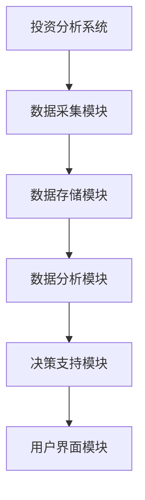
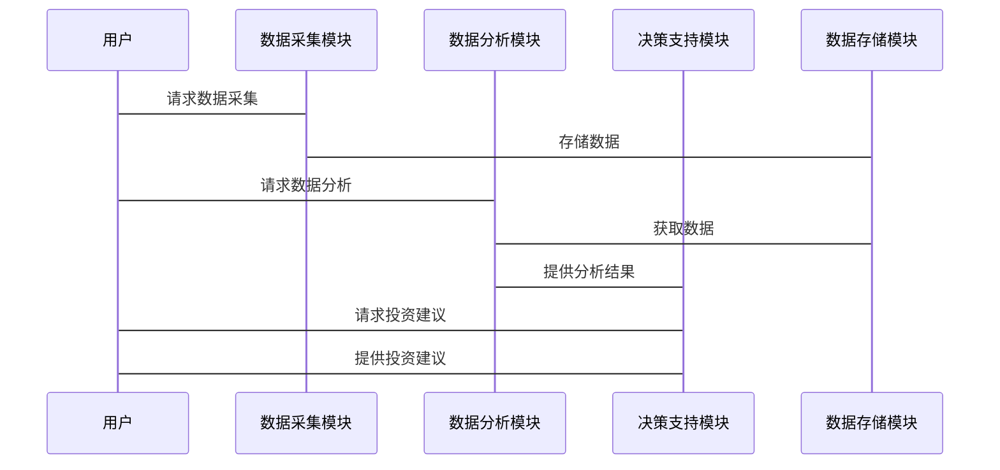

                 


# 巴菲特-芒格看5G技术：新一轮产业革命的机遇

## 关键词
5G技术，巴菲特，芒格，投资分析，产业革命，技术应用

## 摘要
本文从巴菲特和芒格的投资视角，深入分析5G技术的核心原理及其在智能制造、智慧城市等领域的广泛应用，探讨5G带来的产业变革和投资机会。通过结合两位投资大师的价值投资理念和多元思维模型，揭示5G技术如何推动新一轮产业革命，并为投资者提供切实可行的投资策略和建议。

---

# 第一部分：5G技术的背景与产业革命

## 第1章：5G技术的背景与核心概念

### 1.1 5G技术的背景与发展趋势

#### 1.1.1 从1G到5G的演进历程
- **1G：模拟通信**  
  第一代移动通信系统（1G）主要用于语音通话，采用模拟技术，覆盖范围有限，用户容量小。
- **2G：数字通信**  
  第二代移动通信系统（2G）实现了数字化语音通信，支持短信和电路数据传输，如GSM和CDMA。
- **3G：宽带通信**  
  第三代移动通信系统（3G）引入了高速数据传输，支持视频通话和互联网浏览，如CDMA2000、WCDMA和TD-SCDMA。
- **4G：高速移动互联网**  
  第四代移动通信系统（4G）实现了高速数据传输，支持高清视频、在线游戏和移动支付，如LTE和WiMAX。
- **5G：万物互联**  
  第五代移动通信系统（5G）的目标是实现高速、低延迟、大容量的通信，支持大规模物联网（IoT）和工业自动化。

#### 1.1.2 5G技术的核心特征与优势
- **高速率**：5G的理论下载速度达到1Gbps以上，是4G的10倍。
- **低延迟**：5G的端到端延迟降至1ms以下，支持实时交互应用。
- **大容量**：5G支持每平方公里数百万个连接，满足物联网需求。
- **灵活性**：5G网络架构支持多种切片技术，可根据不同场景灵活调整资源。

#### 1.1.3 5G技术对产业革命的推动作用
- 5G技术推动了智能制造、智慧城市、远程医疗等领域的快速发展。
- 5G的低延迟和高速率特性为工业自动化和虚拟现实提供了技术基础。
- 5G的万物互联能力为物联网和智能家居的发展提供了新的机遇。

### 1.2 巴菲特与芒格的投资理念

#### 1.2.1 巴菲特的价值投资原则
- **长期持有优质资产**：巴菲特强调投资具有持续竞争优势的企业，长期持有，而非短期交易。
- **安全边际**：通过低估价格买入，确保投资的安全性。
- **股息与企业盈利**：关注企业的盈利能力和股息回报。

#### 1.2.2 芒格的多元思维模型
- **多学科思维**：芒格提倡通过物理学、心理学、经济学等多学科视角分析问题。
- **逆向思维**：从反方向思考问题，寻找市场的空白点和机会。
- **避免情绪化决策**：保持理性，避免被市场情绪左右。

#### 1.2.3 巴菲特-芒格投资理念的核心要素
- **长期视角**：关注企业的长期价值，而非短期波动。
- **竞争优势**：投资具有护城河的企业，确保持续盈利能力。
- **风险管理**：通过分散投资和安全边际降低风险。

---

## 第2章：5G技术的核心原理与应用场景

### 2.1 5G技术的核心原理

#### 2.1.1 5G的网络架构与技术特点
- **网络架构**  
  5G网络采用基于服务的架构（SBA），支持网络功能虚拟化（NFV）和网络切片技术。
- **关键技术**  
  - **毫米波**：高频段通信，提升容量和速度。
  - **Massive MIMO**：大规模多输入多输出技术，提升信号质量和容量。
  - **网络切片**：根据不同场景分配专用网络资源，确保服务质量。

#### 2.1.2 5G的技术属性对比
| 技术特性       | 1G         | 2G         | 3G         | 4G         | 5G         |
|----------------|------------|------------|------------|------------|------------|
| 频率范围       | <1GHz      | <1GHz      | 1-3GHz      | 1-5GHz      | 1-100GHz    |
| 数据速率       | <2kbps      | <10kbps     | <2Mbps      | <100Mbps     | 1Gbps+      |
| 网络延迟       | 高          | 较高        | 中等        | 低          | 极低（<1ms） |
| 支持设备       | 电话        | 电话+短信   | 语音+数据   | 多媒体数据   | 物联网+AI   |

#### 2.1.3 5G的频段划分与传输特性
- **低频段**：适用于广覆盖，适合农村和郊区。
- **中频段**：适用于热点区域，提升容量。
- **高频段（毫米波）**：适用于高速数据传输，如虚拟现实和自动驾驶。

### 2.2 5G技术的主要应用场景

#### 2.2.1 智能制造：工业互联网与自动化
- **工业物联网（IIoT）**：通过5G连接生产线上的传感器和设备，实现设备间的实时通信。
- **智能制造**：5G支持工业机器人和自动化系统的高效协同，提升生产效率。
- **预测性维护**：通过实时数据传输，实现设备的预测性维护，减少停机时间。

#### 2.2.2 智慧城市：交通、能源与公共设施
- **智能交通系统（ITS）**：5G支持自动驾驶和智能交通管理，减少交通事故和拥堵。
- **智能能源管理**：通过5G连接智能电网，实现能源的高效分配和管理。
- **智慧公共设施**：5G支持智能垃圾桶、智能路灯等设备的远程监控和管理。

#### 2.2.3 智慧医疗：远程诊疗与医疗数据共享
- **远程手术**：5G支持医生远程操控手术机器人，进行高精度手术。
- **远程诊断**：通过5G传输高清医疗影像，实现快速诊断。
- **医疗数据共享**：5G支持医疗数据的实时共享，提升协作效率。

#### 2.2.4 虚拟现实与增强现实：游戏与教育培训
- **虚拟现实（VR）**：5G支持 immersive VR体验，应用于游戏和教育培训。
- **增强现实（AR）**：5G支持 AR应用，如工业设计和教育培训中的实时叠加信息。

---

## 第3章：5G技术的产业影响与投资机会

### 3.1 5G技术对传统产业的颠覆性影响

#### 3.1.1 制造业的智能化转型
- **工业自动化**：5G支持工业机器人和自动化系统的高效协同，推动制造业向智能化方向发展。
- **工业物联网（IIoT）**：通过5G连接设备，实现生产线的实时监控和优化。

#### 3.1.2 通信行业的重构与创新
- **网络切片**：5G的网络切片技术为通信行业提供了新的商业模式，如按需分配网络资源。
- **边缘计算**：5G支持边缘计算，推动云计算和边缘计算的协同发展。

#### 3.1.3 智慧城市的建设与发展
- **智能交通**：5G支持自动驾驶和智能交通管理，提升城市交通效率。
- **智能能源管理**：通过5G连接智能电网，实现能源的高效分配和管理。

### 3.2 5G技术的投资机会分析

#### 3.2.1 5G设备与芯片制造
- **设备制造商**：投资于5G基站、路由器和终端设备的制造企业。
- **芯片制造商**：5G技术依赖高性能芯片，如基带芯片和射频芯片，芯片制造商具备投资潜力。

#### 3.2.2 5G网络建设与运维
- **网络运营商**：投资于5G网络建设和运维的企业，如中国移动、中国联通和中国电信。
- **第三方服务提供商**：提供5G网络优化和运维服务的企业。

#### 3.2.3 5G应用领域的投资潜力
- **智能制造**：投资于工业自动化和工业物联网的企业。
- **智慧城市**：投资于智能交通和智能能源管理的企业。
- **远程医疗**：投资于远程诊疗和医疗数据共享的企业。

#### 3.2.4 5G产业链的协同效应
- 5G技术的产业链包括设备制造、网络建设、应用开发等多个环节，各环节之间具有较强的协同效应，投资于整个产业链可以实现资源的优化配置。

---

## 第4章：巴菲特与芒格视角下的5G投资分析

### 4.1 巴菲特与芒格的投资理念在5G领域的应用

#### 4.1.1 长期视角与持续竞争优势
- 巴菲特强调投资具有持续竞争优势的企业，5G技术的高门槛和高技术壁垒使得具有强大研发能力和市场地位的企业具备竞争优势。

#### 4.1.2 多元思维模型与5G技术的多领域应用
- 芒格的多元思维模型可以帮助投资者从多个角度分析5G技术的投资机会，如技术、市场、政策等多个方面。

#### 4.1.3 风险管理与安全边际
- 巴菲特强调安全边际，投资者在投资5G技术时应充分考虑技术风险、市场风险和政策风险，确保投资的安全性。

### 4.2 5G技术的投资策略与风险管理

#### 4.2.1 投资策略
- **长期持有优质资产**：投资于具有持续竞争优势的5G相关企业，长期持有，分享企业的成长收益。
- **分散投资**：通过分散投资降低风险，避免将所有资金投入到单一领域。
- **关注政策支持**：5G技术的发展离不开政府的政策支持，投资者应关注相关政策的变化。

#### 4.2.2 风险管理
- **技术风险**：5G技术的快速发展和技术更新可能带来技术风险，投资者应选择具有强大研发能力和技术储备的企业。
- **市场风险**：5G市场的竞争可能加剧，投资者应关注企业的市场地位和竞争优势。
- **政策风险**：5G技术的发展受到政策的大力支持，但也可能受到政策变化的影响，投资者应关注政策的变化。

---

## 第5章：系统分析与架构设计

### 5.1 基于5G技术的投资分析系统

#### 5.1.1 系统功能设计
- **数据采集**：采集5G相关企业的财务数据、市场数据和政策数据。
- **数据分析**：通过数据分析工具对数据进行清洗、分析和建模，找出投资机会。
- **决策支持**：基于分析结果，提供投资建议和决策支持。

#### 5.1.2 系统架构设计


#### 5.1.3 系统接口设计
- **数据接口**：与企业财务系统、市场数据系统和政策数据库对接。
- **用户接口**：提供友好的用户界面，方便用户进行数据分析和投资决策。

#### 5.1.4 系统交互流程


---

## 第6章：项目实战与案例分析

### 6.1 项目实战：基于5G技术的投资分析系统开发

#### 6.1.1 环境搭建
- **操作系统**：Windows 10或更高版本，macOS 10.15或更高版本。
- **开发工具**：Python 3.8+，Jupyter Notebook，PyCharm。
- **依赖库**：pandas、numpy、scikit-learn、matplotlib。

#### 6.1.2 系统核心实现源代码
```python
import pandas as pd
import numpy as np
from sklearn import linear_model

# 数据加载
data = pd.read_csv('5g_investment.csv')

# 数据预处理
data.dropna(inplace=True)
data = pd.get_dummies(data)

# 模型训练
model = linear_model.LinearRegression()
model.fit(data.drop('investment_return', axis=1), data['investment_return'])

# 模型预测
new_data = pd.DataFrame({
    'revenue': [1000, 2000],
    'profit_margin': [0.1, 0.2],
    'market_share': [0.3, 0.4]
})
new_data = pd.get_dummies(new_data)
predictions = model.predict(new_data)

# 结果输出
print("Predicted Investment Returns:", predictions)
```

#### 6.1.3 代码应用解读与分析
- **数据加载与预处理**：加载投资数据，删除缺失值，并进行特征编码。
- **模型训练**：使用线性回归模型训练投资回报与企业财务指标之间的关系。
- **模型预测**：基于模型预测新的投资回报。

#### 6.1.4 实际案例分析
- **案例背景**：某5G设备制造商的财务数据和市场数据。
- **数据分析**：通过线性回归模型分析企业的财务指标与投资回报之间的关系。
- **投资建议**：基于模型预测结果，提供投资建议。

#### 6.1.5 项目小结
- 通过开发投资分析系统，投资者可以更科学地进行投资决策，提升投资效率和准确性。

---

## 第7章：总结与展望

### 7.1 5G技术的投资关键点
- **长期视角**：关注企业的长期价值，而非短期波动。
- **竞争优势**：投资具有持续竞争优势的企业，确保盈利能力。
- **风险管理**：通过分散投资和安全边际降低风险，确保投资的安全性。

### 7.2 未来的展望
- **技术创新**：5G技术的不断创新将推动更多应用场景的发展。
- **政策支持**：政府将继续支持5G技术的发展，提供政策支持和资金投入。
- **行业融合**：5G技术将与更多行业深度融合，推动新一轮产业革命。

---

## 作者信息

作者：AI天才研究院/AI Genius Institute & 禅与计算机程序设计艺术/Zen And The Art of Computer Programming

