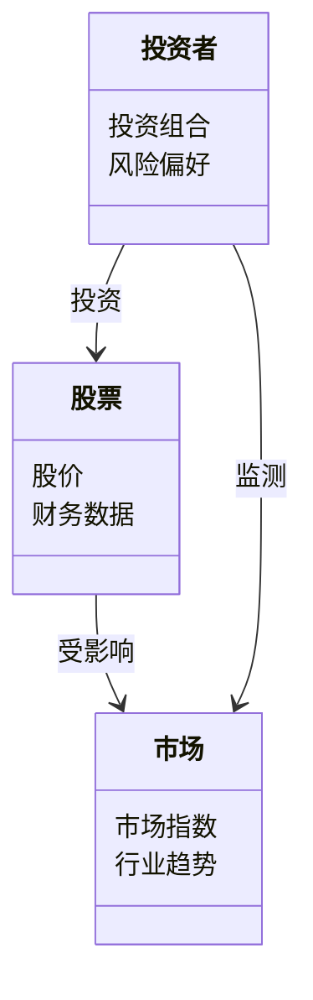
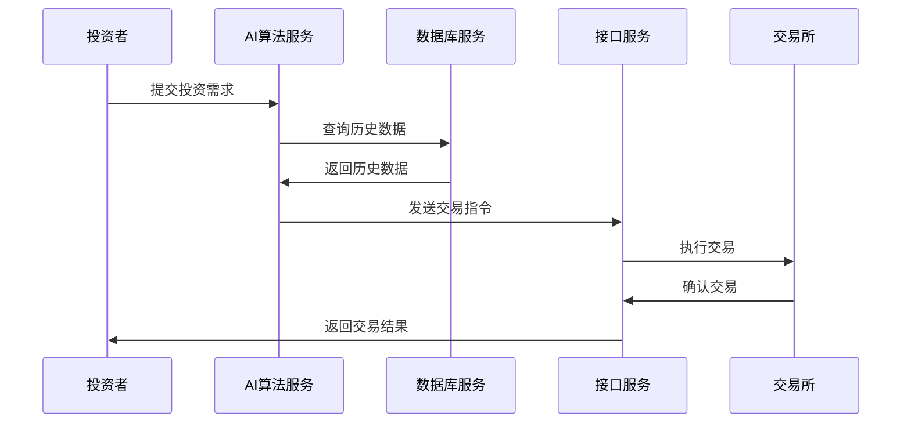

                 


# 巴菲特-芒格看AI在金融服务中的应用：机遇与风险

## 关键词：巴菲特, 芒格, AI, 金融服务, 投资策略, 风险管理

## 摘要：本文从巴菲特和芒格的投资智慧出发，探讨人工智能在金融服务中的应用，分析其带来的机遇与潜在风险。结合AI技术的基本原理和实际应用案例，探讨如何将巴菲特的价值投资理念与AI技术相结合，优化投资决策和风险管理，同时提出在AI驱动的金融环境中，投资者应如何保持理性思考和长期价值判断。

---

# 第一部分：引言

## 第1章：巴菲特与芒格的投资智慧与AI的结合

### 1.1 巴菲特与芒格的投资理念

#### 1.1.1 巴菲特的价值投资理论

沃伦·巴菲特的价值投资理论强调以合理的价格买入优质的公司，长期持有，通过公司价值的增长实现投资收益。他相信市场的短期波动不可预测，但优质企业的长期价值是可以通过基本面分析确定的。

#### 1.1.2 芒格的多元思维模型

查理·芒格的多元思维模型强调通过多个学科的交叉思考，找到问题的解决方案。他认为，投资不仅仅是数学问题，更是对人性、市场和经济规律的深刻理解。

#### 1.1.3 巴菲特与芒格投资理念的核心要素

- **长期视角**：关注企业的长期价值，而非短期波动。
- **基本面分析**：通过对企业财务状况、行业地位和管理团队的深入分析，选择优质企业。
- **风险管理**：芒格强调“避免大错”，巴菲特定律是“第一条是不赔钱，第二条是不赔大钱”。

### 1.2 AI技术的快速发展与金融服务的结合

#### 1.2.1 AI技术的基本概念与特点

人工智能（AI）是指计算机系统模拟人类智能的能力，包括学习、推理、决策和自然语言处理等功能。AI的核心技术包括机器学习、深度学习、自然语言处理和计算机视觉等。

#### 1.2.2 金融服务行业的数字化转型

金融服务行业正在经历数字化转型，传统的金融服务模式逐渐被智能化、自动化和数据驱动的模式取代。AI技术在金融领域的应用日益广泛，从交易执行、风险管理到客户服务，AI正在改变金融行业的运作方式。

#### 1.2.3 巴菲特与芒格视角下的AI机遇

巴菲特和芒格虽然不是技术专家，但他们意识到AI技术对金融行业的潜在影响。他们认为，AI可以提高投资决策的效率和准确性，但也可能带来过度依赖技术的风险。

### 1.3 本书的核心内容与目标

#### 1.3.1 本书的研究范围

本书将探讨AI在金融服务中的应用，重点分析投资决策、风险管理和服务优化等方面。

#### 1.3.2 本书的主要目标

- 分析AI在金融服务中的具体应用。
- 结合巴菲特和芒格的投资理念，探讨AI技术对投资决策的影响。
- 提出在AI驱动的金融环境中，投资者应如何保持理性思考和长期价值判断。

#### 1.3.3 本书的结构安排

本书将分为四个主要部分：引言、背景分析、核心应用和总结与展望。

---

# 第二部分：AI在金融服务中的应用背景

## 第2章：AI与金融服务的背景分析

### 2.1 金融服务行业的现状与挑战

#### 2.1.1 传统金融服务的痛点

传统金融服务存在效率低、成本高、客户体验差等问题。例如，传统的投资决策依赖人工分析，效率低且容易受到主观因素的影响。

#### 2.1.2 数字化转型的必要性

随着互联网和大数据技术的发展，金融服务行业需要通过数字化转型来提高效率、降低成本并提升客户体验。

#### 2.1.3 AI技术在金融服务中的潜在价值

AI技术可以通过数据分析和模式识别，帮助金融机构提高投资决策的效率和准确性，降低风险管理成本，并提供个性化的客户服务。

### 2.2 AI技术的基本原理与应用领域

#### 2.2.1 机器学习与深度学习的简介

机器学习是一种通过数据训练模型，使其能够从数据中学习并做出预测的技术。深度学习是机器学习的一种，通过多层神经网络来模拟人类的深度学习能力。

#### 2.2.2 自然语言处理在金融分析中的应用

自然语言处理（NLP）技术可以用于分析新闻、财报和其他文本数据，提取情感、关键词和趋势，帮助投资者做出决策。

#### 2.2.3 计算机视觉在金融数据处理中的应用

计算机视觉技术可以用于识别和处理图像中的数据，例如从扫描的文档中提取关键信息。

### 2.3 巴菲特与芒格视角下的AI机遇与风险

#### 2.3.1 巴菲特对AI的评价与看法

巴菲特对AI技术持开放态度，认为AI可以提高投资决策的效率，但也提醒投资者不能过度依赖技术，必须保持对市场的深刻理解。

#### 2.3.2 芒格对AI的哲学思考

芒格认为，AI技术可以提高分析的效率，但不能替代人类的判断力和智慧。他强调，投资者必须具备多元思维模型，才能在复杂的市场环境中做出正确的决策。

#### 2.3.3 巴菲特与芒格投资理念与AI的结合

巴菲特和芒格的投资理念强调长期视角和基本面分析，而AI技术可以通过数据分析和模式识别，帮助投资者更好地理解和分析企业的基本面。

---

# 第三部分：AI在金融服务中的核心应用

## 第3章：AI在投资决策中的应用

### 3.1 量化投资与AI技术的结合

#### 3.1.1 量化投资的基本概念

量化投资是一种基于数学模型的投资策略，通过数据分析和算法交易来实现投资收益。

#### 3.1.2 AI在量化投资中的具体应用

- **数据挖掘**：通过AI技术分析历史数据，发现投资机会。
- **算法交易**：利用AI算法进行高频交易，捕捉市场中的短期机会。
- **风险控制**：通过AI技术实时监控市场风险，调整投资组合。

#### 3.1.3 巴菲特与芒格视角下的量化投资与AI的结合

巴菲特和芒格认为，量化投资和AI技术可以提高投资决策的效率，但必须结合基本面分析和长期视角。

### 3.2 风险管理与AI技术的应用

#### 3.2.1 风险管理的基本概念

风险管理是通过识别、评估和应对潜在风险，降低投资损失的过程。

#### 3.2.2 AI在风险管理中的具体应用

- **实时监控**：通过AI技术实时监控市场风险，发现潜在风险。
- **情景分析**：利用AI技术进行情景分析，评估不同市场条件下的风险。
- **风险预警**：通过AI技术预测市场风险，提前采取应对措施。

#### 3.2.3 巴菲特与芒格视角下的风险管理与AI的结合

巴菲特和芒格认为，风险管理是投资成功的关键，AI技术可以帮助投资者更好地识别和应对潜在风险。

### 3.3 客户服务与AI技术的应用

#### 3.3.1 客户服务的基本概念

客户服务是金融机构与客户互动的过程，包括咨询、投诉处理和客户关系管理。

#### 3.3.2 AI在客户服务中的具体应用

- **智能客服**：通过AI技术提供24/7的智能客服，回答客户问题并提供解决方案。
- **客户画像**：通过AI技术分析客户需求，提供个性化的服务。
- **客户行为分析**：通过AI技术分析客户行为，预测客户需求并提供个性化建议。

#### 3.3.3 巴菲特与芒格视角下的客户服务与AI的结合

巴菲特和芒格认为，客户服务是金融机构的核心竞争力之一，AI技术可以帮助金融机构更好地理解客户需求，提供更优质的服务。

---

# 第四部分：系统分析与架构设计

## 第4章：AI在金融服务中的系统分析与架构设计

### 4.1 问题场景介绍

本章将探讨AI在金融服务中的系统设计，包括投资决策、风险管理和服务优化等方面。

### 4.2 系统功能设计

#### 4.2.1 领域模型设计

以下是领域模型的Mermaid图：



#### 4.2.2 系统架构设计

以下是系统架构的Mermaid图：

```mermaid
container 金融服务系统 {
    service AI算法服务 {
        algorithm 算法1
        algorithm 算法2
    }
    service 数据库服务 {
        数据库1
        数据库2
    }
    service 接口服务 {
        REST API
        WebSocket
    }
}
```

#### 4.2.3 系统交互设计

以下是系统交互的Mermaid图：



### 4.3 项目实战

#### 4.3.1 环境安装

安装Python和必要的库，如NumPy、Pandas、Scikit-learn等。

#### 4.3.2 核心实现

以下是核心代码实现：

```python
import numpy as np
from sklearn.linear_model import LinearRegression

# 数据准备
X = np.array([[1], [2], [3], [4], [5]])
y = np.array([2, 4, 5, 4, 6])

# 模型训练
model = LinearRegression()
model.fit(X, y)

# 预测
print(model.predict([[6]]))  # 输出：[[6.8]]
```

### 4.3.3 案例分析

通过案例分析，展示AI技术在金融服务中的实际应用，如预测股票价格和优化投资组合。

---

# 第五部分：总结与展望

## 第5章：AI在金融服务中的总结与展望

### 5.1 总结

本文从巴菲特和芒格的投资理念出发，探讨了AI在金融服务中的应用，分析了投资决策、风险管理和服务优化等方面的核心应用，并提出了系统设计和项目实现的具体方案。

### 5.2 展望

随着AI技术的不断发展，金融服务行业将更加智能化和数据化。投资者需要结合AI技术与巴菲特和芒格的投资理念，制定更加科学和合理的投资策略。

---

作者：AI天才研究院/AI Genius Institute & 禅与计算机程序设计艺术 /Zen And The Art of Computer Programming

