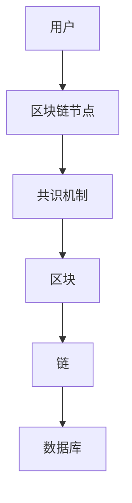

                 

<think>
好的，我将按照您的要求撰写一篇关于“巴菲特与芒格看区块链：技术创新与投资机会”的技术博客文章。为了更好地满足您的需求，我会逐步分析和推理，确保内容逻辑清晰、结构紧凑且易于理解。

---

# 巴菲特-芒格看区块链：技术创新与投资机会

> **关键词**：巴菲特，芒格，区块链，投资机会，技术创新，去中心化，价值投资

> **摘要**：本文从巴菲特和芒格的投资理念出发，结合区块链技术的核心原理，分析其在金融和实体经济中的应用潜力。通过详细的技术分析、投资策略和案例研究，揭示区块链如何为投资者创造长期价值，并探讨其面临的挑战与未来发展趋势。

---

## 第一部分：背景介绍

### 第1章：巴菲特与芒格的投资哲学

#### 1.1 巴菲特的价值投资理论

**1.1.1 价值投资的核心理念**

巴菲特的价值投资理论强调长期主义和基本面分析。他认为，投资的本质是寻找具有持续竞争优势的企业，并以合理的价格买入，长期持有，等待企业价值的实现。这种理念与区块链技术的长期潜力不谋而合。

**1.1.2 芒格的多元思维模型**

芒格提出的多元思维模型强调跨学科的思考方式，认为投资者需要从多个角度理解问题，才能做出明智的决策。这种思维方式为分析区块链技术提供了重要的方法论支持。

**1.1.3 巴菲特与芒格的共同点与差异**

尽管巴菲特和芒格在投资风格上有细微差异，但他们都强调长期价值、基本面分析和风险管理。这种一致性为区块链技术的分析提供了统一的框架。

---

### 第2章：区块链技术的核心原理

#### 2.1 区块链的基本概念

**2.1.1 区块链的定义与特点**

区块链是一种分布式账本技术，通过去中心化的方式记录和验证数据。其核心特点包括去中心化、不可篡改性和透明性。

**2.1.2 区块链的核心技术**

- **分布式账本**：区块链通过多个节点共同维护一个账本，确保数据的一致性和安全性。
- **共识机制**：如比特币的PoW和以太坊的PoS，确保网络中的节点达成一致。
- **智能合约**：通过自动执行的代码实现复杂的业务逻辑。

**2.1.3 区块链的创新点与优势**

- **去中心化**：避免了单一机构的控制风险。
- **数据不可篡改**：提高了数据的可信度。
- **高效性**：通过智能合约实现自动化操作，降低了交易成本。

---

## 第二部分：区块链与投资机会

### 第3章：区块链与价值投资的结合

#### 3.1 区块链如何改变价值传递方式

区块链技术通过去中心化的方式重新定义了价值传递。传统的金融体系依赖于中心机构（如银行），而区块链通过智能合约实现了点对点的价值转移，降低了交易成本和时间。

#### 3.2 巴菲特与芒格的长期主义与区块链的去中心化特征

巴菲特和芒格的长期主义与区块链的去中心化特征高度契合。区块链通过长期的价值积累和去中心化的治理模式，为投资者提供了新的价值捕获方式。

---

### 第4章：区块链的投资机会分析

#### 4.1 区块链在金融领域的应用

**4.1.1 数字货币与加密资产的投资机会**

比特币和以太坊等数字货币具有较高的投资价值，尤其是以太坊的智能合约功能为去中心化金融（DeFi）提供了基础。

**4.1.2 区块链在跨境支付与结算中的应用**

区块链技术可以显著降低跨境支付的手续费和时间成本，为全球金融体系带来革新。

**4.1.3 去中心化金融（DeFi）的崛起**

DeFi通过区块链技术构建了一个去中心化的金融生态系统，投资者可以通过提供流动性、借贷等方式获得收益。

#### 4.2 区块链在其他领域的应用

**4.2.1 供应链管理的区块链解决方案**

区块链可以实现供应链的透明化和可追溯性，帮助企业和消费者更好地追踪商品的来源。

**4.2.2 区块链在知识产权保护中的应用**

通过区块链技术，可以确保知识产权的归属和交易的透明性，保护创作者的权益。

**4.2.3 区块链在医疗健康领域的创新**

区块链可以用于医疗数据的隐私保护和共享，提高医疗系统的效率和安全性。

---

### 第5章：区块链项目分析与投资策略

#### 5.1 区块链项目的评估标准

**5.1.1 项目的技术可行性分析**

投资者需要评估项目的技术创新性和技术实现的可行性，例如是否解决了实际问题。

**5.1.2 项目团队的背景与能力**

团队的背景和能力是项目成功的关键因素，投资者需要关注团队的过往经验和专业性。

**5.1.3 项目的市场前景与商业模型**

投资者需要评估项目的市场潜力和商业模型的可行性，例如是否具备可持续的盈利模式。

#### 5.2 投资策略与风险管理

**5.2.1 长期价值投资策略**

投资者应关注具有长期价值的区块链项目，避免短期波动的干扰。

**5.2.2 短期投机风险的控制**

尽管区块链项目具有高回报潜力，但投资者也需警惕短期市场的剧烈波动。

**5.2.3 如何避免投资陷阱**

投资者需要通过深入研究和多元化投资来分散风险，避免被不实宣传误导。

---

## 第三部分：区块链投资的风险与挑战

### 第6章：区块链技术的风险

#### 6.1 技术成熟度与稳定性问题

区块链技术仍处于快速发展阶段，存在技术不成熟和系统稳定性不足的风险。

#### 6.2 智能合约的安全性隐患

智能合约的漏洞可能导致严重的经济损失，因此需要加强技术研发和安全审查。

#### 6.3 去中心化与监管的矛盾

区块链的去中心化特征与监管要求存在矛盾，可能引发政策风险。

---

### 第7章：总结与展望

#### 7.1 巴菲特与芒格视角下的区块链投资总结

**7.1.1 长期价值投资的可行性**

区块链技术的长期潜力为投资者提供了丰富的投资机会，但需要耐心和长期持有。

**7.1.2 区块链技术的颠覆性潜力**

区块链技术有望改变多个行业的商业模式和价值传递方式，为投资者带来巨大的收益。

**7.1.3 投资者应具备的素养与能力**

投资者需要具备技术理解力和长期投资的耐心，才能在区块链领域获得成功。

#### 7.2 区块链投资的未来展望

**7.2.1 技术创新与应用拓展**

随着技术的不断进步，区块链将在更多领域得到广泛应用，推动社会和经济的数字化转型。

---

## 第四部分：附录与参考文献

### 附录A：区块链技术的数学模型与公式

例如，比特币的哈希函数可以表示为：
$$ H(m) = SHA256(SHA256(m)) $$

其中，$m$ 是需要哈希的输入数据。

### 附录B：区块链系统架构设计

---

## 作者信息

**作者：AI天才研究院/AI Genius Institute & 禅与计算机程序设计艺术 /Zen And The Art of Computer Programming**

---

以上是《巴菲特-芒格看区块链：技术创新与投资机会》的技术博客文章的完整内容。希望这篇文章能为您提供有价值的信息和见解！

