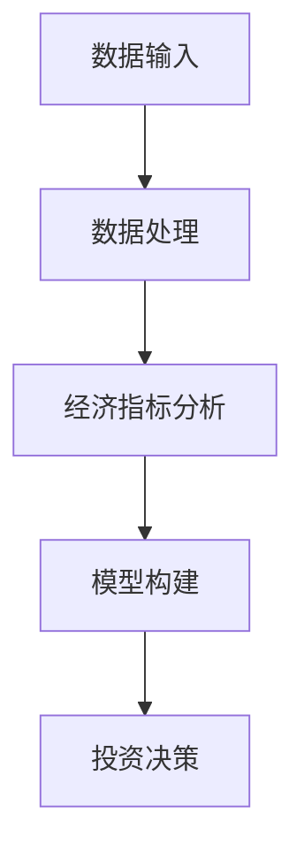

                 


# 巴菲特-芒格看待全球经济失衡：风险与机遇

## 关键词：巴菲特，芒格，全球经济失衡，投资哲学，风险与机遇，价值投资，经济分析

## 摘要：  
本文从巴菲特和芒格的投资哲学出发，分析全球经济失衡的现状及其带来的风险与机遇。通过详细阐述他们的投资理念、分析方法和应对策略，结合实际案例和系统分析，探讨如何在全球经济失衡中找到投资机会和风险管理的方法。

---

# 第一部分: 引言

## 第1章: 全球经济失衡的现状与重要性

### 1.1 全球经济失衡的背景介绍  
#### 1.1.1 经济失衡的定义与表现  
经济失衡是指一个经济体内部或多个经济体之间的经济指标不均衡，如贸易逆差、债务失衡、货币流动失衡等。这些失衡可能导致通货膨胀、资产泡沫、经济危机等问题。

#### 1.1.2 全球化背景下的经济失衡加剧  
全球化促进了跨国贸易和资本流动，但也导致了一些国家的贸易顺差和逆差加剧。例如，美国长期的贸易逆差和中国的贸易顺差，反映了全球价值链的分工不均衡。

#### 1.1.3 经济失衡对全球经济体系的影响  
经济失衡可能导致全球经济不稳定，如2008年的金融危机就是由美国的房地产泡沫和全球化的债务失衡引发的。因此，理解经济失衡的根源和影响至关重要。

### 1.2 巴菲特与芒格的研究视角  
#### 1.2.1 巴菲特与芒格的投资者身份  
巴菲特和芒格不仅是成功的投资者，还是经济理论的实践者。他们的投资哲学和分析方法为理解全球经济失衡提供了独特的视角。

#### 1.2.2 他们的投资哲学与经济分析方法  
巴菲特和芒格的价值投资理念强调长期持有优质资产，注重企业基本面分析。芒格的多元思维模型则强调跨学科思考，将经济学、心理学、数学等知识结合起来分析问题。

#### 1.2.3 为什么他们的视角对理解经济失衡至关重要  
他们的视角可以帮助投资者在经济失衡中识别潜在风险和机会，尤其是在市场波动和经济危机时，他们的方法更具防御性和进攻性。

### 1.3 本书的研究框架与方法  
#### 1.3.1 研究目标与范围  
本文旨在分析全球经济失衡的现状，探讨巴菲特和芒格的投资哲学在其中的应用，寻找风险与机遇。

#### 1.3.2 研究方法与工具  
结合定量分析（如经济指标、数据分析）和定性分析（如企业基本面分析、市场情绪分析），使用多元思维模型进行综合分析。

#### 1.3.3 本书的结构安排  
文章分为引言、投资哲学、背景分析、风险与机遇、应对策略、系统分析、项目实战和结论等部分，确保内容全面且逻辑清晰。

---

# 第二部分: 巴菲特与芒格的投资哲学

## 第2章: 巴菲特与芒格的投资理念

### 2.1 巴菲特的价值投资理论  
#### 2.1.1 价值投资的核心原则  
价值投资强调购买被市场低估的资产，关注企业的内在价值，而非短期市场波动。巴菲特认为，投资的本质是寻找具有持续竞争优势的企业。

#### 2.1.2 安全边际的概念与应用  
安全边际是指资产的市场价格低于其内在价值的部分。巴菲特认为，安全边际是抵御市场风险的重要保障。

#### 2.1.3 长期投资与企业基本面分析  
巴菲特倡导长期投资，关注企业的盈利能力、财务状况和管理团队。他通过分析企业的ROE（净资产收益率）来评估企业的价值。

### 2.2 芒格的多元思维模型  
#### 2.2.1 多元思维模型的定义  
多元思维模型是指将不同学科的知识和思维方式结合起来，用于分析复杂问题。芒格认为，这种思维方式可以帮助投资者避免认知偏差。

#### 2.2.2 芒格的思维方式对企业分析的启示  
芒格强调跨学科思考，例如结合经济学、心理学和数学来分析市场的行为模式。这种思维方式可以帮助投资者更好地理解市场的波动和企业的行为。

#### 2.2.3 多元思维模型在投资决策中的应用  
通过多元思维模型，投资者可以更全面地分析企业的价值和市场的风险。例如，结合心理学的“锚定效应”来理解市场的定价偏差。

### 2.3 巴菲特与芒格的宏观经济分析方法  
#### 2.3.1 经济周期的识别与分析  
巴菲特和芒格关注经济周期的变化，认为在经济衰退时更容易找到被低估的资产。他们通过分析GDP增长率、失业率等指标来判断经济周期。

#### 2.3.2 通货膨胀与货币政策对企业的影响  
通货膨胀会影响企业的成本和利润，货币政策（如加息、降息）则会影响市场的资金流动和企业的融资成本。巴菲特和芒格关注这些因素对企业估值的影响。

#### 2.3.3 财政政策与企业价值的关系  
财政政策（如政府支出、税收政策）会影响企业的盈利能力。巴菲特和芒格关注政府政策对企业长期发展的支持作用。

---

# 第三部分: 全球经济失衡的背景分析

## 第3章: 当前全球经济失衡的表现与成因

### 3.1 主要经济体的经济失衡分析  
#### 3.1.1 美国的贸易逆差与债务问题  
美国的贸易逆差反映了其在全球价值链中的弱势地位。同时，美国的债务水平不断上升，可能引发债务危机。

#### 3.1.2 中国的贸易顺差与产能过剩  
中国的贸易顺差反映了其出口导向型经济的强劲增长，但也导致了全球价值链的失衡。产能过剩则可能导致国内市场竞争加剧，影响企业盈利能力。

#### 3.1.3 欧洲的债务危机与经济结构调整  
欧洲部分国家（如希腊、意大利）的债务问题引发了债务危机，拖累了整个欧洲经济。欧洲的经济结构调整（如财政紧缩、结构性改革）可能影响企业的经营环境。

### 3.2 全球化与贸易保护主义的冲突  
#### 3.2.1 全球化对经济失衡的影响  
全球化促进了跨国贸易和资本流动，但也导致了一些国家的贸易顺差和逆差加剧。例如，发达国家的消费依赖进口，而发展中国家的出口依赖外资。

#### 3.2.2 贸易保护主义的兴起  
近年来，贸易保护主义（如关税壁垒、贸易限制）的兴起反映了全球化带来的矛盾。例如，美国对中国征收关税，导致全球贸易摩擦加剧。

#### 3.2.3 贸易失衡对全球经济的影响  
贸易失衡可能导致全球经济不稳定，例如，贸易逆差国家的消费能力下降，而贸易顺差国家的投资需求不足。

### 3.3 货币政策与财政政策的协调问题  
#### 3.3.1 全球货币政策的分化  
不同国家的货币政策差异（如美国的零利率政策、欧洲的负利率政策）导致货币流动失衡，影响全球资本流动。

#### 3.3.2 财政政策的协调与合作  
全球经济失衡的解决需要各国在货币政策和财政政策上进行协调。例如，通过国际合作减少贸易顺差和逆差。

#### 3.3.3 货币政策与财政政策对经济失衡的双重影响  
宽松的货币政策可能导致资产泡沫，而紧缩的财政政策可能引发经济衰退。因此，政策制定者需要在稳定经济和控制风险之间找到平衡。

---

## 第4章: 巴菲特与芒格视角下的经济失衡分析

### 4.1 巴菲特与芒格对当前经济失衡的看法  
#### 4.1.1 巴菲特对美国经济的看法  
巴菲特认为，美国的债务问题和贸易逆差是长期存在的问题，但通过长期投资优质企业可以规避这些风险。

#### 4.1.2 芒格对全球经济失衡的解读  
芒格认为，全球经济失衡的根本原因是资源分配不均和制度缺陷，这些问题可以通过多元思维模型来解决。

### 4.2 巴菲特与芒格的投资策略应对经济失衡  
#### 4.2.1 价值投资在经济失衡中的优势  
价值投资注重企业的内在价值，能够在经济失衡中找到被低估的资产。例如，巴菲特在2008年金融危机期间投资了 Goldman Sachs 的优先股，获得了丰厚的回报。

#### 4.2.2 多元思维模型在风险控制中的应用  
芒格的多元思维模型可以帮助投资者识别经济失衡中的潜在风险。例如，通过心理学分析市场的行为偏差，避免盲目跟风。

### 4.3 巴菲特与芒格的风险管理策略  
#### 4.3.1 分散投资与风险控制  
巴菲特和芒格强调分散投资，避免过度集中于某一种资产或行业。例如，巴菲特的伯克希尔公司投资于多个行业，以分散风险。

#### 4.3.2 长期持有与短期波动的平衡  
长期持有优质资产可以抵御短期市场波动，但需要关注企业的长期价值。例如，巴菲特长期持有 Coca-Cola 和可口可乐公司的股票。

#### 4.3.3 利用经济失衡中的投资机会  
在全球经济失衡中，投资者可以通过寻找具有竞争优势的企业，或者投资于具有抗周期性的行业，来获得超额收益。

---

# 第四部分: 应对策略与系统分析

## 第5章: 巴菲特与芒格的应对策略

### 5.1 巴菲特与芒格的长期投资策略  
#### 5.1.1 长期投资的核心要素  
长期投资需要关注企业的长期价值，选择具有持续竞争优势的企业。例如，巴菲特长期投资苹果公司，因为苹果公司具有强大的品牌影响力和技术创新能力。

#### 5.1.2 投资组合的构建与优化  
巴菲特和芒格强调投资组合的分散化，选择不同行业的优质资产，以降低风险。例如，伯克希尔公司投资于保险、能源、制造等多个行业。

### 5.2 巴菲特与芒格的风险管理方法  
#### 5.2.1 安全边际在风险管理中的应用  
巴菲特的安全边际理念可以帮助投资者在市场波动中规避风险。例如，购买价格低于内在价值的资产，可以抵御市场的短期波动。

#### 5.2.2 多元思维模型在风险管理中的应用  
芒格的多元思维模型可以帮助投资者识别潜在风险。例如，通过心理学分析市场的行为偏差，避免盲目跟风。

### 5.3 巴菲特与芒格的投资决策框架  
#### 5.3.1 经济分析与投资决策  
巴菲特和芒格通过经济分析（如经济周期、货币政策、财政政策）来判断市场的整体走势。例如，他们在2008年金融危机期间进行了抄底投资。

#### 5.3.2 企业分析与投资决策  
他们通过企业基本面分析（如盈利能力、财务状况、管理团队）来选择优质资产。例如，巴菲特投资于伯克希尔公司，因为该公司具有强大的现金流和分红能力。

---

## 第6章: 系统分析与架构设计

### 6.1 系统分析框架  
#### 6.1.1 问题场景介绍  
全球经济失衡是一个复杂的系统问题，涉及多个因素，如贸易、货币政策、财政政策等。系统分析可以帮助投资者更好地理解这些问题。

#### 6.1.2 系统功能设计  
系统功能设计包括数据收集、指标分析、模型构建等。例如，通过数据收集全球经济指标，构建模型分析经济失衡的影响。

#### 6.1.3 系统架构设计  
系统架构设计需要考虑数据的输入、处理、分析和输出。例如，使用Python进行数据处理，使用Matplotlib进行数据可视化。

### 6.2 系统架构图  


### 6.3 系统接口设计  
系统接口设计包括数据接口和用户界面。例如，通过API接口获取全球经济指标数据。

### 6.4 系统交互图  
```mermaid
sequenceDiagram
    actor 用户
    system 系统
    用户 -> 系统: 请求经济指标数据
    系统 -> 用户: 返回数据
```

---

## 第7章: 项目实战

### 7.1 环境安装  
#### 7.1.1 安装Python  
需要安装Python 3.x及以上版本，可以从官网下载安装。

#### 7.1.2 安装数据分析库  
安装Pandas、NumPy、Matplotlib等库，用于数据处理和可视化。

### 7.2 核心实现源代码  
#### 7.2.1 数据收集与处理  
```python
import pandas as pd
import numpy as np
import matplotlib.pyplot as plt

# 数据收集
data = pd.read_csv('global_economic.csv')

# 数据处理
data['增长率'] = data['GDP'].pct_change()
data['通胀率'] = data['CPI'].pct_change()

# 数据可视化
plt.plot(data['年份'], data['增长率'], label='GDP增长率')
plt.plot(data['年份'], data['通胀率'], label='通胀率')
plt.xlabel('年份')
plt.ylabel('百分比')
plt.legend()
plt.show()
```

#### 7.2.2 模型构建与分析  
```python
from sklearn.linear_model import LinearRegression

# 数据准备
X = data[['增长率', '通胀率']]
y = data['股票收益']

# 模型训练
model = LinearRegression()
model.fit(X, y)

# 预测与评估
预测收益 = model.predict(X)
print('回归系数:', model.coef_)
print('截距:', model.intercept_)
```

### 7.3 应用解读与分析  
通过上述代码，可以分析经济增长率和通胀率对股票收益的影响。回归系数可以帮助我们理解经济增长率对股票收益的贡献。

### 7.4 实际案例分析  
以美国为例，分析其经济指标对股市的影响。例如，2008年金融危机期间，经济增长率下降，通胀率上升，导致股市大幅下跌。但通过巴菲特的安全边际策略，可以在市场底部寻找投资机会。

### 7.5 项目小结  
通过项目实战，我们可以将巴菲特和芒格的投资哲学与实际操作相结合，利用数据分析和模型构建来识别投资机会和风险。

---

## 第8章: 结论与展望

### 8.1 结论  
本文从巴菲特和芒格的投资哲学出发，分析了全球经济失衡的现状及其带来的风险与机遇。通过系统分析和项目实战，展示了如何在全球经济失衡中找到投资机会和风险管理的方法。

### 8.2 展望  
未来的研究可以进一步结合人工智能和大数据技术，开发更复杂的经济模型，帮助投资者更好地应对全球经济失衡带来的挑战。同时，可以探索更多跨学科的思维方式，如行为经济学、复杂系统理论，来深入理解经济失衡的根源和影响。

---

# 作者：AI天才研究院/AI Genius Institute & 禅与计算机程序设计艺术 /Zen And The Art of Computer Programming

