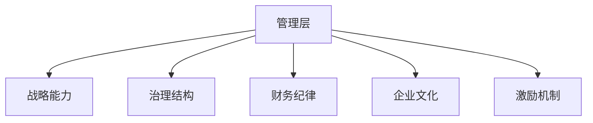
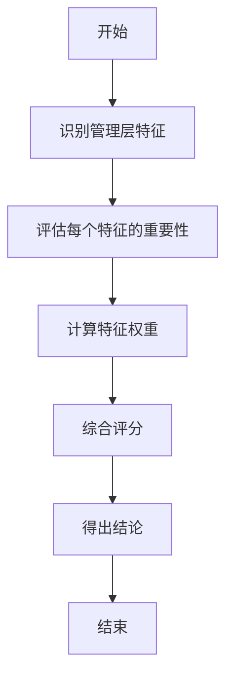
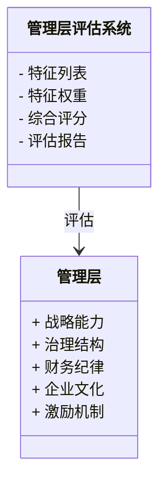
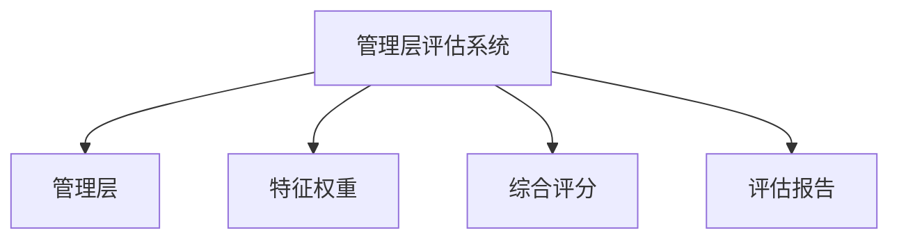
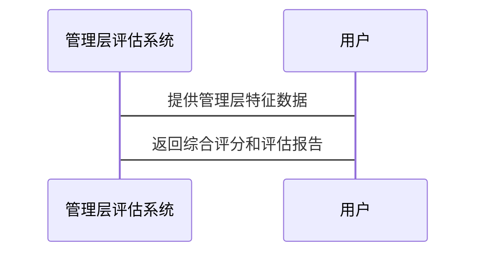

                 


# 巴菲特如何看待公司管理层

## 关键词：巴菲特，公司管理层，价值投资，战略能力，治理结构，财务纪律

## 摘要： 
巴菲特认为，公司管理层的质量是投资成功的关键因素之一。本文详细分析了巴菲特评估公司管理层的核心特征、评估方法和实际案例，探讨了如何从战略、治理、财务、文化和激励机制等方面全面评估管理层，并结合数学模型和实际案例进行详细解读。

---

## 第一部分：巴菲特投资理念与公司管理层评估背景

### 第1章：巴菲特投资理念概述

#### 1.1 巴菲特的投资哲学
##### 1.1.1 价值投资的定义与核心原则
价值投资是一种以内在价值为导向的投资策略，强调购买价格低于内在价值的资产。巴菲特的核心原则包括寻找具有持续竞争优势的公司，关注公司的长期盈利能力，以及注重安全边际。

##### 1.1.2 巴菲特的价值投资体系
巴菲特的价值投资体系基于基本面分析，注重公司财务状况、行业地位和管理层能力。他认为，成功的投资不仅需要对公司进行深入分析，还需要对管理层的诚信和能力有充分的信心。

##### 1.1.3 价值投资与长期主义
巴菲特倡导长期投资，认为市场波动是投资的敌人。他主张投资者应关注企业的内在价值，而非短期市场波动，以实现长期收益。

#### 1.2 公司管理层在投资中的重要性
##### 1.2.1 管理层对企业发展的影响
管理层的决策直接影响公司的战略方向、财务状况和市场表现。优秀管理层能够带领公司应对挑战，抓住机遇，实现可持续增长。

##### 1.2.2 管理层质量与企业长期价值的关系
管理层的质量是决定公司长期价值的关键因素。优秀管理层能够优化资源配置，提升效率，增强公司的核心竞争力。

##### 1.2.3 巴菲特对管理层的筛选标准
巴菲特注重管理层的诚信、能力和热情。他倾向于投资那些具有优秀管理团队的公司，这些团队能够稳健经营，创造长期价值。

### 第2章：公司管理层的核心特征

#### 2.1 管理层的关键特征分析
##### 2.1.1 战略能力
战略能力是指管理层制定和执行战略的能力。优秀的管理层能够准确识别市场机会，制定切实可行的战略，并灵活调整以适应变化。

##### 2.1.2 治理结构
治理结构包括董事会、监事会和管理层的组织架构。良好的治理结构能够确保决策的透明性和有效性，防止权力滥用，维护股东利益。

##### 2.1.3 财务纪律
财务纪律是指管理层在财务管理方面的严谨性和自律性。优秀管理层能够合理分配资金，控制成本，确保财务健康，避免过度扩张。

##### 2.1.4 企业文化
企业文化是公司价值观和行为准则的体现。优秀的企业文化能够激发员工积极性，增强团队凝聚力，推动公司持续发展。

##### 2.1.5 激励机制
激励机制是管理层和员工之间利益绑定的手段。有效的激励机制能够激发管理层的积极性，鼓励其为公司创造更大价值。

#### 2.2 管理层特征对比分析
##### 2.2.1 战略能力与治理结构的对比
战略能力关注公司发展方向和目标的设定，而治理结构关注组织架构和决策机制。两者相辅相成，共同影响公司的发展。

##### 2.2.2 财务纪律与企业文化的对比
财务纪律关注资金管理和成本控制，而企业文化关注公司氛围和员工行为。两者共同影响公司的财务健康和内部凝聚力。

##### 2.2.3 激励机制与其他特征的综合影响
激励机制能够促进管理层的积极性，与其他特征如战略能力和财务纪律相结合，共同提升公司的整体表现。

### 第3章：巴菲特管理层评估的核心概念

#### 3.1 核心概念原理
##### 3.1.1 企业治理与管理层决策的内在联系
良好的企业治理能够确保管理层的有效决策和透明性，从而提升公司的整体表现。

##### 3.1.2 管理层能力与企业绩效的因果关系
管理层的能力直接影响公司的战略执行和绩效表现。优秀管理层能够带领公司实现更好的业绩。

##### 3.1.3 长期主义与短期收益的平衡
巴菲特倡导长期投资，注重管理层的长期规划和稳健经营，而非追求短期收益。

#### 3.2 管理层特征的属性对比表
| 特征         | 定义与重要性 | 巴菲特的评估标准 | 影响因素 |
|--------------|--------------|------------------|----------|
| 战略能力     | 制定和执行战略的能力 | 战略的清晰性和可行性 | 行业趋势、竞争环境 |
| 治理结构     | 组织架构和决策机制 | 董事会独立性、透明度 | 法律法规、公司规模 |
| 财务纪律     | 财务管理的严谨性 | 资金使用效率、债务控制 | 财务报表、行业标准 |
| 企业文化     | 企业价值观和行为准则 | 员工满意度、创新性 | 公司历史、领导风格 |
| 激励机制     | 利益绑定机制 | 股权激励、绩效考核 | 股东利益、员工积极性 |

#### 3.3 ER实体关系图


### 第4章：巴菲特管理层评估的算法原理

#### 4.1 算法原理概述
##### 4.1.1 巴菲特管理层评估的多维度分析模型
巴菲特的评估方法是一个多维度的分析模型，综合考虑管理层的战略能力、治理结构、财务纪律、企业文化以及激励机制。

##### 4.1.2 基于特征权重的评分系统
每个特征都有一定的权重，根据其重要性进行评分，最后计算综合评分。

#### 4.2 算法流程图


#### 4.3 数学模型与公式
##### 4.3.1 特征权重计算公式
$$ \text{特征权重}_i = \frac{\sum_{j=1}^{n} w_j \cdot x_{ij}}{\sum_{j=1}^{n} w_j} $$
其中，\( w_j \) 是第 \( j \) 个特征的权重，\( x_{ij} \) 是第 \( i \) 个公司的第 \( j \) 个特征的评分。

##### 4.3.2 综合评分公式
$$ \text{综合评分} = \sum_{j=1}^{n} w_j \cdot x_{ij} $$

#### 4.4 举例说明
以苹果公司为例，假设其战略能力得分为90，治理结构得分为85，财务纪律得分为95，企业文化得分为88，激励机制得分为92。权重分别为0.2, 0.15, 0.3, 0.2, 0.15。

计算每个特征的权重乘以评分：
- 战略能力：0.2 * 90 = 18
- 治理结构：0.15 * 85 = 12.75
- 财务纪律：0.3 * 95 = 28.5
- 企业文化：0.2 * 88 = 17.6
- 激励机制：0.15 * 92 = 13.8

综合评分 = 18 + 12.75 + 28.5 + 17.6 + 13.8 = 90.65

### 第5章：系统分析与架构设计方案

#### 5.1 系统功能设计
##### 5.1.1 领域模型


#### 5.2 系统架构设计
##### 5.2.1 架构图


#### 5.3 系统接口设计
##### 5.3.1 输入接口
- 管理层特征数据
- 特征权重参数

##### 5.3.2 输出接口
- 综合评分
- 评估报告

#### 5.4 系统交互设计
##### 5.4.1 交互序列图


### 第6章：项目实战

#### 6.1 环境安装
- 安装Python和相关库（如pandas、numpy、matplotlib）
- 安装Mermaid工具用于绘制图表

#### 6.2 核心实现源代码
##### 6.2.1 数据处理代码
```python
import pandas as pd

# 定义特征权重
weights = {'战略能力': 0.2, '治理结构': 0.15, '财务纪律': 0.3, '企业文化': 0.2, '激励机制': 0.15}

# 计算综合评分
def calculate综合评分(features, weights):
    return sum(features[feature] * weights[feature] for feature in features)

# 示例数据
features = {'战略能力': 90, '治理结构': 85, '财务纪律': 95, '企业文化': 88, '激励机制': 92}
评分 = calculate综合评分(features, weights)
print(f"综合评分: {评分}")
```

##### 6.2.2 图表绘制代码
```python
import matplotlib.pyplot as plt

features = ['战略能力', '治理结构', '财务纪律', '企业文化', '激励机制']
values = [90, 85, 95, 88, 92]

plt.bar(features, values)
plt.title('管理层特征评分')
plt.xlabel('特征')
plt.ylabel('评分')
plt.show()
```

#### 6.3 代码应用解读与分析
通过上述代码，我们可以计算出苹果公司的综合评分为90.65，并绘制出各特征的评分柱状图，直观展示各特征的表现。

#### 6.4 案例分析
以苹果公司为例，通过代码计算出综合评分为90.65，说明其管理层表现优秀，具备投资价值。

### 第7章：总结与最佳实践

#### 7.1 小结
巴菲特的管理层评估方法是一个多维度的分析模型，综合考虑战略能力、治理结构、财务纪律、企业文化以及激励机制。通过合理分配特征权重，计算综合评分，可以帮助投资者更准确地评估公司管理层的质量。

#### 7.2 注意事项
- 确保数据的准确性和全面性
- 定期更新特征权重和评分标准
- 结合行业特点和公司具体情况灵活应用

#### 7.3 扩展阅读
建议进一步阅读巴菲特的原著《投资最重要的事》，深入理解其投资哲学和实践案例。

## 作者：AI天才研究院/AI Genius Institute & 禅与计算机程序设计艺术 /Zen And The Art of Computer Programming

