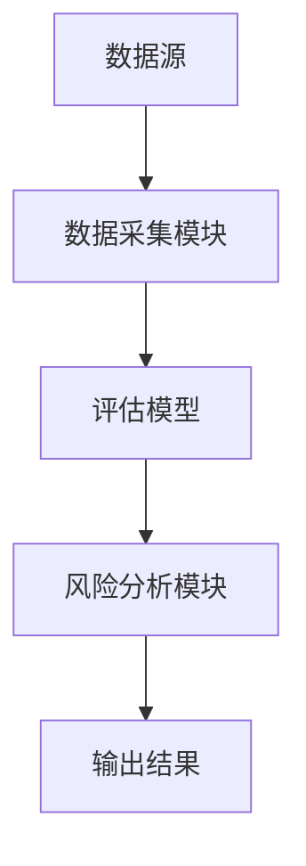

                 


# 巴菲特如何看待加密货币投资

---

## 关键词：
- 巴菲特, 加密货币, 投资理念, 价值投资, 区块链

---

## 摘要：
本文深入探讨了巴菲特对加密货币投资的看法，结合其价值投资理念和加密货币的技术特性，分析了两者的核心联系与差异。通过数学模型和系统架构设计，详细阐述了加密货币市场的波动性及其与巴菲特投资策略的潜在结合点。文章还通过实际案例分析，展示了如何将巴菲特的投资智慧应用于加密货币领域，为投资者提供了有价值的见解和建议。

---

## 第一部分: 背景介绍

### 第1章: 巴菲特与加密货币的背景概述

#### 1.1 巴菲特的投资理念与风格
巴菲特的价值投资理念以基本面分析为核心，注重企业的内在价值和长期增长潜力。他强调安全边际、股息支付率和企业盈利能力，倾向于投资那些具备持续竞争优势的企业。

#### 1.2 加密货币的定义与现状
加密货币是一种基于区块链技术的数字货币，具有去中心化、匿名性和不可篡改的特性。当前市场主要由比特币、以太坊等主导，市场规模迅速增长，但波动性较大。

#### 1.3 巴菲特与加密货币的初步关联
尽管巴菲特对科技股持开放态度，但他对加密货币的评价较为谨慎。本文将分析他的投资理念与加密货币技术的潜在联系，探讨其可能的投资策略。

---

## 第二部分: 核心概念与联系

### 第2章: 巴菲特投资理念与加密货币特性的对比分析

#### 2.1 巴菲特价值投资的核心要素
- **企业基本面分析**：巴菲特注重企业的盈利能力、竞争优势和管理团队。
- **长期投资与安全边际**：他倾向于长期持有优质资产，并在价格低于内在价值时买入。
- **股东权益与企业价值评估**：巴菲特强调企业的内在价值，而非市场的短期波动。

#### 2.2 加密货币的核心属性与技术特征
- **去中心化与匿名性**：加密货币不依赖中央机构，交易匿名。
- **区块链的技术优势**：通过去中心化账本确保交易的安全性和透明性。
- **市场波动性**：加密货币价格受市场情绪影响较大，波动剧烈。

#### 2.3 两者的核心联系与对比
- **技术进步与投资机会**：巴菲特意识到区块链技术的潜力，但对其作为投资标的持谨慎态度。
- **价值投资的适用性**：加密货币的去中心化特性与巴菲特的安全边际理念有潜在契合点。

对比分析表格：
| 巴菲特投资理念       | 加密货币特性           |
|----------------------|------------------------|
| 企业基本面分析       | 区块链技术优势         |
| 长期投资与安全边际   | 市场波动性             |
| 股东权益与企业价值   | 去中心化与匿名性       |

---

## 第三部分: 算法原理与数学模型

### 第3章: 加密货币价格波动的数学模型

#### 3.1 随机游走模型与加密货币价格预测
随机游走模型描述价格变化的随机性，适用于加密货币市场的短期预测。公式如下：
$$ P_{t} = P_{t-1} + \epsilon $$
其中，$\epsilon$为随机扰动项。

#### 3.2 基于价值投资的加密货币评估模型
结合巴菲特的价值投资理念，构建一个评估模型：
$$ V = \alpha \cdot EBITDA + \beta \cdot (1 - \frac{P}{V}) $$
其中，$V$为内在价值，$EBITDA$为企业息税折旧前利润，$P$为市场价格，$\alpha$和$\beta$为权重系数。

---

## 第四部分: 系统分析与架构设计

### 第4章: 加密货币投资系统的架构设计

#### 4.1 问题场景介绍
构建一个基于巴菲特价值投资理念的加密货币评估系统，帮助投资者识别具备长期增长潜力的项目。

#### 4.2 系统功能设计
- 数据采集：获取加密货币的市场数据和项目信息。
- 评估模型：应用上述数学模型评估内在价值。
- 风险分析：识别市场波动和潜在风险。

#### 4.3 架构图（Mermaid）


---

## 第五部分: 项目实战

### 第5章: 实际案例分析

#### 5.1 环境配置
安装Python和必要的库（Pandas, Scikit-learn）。

#### 5.2 核心代码实现
```python
import pandas as pd
from sklearn.linear_model import LinearRegression

# 数据加载
data = pd.read_csv('crypto_data.csv')

# 特征选择
features = ['market_cap', 'volume', 'tx_count']
target = 'price'

# 模型训练
model = LinearRegression()
model.fit(data[features], data[target])

# 预测与评估
predictions = model.predict(data[features])
print('预测值:', predictions)
print('均方误差:', mean_squared_error(data[target], predictions))
```

#### 5.3 案例分析与解读
以比特币为例，分析其市场表现与模型预测结果，评估其是否符合巴菲特的价值投资标准。

---

## 第六部分: 结论与最佳实践

### 第6章: 结论与最佳实践

#### 6.1 巴菲特观点总结
巴菲特对加密货币持谨慎态度，认为其缺乏实际价值，但对其底层技术区块链表示认可。

#### 6.2 投资建议
- **长期视角**：关注具备技术优势和长期增长潜力的加密货币。
- **风险管理**：合理配置资产，避免过度集中。
- **持续学习**：关注行业动态和技术进步。

#### 6.3 注意事项
加密货币市场波动剧烈，投资者需谨慎决策，避免盲目跟风。

#### 6.4 拓展阅读
推荐书籍：《巴菲特致股东的信》、《加密货币：区块链技术入门与应用》。

---

## 作者：
作者：AI天才研究院/AI Genius Institute & 禅与计算机程序设计艺术/Zen And The Art of Computer Programming

---

这篇文章系统地探讨了巴菲特如何看待加密货币投资，结合其价值投资理念与加密货币的技术特性，为读者提供了深入的分析和实用的建议。

