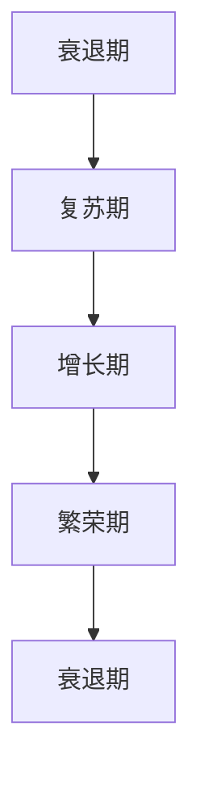
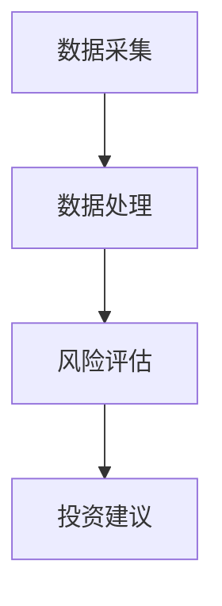

                 

# 巴菲特如何看待房地产投资

## 关键词
- 巴菲特、房地产投资、价值投资、现金流、风险管理、长期投资

## 摘要
本文从巴菲特的投资理念出发，详细分析他如何看待房地产投资。通过探讨房地产投资的基本原则、长期视角、数学模型、系统架构以及风险管理等方面，结合实际案例，阐述巴菲特的房地产投资策略和方法。

---

# 第1章：巴菲特的投资理念概述

## 1.1 投资的核心原则
巴菲特的价值投资理念强调寻找具有持久竞争优势的企业，注重企业的内在价值和长期盈利能力。这一理念同样适用于房地产投资。

---

# 第2章：房地产投资的基本原则

## 2.1 房地产投资的定义与分类
房地产投资是指通过购买、管理和出售房地产资产以获得收益或资本增值的投资行为。常见的房地产投资形式包括住宅、商业房地产和工业地产。

## 2.2 房地产市场的周期性分析
房地产市场的周期性波动是影响投资决策的重要因素。以下是房地产市场的周期性特征：

- **衰退期**：市场需求下降，价格停滞或下跌。
- **复苏期**：市场逐渐恢复，价格止跌回升。
- **增长期**：市场需求旺盛，价格快速上涨。
- **繁荣期**：市场供不应求，价格达到峰值。
- **衰退期**：市场供大于求，价格开始下跌。

**mermaid图示**：

---

# 第3章：巴菲特的房地产投资策略

## 3.1 价值投资在房地产中的应用
巴菲特强调寻找被低估的房地产资产。以下是评估房地产价值的关键步骤：

1. **评估资产本身的价值**：包括地理位置、建筑质量、周边设施等因素。
2. **分析市场供需关系**：研究当地的人口增长、经济发展和就业情况。
3. **考虑长期增值潜力**：选择具有持续增值潜力的区域。

**公式示例**：
$$ \text{内在价值} = \text{未来现金流的现值} $$

## 3.2 现金流的重要性
现金流是房地产投资的核心。以下是现金流的关键作用：

1. **覆盖债务**：确保有足够的现金流偿还贷款。
2. **创造收益**：通过租金收入实现正现金流。
3. **资本增值**：通过资产增值实现资本收益。

---

# 第4章：房地产投资的数学模型与分析

## 4.1 房地产价值评估模型
以下是两种常用的房地产价值评估模型：

### 4.1.1 净现值模型
净现值（Net Present Value, NPV）用于评估投资的未来现金流的现值与初始投资的差额。

$$ NPV = \sum_{t=1}^{n} \frac{CF_t}{(1 + r)^t} - I $$

其中：
- $CF_t$：第t年的现金流
- $r$：折现率
- $I$：初始投资

### 4.1.2 内部收益率模型
内部收益率（Internal Rate of Return, IRR）是使净现值为零的折现率。

$$ NPV = \sum_{t=1}^{n} \frac{CF_t}{(1 + IRR)^t} - I = 0 $$

---

# 第5章：房地产投资的系统架构与实战

## 5.1 系统功能设计
以下是房地产投资分析系统的功能模块：

1. **数据采集与处理**：收集房地产市场的数据，包括价格、租金、经济指标等。
2. **风险评估与预警**：评估投资风险并提供预警。
3. **投资决策支持**：基于数据分析提供投资建议。

**mermaid图示**：

## 5.2 项目实战
以下是一个简单的房地产投资分析案例：

假设你计划投资一套公寓，预计租金收入为每年12万元，贷款利息为5万元，其他费用为2万元。初始投资为50万元，贷款期限为20年，贷款利率为5%。

1. **计算净现值**：
   $$ NPV = \sum_{t=1}^{20} \frac{12万 - 5万 - 2万}{(1 + 0.05)^t} - 50万 $$

2. **计算内部收益率**：
   $$ IRR = \text{使NPV=0的利率} $$

---

# 第6章：风险管理与税务规划

## 6.1 风险管理
1. **分散投资**：避免将所有资金投入单一房地产项目。
2. **评估安全边际**：确保投资标的的价值高于其市场价格。

## 6.2 税务规划
1. **优化税务负担**：合理利用税收优惠政策。
2. **税盾效应**：利用利息抵税减少税负。

---

# 结论
巴菲特的房地产投资策略强调长期视角、价值投资和风险管理。通过合理配置资产、关注现金流和控制风险，投资者可以实现稳健的投资回报。

---

# 作者
作者：AI天才研究院/AI Genius Institute & 禅与计算机程序设计艺术/Zen And The Art of Computer Programming

