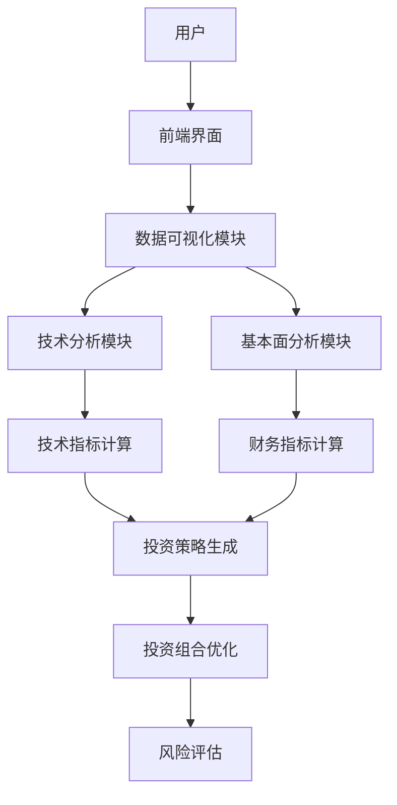

                 


# 巴菲特如何看待新兴市场投资

## 关键词：
- 巴菲特投资理念
- 新兴市场
- 价值投资
- 股票分析
- 风险管理

## 摘要：
本文探讨了巴菲特的投资理念及其在新兴市场的应用。通过分析价值投资的核心原则、新兴市场的特点以及技术分析方法，结合实际案例和代码实现，展示了如何将巴菲特的策略应用于新兴市场的投资决策中，帮助读者在现代投资环境中取得成功。

---

# 第一部分：引言

## 第1章：巴菲特投资理念概述

### 1.1 巴菲特的生平与投资哲学

巴伦·巴菲特（Warren Buffett）是全球最著名的投资者之一，以其长期的价值投资策略闻名。他的投资哲学基于以下几个核心原则：

1. **价值投资**：寻找市场价格低于其内在价值的公司。
2. **安全边际**：在投资时留有安全空间，确保即使出现估值误差，投资仍能盈利。
3. **长期视角**：巴菲特强调长期持有优质资产，避免短期波动的干扰。
4. **竞争优势**：投资那些具有持续竞争优势（护城河）的企业。

巴菲特的投资哲学强调基本面分析，即通过分析公司的财务状况、行业地位、盈利能力等，寻找具有长期增长潜力的公司。

### 1.2 新兴市场的定义与特点

新兴市场是指那些经济发展迅速、市场规模相对较小但增长潜力巨大的国家和地区，如中国、印度、巴西等。新兴市场的特点包括：

1. **高增长潜力**：新兴市场的GDP增速通常高于发达市场。
2. **行业多样性**：新兴市场涵盖科技、消费、金融等多个行业，具有丰富的投资机会。
3. **高波动性**：由于市场参与者较少，信息不透明，新兴市场的股价波动较大。
4. **政策影响**：新兴市场的经济受政府政策影响较大，包括货币政策、贸易政策等。

---

# 第二部分：巴菲特投资理念的核心

## 第2章：价值投资的定义与原则

### 2.1 价值投资的核心概念

价值投资的核心在于寻找市场价格低于内在价值的公司。内在价值是基于公司未来现金流的现值，可以通过DCF（ discounted cash flow）模型计算得出。以下是价值投资的几个关键点：

1. **安全边际**：巴菲特强调在投资时，市场价格应显著低于内在价值，以确保即使出现估值误差，投资仍能盈利。
2. **长期视角**：价值投资需要耐心，因为市场价格可能在短期内偏离内在价值，但长期来看会回归。
3. **竞争优势**：投资那些具有持续竞争优势（如品牌、技术、市场支配地位等）的公司，这些公司能够长期保持高利润率和市场份额。

### 2.2 巴菲特的价值投资策略

巴菲特的投资策略可以总结为以下几个步骤：

1. **识别具有竞争优势的企业**：寻找那些在行业内具有竞争优势的公司，例如可口可乐、苹果等。
2. **评估公司的财务状况**：通过分析公司的财务报表，评估其盈利能力、资产负债表健康状况和现金流情况。
3. **计算内在价值**：使用DCF模型或其他方法计算公司的内在价值。
4. **等待合适的价格**：在市场价格低于内在价值时买入并长期持有。

---

# 第三部分：新兴市场的特点与投资机会

## 第3章：新兴市场的经济与行业分析

### 3.1 新兴市场的经济结构

新兴市场的经济结构通常包括以下几个方面：

1. **高速增长的GDP**：新兴市场的GDP增速通常高于发达市场，例如中国的GDP增速近年来保持在6%以上。
2. **产业升级**：新兴市场正在经历产业升级，从劳动密集型产业向技术密集型产业转型。
3. **消费增长**：随着中产阶级的崛起，新兴市场的消费行业（如食品饮料、家电、互联网等）增长迅速。

### 3.2 新兴市场的行业机会

新兴市场中，以下行业具有较大的投资机会：

1. **科技行业**：新兴市场的科技公司（如中国的阿里巴巴、腾讯）正在快速发展，尤其是在人工智能、5G技术等领域。
2. **消费行业**：随着中产阶级的扩大，消费行业（如食品饮料、家电、互联网等）具有较大的增长潜力。
3. **金融行业**：新兴市场的金融行业（如银行、保险）也在快速发展，尤其是在金融科技领域。

---

# 第四部分：巴菲特投资理念在新兴市场的应用

## 第4章：巴菲特选股标准与新兴市场

### 4.1 巴菲特选股的八大标准

巴菲特选股时通常会考虑以下几个标准：

1. **盈利能力**：公司应具有稳定的盈利能力，可以通过ROE（净资产收益率）和净利润率来衡量。
2. **财务健康状况**：公司应具有健康的财务状况，低负债率和稳定的现金流。
3. **竞争优势**：公司应具有竞争优势，如护城河、品牌、技术等。
4. **管理层素质**：管理层应具有诚信和能力，能够为股东创造价值。

### 4.2 新兴市场中的优质企业识别

在新兴市场中识别优质企业时，可以参考以下步骤：

1. **行业分析**：选择具有增长潜力的行业，如科技、消费等。
2. **财务分析**：通过分析公司的财务报表，评估其盈利能力、资产负债表健康状况和现金流情况。
3. **竞争优势分析**：评估公司是否具有竞争优势，如护城河、品牌等。
4. **管理层分析**：了解公司的管理层，评估其诚信和能力。

---

# 第五部分：巴菲特投资理念的技术分析

## 第5章：技术分析与巴菲特投资策略

### 5.1 技术分析的基本概念

技术分析是通过分析股票的历史价格和成交量数据，预测未来的价格走势。技术分析的基本假设是市场行为反映所有信息，因此可以通过价格和成交量的变化来预测未来的价格走势。

### 5.2 技术分析在新兴市场的应用

在新兴市场中，技术分析可以用于以下几个方面：

1. **趋势分析**：通过分析股价的趋势，确定股票的长期趋势。
2. **支撑位和阻力位**：通过分析股价的支撑位和阻力位，确定买卖时机。
3. **成交量分析**：通过分析成交量的变化，判断市场的强弱。

### 5.3 技术分析的实现

以下是一个使用Python进行技术分析的示例代码：

```python
import pandas as pd
import numpy as np
import matplotlib.pyplot as plt
import yfinance as yf

# 下载股票数据
data = yf.download('AAPL', start='2020-01-01', end='2023-12-31')

# 计算移动平均线
data['MA_50'] = data['Close'].rolling(50).mean()
data['MA_200'] = data['Close'].rolling(200).mean()

# 绘制股价与移动平均线的图形
plt.figure(figsize=(12, 6))
plt.plot(data['Close'], label='Close Price')
plt.plot(data['MA_50'], label='50-Day MA')
plt.plot(data['MA_200'], label='200-Day MA')
plt.title('Apple Stock Price with Moving Averages')
plt.xlabel('Date')
plt.ylabel('Price')
plt.legend()
plt.show()
```

### 5.4 技术分析的局限性

尽管技术分析在新兴市场中具有一定的应用价值，但也存在一些局限性：

1. **信息滞后性**：技术分析依赖于历史数据，无法反映实时信息。
2. **市场情绪影响**：技术分析无法完全预测市场情绪的变化。
3. **复杂性**：技术分析需要掌握多种技术指标和方法，对投资者的技术要求较高。

---

# 第六部分：系统分析与架构设计

## 第6章：系统分析与架构设计方案

### 6.1 问题场景介绍

在新兴市场中，投资者需要一个能够实时监控市场动态、分析股票数据、制定投资策略的系统。为了实现这一目标，我们需要设计一个投资决策支持系统。

### 6.2 项目介绍

投资决策支持系统（Investment Decision Support System，IDSS）是一个基于巴菲特投资理念和现代技术的系统，能够帮助投资者在新兴市场中做出明智的投资决策。

### 6.3 系统功能设计

以下是IDSS的核心功能：

1. **数据获取与处理**：从多个数据源获取股票数据，并进行清洗和预处理。
2. **技术分析**：使用多种技术指标（如移动平均线、相对强度等）进行股票分析。
3. **基本面分析**：分析公司的财务报表，评估公司的内在价值。
4. **投资策略生成**：基于技术分析和基本面分析，生成投资策略。

### 6.4 系统架构设计

以下是IDSS的系统架构图：



### 6.5 系统接口设计

IDSS的接口设计如下：

1. **用户输入**：用户可以通过前端界面输入股票代码和时间范围。
2. **数据接口**：系统从多个数据源获取股票数据，包括Yahoo Finance、Google Finance等。
3. **输出接口**：系统输出技术分析结果、基本面分析结果和投资策略。

### 6.6 系统交互设计

以下是IDSS的交互序列图：

```mermaid
sequenceDiagram
    participant 用户
    participant 前端界面
    participant 数据可视化模块
    participant 技术分析模块
    participant 基本面分析模块
    participant 投资策略生成模块
    用户 -> 前端界面: 输入股票代码和时间范围
    前端界面 -> 数据可视化模块: 请求数据可视化
    数据可视化模块 -> 技术分析模块: 请求技术分析结果
    数据可视化模块 -> 基本面分析模块: 请求基本面分析结果
    技术分析模块 ->抽抽抽抽抽抽抽抽抽抽抽抽抽抽抽抽抽抽抽抽抽抽抽抽抽抽抽抽抽抽抽抽抽抽抽抽抽抽抽抽抽抽抽抽抽抽抽抽抽抽抽抽抽抽抽抽抽抽抽抽抽抽抽抽抽抽抽抽抽抽抽抽抽抽抽抽抽抽抽抽抽抽抽抽抽抽抽抽抽抽抽抽抽抽抽抽抽抽抽抽抽抽抽抽抽抽抽抽抽抽抽抽抽抽抽抽抽抽抽抽抽抽抽抽抽抽抽抽抽抽抽抽抽抽抽抽抽抽抽抽抽抽抽抽抽抽抽抽抽抽抽抽抽抽抽抽抽抽抽抽抽抽抽抽抽抽抽抽抽抽抽抽抽抽抽抽抽抽抽抽抽抽抽抽抽抽抽抽抽抽抽抽抽抽抽抽抽抽抽抽抽抽抽抽抽抽抽抽抽抽抽抽抽抽抽抽抽抽抽抽抽抽抽抽抽抽抽抽抽抽抽抽抽抽抽抽抽抽抽抽抽抽抽抽抽抽抽抽抽抽抽抽抽抽抽抽抽抽抽抽抽抽抽抽抽抽抽抽抽抽抽抽抽抽抽抽抽抽抽抽抽抽抽抽抽抽抽抽抽抽抽抽抽抽抽抽抽抽抽抽抽抽抽抽抽抽抽抽抽抽抽抽抽抽抽抽抽抽抽抽抽抽抽抽抽抽抽抽抽抽抽抽抽抽抽抽抽抽抽抽抽抽抽抽抽抽抽抽抽抽抽抽抽抽抽抽抽抽抽抽抽抽抽抽抽抽抽抽抽抽抽抽抽抽抽抽抽抽抽抽抽抽抽抽抽抽抽抽抽抽抽抽抽抽抽抽抽抽抽抽抽抽抽抽抽抽抽抽抽抽抽抽抽抽抽抽抽抽抽抽抽抽抽抽抽抽抽抽抽抽抽抽抽抽抽抽抽抽抽抽抽抽抽抽抽抽抽抽抽抽抽抽抽抽抽抽抽抽抽抽抽抽抽抽抽抽抽抽抽抽抽抽抽抽抽抽抽抽抽抽抽抽抽抽抽抽抽抽抽抽抽抽抽抽抽抽抽抽抽抽抽抽抽抽抽抽抽抽抽抽抽抽抽抽抽抽抽抽抽抽抽抽抽抽抽抽抽抽抽抽抽抽抽抽抽抽抽抽抽抽抽抽抽抽抽抽抽抽抽抽抽抽抽抽抽抽抽抽抽抽抽抽抽抽抽抽抽抽抽抽抽抽抽抽抽抽抽抽抽抽抽抽抽抽抽抽抽抽抽抽抽抽抽抽抽抽抽抽抽抽抽抽抽抽抽抽抽抽抽抽抽抽抽抽抽抽抽抽抽抽抽抽抽抽抽抽抽抽抽抽抽抽抽抽抽抽抽抽抽抽抽抽抽抽抽抽抽抽抽抽抽抽抽抽抽抽抽抽抽抽抽抽抽抽抽抽抽抽抽抽抽抽抽抽抽抽抽抽抽抽抽抽抽抽抽抽抽抽抽抽抽抽抽抽抽抽抽抽抽抽抽抽抽抽抽抽抽抽抽抽抽抽抽抽抽抽抽抽抽抽抽抽抽抽抽抽抽抽抽抽抽抽抽抽抽抽抽抽抽抽抽抽抽抽抽抽抽抽抽抽抽抽抽抽抽抽抽抽抽抽抽抽抽抽抽抽抽抽抽抽抽抽抽抽抽抽抽抽抽抽抽抽抽抽抽抽抽抽抽抽抽抽抽抽抽抽抽抽抽抽抽抽抽抽抽抽抽抽抽抽抽抽抽抽抽抽抽抽抽抽抽抽抽抽抽抽抽抽抽抽抽抽抽抽抽抽抽抽抽抽抽抽抽抽抽抽抽抽抽抽抽抽抽抽抽抽抽抽抽抽抽抽抽抽抽抽抽抽抽抽抽抽抽抽抽抽抽抽抽抽抽抽抽抽抽抽抽抽抽抽抽抽抽抽抽抽抽抽抽抽抽抽抽抽抽抽抽抽抽抽抽抽抽抽抽抽抽抽抽抽抽抽抽抽抽抽抽抽抽抽抽抽抽抽抽抽抽抽抽抽抽抽抽抽抽抽抽抽抽抽抽抽抽抽抽抽抽抽抽抽抽抽抽抽抽抽抽抽抽抽抽抽抽抽抽抽抽抽抽抽抽抽抽抽抽抽抽抽抽抽抽抽抽抽抽抽抽抽抽抽抽抽抽抽抽抽抽抽抽抽抽抽抽抽抽抽抽抽抽抽抽抽抽抽抽抽抽抽抽抽抽抽抽抽抽抽抽抽抽抽抽抽抽抽抽抽抽抽抽抽抽抽抽抽抽抽抽抽抽抽抽抽抽抽抽抽抽抽抽抽抽抽抽抽抽抽抽抽抽抽抽抽抽抽抽抽抽抽抽抽抽抽抽抽抽抽抽抽抽抽抽抽抽抽抽抽抽抽抽抽抽抽抽抽抽抽抽抽抽抽抽抽抽抽抽抽抽抽抽抽抽抽抽抽抽抽抽抽抽抽抽抽抽抽抽抽抽抽抽抽抽抽抽抽抽抽抽抽抽抽抽抽抽抽抽抽抽抽抽抽抽抽抽抽抽抽抽抽抽抽抽抽抽抽抽抽抽抽抽抽抽抽抽抽抽抽抽抽抽抽抽抽抽抽抽抽抽抽抽抽抽抽抽抽抽抽抽抽抽抽抽抽抽抽抽抽抽抽抽抽抽抽抽抽抽抽抽抽抽抽抽抽抽抽抽抽抽抽抽抽抽抽抽抽抽抽抽抽抽抽抽抽抽抽抽抽抽抽抽抽抽抽抽抽抽抽抽抽抽抽抽抽抽抽抽抽抽抽抽抽抽抽抽抽抽抽抽抽抽抽抽抽抽抽抽抽抽抽抽抽抽抽抽抽抽抽抽抽抽抽抽抽抽抽抽抽抽抽抽抽抽抽抽抽抽抽抽抽抽抽抽抽抽抽抽抽抽抽抽抽抽抽抽抽抽抽抽抽抽抽抽抽抽抽抽抽抽抽抽抽抽抽抽抽抽抽抽抽抽抽抽抽抽抽抽抽抽抽抽抽抽抽抽抽抽抽抽抽抽抽抽抽抽抽抽抽抽抽抽抽抽抽抽抽抽抽抽抽抽抽抽抽抽抽抽抽抽抽抽抽抽抽抽抽抽抽抽抽抽抽抽抽抽抽抽抽抽抽抽抽抽抽抽抽抽抽抽抽抽抽抽抽抽抽抽抽抽抽抽抽抽抽抽抽抽抽抽抽抽抽抽抽抽抽抽抽抽抽抽抽抽抽抽抽抽抽抽抽抽抽抽抽抽抽抽抽抽抽抽抽抽抽抽抽抽抽抽抽抽抽抽抽抽抽抽抽抽抽抽抽抽抽抽抽抽抽抽抽抽抽抽抽抽抽抽抽抽抽抽抽抽抽抽抽抽抽抽抽抽抽抽抽抽抽抽抽抽抽抽抽抽抽抽抽抽抽抽抽抽抽抽抽抽抽抽抽抽抽抽抽抽抽抽抽抽抽抽抽抽抽抽抽抽抽抽抽抽抽抽抽抽抽抽抽抽抽抽抽抽抽抽抽抽抽抽抽抽抽抽抽抽抽抽抽抽抽抽抽抽抽抽抽抽抽抽抽抽抽抽抽抽抽抽抽抽抽抽抽抽抽抽抽抽抽抽抽抽抽抽抽抽抽抽抽抽抽抽抽抽抽抽抽抽抽抽抽抽抽抽抽抽抽抽抽抽抽抽抽抽抽抽抽抽抽抽抽抽抽抽抽抽抽抽抽抽抽抽抽抽抽抽抽抽抽抽抽抽抽抽抽抽抽抽抽抽抽抽抽抽抽抽抽抽抽抽抽抽抽抽抽抽抽抽抽抽抽抽抽抽抽抽抽抽抽抽抽抽抽抽抽抽抽抽抽抽抽抽抽抽抽抽抽抽抽抽抽抽抽抽抽抽抽抽抽抽抽抽抽抽抽抽抽抽抽抽抽抽抽抽抽抽抽抽抽抽抽抽抽抽抽抽抽抽抽抽抽抽抽抽抽抽抽抽抽抽抽抽抽抽抽抽抽抽抽抽抽抽抽抽抽抽抽抽抽抽抽抽抽抽抽抽抽抽抽抽抽抽抽抽抽抽抽抽抽抽抽抽抽抽抽抽抽抽抽抽抽抽抽抽抽抽抽抽抽抽抽抽抽抽抽抽抽抽抽抽抽抽抽抽抽抽抽抽抽抽抽抽抽抽抽抽抽抽抽抽抽抽抽抽抽抽抽抽抽抽抽抽抽抽抽抽抽抽抽抽抽抽抽抽抽抽抽抽抽抽抽抽抽抽抽抽抽抽抽抽抽抽抽抽抽抽抽抽抽抽抽抽抽抽抽抽抽抽抽抽抽抽抽抽抽抽抽抽抽抽抽抽抽抽抽抽抽抽抽抽抽抽抽抽抽抽抽抽抽抽抽抽抽抽抽抽抽抽抽抽抽抽抽抽抽抽抽抽抽抽抽抽抽抽抽抽抽抽抽抽抽抽抽抽抽抽抽抽抽抽抽抽抽抽抽抽抽抽抽抽抽抽抽抽抽抽抽抽抽抽抽抽抽抽抽抽抽抽抽抽抽抽抽抽抽抽抽抽抽抽抽抽抽抽抽抽抽抽抽抽抽抽抽抽抽抽抽抽抽抽抽抽抽抽抽抽抽抽抽抽抽抽抽抽抽抽抽抽抽抽抽抽抽抽抽抽抽抽抽抽抽抽抽抽抽抽抽抽抽抽抽抽抽抽抽抽抽抽抽抽抽抽抽抽抽抽抽抽抽抽抽抽抽抽抽抽抽抽抽抽抽抽抽抽抽抽抽抽抽抽抽抽抽抽抽抽抽抽抽抽抽抽抽抽抽抽抽抽抽抽抽抽抽抽抽抽抽抽抽抽抽抽抽抽抽抽抽抽抽抽抽抽抽抽抽抽抽抽抽抽抽抽抽抽抽抽抽抽抽抽抽抽抽抽抽抽抽抽抽抽抽抽抽抽抽抽抽抽抽抽抽抽抽抽抽抽抽抽抽抽抽抽抽抽抽抽抽抽抽抽抽抽抽抽抽抽抽抽抽抽抽抽抽抽抽抽抽抽抽抽抽抽抽抽抽抽抽抽抽抽抽抽抽抽抽抽抽抽抽抽抽抽抽抽抽抽抽抽抽抽抽抽抽抽抽抽抽抽抽抽抽抽抽抽抽抽抽抽抽抽抽抽抽抽抽抽抽抽抽抽抽抽抽抽抽抽抽抽抽抽抽抽抽抽抽抽抽抽抽抽抽抽抽抽抽抽抽抽抽抽抽抽抽抽抽抽抽抽抽抽抽抽抽抽抽抽抽抽抽抽抽抽抽抽抽抽抽抽抽抽抽抽抽抽抽抽抽抽抽抽抽抽抽抽抽抽抽抽抽抽抽抽抽抽抽抽抽抽抽抽抽抽抽抽抽抽抽抽抽抽抽抽抽抽抽抽抽抽抽抽抽抽抽抽抽抽抽抽抽抽抽抽抽抽抽抽抽抽抽抽抽抽抽抽抽抽抽抽抽抽抽抽抽抽抽抽抽抽抽抽抽抽抽抽抽抽抽抽抽抽抽抽抽抽抽抽抽抽抽抽抽抽抽抽抽抽抽抽抽抽抽抽抽抽抽抽抽抽抽抽抽抽抽抽抽抽抽抽抽抽抽抽抽抽抽抽抽抽抽抽抽抽抽抽抽抽抽抽抽抽抽抽抽抽抽抽抽抽抽抽抽抽抽抽抽抽抽抽抽抽抽抽抽抽抽抽抽抽抽抽抽抽抽抽抽抽抽抽抽抽抽抽抽抽抽抽抽抽抽抽抽抽抽抽抽抽抽抽抽抽抽抽抽抽抽抽抽抽抽抽抽抽抽抽抽抽抽抽抽抽抽抽抽抽抽抽抽抽抽抽抽抽抽抽抽抽抽抽抽抽抽抽抽抽抽抽抽抽抽抽抽抽抽抽抽抽抽抽抽抽抽抽抽抽抽抽抽抽抽抽抽抽抽抽抽抽抽抽抽抽抽抽抽抽抽抽抽抽抽抽抽抽抽抽抽抽抽抽抽抽抽抽抽抽抽抽抽抽抽抽抽抽抽抽抽抽抽抽抽抽抽抽抽抽抽抽抽抽抽抽抽抽抽抽抽抽抽抽抽抽抽抽抽抽抽抽抽抽抽抽抽抽抽抽抽抽抽抽抽抽抽抽抽抽抽抽抽抽抽抽抽抽抽抽抽抽抽抽抽抽抽抽抽抽抽抽抽抽抽抽抽抽抽抽抽抽抽抽抽抽抽抽抽抽抽抽抽抽抽抽抽抽抽抽抽抽抽抽抽抽抽抽抽抽抽抽抽抽抽抽抽抽抽抽抽抽抽抽抽抽抽抽抽抽抽抽抽抽抽抽抽抽抽抽抽抽抽抽抽抽抽抽抽抽抽抽抽抽抽抽抽抽抽抽抽抽抽抽抽抽抽抽抽抽抽抽抽抽抽抽抽抽抽抽抽抽抽抽抽抽抽抽抽抽抽抽抽抽抽抽抽抽抽抽抽抽抽抽抽抽抽抽抽抽抽抽抽抽抽抽抽抽抽抽抽抽抽抽抽抽抽抽抽抽抽抽抽抽抽抽抽抽抽抽抽抽抽抽抽抽抽抽抽抽抽抽抽抽抽抽抽抽抽抽抽抽抽抽抽抽抽抽抽抽抽抽抽抽抽抽抽抽抽抽抽抽抽抽抽抽抽抽抽抽抽抽抽抽抽抽抽抽抽抽抽抽抽抽抽抽抽抽抽抽抽抽抽抽抽抽抽抽抽抽抽抽抽抽抽抽抽抽抽抽抽抽抽抽抽抽抽抽抽抽抽抽抽抽抽抽抽抽抽抽抽抽抽抽抽抽抽抽抽抽抽抽抽抽抽抽抽抽抽抽抽抽抽抽抽抽抽抽抽抽抽抽抽抽抽抽抽抽抽抽抽抽抽抽抽抽抽抽抽抽抽抽抽抽抽抽抽抽抽抽抽抽抽抽抽抽抽抽抽抽抽抽抽抽抽抽抽抽抽抽抽抽抽抽抽抽抽抽抽抽抽抽抽抽抽抽抽抽抽抽抽抽抽抽抽抽抽抽抽抽抽抽抽抽抽抽抽抽抽抽抽抽抽抽抽抽抽抽抽抽抽抽抽抽抽抽抽抽抽抽抽抽抽抽抽抽抽抽抽抽抽抽抽抽抽抽抽抽抽抽抽抽抽抽抽抽抽抽抽抽抽抽抽抽抽抽抽抽抽抽抽抽抽抽抽抽抽抽抽抽抽抽抽抽抽抽抽抽抽抽抽抽抽抽抽抽抽抽抽抽抽抽抽抽抽抽抽抽抽抽抽抽抽抽抽抽抽抽抽抽抽抽抽抽抽抽抽抽抽抽抽抽抽抽抽抽抽抽抽抽抽抽抽抽抽抽抽抽抽抽抽抽抽抽抽抽抽抽抽抽抽抽抽抽抽抽抽抽抽抽抽抽抽抽抽抽抽抽抽抽抽抽抽抽抽抽抽抽抽抽抽抽抽抽抽抽抽抽抽抽抽抽抽抽抽抽抽抽抽抽抽抽抽抽抽抽抽抽抽抽抽抽抽抽抽抽抽抽抽抽抽抽抽抽抽抽抽抽抽抽抽抽抽抽抽抽抽抽抽抽抽抽抽抽抽抽抽抽抽抽抽抽抽抽抽抽抽抽抽抽抽抽抽抽抽抽抽抽抽抽抽抽抽抽抽抽抽抽抽抽抽抽抽抽抽抽抽抽抽抽抽抽抽抽抽抽抽抽抽抽抽抽抽抽抽抽抽抽抽抽抽抽抽抽抽抽抽抽抽抽抽抽抽抽抽抽抽抽抽抽抽抽抽抽抽抽抽抽抽抽抽抽抽抽抽抽抽抽抽抽抽抽抽抽抽抽抽抽抽抽抽抽抽抽抽抽抽抽抽抽抽抽抽抽抽抽抽抽抽抽抽抽抽抽抽抽抽抽抽抽抽抽抽抽抽抽抽抽抽抽抽抽抽抽抽抽抽抽抽抽抽抽抽抽抽抽抽抽抽抽抽抽抽抽抽抽抽抽抽抽抽抽抽抽抽抽抽抽抽抽抽抽抽抽抽抽抽抽抽抽抽抽抽抽抽抽抽抽抽抽抽抽抽抽抽抽抽抽抽抽抽抽抽抽抽抽抽抽抽抽抽抽抽抽抽抽抽抽抽抽抽抽抽抽抽抽抽抽抽抽抽抽抽抽抽抽抽抽抽抽抽抽抽抽抽抽抽抽抽抽抽抽抽抽抽抽抽抽抽抽抽抽抽抽抽抽抽抽抽抽抽抽抽抽抽抽抽抽抽抽抽抽抽抽抽抽抽抽抽抽抽抽抽抽抽抽抽抽抽抽抽抽抽抽抽抽抽抽抽抽抽抽抽抽抽抽抽抽抽抽抽抽抽抽抽抽抽抽抽抽抽抽抽抽抽抽抽抽抽抽抽抽抽抽抽抽抽抽抽抽抽抽抽抽抽抽抽抽抽抽抽抽抽抽抽抽抽抽抽抽抽抽抽抽抽抽抽抽抽抽抽抽抽抽抽抽抽抽抽抽抽抽抽抽抽抽抽抽抽抽抽抽抽抽抽抽抽抽抽抽抽抽抽抽抽抽抽抽抽抽抽抽抽抽抽抽抽抽抽抽抽抽抽抽抽抽抽抽抽抽抽抽抽抽抽抽抽抽抽抽抽抽抽抽抽抽抽抽抽抽抽抽抽抽抽抽抽抽抽抽抽抽抽抽抽抽抽抽抽抽抽抽抽抽抽抽抽抽抽抽抽抽抽抽抽抽抽抽抽抽抽抽抽抽抽抽抽抽抽抽抽抽抽抽抽抽抽抽抽抽抽抽抽抽抽抽抽抽抽抽抽抽抽抽抽抽抽抽抽抽抽抽抽抽抽抽抽抽抽抽抽抽抽抽抽抽抽抽抽抽抽抽抽抽抽抽抽抽抽抽抽抽抽抽抽抽抽抽抽抽抽抽抽抽抽抽抽抽抽抽抽抽抽抽抽抽抽抽抽抽抽抽抽抽抽抽抽抽抽抽抽抽抽抽抽抽抽抽抽抽抽抽抽抽抽抽抽抽抽抽抽抽抽抽抽抽抽抽抽抽抽抽抽抽抽抽抽抽抽抽抽抽抽抽抽抽抽抽抽抽抽抽抽抽抽抽抽抽抽抽抽抽抽抽抽抽抽抽抽抽抽抽抽抽抽抽抽抽抽抽抽抽抽抽抽抽抽抽抽抽抽抽抽抽抽抽抽抽抽抽抽抽抽抽抽抽抽抽抽抽抽抽抽抽抽抽抽抽抽抽抽抽抽抽抽抽抽抽抽抽抽抽抽抽抽抽抽抽抽抽抽抽抽抽抽抽抽抽抽抽抽抽抽抽抽抽抽抽抽抽抽抽抽抽抽抽抽抽抽抽抽抽抽抽抽抽抽抽抽抽抽抽抽抽抽抽抽抽抽抽抽抽抽抽抽抽抽抽抽抽抽抽抽抽抽抽抽抽抽抽抽抽抽抽抽抽抽抽抽抽抽抽抽抽抽抽抽抽抽抽抽抽抽抽抽抽抽抽抽抽抽抽抽抽抽抽抽抽抽抽抽抽抽抽抽抽抽抽抽抽抽抽抽抽抽抽抽抽抽抽抽抽抽抽抽抽抽抽抽抽抽抽抽抽抽抽抽抽抽抽抽抽抽抽抽抽抽抽抽抽抽抽抽抽抽抽抽抽抽抽抽抽抽抽抽抽抽抽抽抽抽抽抽抽抽抽抽抽抽抽抽抽抽抽抽抽抽抽抽抽抽抽抽抽抽抽抽抽抽抽抽抽抽抽抽抽抽抽抽抽抽抽抽抽抽抽抽抽抽抽抽抽抽抽抽抽抽抽抽抽抽抽抽抽抽抽抽抽抽抽抽抽抽抽抽抽抽抽抽抽抽抽抽抽抽抽抽抽抽抽抽抽抽抽抽抽抽抽抽抽抽抽抽抽抽抽抽抽抽抽抽抽抽抽抽抽抽抽抽抽抽抽抽抽抽抽抽抽抽抽抽抽抽抽抽抽抽抽抽抽抽抽抽抽抽抽抽抽抽抽抽抽抽抽抽抽抽抽抽抽抽抽抽抽抽抽抽抽抽抽抽抽抽抽抽抽抽抽抽抽抽抽抽抽抽抽抽抽抽抽抽抽抽抽抽抽抽抽抽抽抽抽抽抽抽抽抽抽抽抽抽抽抽抽抽抽抽抽抽抽抽抽抽抽抽抽抽抽抽抽抽抽抽抽抽抽抽抽抽抽抽抽抽抽抽抽抽抽抽抽抽抽抽抽抽抽抽抽抽抽抽抽抽抽抽抽抽抽抽抽抽抽抽抽抽抽抽抽抽抽抽抽抽抽抽抽抽抽抽抽抽抽抽抽抽抽抽抽抽抽抽抽抽抽抽抽抽抽抽抽抽抽抽抽抽抽抽抽抽抽抽抽抽抽抽抽抽抽抽抽抽抽抽抽抽抽抽抽抽抽抽抽抽抽抽抽抽抽抽抽抽抽抽抽抽抽抽抽抽抽抽抽抽抽抽抽抽抽抽抽抽抽抽抽抽抽抽抽抽抽抽抽抽抽抽抽抽抽抽抽抽抽抽抽抽抽抽抽抽抽抽抽抽抽抽抽抽抽抽抽抽抽抽抽抽抽抽抽抽抽抽抽抽抽抽抽抽抽抽抽抽抽抽抽抽抽抽抽抽抽抽抽抽抽抽抽抽抽抽抽抽抽抽抽抽抽抽抽抽抽抽抽抽抽抽抽抽抽抽抽抽抽抽抽抽抽抽抽抽抽抽抽抽抽抽抽抽抽抽抽抽抽抽抽抽抽抽抽抽抽抽抽抽抽抽抽抽抽抽抽抽抽抽抽抽抽抽抽抽抽抽抽抽抽抽抽抽抽抽抽抽抽抽抽抽抽抽抽抽抽抽抽抽抽抽抽抽抽抽抽抽抽抽抽抽抽抽抽抽抽抽抽抽抽抽抽抽抽抽抽抽抽抽抽抽抽抽抽抽抽抽抽抽抽抽抽抽抽抽抽抽抽抽抽抽抽抽抽抽抽抽抽抽抽抽抽抽抽抽抽抽抽抽抽抽抽抽抽抽抽抽抽抽抽抽抽抽抽抽抽抽抽抽抽抽抽抽抽抽抽抽抽抽抽抽抽抽抽抽抽抽抽抽抽抽抽抽抽抽抽抽抽抽抽抽抽抽抽抽抽抽抽抽抽抽抽抽抽抽抽抽抽抽抽抽抽抽抽抽抽抽抽抽抽抽抽抽抽抽抽抽抽抽抽抽抽抽抽抽抽抽抽抽抽抽抽抽抽抽抽抽抽抽抽抽抽抽抽抽抽抽抽抽抽抽抽抽抽抽抽抽抽抽抽抽抽抽抽抽抽抽抽抽抽抽抽抽抽抽抽抽抽抽抽抽抽抽抽抽抽抽抽抽抽抽抽抽抽抽抽抽抽抽抽抽抽抽抽抽抽抽抽抽抽抽抽抽抽抽抽抽抽抽抽抽抽抽抽抽抽抽抽抽抽抽抽抽抽抽抽抽抽抽抽抽抽抽抽抽抽抽抽抽抽抽抽抽抽抽抽抽抽抽抽抽抽抽抽抽抽抽抽抽抽抽抽抽抽抽抽抽抽抽抽抽抽抽抽抽抽抽抽抽抽抽抽抽抽抽抽抽抽抽抽抽抽抽抽抽抽抽抽抽抽抽抽抽抽抽抽抽抽抽抽抽抽抽抽抽抽抽抽抽抽抽抽抽抽抽抽抽抽抽抽抽抽抽抽抽抽抽抽抽抽抽抽抽抽抽抽抽抽抽抽抽抽抽抽抽抽抽抽抽抽抽抽抽抽抽抽抽抽抽抽抽抽抽抽抽抽抽抽抽抽抽抽抽抽抽抽抽抽抽抽抽抽抽抽抽抽抽抽抽抽抽抽抽抽抽抽抽抽抽抽抽抽抽抽抽抽抽抽抽抽抽抽抽抽抽抽抽抽抽抽抽抽抽抽抽抽抽抽抽抽抽抽抽抽抽抽抽抽抽抽抽抽抽抽抽抽抽抽抽抽抽抽抽抽抽抽抽抽抽抽抽抽抽抽抽抽抽抽抽抽抽抽抽抽抽抽抽抽抽抽抽抽抽抽抽抽抽抽抽抽抽抽抽抽抽抽抽抽抽抽抽抽抽抽抽抽抽抽抽抽抽抽抽抽抽抽抽抽抽抽抽抽抽抽抽抽抽抽抽抽抽抽抽抽抽抽抽抽抽抽抽抽抽抽抽抽抽抽抽抽抽抽抽抽抽抽抽抽抽抽抽抽抽抽抽抽抽抽抽抽抽抽抽抽抽抽抽抽抽抽抽抽抽抽抽抽抽抽抽抽抽抽抽抽抽抽抽抽抽抽抽抽抽抽抽抽抽抽抽抽抽抽抽抽抽抽抽抽抽抽抽抽抽抽抽抽抽抽抽抽抽抽抽抽抽抽抽抽抽抽抽抽抽抽抽抽抽抽抽抽抽抽抽抽抽抽抽抽抽抽抽抽抽抽抽抽抽抽抽抽抽抽抽抽抽抽抽抽抽抽抽抽抽抽抽抽抽抽抽抽抽抽抽抽抽抽抽抽抽抽抽抽抽抽抽抽抽抽抽抽抽抽抽抽抽抽抽抽抽抽抽抽抽抽抽抽抽抽抽抽抽抽抽抽抽抽抽抽抽抽抽抽抽抽抽抽抽抽抽抽抽抽抽抽抽抽抽抽抽抽抽抽抽抽抽抽抽抽抽抽抽抽抽抽抽抽抽抽抽抽抽抽抽抽抽抽抽抽抽抽抽抽抽抽抽抽抽抽抽抽抽抽抽抽抽抽抽抽抽抽抽抽抽抽抽抽抽抽抽抽抽抽抽抽抽抽抽抽抽抽抽抽抽抽抽抽抽抽抽抽抽抽抽抽抽抽抽抽抽抽抽抽抽抽抽抽抽抽抽抽抽抽抽抽抽抽抽抽抽抽抽抽抽抽抽抽抽抽抽抽抽抽抽抽抽抽抽抽抽抽抽抽抽抽抽抽抽抽抽抽抽抽抽抽抽抽抽抽抽抽抽抽抽抽抽抽抽抽抽抽抽抽抽抽抽抽抽抽抽抽抽抽抽抽抽抽抽抽抽抽抽抽抽抽抽抽抽抽抽抽抽抽抽抽抽抽抽抽抽抽抽抽抽抽抽抽抽抽抽抽抽抽抽抽抽抽抽抽抽抽抽抽抽抽抽抽抽抽抽抽抽抽抽抽抽抽抽抽抽抽抽抽抽抽抽抽抽抽抽抽抽抽抽抽抽抽抽抽抽抽抽抽抽抽抽抽抽抽抽抽抽抽抽抽抽抽抽抽抽抽抽抽抽抽抽抽抽抽抽抽抽抽抽抽抽抽抽抽抽抽抽抽抽抽抽抽抽抽抽抽抽抽抽抽抽抽抽抽抽抽抽抽抽抽抽抽抽抽抽抽抽抽抽抽抽抽抽抽抽抽抽抽抽抽抽抽抽抽抽抽抽抽抽抽抽抽抽抽抽抽抽抽抽抽抽抽抽抽抽抽抽抽抽抽抽抽抽抽抽抽抽抽抽抽抽抽抽抽抽抽抽抽抽抽抽抽抽抽抽抽抽抽抽抽抽抽抽抽抽抽抽抽抽抽抽抽抽抽抽抽抽抽抽抽抽抽抽抽抽抽抽抽抽抽抽抽抽抽抽抽抽抽抽抽抽抽抽抽抽抽抽抽抽抽抽抽抽抽抽抽抽抽抽抽抽抽抽抽抽抽抽抽抽抽抽抽抽抽抽抽抽抽抽抽抽抽抽抽抽抽抽抽抽抽抽抽抽抽抽抽抽抽抽抽抽抽抽抽抽抽抽抽抽抽抽抽抽抽抽抽抽抽抽抽抽抽抽抽抽抽抽抽抽抽抽抽抽抽抽抽抽抽抽抽抽抽抽抽抽抽抽抽抽抽抽抽抽抽抽抽抽抽抽抽抽抽抽抽抽抽抽抽抽抽抽抽抽抽抽抽抽抽抽抽抽抽抽抽抽抽抽抽抽抽抽抽抽抽抽抽抽抽抽抽抽抽抽抽抽抽抽抽抽抽抽抽抽抽抽抽抽抽抽抽抽抽抽抽抽抽抽抽抽抽抽抽抽抽抽抽抽抽抽抽抽抽抽抽抽抽抽抽抽抽抽抽抽抽抽抽抽抽抽抽抽抽抽抽抽抽抽抽抽抽抽抽抽抽抽抽抽抽抽抽抽抽抽抽抽抽抽抽抽抽抽抽抽抽抽抽抽抽抽抽抽抽抽抽抽抽抽抽抽抽抽抽抽抽抽抽抽抽抽抽抽抽抽抽抽抽抽抽抽抽抽抽抽抽抽抽抽抽抽抽抽抽抽抽抽抽抽抽抽抽抽抽抽抽抽抽抽抽抽抽抽抽抽抽抽抽抽抽抽抽抽抽抽抽抽抽抽抽抽抽抽抽抽抽抽抽抽抽抽抽抽抽抽抽抽抽抽抽抽抽抽抽抽抽抽抽抽抽抽抽抽抽抽抽抽抽抽抽抽抽抽抽抽抽抽抽抽抽抽抽抽抽抽抽抽抽抽抽抽抽抽抽抽抽抽抽抽抽抽抽抽抽抽抽抽抽抽抽抽抽抽抽抽抽抽抽抽抽抽抽抽抽抽抽抽抽抽抽抽抽抽抽抽抽抽抽抽抽抽抽抽抽抽抽抽抽抽抽抽抽抽抽抽抽抽抽抽抽抽抽抽抽抽抽抽抽抽抽抽抽抽抽抽抽抽抽抽抽抽抽抽抽抽抽抽抽抽抽抽抽抽抽抽抽抽抽抽抽抽抽抽抽抽抽抽抽抽抽抽抽抽抽抽抽抽抽抽抽抽抽抽抽抽抽抽抽抽抽抽抽抽抽抽抽抽抽抽抽抽抽抽抽抽抽抽抽抽抽抽抽抽抽抽抽抽抽抽抽抽抽抽抽抽抽抽抽抽抽抽抽抽抽抽抽抽抽抽抽抽抽抽抽抽抽抽抽抽抽抽抽抽抽抽抽抽抽抽抽抽抽抽抽抽抽抽抽抽抽抽抽抽抽抽抽抽抽抽抽抽抽抽抽抽抽抽抽抽抽抽抽抽抽抽抽抽抽抽抽抽抽抽抽抽抽抽抽抽抽抽抽抽抽抽抽抽抽抽抽抽抽抽抽抽抽抽抽抽抽抽抽抽抽抽抽抽抽抽抽抽抽抽抽抽抽抽抽抽抽抽抽抽抽抽抽抽抽抽抽抽抽抽抽抽抽抽抽抽抽抽抽抽抽抽抽抽抽抽抽抽抽抽抽抽抽抽抽抽抽抽抽抽抽抽抽抽抽抽抽抽抽抽抽抽抽抽抽抽抽抽抽抽抽抽抽抽抽抽抽抽抽抽抽抽抽抽抽抽抽抽抽抽抽抽抽抽抽抽抽抽抽抽抽抽抽抽抽抽抽抽抽抽抽抽抽抽抽抽抽抽抽抽抽抽抽抽抽抽抽抽抽抽抽抽抽抽抽抽抽抽抽抽抽抽抽抽抽抽抽抽抽抽抽抽抽抽抽抽抽抽抽抽抽抽抽抽抽抽抽抽抽抽抽抽抽抽抽抽抽抽抽抽抽抽抽抽抽抽抽抽抽抽抽抽抽抽抽抽抽抽抽抽抽抽抽抽抽抽抽抽抽抽抽抽抽抽抽抽抽抽抽抽抽抽抽抽抽抽抽抽抽抽抽抽抽抽抽抽抽抽抽抽抽抽抽抽抽抽抽抽抽抽抽抽抽抽抽抽抽抽抽抽抽抽抽抽抽抽抽抽抽抽抽抽抽抽抽抽抽抽抽抽抽抽抽抽抽抽抽抽抽抽抽抽抽抽抽抽抽抽抽抽抽抽抽抽抽抽抽抽抽抽抽抽抽抽抽抽抽抽抽抽抽抽抽抽抽抽抽抽抽抽抽抽抽抽抽抽抽抽抽抽抽抽抽抽抽抽抽抽抽抽抽抽抽抽抽抽抽抽抽抽抽抽抽抽抽抽抽抽抽抽抽抽抽抽抽抽抽抽抽抽抽抽抽抽抽抽抽抽抽抽抽抽抽抽抽抽抽抽抽抽抽抽抽抽抽抽抽抽抽抽抽抽抽抽抽抽抽抽抽抽抽抽抽抽抽抽抽抽抽抽抽抽抽抽抽抽抽抽抽抽抽抽抽抽抽抽抽抽抽抽抽抽抽抽抽抽抽抽抽抽抽抽抽抽抽抽抽抽抽抽抽抽抽抽抽抽抽抽抽抽抽抽抽抽抽抽抽抽抽抽抽抽抽抽抽抽抽抽抽抽抽抽抽抽抽抽抽抽抽抽抽抽抽抽抽抽抽抽抽抽抽抽抽抽抽抽抽抽抽抽抽抽抽抽抽抽抽抽抽抽抽抽抽抽抽抽抽抽抽抽抽抽抽抽抽抽抽抽抽抽抽抽抽抽抽抽抽抽抽抽抽抽抽抽抽抽抽抽抽抽抽抽抽抽抽抽抽抽抽抽抽抽抽抽抽抽抽抽抽抽抽抽抽抽抽抽抽抽抽抽抽抽抽抽抽抽抽抽抽抽抽抽抽抽抽抽抽抽抽抽抽抽抽抽抽抽抽抽抽抽抽抽抽抽抽抽抽抽抽抽抽抽抽抽抽抽抽抽抽抽抽抽抽抽抽抽抽抽抽抽抽抽抽抽抽抽抽抽抽抽抽抽抽抽抽抽抽抽抽抽抽抽抽抽抽抽抽抽抽抽抽抽抽抽抽抽抽抽抽抽抽抽抽抽抽抽抽抽抽抽抽抽抽抽抽抽抽抽抽抽抽抽抽抽抽抽抽抽抽抽抽抽抽抽抽抽抽抽抽抽抽抽抽抽抽抽抽抽抽抽抽抽抽抽抽抽抽抽抽抽抽抽抽抽抽抽抽抽抽抽抽抽抽抽抽抽抽抽抽抽抽抽抽抽抽抽抽抽抽抽抽抽抽抽抽抽抽抽抽抽抽抽抽抽抽抽抽抽抽抽抽抽抽抽抽抽抽抽抽抽抽抽抽抽抽抽抽抽抽抽抽抽抽抽抽抽抽抽抽抽抽抽抽抽抽抽抽抽抽抽抽抽抽抽抽抽抽抽抽抽抽抽抽抽抽抽抽抽抽抽抽抽抽抽抽抽抽抽抽抽抽抽抽抽抽抽抽抽抽抽抽抽抽抽抽抽抽抽抽抽抽抽抽抽抽抽抽抽抽抽抽抽抽抽抽抽抽抽抽抽抽抽抽抽抽抽抽抽抽抽抽抽抽抽抽抽抽抽抽抽抽抽抽抽抽抽抽抽抽抽抽抽抽抽抽抽抽抽抽抽抽抽抽抽抽抽抽抽抽抽抽抽抽抽抽抽抽抽抽抽抽抽抽抽抽抽抽抽抽抽抽抽抽抽抽抽抽抽抽抽抽抽抽抽抽抽抽抽抽抽抽抽抽抽抽抽抽抽抽抽抽抽抽抽抽抽抽抽抽抽抽抽抽抽抽抽抽抽抽抽抽抽抽抽抽抽抽抽抽抽抽抽抽抽抽抽抽抽抽抽抽抽抽抽抽抽抽抽抽抽抽抽抽抽抽抽抽抽抽抽抽抽抽抽抽抽抽抽抽抽抽抽抽抽抽抽抽抽抽抽抽抽抽抽抽抽抽抽抽抽抽抽抽抽抽抽抽抽抽抽抽抽抽抽抽抽抽抽抽抽抽抽抽抽抽抽抽抽抽抽抽抽抽抽抽抽抽抽抽抽抽抽抽抽抽抽抽抽抽抽抽抽抽抽抽抽抽抽抽抽抽抽抽抽抽抽抽抽抽抽抽抽抽抽抽抽抽抽抽抽抽抽抽抽抽抽抽抽抽抽抽抽抽抽抽抽抽抽抽抽抽抽抽抽抽抽抽抽抽抽抽抽抽抽抽抽抽抽抽抽抽抽抽抽抽抽抽抽抽抽抽抽抽抽抽抽抽抽抽抽抽抽抽抽抽抽抽抽抽抽抽抽抽抽抽抽抽抽抽抽抽抽抽抽抽抽抽抽抽抽抽抽抽抽抽抽抽抽抽抽抽抽抽抽抽抽抽抽抽抽抽抽抽抽抽抽抽抽抽抽抽抽抽抽抽抽抽抽抽抽抽抽抽抽抽抽抽抽抽抽抽抽抽抽抽抽抽抽抽抽抽抽抽抽抽抽抽抽抽抽抽抽抽抽抽抽抽抽抽抽抽抽抽抽抽抽抽抽抽抽抽抽抽抽抽抽抽抽抽抽抽抽抽抽抽抽抽抽抽抽抽抽抽抽抽抽抽抽抽抽抽抽抽抽抽抽抽抽抽抽抽抽抽抽抽抽抽抽抽抽抽抽抽抽抽抽抽抽抽抽抽抽抽抽抽抽抽抽抽抽抽抽抽抽抽抽抽抽抽抽抽抽抽抽抽抽抽抽抽抽抽抽抽抽抽抽抽抽抽抽抽抽抽抽抽抽抽抽抽抽抽抽抽抽抽抽抽抽抽抽抽抽抽抽抽抽抽抽抽抽抽抽抽抽抽抽抽抽抽抽抽抽抽抽抽抽抽抽抽抽抽抽抽抽抽抽抽抽抽抽抽抽抽抽抽抽抽抽抽抽抽抽抽抽抽抽抽抽抽抽抽抽抽抽抽抽抽抽抽抽抽抽抽抽抽抽抽抽抽抽抽抽抽抽抽抽抽抽抽抽抽抽抽抽抽抽抽抽抽抽抽抽抽抽抽抽抽抽抽抽抽抽抽抽抽抽抽抽抽抽抽抽抽抽抽抽抽抽抽抽抽抽抽抽抽抽抽抽抽抽抽抽抽抽抽抽抽抽抽抽抽抽抽抽抽抽抽抽抽抽抽抽抽抽抽抽抽抽抽抽抽抽抽抽抽抽抽抽抽抽抽抽抽抽抽抽抽抽抽抽抽抽抽抽抽抽抽抽抽抽抽抽抽抽抽抽抽抽抽抽抽抽抽抽抽抽抽抽抽抽抽抽抽抽抽抽抽抽抽抽抽抽抽抽抽抽抽抽抽抽抽抽抽抽抽抽抽抽抽抽抽抽抽抽抽抽抽抽抽抽抽抽抽抽抽抽抽抽抽抽抽抽抽抽抽抽抽抽抽抽抽抽抽抽抽抽抽抽抽抽抽抽抽抽抽抽抽抽抽抽抽抽抽抽抽抽抽抽抽抽抽抽抽抽抽抽抽抽抽抽抽抽抽抽抽抽抽抽抽抽抽抽抽抽抽抽抽抽抽抽抽抽抽抽抽抽抽抽抽抽抽抽抽抽抽抽抽抽抽抽抽抽抽抽抽抽抽抽抽抽抽抽抽抽抽抽抽抽抽抽抽抽抽抽抽抽抽抽抽抽抽抽抽抽抽抽抽抽抽抽抽抽抽抽抽抽抽抽抽抽抽抽抽抽抽抽抽抽抽抽抽抽抽抽抽抽抽抽抽抽抽抽抽抽抽抽抽抽抽抽抽抽抽抽抽抽抽抽抽抽抽抽抽抽抽抽抽抽抽抽抽抽抽抽抽抽抽抽抽抽抽抽抽抽抽抽抽抽抽抽抽抽抽抽抽抽抽抽抽抽抽抽抽抽抽抽抽抽抽抽抽抽抽抽抽抽抽抽抽抽抽抽抽抽抽抽抽抽抽抽抽抽抽抽抽抽抽抽抽抽抽抽抽抽抽抽抽抽抽抽抽抽抽抽抽抽抽抽抽抽抽抽抽抽抽抽抽抽抽抽抽抽抽抽抽抽抽抽抽抽抽抽抽抽抽抽抽抽抽抽抽抽抽抽抽抽抽抽抽抽抽抽抽抽抽抽抽抽抽抽抽抽抽抽抽抽抽抽抽抽抽抽抽抽抽抽抽抽抽抽抽抽抽抽抽抽抽抽抽抽抽抽抽抽抽抽抽抽抽抽抽抽抽抽抽抽抽抽抽抽抽抽抽抽抽抽抽抽抽抽抽抽抽抽抽抽抽抽抽抽抽抽抽抽抽抽抽抽抽抽抽抽抽抽抽抽抽抽抽抽抽抽抽抽抽抽抽抽抽抽抽抽抽抽抽抽抽抽抽抽抽抽抽抽抽抽抽抽抽抽抽抽抽抽抽抽抽抽抽抽抽抽抽抽抽抽抽抽抽抽抽抽抽抽抽抽抽抽抽抽抽抽抽抽抽抽抽抽抽抽抽抽抽抽抽抽抽抽抽抽抽抽抽抽抽抽抽抽抽抽抽抽抽抽抽抽抽抽抽抽抽抽抽抽抽抽抽抽抽抽抽抽抽抽抽抽抽抽抽抽抽抽抽抽抽抽抽抽抽抽抽抽抽抽抽抽抽抽抽抽抽抽抽抽抽抽抽抽抽抽抽抽抽抽抽抽抽抽抽抽抽抽抽抽抽抽抽抽抽抽抽抽抽抽抽抽抽抽抽抽抽抽抽抽抽抽抽抽抽抽抽抽抽抽抽抽抽抽抽抽抽抽抽抽抽抽抽抽抽抽抽抽抽抽抽抽抽抽抽抽抽抽抽抽抽抽抽抽抽抽抽抽抽抽抽抽抽抽抽抽抽抽抽抽抽抽抽抽抽抽抽抽抽抽抽抽抽抽抽抽抽抽抽抽抽抽抽抽抽抽抽抽抽抽抽抽抽抽抽抽抽抽抽抽抽抽抽抽抽抽抽抽抽抽抽抽抽抽抽抽抽抽抽抽抽抽抽抽抽抽抽抽抽抽抽抽抽抽抽抽抽抽抽抽抽抽抽抽抽抽抽抽抽抽抽抽抽抽抽抽抽抽抽抽抽抽抽抽抽抽抽抽抽抽抽抽抽抽抽抽抽抽抽抽抽抽抽抽抽抽抽抽抽抽抽抽抽抽抽抽抽抽抽抽抽抽抽抽抽抽抽抽抽抽抽抽抽抽抽抽抽抽抽抽抽抽抽抽抽抽抽抽抽抽抽抽抽抽抽抽抽抽抽抽抽抽抽抽抽抽抽抽抽抽抽抽抽抽抽抽抽抽抽抽抽抽抽抽抽抽抽抽抽抽抽抽抽抽抽抽抽抽抽抽抽抽抽抽抽抽抽抽抽抽抽抽抽抽抽抽抽抽抽抽抽抽抽抽抽抽抽抽抽抽抽抽抽抽抽抽抽抽抽抽抽抽抽抽抽抽抽抽抽抽抽抽抽抽抽抽抽抽抽抽抽抽抽抽抽抽抽抽抽抽抽抽抽抽抽抽抽抽抽抽抽抽抽抽抽抽抽抽抽抽抽抽抽抽抽抽抽抽抽抽抽抽抽抽抽抽抽抽抽抽抽抽抽抽抽抽抽抽抽抽抽抽抽抽抽抽抽抽抽抽抽抽抽抽抽抽抽抽抽抽抽抽抽抽抽抽抽抽抽抽抽抽抽抽抽抽抽抽抽抽抽抽抽抽抽抽抽抽抽抽抽抽抽抽抽抽抽抽抽抽抽抽抽抽抽抽抽抽抽抽抽抽抽抽抽抽抽抽抽抽抽抽抽抽抽抽抽抽抽抽抽抽抽抽抽抽抽抽抽抽抽抽抽抽抽抽抽抽抽抽抽抽抽抽抽抽抽抽抽抽抽抽抽抽抽抽抽抽抽抽抽抽抽抽抽抽抽抽抽抽抽抽抽抽抽抽抽抽抽抽抽抽抽抽抽抽抽抽抽抽抽抽抽抽抽抽抽抽抽抽抽抽抽抽抽抽抽抽抽抽抽抽抽抽抽抽抽抽抽抽抽抽抽抽抽抽抽抽抽抽抽抽抽抽抽抽抽抽抽抽抽抽抽抽抽抽抽抽抽抽抽抽抽抽抽抽抽抽抽抽抽抽抽抽抽抽抽抽抽抽抽抽抽抽抽抽抽抽抽抽抽抽抽抽抽抽抽抽抽抽抽抽抽抽抽抽抽抽抽抽抽抽抽抽抽抽抽抽抽抽抽抽抽抽抽抽抽抽抽抽抽抽抽抽抽抽抽抽抽抽抽抽抽抽抽抽抽抽抽抽抽抽抽抽抽抽抽抽抽抽抽抽抽抽抽抽抽抽抽抽抽抽抽抽抽抽抽抽抽抽抽抽抽抽抽抽抽抽抽抽抽抽抽抽抽抽抽抽抽抽抽抽抽抽抽抽抽抽抽抽抽抽抽抽抽抽抽抽抽抽抽抽抽抽抽抽抽抽抽抽抽抽抽抽抽抽抽抽抽抽抽抽抽抽抽抽抽抽抽抽抽抽抽抽抽抽抽抽抽抽抽抽抽抽抽抽抽抽抽抽抽抽抽抽抽抽抽抽抽抽抽抽抽抽抽抽抽抽抽抽抽抽抽抽抽抽抽抽抽抽抽抽抽抽抽抽抽抽抽抽抽抽抽抽抽抽抽抽抽抽抽抽抽抽抽抽抽抽抽抽抽抽抽抽抽抽抽抽抽抽抽抽抽抽抽抽抽抽抽抽抽抽抽抽抽抽抽抽抽抽抽抽抽抽抽抽抽抽抽抽抽抽抽抽抽抽抽抽抽抽抽抽抽抽抽抽抽抽抽抽抽抽抽抽抽抽抽抽抽抽抽抽抽抽抽抽抽抽抽抽抽抽抽抽抽抽抽抽抽抽抽抽抽抽抽抽抽抽抽抽抽抽抽抽抽抽抽抽抽抽抽抽抽抽抽抽抽抽抽抽抽抽抽抽抽抽抽抽抽抽抽抽抽抽抽抽抽抽抽抽抽抽抽抽抽抽抽抽抽抽抽抽抽抽抽抽抽抽抽抽抽抽抽抽抽抽抽抽抽抽抽抽抽抽抽抽抽抽抽抽抽抽抽抽抽抽抽抽抽抽抽抽抽抽抽抽抽抽抽抽抽抽抽抽抽抽抽抽抽抽抽抽抽抽抽抽抽抽抽抽抽抽抽抽抽抽抽抽抽抽抽抽抽抽抽抽抽抽抽抽抽抽抽抽抽抽抽抽抽抽抽抽抽抽抽抽抽抽抽抽抽抽抽抽抽抽抽抽抽抽抽抽抽抽抽抽抽抽抽抽抽抽抽抽抽抽抽抽抽抽抽抽抽抽抽抽抽抽抽抽抽抽抽抽抽抽抽抽抽抽抽抽抽抽抽抽抽抽抽抽抽抽抽抽抽抽抽抽抽抽抽抽抽抽抽抽抽抽抽抽抽抽抽抽抽抽抽抽抽抽抽抽抽抽抽抽抽抽抽抽抽抽抽抽抽抽抽抽抽抽抽抽抽抽抽抽抽抽抽抽抽抽抽抽抽抽抽抽抽抽抽抽抽抽抽抽抽抽抽抽抽抽抽抽抽抽抽抽抽抽抽抽抽抽抽抽抽抽抽抽抽抽抽抽抽抽抽抽抽抽抽抽抽抽抽抽抽抽抽抽抽抽抽抽抽抽抽抽抽抽抽抽抽抽抽抽抽抽抽抽抽抽抽抽抽抽抽抽抽抽抽抽抽抽抽抽抽抽抽抽抽抽抽抽抽抽抽抽抽抽抽抽抽抽抽抽抽抽抽抽抽抽抽抽抽抽抽抽抽抽抽抽抽抽抽抽抽抽抽抽抽抽抽抽抽抽抽抽抽抽抽抽抽抽抽抽抽抽抽抽抽抽抽抽抽抽抽抽抽抽抽抽抽抽抽抽抽抽抽抽抽抽抽抽抽抽抽抽抽抽抽抽抽抽抽抽抽抽抽抽抽抽抽抽抽抽抽抽抽抽抽抽抽抽抽抽抽抽抽抽抽抽抽抽抽抽抽抽抽抽抽抽抽抽抽抽抽抽抽抽抽抽抽抽抽抽抽抽抽抽抽抽抽抽抽抽抽抽抽抽抽抽抽抽抽抽抽抽抽抽抽抽抽抽抽抽抽抽抽抽抽抽抽抽抽抽抽抽抽抽抽抽抽抽抽抽抽抽抽抽抽抽抽抽抽抽抽抽抽抽抽抽抽抽抽抽抽抽抽抽抽抽抽抽抽抽抽抽抽抽抽抽抽抽抽抽抽抽抽抽抽抽抽抽抽抽抽抽抽抽抽抽抽抽抽抽抽抽抽抽抽抽抽抽抽抽抽抽抽抽抽抽抽抽抽抽抽抽抽抽抽抽抽抽抽抽抽抽抽抽抽抽抽抽抽抽抽抽抽抽抽抽抽抽抽抽抽抽抽抽抽抽抽抽抽抽抽抽抽抽抽抽抽抽抽抽抽抽抽抽抽抽抽抽抽抽抽抽抽抽抽抽抽抽抽抽抽抽抽抽抽抽抽抽抽抽抽抽抽抽抽抽抽抽抽抽抽抽抽抽抽抽抽抽抽抽抽抽抽抽抽抽抽抽抽抽抽抽抽抽抽抽抽抽抽抽抽抽抽抽抽抽抽抽抽抽抽抽抽抽抽抽抽抽抽抽抽抽抽抽抽抽抽抽抽抽抽抽抽抽抽抽抽抽抽抽抽抽抽抽抽抽抽抽抽抽抽抽抽抽抽抽抽抽抽抽抽抽抽抽抽抽抽抽抽抽抽抽抽抽抽抽抽抽抽抽抽抽抽抽抽抽抽抽抽抽抽抽抽抽抽抽抽抽抽抽抽抽抽抽抽抽抽抽抽抽抽抽抽抽抽抽抽抽抽抽抽抽抽抽抽抽抽抽抽抽抽抽抽抽抽抽抽抽抽抽抽抽抽抽抽抽抽抽抽抽抽抽抽抽抽抽抽抽抽抽抽抽抽抽抽抽抽抽抽抽抽抽抽抽抽抽抽抽抽抽抽抽抽抽抽抽抽抽抽抽抽抽抽抽抽抽抽抽抽抽抽抽抽抽抽抽抽抽抽抽抽抽抽抽抽抽抽抽抽抽抽抽抽抽抽抽抽抽抽抽抽抽抽抽抽抽抽抽抽抽抽抽抽抽抽抽抽抽抽抽抽抽抽抽抽抽抽抽抽抽抽抽抽抽抽抽抽抽抽抽抽抽抽抽抽抽抽抽抽抽抽抽抽抽抽抽抽抽抽抽抽抽抽抽抽抽抽抽抽抽抽抽抽抽抽抽抽抽抽抽抽抽抽抽抽抽抽抽抽抽抽抽抽抽抽抽抽抽抽抽抽抽抽抽抽抽抽抽抽抽抽抽抽抽抽抽抽抽抽抽抽抽抽抽抽抽抽抽抽抽抽抽抽抽抽抽抽抽抽抽抽抽抽抽抽抽抽抽抽抽抽抽抽抽抽抽抽抽抽抽抽抽抽抽抽抽抽抽抽抽抽抽抽抽抽抽抽抽抽抽抽抽抽抽抽抽抽抽抽抽抽抽抽抽抽抽抽抽抽抽抽抽抽抽抽抽抽抽抽抽抽抽抽抽抽抽抽抽抽抽抽抽抽抽抽抽抽抽抽抽抽抽抽抽抽抽抽抽抽抽抽抽抽抽抽抽抽抽抽抽抽抽抽抽抽抽抽抽抽抽抽抽抽抽抽抽抽抽抽抽抽抽抽抽抽抽抽抽抽抽抽抽抽抽抽抽抽抽抽抽抽抽抽抽抽抽抽抽抽抽抽抽抽抽抽抽抽抽抽抽抽抽抽抽抽抽抽抽抽抽抽抽抽抽抽抽抽抽抽抽抽抽抽抽抽抽抽抽抽抽抽抽抽抽抽抽抽抽抽抽抽抽抽抽抽抽抽抽抽抽抽抽抽抽抽抽抽抽抽抽抽抽抽抽抽抽抽抽抽抽抽抽抽抽抽抽抽抽抽抽抽抽抽抽抽抽抽抽抽抽抽抽抽抽抽抽抽抽抽抽抽抽抽抽抽抽抽抽抽抽抽抽抽抽抽抽抽抽抽抽抽抽抽抽抽抽抽抽抽抽抽抽抽抽抽抽抽抽抽抽抽抽抽抽抽抽抽抽抽抽抽抽抽抽抽抽抽抽抽抽抽抽抽抽抽抽抽抽抽抽抽抽抽抽抽抽抽抽抽抽抽抽抽抽抽抽抽抽抽抽抽抽抽抽抽抽抽抽抽抽抽抽抽抽抽抽抽抽抽抽抽抽抽抽抽抽抽抽抽抽抽抽抽抽抽抽抽抽抽抽抽抽抽抽抽抽抽抽抽抽抽抽抽抽抽抽抽抽抽抽抽抽抽抽抽抽抽抽抽抽抽抽抽抽抽抽抽抽抽抽抽抽抽抽抽抽抽抽抽抽抽抽抽抽抽抽抽抽抽抽抽抽抽抽抽抽抽抽抽抽抽抽抽抽抽抽抽抽抽抽抽抽抽抽抽抽抽抽抽抽抽抽抽抽抽抽抽抽抽抽抽抽抽抽抽抽抽抽抽抽抽抽抽抽抽抽抽抽抽抽抽抽抽抽抽抽抽抽抽抽抽抽抽抽抽抽抽抽抽抽抽抽抽抽抽抽抽抽抽抽抽抽抽抽抽抽抽抽抽抽抽抽抽抽抽抽抽抽抽抽抽抽抽抽抽抽抽抽抽抽抽抽抽抽抽抽抽抽抽抽抽抽抽抽抽抽抽抽抽抽抽抽抽抽抽抽抽抽抽抽抽抽抽抽抽抽抽抽抽抽抽抽抽抽抽抽抽抽抽抽抽抽抽抽抽抽抽抽抽抽抽抽抽抽抽抽抽抽抽抽抽抽抽抽抽抽抽抽抽抽抽抽抽抽抽抽抽抽抽抽抽抽抽抽抽抽抽抽抽抽抽抽抽抽抽抽抽抽抽抽抽抽抽抽抽抽抽抽抽抽抽抽抽抽抽抽抽抽抽抽抽抽抽抽抽抽抽抽抽抽抽抽抽抽抽抽抽抽抽抽抽抽抽抽抽抽抽抽抽抽抽抽抽抽抽抽抽抽抽抽抽抽抽抽抽抽抽抽抽抽抽抽抽抽抽抽抽抽抽抽抽抽抽抽抽抽抽抽抽抽抽抽抽抽抽抽抽抽抽抽抽抽抽抽抽抽抽抽抽抽抽抽抽抽抽抽抽抽抽抽抽抽抽抽抽抽抽抽抽抽抽抽抽抽抽抽抽抽抽抽抽抽抽抽抽抽抽抽抽抽抽抽抽抽抽抽抽抽抽抽抽抽抽抽抽抽抽抽抽抽抽抽抽抽抽抽抽抽抽抽抽抽抽抽抽抽抽抽抽抽抽抽抽抽抽抽抽抽抽抽抽抽抽抽抽抽抽抽抽抽抽抽抽抽抽抽抽抽抽抽抽抽抽抽抽抽抽抽抽抽抽抽抽抽抽抽抽抽抽抽抽抽抽抽抽抽抽抽抽抽抽抽抽抽抽抽抽抽抽抽抽抽抽抽抽抽抽抽抽抽抽抽抽抽抽抽抽抽抽抽抽抽抽抽抽抽抽抽抽抽抽抽抽抽抽抽抽抽抽抽抽抽抽抽抽抽抽抽抽抽抽抽抽抽抽抽抽抽抽抽抽抽抽抽抽抽抽抽抽抽抽抽抽抽抽抽抽抽抽抽抽抽抽抽抽抽抽抽抽抽抽抽抽抽抽抽抽抽抽抽抽抽抽抽抽抽抽抽抽抽抽抽抽抽抽抽抽抽抽抽抽抽抽抽抽抽抽抽抽抽抽抽抽抽抽抽抽抽抽抽抽抽抽抽抽抽抽抽抽抽抽抽抽抽抽抽抽抽抽抽抽抽抽抽抽抽抽抽抽抽抽抽抽抽抽抽抽抽抽抽抽抽抽抽抽抽抽抽抽抽抽抽抽抽抽抽抽抽抽抽抽抽抽抽抽抽抽抽抽抽抽抽抽抽抽抽抽抽抽抽抽抽抽抽抽抽抽抽抽抽抽抽抽抽抽抽抽抽抽抽抽抽抽抽抽抽抽抽抽抽抽抽抽抽抽抽抽抽抽抽抽抽抽抽抽抽抽抽抽抽抽抽抽抽抽抽抽抽抽抽抽抽抽抽抽抽抽抽抽抽抽抽抽抽抽抽抽抽抽抽抽抽抽抽抽抽抽抽抽抽抽抽抽抽抽抽抽抽抽抽抽抽抽抽抽抽抽抽抽抽抽抽抽抽抽抽抽抽抽抽抽抽抽抽抽抽抽抽抽抽抽抽抽抽抽抽抽抽抽抽抽抽抽抽抽抽抽抽抽抽抽抽抽抽抽抽抽抽抽抽抽抽抽抽抽抽抽抽抽抽抽抽抽抽抽抽抽抽抽抽抽抽抽抽抽抽抽抽抽抽抽抽抽抽抽抽抽抽抽抽抽抽抽抽抽抽抽抽抽抽抽抽抽抽抽抽抽抽抽抽抽抽抽抽抽抽抽抽抽抽抽抽抽抽抽抽抽抽抽抽抽抽抽抽抽抽抽抽抽抽抽抽抽抽抽抽抽抽抽抽抽抽抽抽抽抽抽抽抽抽抽抽抽抽抽抽抽抽抽抽抽抽抽抽抽抽抽抽抽抽抽抽抽抽抽抽抽抽抽抽抽抽抽抽抽抽抽抽抽抽抽抽抽抽抽抽抽抽抽抽抽抽抽抽抽抽抽抽抽抽抽抽抽抽抽抽抽抽抽抽抽抽抽抽抽抽抽抽抽抽抽抽抽抽抽抽抽抽抽抽抽抽抽抽抽抽抽抽抽抽抽抽抽抽抽抽抽抽抽抽抽抽抽抽抽抽抽抽抽抽抽抽抽抽抽抽抽抽抽抽抽抽抽抽抽抽抽抽抽抽抽抽抽抽抽抽抽抽抽抽抽抽抽抽抽抽抽抽抽抽抽抽抽抽抽抽抽抽抽抽抽抽抽抽抽抽抽抽抽抽抽抽抽抽抽抽抽抽抽抽抽抽抽抽抽抽抽抽抽抽抽抽抽抽抽抽抽抽抽抽抽抽抽抽抽抽抽抽抽抽抽抽抽抽抽抽抽抽抽抽抽抽抽抽抽抽抽抽抽抽抽抽抽抽抽抽抽抽抽抽抽抽抽抽抽抽抽抽抽抽抽抽抽抽抽抽抽抽抽抽抽抽抽抽抽抽抽抽抽抽抽抽抽抽抽抽抽抽抽抽抽抽抽抽抽抽抽抽抽抽抽抽抽抽抽抽抽抽抽抽抽抽抽抽抽抽抽抽抽抽抽抽抽抽抽抽抽抽抽抽抽抽抽抽抽抽抽抽抽抽抽抽抽抽抽抽抽抽抽抽抽抽抽抽抽抽抽抽抽抽抽抽抽抽抽抽抽抽抽抽抽抽抽抽抽抽抽抽抽抽抽抽抽抽抽抽抽抽抽抽抽抽抽抽抽抽抽抽抽抽抽抽抽抽抽抽抽抽抽抽抽抽抽抽抽抽抽抽抽抽抽抽抽抽抽抽抽抽抽抽抽抽抽抽抽抽抽抽抽抽抽抽抽抽抽抽抽抽抽抽抽抽抽抽抽抽抽抽抽抽抽抽抽抽抽抽抽抽抽抽抽抽抽抽抽抽抽抽抽抽抽抽抽抽抽抽抽抽抽抽抽抽抽抽抽抽抽抽抽抽抽抽抽抽抽抽抽抽抽抽抽抽抽抽抽抽抽抽抽抽抽抽抽抽抽抽抽抽抽抽抽抽抽抽抽抽抽抽抽抽抽抽抽抽抽抽抽抽抽抽抽抽抽抽抽抽抽抽抽抽抽抽抽抽抽抽抽抽抽抽抽抽抽抽抽抽抽抽抽抽抽抽抽抽抽抽抽抽抽抽抽抽抽抽抽抽抽抽抽抽抽抽抽抽抽抽抽抽抽抽抽抽抽抽抽抽抽抽抽抽抽抽抽抽抽抽抽抽抽抽抽抽抽抽抽抽抽抽抽抽抽抽抽抽抽抽抽抽抽抽抽抽抽抽抽抽抽抽抽抽抽抽抽抽抽抽抽抽抽抽抽抽抽抽抽抽抽抽抽抽抽抽抽抽抽抽抽抽抽抽抽抽抽抽抽抽抽抽抽抽抽抽抽抽抽抽抽抽抽抽抽抽抽抽抽抽抽抽抽抽抽抽抽抽抽抽抽抽抽抽抽抽抽抽抽抽抽抽抽抽抽抽抽抽抽抽抽抽抽抽抽抽抽抽抽抽抽抽抽抽抽抽抽抽抽抽抽抽抽抽抽抽抽抽抽抽抽抽抽抽抽抽抽抽抽抽抽抽抽抽抽抽抽抽抽抽抽抽抽抽抽抽抽抽抽抽抽抽抽抽抽抽抽抽抽抽抽抽抽抽抽抽抽抽抽抽抽抽抽抽抽抽抽抽抽抽抽抽抽抽抽抽抽抽抽抽抽抽抽抽抽抽抽抽抽抽抽抽抽抽抽抽抽抽抽抽抽抽抽抽抽抽抽抽抽抽抽抽抽抽抽抽抽抽抽抽抽抽抽抽抽抽抽抽抽抽抽抽抽抽抽抽抽抽抽抽抽抽抽抽抽抽抽抽抽抽抽抽抽抽抽抽抽抽抽抽抽抽抽抽抽抽抽抽抽抽抽抽抽抽抽抽抽抽抽抽抽抽抽抽抽抽抽抽抽抽抽抽抽抽抽抽抽抽抽抽抽抽抽抽抽抽抽抽抽抽抽抽抽抽抽抽抽抽抽抽抽抽抽抽抽抽抽抽抽抽抽抽抽抽抽抽抽抽抽抽抽抽抽抽抽抽抽抽抽抽抽抽抽抽抽抽抽抽抽抽抽抽抽抽抽抽抽抽抽抽抽抽抽抽抽抽抽抽抽抽抽抽抽抽抽抽抽抽抽抽抽抽抽抽抽抽抽抽抽抽抽抽抽抽抽抽抽抽抽抽抽抽抽抽抽抽抽抽抽抽抽抽抽抽抽抽抽抽抽抽抽抽抽抽抽抽抽抽抽抽抽抽抽抽抽抽抽抽抽抽抽抽抽抽抽抽抽抽抽抽抽抽抽抽抽抽抽抽抽抽抽抽抽抽抽抽抽抽抽抽抽抽抽抽抽抽抽抽抽抽抽抽抽抽抽抽抽抽抽抽抽抽抽抽抽抽抽抽抽抽抽抽抽抽抽抽抽抽抽抽抽抽抽抽抽抽抽抽抽抽抽抽抽抽抽抽抽抽抽抽抽抽抽抽抽抽抽抽抽抽抽抽抽抽抽抽抽抽抽抽抽抽抽抽抽抽抽抽抽抽抽抽抽抽抽抽抽抽抽抽抽抽抽抽抽抽抽抽抽抽抽抽抽抽抽抽抽抽抽抽抽抽抽抽抽抽抽抽抽抽抽抽抽抽抽抽抽抽抽抽抽抽抽抽抽抽抽抽抽抽抽抽抽抽抽抽抽抽抽抽抽抽抽抽抽抽抽抽抽抽抽抽抽抽抽抽抽抽抽抽抽抽抽抽抽抽抽抽抽抽抽抽抽抽抽抽抽抽抽抽抽抽抽抽抽抽抽抽抽抽抽抽抽抽抽抽抽抽抽抽抽抽抽抽抽抽抽抽抽抽抽抽抽抽抽抽抽抽抽抽抽抽抽抽抽抽抽抽抽抽抽抽抽抽抽抽抽抽抽抽抽抽抽抽抽抽抽抽抽抽抽抽抽抽抽抽抽抽抽抽抽抽抽抽抽抽抽抽抽抽抽抽抽抽抽抽抽抽抽抽抽抽抽抽抽抽抽抽抽抽抽抽抽抽抽抽抽抽抽抽抽抽抽抽抽抽抽抽抽抽抽抽抽抽抽抽抽抽抽抽抽抽抽抽抽抽抽抽抽抽抽抽抽抽抽抽抽抽抽抽抽抽抽抽抽抽抽抽抽抽抽抽抽抽抽抽抽抽抽抽抽抽抽抽抽抽抽抽抽抽抽抽抽抽抽抽抽抽抽抽抽抽抽抽抽抽抽抽抽抽抽抽抽抽抽抽抽抽抽抽抽抽抽抽抽抽抽抽抽抽抽抽抽抽抽抽抽抽抽抽抽抽抽抽抽抽抽抽抽抽抽抽抽抽抽抽抽抽抽抽抽抽抽抽抽抽抽抽抽抽抽抽抽抽抽抽抽抽抽抽抽抽抽抽抽抽抽抽抽抽抽抽抽抽抽抽抽抽抽抽抽抽抽抽抽抽抽抽抽抽抽抽抽抽抽抽抽抽抽抽抽抽抽抽抽抽抽抽抽抽抽抽抽抽抽抽抽抽抽抽抽抽抽抽抽抽抽抽抽抽抽抽抽抽抽抽抽抽抽抽抽抽抽抽抽抽抽抽抽抽抽抽抽抽抽抽抽抽抽抽抽抽抽抽抽抽抽抽抽抽抽抽抽抽抽抽抽抽抽抽抽抽抽抽抽抽抽抽抽抽抽抽抽抽抽抽抽抽抽抽抽抽抽抽抽抽抽抽抽抽抽抽抽抽抽抽抽抽抽抽抽抽抽抽抽抽抽抽抽抽抽抽抽抽抽抽抽抽抽抽抽抽抽抽抽抽抽抽抽抽抽抽抽抽抽抽抽抽抽抽抽抽抽抽抽抽抽抽抽抽抽抽抽抽抽抽抽抽抽抽抽抽抽抽抽抽抽抽抽抽抽抽抽抽抽抽抽抽抽抽抽抽抽抽抽抽抽抽抽抽抽抽抽抽抽抽抽抽抽抽抽抽抽抽抽抽抽抽抽抽抽抽抽抽抽抽抽抽抽抽抽抽抽抽抽抽抽抽抽抽抽抽抽抽抽抽抽抽抽抽抽抽抽抽抽抽抽抽抽抽抽抽抽抽抽抽抽抽抽抽抽抽抽抽抽抽抽抽抽抽抽抽抽抽抽抽抽抽抽抽抽抽抽抽抽抽抽抽抽抽抽抽抽抽抽抽抽抽抽抽抽抽抽抽抽抽抽抽抽抽抽抽抽抽抽抽抽抽抽抽抽抽抽抽抽抽抽抽抽抽抽抽抽抽抽抽抽抽抽抽抽抽抽抽抽抽抽抽抽抽抽抽抽抽抽抽抽抽抽抽抽抽抽抽抽抽抽抽抽抽抽抽抽抽抽抽抽抽抽抽抽抽抽抽抽抽抽抽抽抽抽抽抽抽抽抽抽抽抽抽抽抽抽抽抽抽抽抽抽抽抽抽抽抽抽抽抽抽抽抽抽抽抽抽抽抽抽抽抽抽抽抽抽抽抽抽抽抽抽抽抽抽抽抽抽抽抽抽抽抽抽抽抽抽抽抽抽抽抽抽抽抽抽抽抽抽抽抽抽抽抽抽抽抽抽抽抽抽抽抽抽抽抽抽抽抽抽抽抽抽抽抽抽抽抽抽抽抽抽抽抽抽抽抽抽抽抽抽抽抽抽抽抽抽抽抽抽抽抽抽抽抽抽抽抽抽抽抽抽抽抽抽抽抽抽抽抽抽抽抽抽抽抽抽抽抽抽抽抽抽抽抽抽抽抽抽抽抽抽抽抽抽抽抽抽抽抽抽抽抽抽抽抽抽抽抽抽抽抽抽抽抽抽抽抽抽抽抽抽抽抽抽抽抽抽抽抽抽抽抽抽抽抽抽抽抽抽抽抽抽抽抽抽抽抽抽抽抽抽抽抽抽抽抽抽抽抽抽抽抽抽抽抽抽抽抽抽抽抽抽抽抽抽抽抽抽抽抽抽抽抽抽抽抽抽抽抽抽抽抽抽抽抽抽抽抽抽抽抽抽抽抽抽抽抽抽抽抽抽抽抽抽抽抽抽抽抽抽抽抽抽抽抽抽抽抽抽抽抽抽抽抽抽抽抽抽抽抽抽抽抽抽抽抽抽抽抽抽抽抽抽抽抽抽抽抽抽抽抽抽抽抽抽抽抽抽抽抽抽抽抽抽抽抽抽抽抽抽抽抽抽抽抽抽抽抽抽抽抽抽抽抽抽抽抽抽抽抽抽抽抽抽抽抽抽抽抽抽抽抽抽抽抽抽抽抽抽抽抽抽抽抽抽抽抽抽抽抽抽抽抽抽抽抽抽抽抽抽抽抽抽抽抽抽抽抽抽抽抽抽抽抽抽抽抽抽抽抽抽抽抽抽抽抽抽抽抽抽抽抽抽抽抽抽抽抽抽抽抽抽抽抽抽抽抽抽抽抽抽抽抽抽抽抽抽抽抽抽抽抽抽抽抽抽抽抽抽抽抽抽抽抽抽抽抽抽抽抽抽抽抽抽抽抽抽抽抽抽抽抽抽抽抽抽抽抽抽抽抽抽抽抽抽抽抽抽抽抽抽抽抽抽抽抽抽抽抽抽抽抽抽抽抽抽抽抽抽抽抽抽抽抽抽抽抽抽抽抽抽抽抽抽抽抽抽抽抽抽抽抽抽抽抽抽抽抽抽抽抽抽抽抽抽抽抽抽抽抽抽抽抽抽抽抽抽抽抽抽抽抽抽抽抽抽抽抽抽抽抽抽抽抽抽抽抽抽抽抽抽抽抽抽抽抽抽抽抽抽抽抽抽抽抽抽抽抽抽抽抽抽抽抽抽抽抽抽抽抽抽抽抽抽抽抽抽抽抽抽抽抽抽抽抽抽抽抽抽抽抽抽抽抽抽抽抽抽抽抽抽抽抽抽抽抽抽抽抽抽抽抽抽抽抽抽抽抽抽抽抽抽抽抽抽抽抽抽抽抽抽抽抽抽抽抽抽抽抽抽抽抽抽抽抽抽抽抽抽抽抽抽抽抽抽抽抽抽抽抽抽抽抽抽抽抽抽抽抽抽抽抽抽抽抽抽抽抽抽抽抽抽抽抽抽抽抽抽抽抽抽抽抽抽抽抽抽抽抽抽抽抽抽抽抽抽抽抽抽抽抽抽抽抽抽抽抽抽抽抽抽抽抽抽抽抽抽抽抽抽抽抽抽抽抽抽抽抽抽抽抽抽抽抽抽抽抽抽抽抽抽抽抽抽抽抽抽抽抽抽抽抽抽抽抽抽抽抽抽抽抽抽抽抽抽抽抽抽抽抽抽抽抽抽抽抽抽抽抽抽抽抽抽抽抽抽抽抽抽抽抽抽抽抽抽抽抽抽抽抽抽抽抽抽抽抽抽抽抽抽抽抽抽抽抽抽抽抽抽抽抽抽抽抽抽抽抽抽抽抽抽抽抽抽抽抽抽抽抽抽抽抽抽抽抽抽抽抽抽抽抽抽抽抽抽抽抽抽抽抽抽抽抽抽抽抽抽抽抽抽抽抽抽抽抽抽抽抽抽抽抽抽抽抽抽抽抽抽抽抽抽抽抽抽抽抽抽抽抽抽抽抽抽抽抽抽抽抽抽抽抽抽抽抽抽抽抽抽抽抽抽抽抽抽抽抽抽抽抽抽抽抽抽抽抽抽抽抽抽抽抽抽抽抽抽抽抽抽抽抽抽抽抽抽抽抽抽抽抽抽抽抽抽抽抽抽抽抽抽抽抽抽抽抽抽抽抽抽抽抽抽抽抽抽抽抽抽抽抽抽抽抽抽抽抽抽抽抽抽抽抽抽抽抽抽抽抽抽抽抽抽抽抽抽抽抽抽抽抽抽抽抽抽抽抽抽抽抽抽抽抽抽抽抽抽抽抽抽抽抽抽抽抽抽抽抽抽抽抽抽抽抽抽抽抽抽抽抽抽抽抽抽抽抽抽抽抽抽抽抽抽抽抽抽抽抽抽抽抽抽抽抽抽抽抽抽抽抽抽抽抽抽抽抽抽抽抽抽抽抽抽抽抽抽抽抽抽抽抽抽抽抽抽抽抽抽抽抽抽抽抽抽抽抽抽抽抽抽抽抽抽抽抽抽抽抽抽抽抽抽抽抽抽抽抽抽抽抽抽抽抽抽抽抽抽抽抽抽抽抽抽抽抽抽抽抽抽抽抽抽抽抽抽抽抽抽抽抽抽抽抽抽抽抽抽抽抽抽抽抽抽抽抽抽抽抽抽抽抽抽抽抽抽抽抽抽抽抽抽抽抽抽抽抽抽抽抽抽抽抽抽抽抽抽抽抽抽抽抽抽抽抽抽抽抽抽抽抽抽抽抽抽抽抽抽抽抽抽抽抽抽抽抽抽抽抽抽抽抽抽抽抽抽抽抽抽抽抽抽抽抽抽抽抽抽抽抽抽抽抽抽抽抽抽抽抽抽抽抽抽抽抽抽抽抽抽抽抽抽抽抽抽抽抽抽抽抽抽抽抽抽抽抽抽抽抽抽抽抽抽抽抽抽抽抽抽抽抽抽抽抽抽抽抽抽抽抽抽抽抽抽抽抽抽抽抽抽抽抽抽抽抽抽抽抽抽抽抽抽抽抽抽抽抽抽抽抽抽抽抽抽抽抽抽抽抽抽抽抽抽抽抽抽抽抽抽抽抽抽抽抽抽抽抽抽抽抽抽抽抽抽抽抽抽抽抽抽抽抽抽抽抽抽抽抽抽抽抽抽抽抽抽抽抽抽抽抽抽抽抽抽抽抽抽抽抽抽抽抽抽抽抽抽抽抽抽抽抽抽抽抽抽抽抽抽抽抽抽抽抽抽抽抽抽抽抽抽抽抽抽抽抽抽抽抽抽抽抽抽抽抽抽抽抽抽抽抽抽抽抽抽抽抽抽抽抽抽抽抽抽抽抽抽抽抽抽抽抽抽抽抽抽抽抽抽抽抽抽抽抽抽抽抽抽抽抽抽抽抽抽抽抽抽抽抽抽抽抽抽抽抽抽抽抽抽抽抽抽抽抽抽抽抽抽抽抽抽抽抽抽抽抽抽抽抽抽抽抽抽抽抽抽抽抽抽抽抽抽抽抽抽抽抽抽抽抽抽抽抽抽抽抽抽抽抽抽抽抽抽抽抽抽抽抽抽抽抽抽抽抽抽抽抽抽抽抽抽抽抽抽抽抽抽抽抽抽抽抽抽抽抽抽抽抽抽抽抽抽抽抽抽抽抽抽抽抽抽抽抽抽抽抽抽抽抽抽抽抽抽抽抽抽抽抽抽抽抽抽抽抽抽抽抽抽抽抽抽抽抽抽抽抽抽抽抽抽抽抽抽抽抽抽抽抽抽抽抽抽抽抽抽抽抽抽抽抽抽抽抽抽抽抽抽抽抽抽抽抽抽抽抽抽抽抽抽抽抽抽抽抽抽抽抽抽抽抽抽抽抽抽抽抽抽抽抽抽抽抽抽抽抽抽抽抽抽抽抽抽抽抽抽抽抽抽抽抽抽抽抽抽抽抽抽抽抽抽抽抽抽抽抽抽抽抽抽抽抽抽抽抽抽抽抽抽抽抽抽抽抽抽抽抽抽抽抽抽抽抽抽抽抽抽抽抽抽抽抽抽抽抽抽抽抽抽抽抽抽抽抽抽抽抽抽抽抽抽抽抽抽抽抽抽抽抽抽抽抽抽抽抽抽抽抽抽抽抽抽抽抽抽抽抽抽抽抽抽抽抽抽抽抽抽抽抽抽抽抽抽抽抽抽抽抽抽抽抽抽抽抽抽抽抽抽抽抽抽抽抽抽抽抽抽抽抽抽抽抽抽抽抽抽抽抽抽抽抽抽抽抽抽抽抽抽抽抽抽抽抽抽抽抽抽抽抽抽抽抽抽抽抽抽抽抽抽抽抽抽抽抽抽抽抽抽抽抽抽抽抽抽抽抽抽抽抽抽抽抽抽抽抽抽抽抽抽抽抽抽抽抽抽抽抽抽抽抽抽抽抽抽抽抽抽抽抽抽抽抽抽抽抽抽抽抽抽抽抽抽抽抽抽抽抽抽抽抽抽抽抽抽抽抽抽抽抽抽抽抽抽抽抽抽抽抽抽抽抽抽抽抽抽抽抽抽抽抽抽抽抽抽抽抽抽抽抽抽抽抽抽抽抽抽抽抽抽抽抽抽抽抽抽抽抽抽抽抽抽抽抽抽抽抽抽抽抽抽抽抽抽抽抽抽抽抽抽抽抽抽抽抽抽抽抽抽抽抽抽抽抽抽抽抽抽抽抽抽抽抽抽抽抽抽抽抽抽抽抽抽抽抽抽抽抽抽抽抽抽抽抽抽抽抽抽抽抽抽抽抽抽抽抽抽抽抽抽抽抽抽抽抽抽抽抽抽抽抽抽抽抽抽抽抽抽抽抽抽抽抽抽抽抽抽抽抽抽抽抽抽抽抽抽抽抽抽抽抽抽抽抽抽抽抽抽抽抽抽抽抽抽抽抽抽抽抽抽抽抽抽抽抽抽抽抽抽抽抽抽抽抽抽抽抽抽抽抽抽抽抽抽抽抽抽抽抽抽抽抽抽抽抽抽抽抽抽抽抽抽抽抽抽抽抽抽抽抽抽抽抽抽抽抽抽抽抽抽抽抽抽抽抽抽抽抽抽抽抽抽抽抽抽抽抽抽抽抽抽抽抽抽抽抽抽抽抽抽抽抽抽抽抽抽抽抽抽抽抽抽抽抽抽抽抽抽抽抽抽抽抽抽抽抽抽抽抽抽抽抽抽抽抽抽抽抽抽抽抽抽抽抽抽抽抽抽抽抽抽抽抽抽抽抽抽抽抽抽抽抽抽抽抽抽抽抽抽抽抽抽抽抽抽抽抽抽抽抽抽抽抽抽抽抽抽抽抽抽抽抽抽抽抽抽抽抽抽抽抽抽抽抽抽抽抽抽抽抽抽抽抽抽抽抽抽抽抽抽抽抽抽抽抽抽抽抽抽抽抽抽抽抽抽抽抽抽抽抽抽抽抽抽抽抽抽抽抽抽抽抽抽抽抽抽抽抽抽抽抽抽抽抽抽抽抽抽抽抽抽抽抽抽抽抽抽抽抽抽抽抽抽抽抽抽抽抽抽抽抽抽抽抽抽抽抽抽抽抽抽抽抽抽抽抽抽抽抽抽抽抽抽抽抽抽抽抽抽抽抽抽抽抽抽抽抽抽抽抽抽抽抽抽抽抽抽抽抽抽抽抽抽抽抽抽抽抽抽抽抽抽抽抽抽抽抽抽抽抽抽抽抽抽抽抽抽抽抽抽抽抽抽抽抽抽抽抽抽抽抽抽抽抽抽抽抽抽抽抽抽抽抽抽抽抽抽抽抽抽抽抽抽抽抽抽抽抽抽抽抽抽抽抽抽抽抽抽抽抽抽抽抽抽抽抽抽抽抽抽抽抽抽抽抽抽抽抽抽抽抽抽抽抽抽抽抽抽抽抽抽抽抽抽抽抽抽抽抽抽抽抽抽抽抽抽抽抽抽抽抽抽抽抽抽抽抽抽抽抽抽抽抽抽抽抽抽抽抽抽抽抽抽抽抽抽抽抽抽抽抽抽抽抽抽抽抽抽抽抽抽抽抽抽抽抽抽抽抽抽抽抽抽抽抽抽抽抽抽抽抽抽抽抽抽抽抽抽抽抽抽抽抽抽抽抽抽抽抽抽抽抽抽抽抽抽抽抽抽抽抽抽抽抽抽抽抽抽抽抽抽抽抽抽抽抽抽抽抽抽抽抽抽抽抽抽抽抽抽抽抽抽抽抽抽抽抽抽抽抽抽抽抽抽抽抽抽抽抽抽抽抽抽抽抽抽抽抽抽抽抽抽抽抽抽抽抽抽抽抽抽抽抽抽抽抽抽抽抽抽抽抽抽抽抽抽抽抽抽抽抽抽抽抽抽抽抽抽抽抽抽抽抽抽抽抽抽抽抽抽抽抽抽抽抽抽抽抽抽抽抽抽抽抽抽抽抽抽抽抽抽抽抽抽抽抽抽抽抽抽抽抽抽抽抽抽抽抽抽抽抽抽抽抽抽抽抽抽抽抽抽抽抽抽抽抽抽抽抽抽抽抽抽抽抽抽抽抽抽抽抽抽抽抽抽抽抽抽抽抽抽抽抽抽抽抽抽抽抽抽抽抽抽抽抽抽抽抽抽抽抽抽抽抽抽抽抽抽抽抽抽抽抽抽抽抽抽抽抽抽抽抽抽抽抽抽抽抽抽抽抽抽抽抽抽抽抽抽抽抽抽抽抽抽抽抽抽抽抽抽抽抽抽抽抽抽抽抽抽抽抽抽抽抽抽抽抽抽抽抽抽抽抽抽抽抽抽抽抽抽抽抽抽抽抽抽抽抽抽抽抽抽抽抽抽抽抽抽抽抽抽抽抽抽抽抽抽抽抽抽抽抽抽抽抽抽抽抽抽抽抽抽抽抽抽抽抽抽抽抽抽抽抽抽抽抽抽抽抽抽抽抽抽抽抽抽抽抽抽抽抽抽抽抽抽抽抽抽抽抽抽抽抽抽抽抽抽抽抽抽抽抽抽抽抽抽抽抽抽抽抽抽抽抽抽抽抽抽抽抽抽抽抽抽抽抽抽抽抽抽抽抽抽抽抽抽抽抽抽抽抽抽抽抽抽抽抽抽抽抽抽抽抽抽抽抽抽抽抽抽抽抽抽抽抽抽抽抽抽抽抽抽抽抽抽抽抽抽抽抽抽抽抽抽抽抽抽抽抽抽抽抽抽抽抽抽抽抽抽抽抽抽抽抽抽抽抽抽抽抽抽抽抽抽抽抽抽抽抽抽抽抽抽抽抽抽抽抽抽抽抽抽抽抽抽抽抽抽抽抽抽抽抽抽抽抽抽抽抽抽抽抽抽抽抽抽抽抽抽抽抽抽抽抽抽抽抽抽抽抽抽抽抽抽抽抽抽抽抽抽抽抽抽抽抽抽抽抽抽抽抽抽抽抽抽抽抽抽抽抽抽抽抽抽抽抽抽抽抽抽抽抽抽抽抽抽抽抽抽抽抽抽抽抽抽抽抽抽抽抽抽抽抽抽抽抽抽抽抽抽抽抽抽抽抽抽抽抽抽抽抽抽抽抽抽抽抽抽抽抽抽抽抽抽抽抽抽抽抽抽抽抽抽抽抽抽抽抽抽抽抽抽抽抽抽抽抽抽抽抽抽抽抽抽抽抽抽抽抽抽抽抽抽抽抽抽抽抽抽抽抽抽抽抽抽抽抽抽抽抽抽抽抽抽抽抽抽抽抽抽抽抽抽抽抽抽抽抽抽抽抽抽抽抽抽抽抽抽抽抽抽抽抽抽抽抽抽抽抽抽抽抽抽抽抽抽抽抽抽抽抽抽抽抽抽抽抽抽抽抽抽抽抽抽抽抽抽抽抽抽抽抽抽抽抽抽抽抽抽抽抽抽抽抽抽抽抽抽抽抽抽抽抽抽抽抽抽抽抽抽抽抽抽抽抽抽抽抽抽抽抽抽抽抽抽抽抽抽抽抽抽抽抽抽抽抽抽抽抽抽抽抽抽抽抽抽抽抽抽抽抽抽抽抽抽抽抽抽抽抽抽抽抽抽抽抽抽抽抽抽抽抽抽抽抽抽抽抽抽抽抽抽抽抽抽抽抽抽抽抽抽抽抽抽抽抽抽抽抽抽抽抽抽抽抽抽抽抽抽抽抽抽抽抽抽抽抽抽抽抽抽抽抽抽抽抽抽抽抽抽抽抽抽抽抽抽抽抽抽抽抽抽抽抽抽抽抽抽抽抽抽抽抽抽抽抽抽抽抽抽抽抽抽抽抽抽抽抽抽抽抽抽抽抽抽抽抽抽抽抽抽抽抽抽抽抽抽抽抽抽抽抽抽抽抽抽抽抽抽抽抽抽抽抽抽抽抽抽抽抽抽抽抽抽抽抽抽抽抽抽抽抽抽抽抽抽抽抽抽抽抽抽抽抽抽抽抽抽抽抽抽抽抽抽抽抽抽抽抽抽抽抽抽抽抽抽抽抽抽抽抽抽抽抽抽抽抽抽抽抽抽抽抽抽抽抽抽抽抽抽抽抽抽抽抽抽抽抽抽抽抽抽抽抽抽抽抽抽抽抽抽抽抽抽抽抽抽抽抽抽抽抽抽抽抽抽抽抽抽抽抽抽抽抽抽抽抽抽抽抽抽抽抽抽抽抽抽抽抽抽抽抽抽抽抽抽抽抽抽抽抽抽抽抽抽抽抽抽抽抽抽抽抽抽抽抽抽抽抽抽抽抽抽抽抽抽抽抽抽抽抽抽抽抽抽抽抽抽抽抽抽抽抽抽抽抽抽抽抽抽抽抽抽抽抽抽抽抽抽抽抽抽抽抽抽抽抽抽抽抽抽抽抽抽抽抽抽抽抽抽抽抽抽抽抽抽抽抽抽抽抽抽抽抽抽抽抽抽抽抽抽抽抽抽抽抽抽抽抽抽抽抽抽抽抽抽抽抽抽抽抽抽抽抽抽抽抽抽抽抽抽抽抽抽抽抽抽抽抽抽抽抽抽抽抽抽抽抽抽抽抽抽抽抽抽抽抽抽抽抽抽抽抽抽抽抽抽抽抽抽抽抽抽抽抽抽抽抽抽抽抽抽抽抽抽抽抽抽抽抽抽抽抽抽抽抽抽抽抽抽抽抽抽抽抽抽抽抽抽抽抽抽抽抽抽抽抽抽抽抽抽抽抽抽抽抽抽抽抽抽抽抽抽抽抽抽抽抽抽抽抽抽抽抽抽抽抽抽抽抽抽抽抽抽抽抽抽抽抽抽抽抽抽抽抽抽抽抽抽抽抽抽抽抽抽抽抽抽抽抽抽抽抽抽抽抽抽抽抽抽抽抽抽抽抽抽抽抽抽抽抽抽抽抽抽抽抽抽抽抽抽抽抽抽抽抽抽抽抽抽抽抽抽抽抽抽抽抽抽抽抽抽抽抽抽抽抽抽抽抽抽抽抽抽抽抽抽抽抽抽抽抽抽抽抽抽抽抽抽抽抽抽抽抽抽抽抽抽抽抽抽抽抽抽抽抽抽抽抽抽抽抽抽抽抽抽抽抽抽抽抽抽抽抽抽抽抽抽抽抽抽抽抽抽抽抽抽抽抽抽抽抽抽抽抽抽抽抽抽抽抽抽抽抽抽抽抽抽抽抽抽抽抽抽抽抽抽抽抽抽抽抽抽抽抽抽抽抽抽抽抽抽抽抽抽抽抽抽抽抽抽抽抽抽抽抽抽抽抽抽抽抽抽抽抽抽抽抽抽抽抽抽抽抽抽抽抽抽抽抽抽抽抽抽抽抽抽抽抽抽抽抽抽抽抽抽抽抽抽抽抽抽抽抽抽抽抽抽抽抽抽抽抽抽抽抽抽抽抽抽抽抽抽抽抽抽抽抽抽抽抽抽抽抽抽抽抽抽抽抽抽抽抽抽抽抽抽抽抽抽抽抽抽抽抽抽抽抽抽抽抽抽抽抽抽抽抽抽抽抽抽抽抽抽抽抽抽抽抽抽抽抽抽抽抽抽抽抽抽抽抽抽抽抽抽抽抽抽抽抽抽抽抽抽抽抽抽抽抽抽抽抽抽抽抽抽抽抽抽抽抽抽抽抽抽抽抽抽抽抽抽抽抽抽抽抽抽抽抽抽抽抽抽抽抽抽抽抽抽抽抽抽抽抽抽抽抽抽抽抽抽抽抽抽抽抽抽抽抽抽抽抽抽抽抽抽抽抽抽抽抽抽抽抽抽抽抽抽抽抽抽抽抽抽抽抽抽抽抽抽抽抽抽抽抽抽抽抽抽抽抽抽抽抽抽抽抽抽抽抽抽抽抽抽抽抽抽抽抽抽抽抽抽抽抽抽抽抽抽抽抽抽抽抽抽抽抽抽抽抽抽抽抽抽抽抽抽抽抽抽抽抽抽抽抽抽抽抽抽抽抽抽抽抽抽抽抽抽抽抽抽抽抽抽抽抽抽抽抽抽抽抽抽抽抽抽抽抽抽抽抽抽抽抽抽抽抽抽抽抽抽抽抽抽抽抽抽抽抽抽抽抽抽抽抽抽抽抽抽抽抽抽抽抽抽抽抽抽抽抽抽抽抽抽抽抽抽抽抽抽抽抽抽抽抽抽抽抽抽抽抽抽抽抽抽抽抽抽抽抽抽抽抽抽抽抽抽抽抽抽抽抽抽抽抽抽抽抽抽抽抽抽抽抽抽抽抽抽抽抽抽抽抽抽抽抽抽抽抽抽抽抽抽抽抽抽抽抽抽抽抽抽抽抽抽抽抽抽抽抽抽抽抽抽抽抽抽抽抽抽抽抽抽抽抽抽抽抽抽抽抽抽抽抽抽抽抽抽抽抽抽抽抽抽抽抽抽抽抽抽抽抽抽抽抽抽抽抽抽抽抽抽抽抽抽抽抽抽抽抽抽抽抽抽抽抽抽抽抽抽抽抽抽抽抽抽抽抽抽抽抽抽抽抽抽抽抽抽抽抽抽抽抽抽抽抽抽抽抽抽抽抽抽抽抽抽抽抽抽抽抽抽抽抽抽抽抽抽抽抽抽抽抽抽抽抽抽抽抽抽抽抽抽抽抽抽抽抽抽抽抽抽抽抽抽抽抽抽抽抽抽抽抽抽抽抽抽抽抽抽抽抽抽抽抽抽抽抽抽抽抽抽抽抽抽抽抽抽抽抽抽抽抽抽抽抽抽抽抽抽抽抽抽抽抽抽抽抽抽抽抽抽抽抽抽抽抽抽抽抽抽抽抽抽抽抽抽抽抽抽抽抽抽抽抽抽抽抽抽抽抽抽抽抽抽抽抽抽抽抽抽抽抽抽抽抽抽抽抽抽抽抽抽抽抽抽抽抽抽抽抽抽抽抽抽抽抽抽抽抽抽抽抽抽抽抽抽抽抽抽抽抽抽抽抽抽抽抽抽抽抽抽抽抽抽抽抽抽抽抽抽抽抽抽抽抽抽抽抽抽抽抽抽抽抽抽抽抽抽抽抽抽抽抽抽抽抽抽抽抽抽抽抽抽抽抽抽抽抽抽抽抽抽抽抽抽抽抽抽抽抽抽抽抽抽抽抽抽抽抽抽抽抽抽抽抽抽抽抽抽抽抽抽抽抽抽抽抽抽抽抽抽抽抽抽抽抽抽抽抽抽抽抽抽抽抽抽抽抽抽抽抽抽抽抽抽抽抽抽抽抽抽抽抽抽抽抽抽抽抽抽抽抽抽抽抽抽抽抽抽抽抽抽抽抽抽抽抽抽抽抽抽抽抽抽抽抽抽抽抽抽抽抽抽抽抽抽抽抽抽抽抽抽抽抽抽抽抽抽抽抽抽抽抽抽抽抽抽抽抽抽抽抽抽抽抽抽抽抽抽抽抽抽抽抽抽抽抽抽抽抽抽抽抽抽抽抽抽抽抽抽抽抽抽抽抽抽抽抽抽抽抽抽抽抽抽抽抽抽抽抽抽抽抽抽抽抽抽抽抽抽抽抽抽抽抽抽抽抽抽抽抽抽抽抽抽抽抽抽抽抽抽抽抽抽抽抽抽抽抽抽抽抽抽抽抽抽抽抽抽抽抽抽抽抽抽抽抽抽抽抽抽抽抽抽抽抽抽抽抽抽抽抽抽抽抽抽抽抽抽抽抽抽抽抽抽抽抽抽抽抽抽抽抽抽抽抽抽抽抽抽抽抽抽抽抽抽抽抽抽抽抽抽抽抽抽抽抽抽抽抽抽抽抽抽抽抽抽抽抽抽抽抽抽抽抽抽抽抽抽抽抽抽抽抽抽抽抽抽抽抽抽抽抽抽抽抽抽抽抽抽抽抽抽抽抽抽抽抽抽抽抽抽抽抽抽抽抽抽抽抽抽抽抽抽抽抽抽抽抽抽抽抽抽抽抽抽抽抽抽抽抽抽抽抽抽抽抽抽抽抽抽抽抽抽抽抽抽抽抽抽抽抽抽抽抽抽抽抽抽抽抽抽抽抽抽抽抽抽抽抽抽抽抽抽抽抽抽抽抽抽抽抽抽抽抽抽抽抽抽抽抽抽抽抽抽抽抽抽抽抽抽抽抽抽抽抽抽抽抽抽抽抽抽抽抽抽抽抽抽抽抽抽抽抽抽抽抽抽抽抽抽抽抽抽抽抽抽抽抽抽抽抽抽抽抽抽抽抽抽抽抽抽抽抽抽抽抽抽抽抽抽抽抽抽抽抽抽抽抽抽抽抽抽抽抽抽抽抽抽抽抽抽抽抽抽抽抽抽抽抽抽抽抽抽抽抽抽抽抽抽抽抽抽抽抽抽抽抽抽抽抽抽抽抽抽抽抽抽抽抽抽抽抽抽抽抽抽抽抽抽抽抽抽抽抽抽抽抽抽抽抽抽抽抽抽抽抽抽抽抽抽抽抽抽抽抽抽抽抽抽抽抽抽抽抽抽抽抽抽抽抽抽抽抽抽抽抽抽抽抽抽抽抽抽抽抽抽抽抽抽抽抽抽抽抽抽抽抽抽抽抽抽抽抽抽抽抽抽抽抽抽抽抽抽抽抽抽抽抽抽抽抽抽抽抽抽抽抽抽抽抽抽抽抽抽抽抽抽抽抽抽抽抽抽抽抽抽抽抽抽抽抽抽抽抽抽抽抽抽抽抽抽抽抽抽抽抽抽抽抽抽抽抽抽抽抽抽抽抽抽抽抽抽抽抽抽抽抽抽抽抽抽抽抽抽抽抽抽抽抽抽抽抽抽抽抽抽抽抽抽抽抽抽抽抽抽抽抽抽抽抽抽抽抽抽抽抽抽抽抽抽抽抽抽抽抽抽抽抽抽抽抽抽抽抽抽抽抽抽抽抽抽抽抽抽抽抽抽抽抽抽抽抽抽抽抽抽抽抽抽抽抽抽抽抽抽抽抽抽抽抽抽抽抽抽抽抽抽抽抽抽抽抽抽抽抽抽抽抽抽抽抽抽抽抽抽抽抽抽抽抽抽抽抽抽抽抽抽抽抽抽抽抽抽抽抽抽抽抽抽抽抽抽抽抽抽抽抽抽抽抽抽抽抽抽抽抽抽抽抽抽抽抽抽抽抽抽抽抽抽抽抽抽抽抽抽抽抽抽抽抽抽抽抽抽抽抽抽抽抽抽抽抽抽抽抽抽抽抽抽抽抽抽抽抽抽抽抽抽抽抽抽抽抽抽抽抽抽抽抽抽抽抽抽抽抽抽抽抽抽抽抽抽抽抽抽抽抽抽抽抽抽抽抽抽抽抽抽抽抽抽抽抽抽抽抽抽抽抽抽抽抽抽抽抽抽抽抽抽抽抽抽抽抽抽抽抽抽抽抽抽抽抽抽抽抽抽抽抽抽抽抽抽抽抽抽抽抽抽抽抽抽抽抽抽抽抽抽抽抽抽抽抽抽抽抽抽抽抽抽抽抽抽抽抽抽抽抽抽抽抽抽抽抽抽抽抽抽抽抽抽抽抽抽抽抽抽抽抽抽抽抽抽抽抽抽抽抽抽抽抽抽抽抽抽抽抽抽抽抽抽抽抽抽抽抽抽抽抽抽抽抽抽抽抽抽抽抽抽抽抽抽抽抽抽抽抽抽抽抽抽抽抽抽抽抽抽抽抽抽抽抽抽抽抽抽抽抽抽抽抽抽抽抽抽抽抽抽抽抽抽抽抽抽抽抽抽抽抽抽抽抽抽抽抽抽抽抽抽抽抽抽抽抽抽抽抽抽抽抽抽抽抽抽抽抽抽抽抽抽抽抽抽抽抽抽抽抽抽抽抽抽抽抽抽抽抽抽抽抽抽抽抽抽抽抽抽抽抽抽抽抽抽抽抽抽抽抽抽抽抽抽抽抽抽抽抽抽抽抽抽抽抽抽抽抽抽抽抽抽抽抽抽抽抽抽抽抽抽抽抽抽抽抽抽抽抽抽抽抽抽抽抽抽抽抽抽抽抽抽抽抽抽抽抽抽抽抽抽抽抽抽抽抽抽抽抽抽抽抽抽抽抽抽抽抽抽抽抽抽抽抽抽抽抽抽抽抽抽抽抽抽抽抽抽抽抽抽抽抽抽抽抽抽抽抽抽抽抽抽抽抽抽抽抽抽抽抽抽抽抽抽抽抽抽抽抽抽抽抽抽抽抽抽抽抽抽抽抽抽抽抽抽抽抽抽抽抽抽抽抽抽抽抽抽抽抽抽抽抽抽抽抽抽抽抽抽抽抽抽抽抽抽抽抽抽抽抽抽抽抽抽抽抽抽抽抽抽抽抽抽抽抽抽抽抽抽抽抽抽抽抽抽抽抽抽抽抽抽抽抽抽抽抽抽抽抽抽抽抽抽抽抽抽抽抽抽抽抽抽抽抽抽抽抽抽抽抽抽抽抽抽抽抽抽抽抽抽抽抽抽抽抽抽抽抽抽抽抽抽抽抽抽抽抽抽抽抽抽抽抽抽抽抽抽抽抽抽抽抽抽抽抽抽抽抽抽抽抽抽抽抽抽抽抽抽抽抽抽抽抽抽抽抽抽抽抽抽抽抽抽抽抽抽抽抽抽抽抽抽抽抽抽抽抽抽抽抽抽抽抽抽抽抽抽抽抽抽抽抽抽抽抽抽抽抽抽抽抽抽抽抽抽抽抽抽抽抽抽抽抽抽抽抽抽抽抽抽抽抽抽抽抽抽抽抽抽抽抽抽抽抽抽抽抽抽抽抽抽抽抽抽抽抽抽抽抽抽抽抽抽抽抽抽抽抽抽抽抽抽抽抽抽抽抽抽抽抽抽抽抽抽抽抽抽抽抽抽抽抽抽抽抽抽抽抽抽抽抽抽抽抽抽抽抽抽抽抽抽抽抽抽抽抽抽抽抽抽抽抽抽抽抽抽抽抽抽抽抽抽抽抽抽抽抽抽抽抽抽抽抽抽抽抽抽抽抽抽抽抽抽抽抽抽抽抽抽抽抽抽抽抽抽抽抽抽抽抽抽抽抽抽抽抽抽抽抽抽抽抽抽抽抽抽抽抽抽抽抽抽抽抽抽抽抽抽抽抽抽抽抽抽抽抽抽抽抽抽抽抽抽抽抽抽抽抽抽抽抽抽抽抽抽抽抽抽抽抽抽抽抽抽抽抽抽抽抽抽抽抽抽抽抽抽抽抽抽抽抽抽抽抽抽抽抽抽抽抽抽抽抽抽抽抽抽抽抽抽抽抽抽抽抽抽抽抽抽抽抽抽抽抽抽抽抽抽抽抽抽抽抽抽抽抽抽抽抽抽抽抽抽抽抽抽抽抽抽抽抽抽抽抽抽抽抽抽抽抽抽抽抽抽抽抽抽抽抽抽抽抽抽抽抽抽抽抽抽抽抽抽抽抽抽抽抽抽抽抽抽抽抽抽抽抽抽抽抽抽抽抽抽抽抽抽抽抽抽抽抽抽抽抽抽抽抽抽抽抽抽抽抽抽抽抽抽抽抽抽抽抽抽抽抽抽抽抽抽抽抽抽抽抽抽抽抽抽抽抽抽抽抽抽抽抽抽抽抽抽抽抽抽抽抽抽抽抽抽抽抽抽抽抽抽抽抽抽抽抽抽抽抽抽抽抽抽抽抽抽抽抽抽抽抽抽抽抽抽抽抽抽抽抽抽抽抽抽抽抽抽抽抽抽抽抽抽抽抽抽抽抽抽抽抽抽抽抽抽抽抽抽抽抽抽抽抽抽抽抽抽抽抽抽抽抽抽抽抽抽抽抽抽抽抽抽抽抽抽抽抽抽抽抽抽抽抽抽抽抽抽抽抽抽抽抽抽抽抽抽抽抽抽抽抽抽抽抽抽抽抽抽抽抽抽抽抽抽抽抽抽抽抽抽抽抽抽抽抽抽抽抽抽抽抽抽抽抽抽抽抽抽抽抽抽抽抽抽抽抽抽抽抽抽抽抽抽抽抽抽抽抽抽抽抽抽抽抽抽抽抽抽抽抽抽抽抽抽抽抽抽抽抽抽抽抽抽抽抽抽抽抽抽抽抽抽抽抽抽抽抽抽抽抽抽抽抽抽抽抽抽抽抽抽抽抽抽抽抽抽抽抽抽抽抽抽抽抽抽抽抽抽抽抽抽抽抽抽抽抽抽抽抽抽抽抽抽抽抽抽抽抽抽抽抽抽抽抽抽抽抽抽抽抽抽抽抽抽抽抽抽抽抽抽抽抽抽抽抽抽抽抽抽抽抽抽抽抽抽抽抽抽抽抽抽抽抽抽抽抽抽抽抽抽抽抽抽抽抽抽抽抽抽抽抽抽抽抽抽抽抽抽抽抽抽抽抽抽抽抽抽抽抽抽抽抽抽抽抽抽抽抽抽抽抽抽抽抽抽抽抽抽抽抽抽抽抽抽抽抽抽抽抽抽抽抽抽抽抽抽抽抽抽抽抽抽抽抽抽抽抽抽抽抽抽抽抽抽抽抽抽抽抽抽抽抽抽抽抽抽抽抽抽抽抽抽抽抽抽抽抽抽抽抽抽抽抽抽抽抽抽抽抽抽抽抽抽抽抽抽抽抽抽抽抽抽抽抽抽抽抽抽抽抽抽抽抽抽抽抽抽抽抽抽抽抽抽抽抽抽抽抽抽抽抽抽抽抽抽抽抽抽抽抽抽抽抽抽抽抽抽抽抽抽抽抽抽抽抽抽抽抽抽抽抽抽抽抽抽抽抽抽抽抽抽抽抽抽抽抽抽抽抽抽抽抽抽抽抽抽抽抽抽抽抽抽抽抽抽抽抽抽抽抽抽抽抽抽抽抽抽抽抽抽抽抽抽抽抽抽抽抽抽抽抽抽抽抽抽抽抽抽抽抽抽抽抽抽抽抽抽抽抽抽抽抽抽抽抽抽抽抽抽抽抽抽抽抽抽抽抽抽抽抽抽抽抽抽抽抽抽抽抽抽抽抽抽抽抽抽抽抽抽抽抽抽抽抽抽抽抽抽抽抽抽抽抽抽抽抽抽抽抽抽抽抽抽抽抽抽抽抽抽抽抽抽抽抽抽抽抽抽抽抽抽抽抽抽抽抽抽抽抽抽抽抽抽抽抽抽抽抽抽抽抽抽抽抽抽抽抽抽抽抽抽抽抽抽抽抽抽抽抽抽抽抽抽抽抽抽抽抽抽抽抽抽抽抽抽抽抽抽抽抽抽抽抽抽抽抽抽抽抽抽抽抽抽抽抽抽抽抽抽抽抽抽抽抽抽抽抽抽抽抽抽抽抽抽抽抽抽抽抽抽抽抽抽抽抽抽抽抽抽抽抽抽抽抽抽抽抽抽抽抽抽抽抽抽抽抽抽抽抽抽抽抽抽抽抽抽抽抽抽抽抽抽抽抽抽抽抽抽抽抽抽抽抽抽抽抽抽抽抽抽抽抽抽抽抽抽抽抽抽抽抽抽抽抽抽抽抽抽抽抽抽抽抽抽抽抽抽抽抽抽抽抽抽抽抽抽抽抽抽抽抽抽抽抽抽抽抽抽抽抽抽抽抽抽抽抽抽抽抽抽抽抽抽抽抽抽抽抽抽抽抽抽抽抽抽抽抽抽抽抽抽抽抽抽抽抽抽抽抽抽抽抽抽抽抽抽抽抽抽抽抽抽抽抽抽抽抽抽抽抽抽抽抽抽抽抽抽抽抽抽抽抽抽抽抽抽抽抽抽抽抽抽抽抽抽抽抽抽抽抽抽抽抽抽抽抽抽抽抽抽抽抽抽抽抽抽抽抽抽抽抽抽抽抽抽抽抽抽抽抽抽抽抽抽抽抽抽抽抽抽抽抽抽抽抽抽抽抽抽抽抽抽抽抽抽抽抽抽抽抽抽抽抽抽抽抽抽抽抽抽抽抽抽抽抽抽抽抽抽抽抽抽抽抽抽抽抽抽抽抽抽抽抽抽抽抽抽抽抽抽抽抽抽抽抽抽抽抽抽抽抽抽抽抽抽抽抽抽抽抽抽抽抽抽抽抽抽抽抽抽抽抽抽抽抽抽抽抽抽抽抽抽抽抽抽抽抽抽抽抽抽抽抽抽抽抽抽抽抽抽抽抽抽抽抽抽抽抽抽抽抽抽抽抽抽抽抽抽抽抽抽抽抽抽抽抽抽抽抽抽抽抽抽抽抽抽抽抽抽抽抽抽抽抽抽抽抽抽抽抽抽抽抽抽抽抽抽抽抽抽抽抽抽抽抽抽抽抽抽抽抽抽抽抽抽抽抽抽抽抽抽抽抽抽抽抽抽抽抽抽抽抽抽抽抽抽抽抽抽抽抽抽抽抽抽抽抽抽抽抽抽抽抽抽抽抽抽抽抽抽抽抽抽抽抽抽抽抽抽抽抽抽抽抽抽抽抽抽抽抽抽抽抽抽抽抽抽抽抽抽抽抽抽抽抽抽抽抽抽抽抽抽抽抽抽抽抽抽抽抽抽抽抽抽抽抽抽抽抽抽抽抽抽抽抽抽抽抽抽抽抽抽抽抽抽抽抽抽抽抽抽抽抽抽抽抽抽抽抽抽抽抽抽抽抽抽抽抽抽抽抽抽抽抽抽抽抽抽抽抽抽抽抽抽抽抽抽抽抽抽抽抽抽抽抽抽抽抽抽抽抽抽抽抽抽抽抽抽抽抽抽抽抽抽抽抽抽抽抽抽抽抽抽抽抽抽抽抽抽抽抽抽抽抽抽抽抽抽抽抽抽抽抽抽抽抽抽抽抽抽抽抽抽抽抽抽抽抽抽抽抽抽抽抽抽抽抽抽抽抽抽抽抽抽抽抽抽抽抽抽抽抽抽抽抽抽抽抽抽抽抽抽抽抽抽抽抽抽抽抽抽抽抽抽抽抽抽抽抽抽抽抽抽抽抽抽抽抽抽抽抽抽抽抽抽抽抽抽抽抽抽抽抽抽抽抽抽抽抽抽抽抽抽抽抽抽抽抽抽抽抽抽抽抽抽抽抽抽抽抽抽抽抽抽抽抽抽抽抽抽抽抽抽抽抽抽抽抽抽抽抽抽抽抽抽抽抽抽抽抽抽抽抽抽抽抽抽抽抽抽抽抽抽抽抽抽抽抽抽抽抽抽抽抽抽抽抽抽抽抽抽抽抽抽抽抽抽抽抽抽抽抽抽抽抽抽抽抽抽抽抽抽抽抽抽抽抽抽抽抽抽抽抽抽抽抽抽抽抽抽抽抽抽抽抽抽抽抽抽抽抽抽抽抽抽抽抽抽抽抽抽抽抽抽抽抽抽抽抽抽抽抽抽抽抽抽抽抽抽抽抽抽抽抽抽抽抽抽抽抽抽抽抽抽抽抽抽抽抽抽抽抽抽抽抽抽抽抽抽抽抽抽抽抽抽抽抽抽抽抽抽抽抽抽抽抽抽抽抽抽抽抽抽抽抽抽抽抽抽抽抽抽抽抽抽抽抽抽抽抽抽抽抽抽抽抽抽抽抽抽抽抽抽抽抽抽抽抽抽抽抽抽抽抽抽抽抽抽抽抽抽抽抽抽抽抽抽抽抽抽抽抽抽抽抽抽抽抽抽抽抽抽抽抽抽抽抽抽抽抽抽抽抽抽抽抽抽抽抽抽抽抽抽抽抽抽抽抽抽抽抽抽抽抽抽抽抽抽抽抽抽抽抽抽抽抽抽抽抽抽抽抽抽抽抽抽抽抽抽抽抽抽抽抽抽抽抽抽抽抽抽抽抽抽抽抽抽抽抽抽抽抽抽抽抽抽抽抽抽抽抽抽抽抽抽抽抽抽抽抽抽抽抽抽抽抽抽抽抽抽抽抽抽抽抽抽抽抽抽抽抽抽抽抽抽抽抽抽抽抽抽抽抽抽抽抽抽抽抽抽抽抽抽抽抽抽抽抽抽抽抽抽抽抽抽抽抽抽抽抽抽抽抽抽抽抽抽抽抽抽抽抽抽抽抽抽抽抽抽抽抽抽抽抽抽抽抽抽抽抽抽抽抽抽抽抽抽抽抽抽抽抽抽抽抽抽抽抽抽抽抽抽抽抽抽抽抽抽抽抽抽抽抽抽抽抽抽抽抽抽抽抽抽抽抽抽抽抽抽抽抽抽抽抽抽抽抽抽抽抽抽抽抽抽抽抽抽抽抽抽抽抽抽抽抽抽抽抽抽抽抽抽抽抽抽抽抽抽抽抽抽抽抽抽抽抽抽抽抽抽抽抽抽抽抽抽抽抽抽抽抽抽抽抽抽抽抽抽抽抽抽抽抽抽抽抽抽抽抽抽抽抽抽抽抽抽抽抽抽抽抽抽抽抽抽抽抽抽抽抽抽抽抽抽抽抽抽抽抽抽抽抽抽抽抽抽抽抽抽抽抽抽抽抽抽抽抽抽抽抽抽抽抽抽抽抽抽抽抽抽抽抽抽抽抽抽抽抽抽抽抽抽抽抽抽抽抽抽抽抽抽抽抽抽抽抽抽抽抽抽抽抽抽抽抽抽抽抽抽抽抽抽抽抽抽抽抽抽抽抽抽抽抽抽抽抽抽抽抽抽抽抽抽抽抽抽抽抽抽抽抽抽抽抽抽抽抽抽抽抽抽抽抽抽抽抽抽抽抽抽抽抽抽抽抽抽抽抽抽抽抽抽抽抽抽抽抽抽抽抽抽抽抽抽抽抽抽抽抽抽抽抽抽抽抽抽抽抽抽抽抽抽抽抽抽抽抽抽抽抽抽抽抽抽抽抽抽抽抽抽抽抽抽抽抽抽抽抽抽抽抽抽抽抽抽抽抽抽抽抽抽抽抽抽抽抽抽抽抽抽抽抽抽抽抽抽抽抽抽抽抽抽抽抽抽抽抽抽抽抽抽抽抽抽抽抽抽抽抽抽抽抽抽抽抽抽抽抽抽抽抽抽抽抽抽抽抽抽抽抽抽抽抽抽抽抽抽抽抽抽抽抽抽抽抽抽抽抽抽抽抽抽抽抽抽抽抽抽抽抽抽抽抽抽抽抽抽抽抽抽抽抽抽抽抽抽抽抽抽抽抽抽抽抽抽抽抽抽抽抽抽抽抽抽抽抽抽抽抽抽抽抽抽抽抽抽抽抽抽抽抽抽抽抽抽抽抽抽抽抽抽抽抽抽抽抽抽抽抽抽抽抽抽抽抽抽抽抽抽抽抽抽抽抽抽抽抽抽抽抽抽抽抽抽抽抽抽抽抽抽抽抽抽抽抽抽抽抽抽抽抽抽抽抽抽抽抽抽抽抽抽抽抽抽抽抽抽抽抽抽抽抽抽抽抽抽抽抽抽抽抽抽抽抽抽抽抽抽抽抽抽抽抽抽抽抽抽抽抽抽抽抽抽抽抽抽抽抽抽抽抽抽抽抽抽抽抽抽抽抽抽抽抽抽抽抽抽抽抽抽抽抽抽抽抽抽抽抽抽抽抽抽抽抽抽抽抽抽抽抽抽抽抽抽抽抽抽抽抽抽抽抽抽抽抽抽抽抽抽抽抽抽抽抽抽抽抽抽抽抽抽抽抽抽抽抽抽抽抽抽抽抽抽抽抽抽抽抽抽抽抽抽抽抽抽抽抽抽抽抽抽抽抽抽抽抽抽抽抽抽抽抽抽抽抽抽抽抽抽抽抽抽抽抽抽抽抽抽抽抽抽抽抽抽抽抽抽抽抽抽抽抽抽抽抽抽抽抽抽抽抽抽抽抽抽抽抽抽抽抽抽抽抽抽抽抽抽抽抽抽抽抽抽抽抽抽抽抽抽抽抽抽抽抽抽抽抽抽抽抽抽抽抽抽抽抽抽抽抽抽抽抽抽抽抽抽抽抽抽抽抽抽抽抽抽抽抽抽抽抽抽抽抽抽抽抽抽抽抽抽抽抽抽抽抽抽抽抽抽抽抽抽抽抽抽抽抽抽抽抽抽抽抽抽抽抽抽抽抽抽抽抽抽抽抽抽抽抽抽抽抽抽抽抽抽抽抽抽抽抽抽抽抽抽抽抽抽抽抽抽抽抽抽抽抽抽抽抽抽抽抽抽抽抽抽抽抽抽抽抽抽抽抽抽抽抽抽抽抽抽抽抽抽抽抽抽抽抽抽抽抽抽抽抽抽抽抽抽抽抽抽抽抽抽抽抽抽抽抽抽抽抽抽抽抽抽抽抽抽抽抽抽抽抽抽抽抽抽抽抽抽抽抽抽抽抽抽抽抽抽抽抽抽抽抽抽抽抽抽抽抽抽抽抽抽抽抽抽抽抽抽抽抽抽抽抽抽抽抽抽抽抽抽抽抽抽抽抽抽抽抽抽抽抽抽抽抽抽抽抽抽抽抽抽抽抽抽抽抽抽抽抽抽抽抽抽抽抽抽抽抽抽抽抽抽抽抽抽抽抽抽抽抽抽抽抽抽抽抽抽抽抽抽抽抽抽抽抽抽抽抽抽抽抽抽抽抽抽抽抽抽抽抽抽抽抽抽抽抽抽抽抽抽抽抽抽抽抽抽抽抽抽抽抽抽抽抽抽抽抽抽抽抽抽抽抽抽抽抽抽抽抽抽抽抽抽抽抽抽抽抽抽抽抽抽抽抽抽抽抽抽抽抽抽抽抽抽抽抽抽抽抽抽抽抽抽抽抽抽抽抽抽抽抽抽抽抽抽抽抽抽抽抽抽抽抽抽抽抽抽抽抽抽抽抽抽抽抽抽抽抽抽抽抽抽抽抽抽抽抽抽抽抽抽抽抽抽抽抽抽抽抽抽抽抽抽抽抽抽抽抽抽抽抽抽抽抽抽抽抽抽抽抽抽抽抽抽抽抽抽抽抽抽抽抽抽抽抽抽抽抽抽抽抽抽抽抽抽抽抽抽抽抽抽抽抽抽抽抽抽抽抽抽抽抽抽抽抽抽抽抽抽抽抽抽抽抽抽抽抽抽抽抽抽抽抽抽抽抽抽抽抽抽抽抽抽抽抽抽抽抽抽抽抽抽抽抽抽抽抽抽抽抽抽抽抽抽抽抽抽抽抽抽抽抽抽抽抽抽抽抽抽抽抽抽抽抽抽抽抽抽抽抽抽抽抽抽抽抽抽抽抽抽抽抽抽抽抽抽抽抽抽抽抽抽抽抽抽抽抽抽抽抽抽抽抽抽抽抽抽抽抽抽抽抽抽抽抽抽抽抽抽抽抽抽抽抽抽抽抽抽抽抽抽抽抽抽抽抽抽抽抽抽抽抽抽抽抽抽抽抽抽抽抽抽抽抽抽抽抽抽抽抽抽抽抽抽抽抽抽抽抽抽抽抽抽抽抽抽抽抽抽抽抽抽抽抽抽抽抽抽抽抽抽抽抽抽抽抽抽抽抽抽抽抽抽抽抽抽抽抽抽抽抽抽抽抽抽抽抽抽抽抽抽抽抽抽抽抽抽抽抽抽抽抽抽抽抽抽抽抽抽抽抽抽抽抽抽抽抽抽抽抽抽抽抽抽抽抽抽抽抽抽抽抽抽抽抽抽抽抽抽抽抽抽抽抽抽抽抽抽抽抽抽抽抽抽抽抽抽抽抽抽抽抽抽抽抽抽抽抽抽抽抽抽抽抽抽抽抽抽抽抽抽抽抽抽抽抽抽抽抽抽抽抽抽抽抽抽抽抽抽抽抽抽抽抽抽抽抽抽抽抽抽抽抽抽抽抽抽抽抽抽抽抽抽抽抽抽抽抽抽抽抽抽抽抽抽抽抽抽抽抽抽抽抽抽抽抽抽抽抽抽抽抽抽抽抽抽抽抽抽抽抽抽抽抽抽抽抽抽抽抽抽抽抽抽抽抽抽抽抽抽抽抽抽抽抽抽抽抽抽抽抽抽抽抽抽抽抽抽抽抽抽抽抽抽抽抽抽抽抽抽抽抽抽抽抽抽抽抽抽抽抽抽抽抽抽抽抽抽抽抽抽抽抽抽抽抽抽抽抽抽抽抽抽抽抽抽抽抽抽抽抽抽抽抽抽抽抽抽抽抽抽抽抽抽抽抽抽抽抽抽抽抽抽抽抽抽抽抽抽抽抽抽抽抽抽抽抽抽抽抽抽抽抽抽抽抽抽抽抽抽抽抽抽抽抽抽抽抽抽抽抽抽抽抽抽抽抽抽抽抽抽抽抽抽抽抽抽抽抽抽抽抽抽抽抽抽抽抽抽抽抽抽抽抽抽抽抽抽抽抽抽抽抽抽抽抽抽抽抽抽抽抽抽抽抽抽抽抽抽抽抽抽抽抽抽抽抽抽抽抽抽抽抽抽抽抽抽抽抽抽抽抽抽抽抽抽抽抽抽抽抽抽抽抽抽抽抽抽抽抽抽抽抽抽抽抽抽抽抽抽抽抽抽抽抽抽抽抽抽抽抽抽抽抽抽抽抽抽抽抽抽抽抽抽抽抽抽抽抽抽抽抽抽抽抽抽抽抽抽抽抽抽抽抽抽抽抽抽抽抽抽抽抽抽抽抽抽抽抽抽抽抽抽抽抽抽抽抽抽抽抽抽抽抽抽抽抽抽抽抽抽抽抽抽抽抽抽抽抽抽抽抽抽抽抽抽抽抽抽抽抽抽抽抽抽抽抽抽抽抽抽抽抽抽抽抽抽抽抽抽抽抽抽抽抽抽抽抽抽抽抽抽抽抽抽抽抽抽抽抽抽抽抽抽抽抽抽抽抽抽抽抽抽抽抽抽抽抽抽抽抽抽抽抽抽抽抽抽抽抽抽抽抽抽抽抽抽抽抽抽抽抽抽抽抽抽抽抽抽抽抽抽抽抽抽抽抽抽抽抽抽抽抽抽抽抽抽抽抽抽抽抽抽抽抽抽抽抽抽抽抽抽抽抽抽抽抽抽抽抽抽抽抽抽抽抽抽抽抽抽抽抽抽抽抽抽抽抽抽抽抽抽抽抽抽抽抽抽抽抽抽抽抽抽抽抽抽抽抽抽抽抽抽抽抽抽抽抽抽抽抽抽抽抽抽抽抽抽抽抽抽抽抽抽抽抽抽抽抽抽抽抽抽抽抽抽抽抽抽抽抽抽抽抽抽抽抽抽抽抽抽抽抽抽抽抽抽抽抽抽抽抽抽抽抽抽抽抽抽抽抽抽抽抽抽抽抽抽抽抽抽抽抽抽抽抽抽抽抽抽抽抽抽抽抽抽抽抽抽抽抽抽抽抽抽抽抽抽抽抽抽抽抽抽抽抽抽抽抽抽抽抽抽抽抽抽抽抽抽抽抽抽抽抽抽抽抽抽抽抽抽抽抽抽抽抽抽抽抽抽抽抽抽抽抽抽抽抽抽抽抽抽抽抽抽抽抽抽抽抽抽抽抽抽抽抽抽抽抽抽抽抽抽抽抽抽抽抽抽抽抽抽抽抽抽抽抽抽抽抽抽抽抽抽抽抽抽抽抽抽抽抽抽抽抽抽抽抽抽抽抽抽抽抽抽抽抽抽抽抽抽抽抽抽抽抽抽抽抽抽抽抽抽抽抽抽抽抽抽抽抽抽抽抽抽抽抽抽抽抽抽抽抽抽抽抽抽抽抽抽抽

