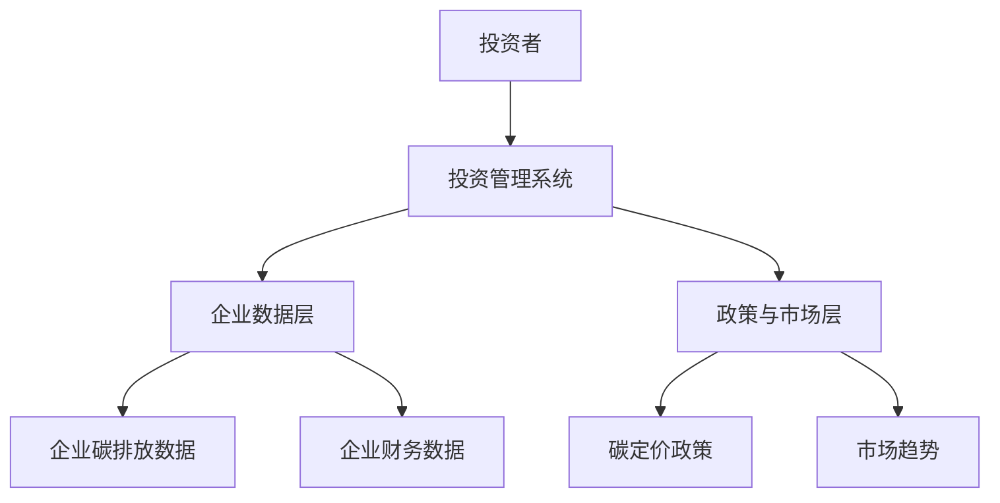
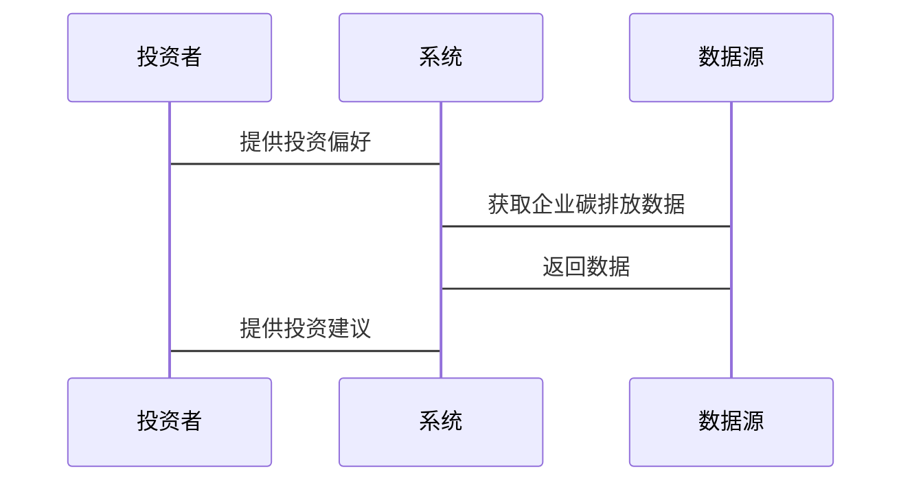

                 


# 巴菲特如何看待气候变化对投资的影响

## 关键词：巴菲特，气候变化，投资，风险管理，可持续发展，碳定价

## 摘要：气候变化作为全球性挑战，对经济和投资产生了深远影响。本文探讨巴菲特如何将气候变化因素纳入投资决策，分析其对投资策略的影响，以及气候变化带来的投资机会。文章结合巴菲特的投资理念，分析企业在应对气候变化中的策略，以及投资者如何评估和管理气候变化风险，为投资决策提供新视角。

---

# 第1章 巴菲特的投资哲学与气候变化背景

## 1.1 引言：气候变化对全球经济的影响

- 气候变化带来的极端天气和环境问题，对企业运营和经济活动构成威胁。
- 投资者需关注气候变化的长期影响，包括政策变化、技术转型和消费者行为变化。
- 气候变化可能引发的金融风险，如资产减值和企业利润下降。

## 1.2 巴菲特的投资理念

- 长期价值投资：巴菲特注重企业长期盈利能力，关注管理层能力和竞争优势。
- 安全边际：通过保守评估和安全边际降低投资风险。
- 风险管理：分散投资，避免过度集中，控制潜在损失。

## 1.3 气候变化与投资的关联

- 气候变化影响企业的运营成本和市场需求。
- 政府政策如碳税和环保法规对企业利润的影响。
- 可再生能源和绿色技术带来的投资机会。

---

# 第2章 气候变化对企业的财务影响

## 2.1 企业财务层面的气候变化影响

### 2.1.1 利润影响

- 企业因极端天气可能导致生产中断，影响收入。
- 环保法规和碳定价增加企业成本。
- 可再生能源和节能技术的投资可能降低长期成本。

### 2.1.2 成本控制

- 能源价格波动影响企业生产成本。
- 碳排放交易机制对企业运营成本的影响。
- 环保技术投资的初期成本与长期收益。

### 2.1.3 风险管理

- 企业需评估气候变化带来的物理风险和转型风险。
- 制定应对策略，如多元化能源来源和优化供应链。

## 2.2 企业战略调整

### 2.2.1 可持续发展的重要性

- 企业需制定长期环保战略，减少碳足迹。
- 通过技术创新和绿色生产提升竞争力。
- 适应政策变化，确保合规性。

## 2.3 企业估值影响

### 2.3.1 碳定价机制

- 碳税和碳交易对企业成本的影响。
- 碳定价可能影响企业未来的现金流。

### 2.3.2 未来现金流评估

- 气候变化影响企业未来的盈利能力和现金流预测。
- 可再生能源和绿色技术的投资可能带来新的收入来源。

### 2.3.3 长期投资价值

- 企业适应气候变化的能力影响其长期投资价值。
- 可持续发展能力强的企业更具投资吸引力。

---

# 第3章 巴菲特对气候变化的投资策略

## 3.1 巴菲特的长期视角

### 3.1.1 长期投资机会

- 可再生能源行业的投资前景。
- 碳捕获技术的未来发展。
- 绿色金融产品的潜在价值。

### 3.1.2 企业风险管理

- 评估企业应对气候变化的能力。
- 关注管理层在环保方面的决策和投入。

## 3.2 投资组合管理

### 3.2.1 筛选标准

- 企业碳排放强度和环保表现。
- 企业应对气候变化的策略和能力。
- 行业的碳转型风险和潜在收益。

### 3.2.2 风险控制

- 分散投资以降低特定风险。
- 定期评估投资组合的气候变化风险敞口。

## 3.3 投资机会分析

### 3.3.1 可再生能源

- 太阳能和风能行业的增长潜力。
- 政策支持和技术创新驱动行业发展。

### 3.3.2 碳捕获技术

- 碳捕获技术在减少碳排放中的作用。
- 技术成熟度和商业化潜力。

### 3.3.3 绿色金融

- 绿色债券和ESG投资产品的兴起。
- 投资者对可持续发展的关注推动绿色金融发展。

---

# 第4章 系统分析与架构设计

## 4.1 气候变化与投资系统架构

### 4.1.1 问题场景介绍

- 投资者需要将气候变化因素纳入决策过程。
- 开发一个系统来评估企业应对气候变化的能力和投资机会。

### 4.1.2 系统功能设计

- 数据收集与处理：收集企业碳排放数据、政策信息和市场趋势。
- 风险评估：评估气候变化对企业财务和投资组合的影响。
- 投资建议：基于分析结果，提供投资建议和策略。

### 4.1.3 系统架构设计



### 4.1.4 系统接口设计

- 数据接口：从公开数据库获取企业碳排放数据。
- 用户界面：投资者输入投资偏好，系统生成投资建议。

### 4.1.5 系统交互流程



---

# 第5章 项目实战：气候变化投资策略实现

## 5.1 环境安装与数据收集

- 使用Python和相关库（如Pandas、Matplotlib）进行数据分析。
- 数据来源：公开企业数据和政府发布的气候变化报告。

## 5.2 核心算法实现

### 5.2.1 碳风险评估模型

```python
import pandas as pd

def carbon_risk_score(enterprise_data):
    # 计算碳排放强度
    emissions = enterprise_data['carbon_emissions']
    revenue = enterprise_data['revenue']
    intensity = emissions / revenue
    # 碳风险评分
    score = (intensity - intensity.min()) / (intensity.max() - intensity.min())
    return score
```

### 5.2.2 可再生能源投资潜力模型

```python
import numpy as np

def renewable_potential(investment, growth_rate):
    return investment * (1 + growth_rate)**10
```

## 5.3 系统实现与分析

- 实现碳风险评估模型，评估企业碳排放风险。
- 使用可再生能源潜力模型预测未来收益。

## 5.4 案例分析

- 分析某可再生能源企业的投资潜力。
- 结合模型结果，提供投资建议。

---

# 第6章 总结与展望

## 6.1 核心观点回顾

- 巴菲特的长期投资理念与气候变化应对相契合。
- 气候变化带来投资机会，也带来新的风险。

## 6.2 未来展望

- 气候变化投资将更加重要，投资者需持续关注相关政策和技术发展。
- 可再生能源和绿色技术的投资将继续增长。

---

# 作者

作者：AI天才研究院/AI Genius Institute & 禅与计算机程序设计艺术 /Zen And The Art of Computer Programming

