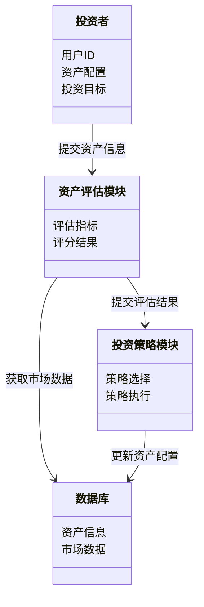

                 


# 巴菲特如何看待通货膨胀与投资

## 关键词：巴菲特，通货膨胀，投资策略，资产配置，风险管理，经济分析，价值投资

## 摘要：本文深入探讨了巴菲特对通货膨胀的理解及其投资策略，分析了通货膨胀对不同类型资产的影响，揭示了巴菲特如何通过价值投资和长期投资来应对通货膨胀的挑战。文章结合数学模型和系统架构设计，提供了实证分析和项目实战，帮助读者掌握巴菲特的投资智慧。

---

## 第一部分：引言

### 第1章：通货膨胀的基本概念

#### 1.1 通货膨胀的定义与类型

通货膨胀是指物价总水平在一段时间内持续上涨，导致货币购买力下降的经济现象。其主要类型包括需求拉动型、成本推动型和货币供应型通货膨胀。

#### 1.2 投资的基本概念

投资是将资金分配到不同资产以实现保值增值的过程，主要包括股票、债券、房地产等多种形式。

---

### 第2章：巴菲特的投资理念

#### 2.1 巴菲特的投资策略

巴菲特强调长期投资和价值投资，注重企业的基本面分析，寻找具有持续竞争优势的企业进行投资。

#### 2.2 巴菲特的选股标准

包括企业财务健康、行业地位和管理团队等因素，确保投资标的具有长期增长潜力。

---

### 第3章：通货膨胀与投资的关系

#### 3.1 通货膨胀对投资的影响

通货膨胀可能导致股票、债券等资产的价格波动，但巴菲特认为长期投资可以抵消其影响。

#### 3.2 巴菲特应对通货膨胀的策略

通过投资实物资产和具备定价权的企业，巴菲特在通货膨胀环境中实现资产保值和增值。

---

## 第二部分：投资组合优化的数学模型

### 第4章：资产定价模型

#### 4.1 CAPM模型

CAPM模型通过公式描述资产的预期回报率，帮助投资者评估资产的定价是否合理。

$$ E(R_i) = R_f + \beta_i (E(R_m) - R_f) $$

#### 4.2 投资组合优化

使用均值-方差优化模型构建最优投资组合，平衡风险与收益。

$$ \text{Minimize } \sigma^2 \text{ subject to } \mathbb{E}[R] = \text{Target Return} $$

#### 4.3 数学模型的实现

通过Python代码实现资产定价和投资组合优化，帮助读者理解模型的应用。

---

## 第三部分：系统架构设计

### 第5章：系统功能设计

#### 5.1 领域模型设计

使用mermaid类图展示投资决策支持系统的功能模块及其交互。



#### 5.2 系统架构设计

使用mermaid架构图展示系统的整体架构，包括前端、后端和数据库模块。

```mermaid
archiecture

    客户端 --> 前端: 用户交互
    前端 --> 后端API: 请求处理
    后端API --> 数据库: 数据操作
    数据库 --> 后端API: 数据返回
```

---

## 第四部分：项目实战

### 第6章：构建抗通胀投资组合

#### 6.1 环境配置

安装必要的Python库，如pandas、numpy和scipy。

```bash
pip install pandas numpy scipy
```

#### 6.2 核心代码实现

实现资产配置优化的Python代码，展示如何构建抗通胀投资组合。

```python
import numpy as np
import pandas as pd

# 假设数据
returns = np.array([[0.1, 0.05, 0.15],
                    [0.08, 0.12, 0.09],
                    [0.12, 0.10, 0.11]])

# 计算协方差矩阵
cov_matrix = np.cov(returns)

# 使用均值-方差优化
from scipy.optimize import minimize

def portfolio_variance(weights, covariance):
    return np.dot(weights.T, np.dot(covariance, weights))

weights = np.array([1/3, 1/3, 1/3])
minimization = minimize(portfolio_variance, weights, args=(cov_matrix,))
optimal_weights = minimization.x

print("最优权重:", optimal_weights)
```

#### 6.3 案例分析

分析实际市场数据，展示如何在通货膨胀环境下优化投资组合。

---

## 第五部分：结论

### 第7章：总结与展望

#### 7.1 小结

总结巴菲特的投资理念和应对通货膨胀的策略，强调长期投资和价值投资的重要性。

#### 7.2 注意事项

提醒投资者在实际操作中注意风险管理和市场波动，避免盲目跟风。

#### 7.3 拓展阅读

建议读者深入学习资产定价模型和投资组合优化，提升投资能力。

---

## 结语

通过本文的分析，读者可以更好地理解巴菲特如何看待通货膨胀与投资，并掌握相关的数学模型和系统设计方法，帮助他们在复杂多变的市场中做出明智的投资决策。

---

## 作者：AI天才研究院

