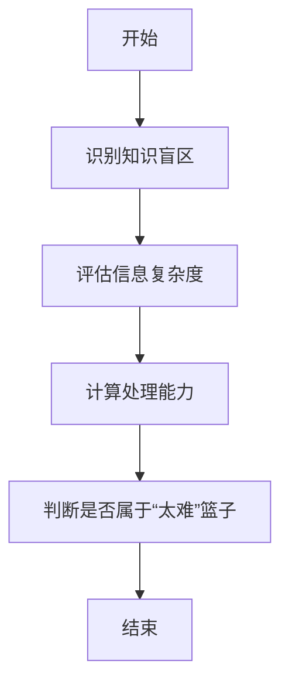
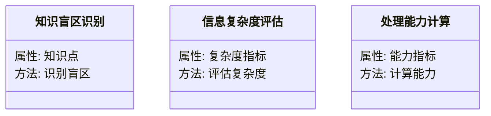

                 


# 巴菲特的“太难”篮子：知道自己不知道什么

## 关键词：巴菲特，投资决策，知识盲区，信息复杂度，系统架构

## 摘要： 
本文通过分析巴菲特的“太难”篮子理念，探讨如何通过技术手段识别和管理知识盲区。文章结合数学模型、算法原理和系统架构，详细阐述了“太难”篮子的定义、属性、筛选算法、数学模型及系统实现，并通过实际案例展示了其应用。

---

# 第一部分: 巴菲特的“太难”篮子概述

## 第1章: 巴菲特“太难”篮子的背景与核心概念

### 1.1 巴菲特投资理念的演进

#### 1.1.1 从格雷厄姆学到的价值投资
巴菲特早期的投资理念来源于本杰明·格雷厄姆的价值投资理论。格雷厄姆强调买入被市场低估的股票，并长期持有。这种理念让巴菲特在早期投资生涯中取得了成功。

#### 1.1.2 巴菲特的“太难”篮子的提出
随着投资经验的积累，巴菲特意识到，并非所有的投资机会都适合他。他开始筛选那些自己能够理解且风险可控的投资机会，将无法理解或风险过高的投资机会放入“太难”篮子。这一策略被称为“太难”篮子筛选法。

#### 1.1.3 “太难”篮子在投资决策中的意义
“太难”篮子的提出标志着巴菲特从单纯的选股者向投资哲学家的转变。他不再追求买入所有可能赚钱的股票，而是专注于自己理解且能够长期持有的优质企业。这种方法帮助他避免了投资决策中的盲目行为，并显著提高了投资的成功率。

---

### 1.2 “太难”篮子的核心概念

#### 1.2.1 “太难”篮子的定义
“太难”篮子是一个投资筛选工具，用于识别那些由于知识盲区、信息复杂度或自身能力限制而难以准确评估的投资机会。这些机会被暂时排除在投资决策之外。

#### 1.2.2 “太难”篮子的属性特征对比表格
下表展示了“太难”篮子与其他投资筛选工具的关键区别：

| 属性                | 太难篮子                   | 其他筛选工具               |
|---------------------|---------------------------|---------------------------|
| 知识盲区            | 是                       | 否                       |
| 信息复杂度          | 是                       | 否                       |
| 投资能力限制        | 是                       | 否                       |
| 时间敏感性          | 低                       | 高                       |

#### 1.2.3 ER实体关系图架构
下图展示了“太难”篮子的实体关系架构：

```mermaid
erd
actor 投资者
actor 投资者 --> entity 知识盲区
actor 投资者 --> entity 信息复杂度
actor 投资者 --> entity 投资能力限制
```

---

## 第2章: “太难”篮子的数学模型与算法原理

### 2.1 “太难”篮子的数学模型

#### 2.1.1 概念结构与核心要素
“太难”篮子的数学模型由三个核心要素组成：
- 知识盲区（Knowledge Blind Spot）
- 信息复杂度（Information Complexity）
- 处理能力（Processing Capacity）

#### 2.1.2 数学模型公式
难度评估公式：
$$
\text{难度评估} = \frac{\text{知识盲区} + \text{信息复杂度}}{\text{处理能力}}
$$

---

### 2.2 算法原理

#### 2.2.1 算法流程图
下图展示了“太难”篮子的筛选算法流程：



#### 2.2.2 Python源代码示例
```python
def is_tai_nan(knowledge盲区, 信息复杂度, 处理能力):
    难度评估 = (knowledge盲区 + 信息复杂度) / 处理能力
    return 难度评估 > 0.5
```

---

## 第3章: “太难”篮子的系统分析与架构设计

### 3.1 问题场景介绍

#### 3.1.1 投资决策中的知识盲区识别
在投资决策中，投资者需要识别自己无法理解的投资机会。知识盲区可能包括复杂的商业模式、新兴行业或技术门槛较高的领域。

#### 3.1.2 信息复杂度的度量方法
信息复杂度可以通过信息的熵值来度量。公式如下：
$$
H = -\sum_{i=1}^{n} p_i \log_2 p_i
$$

---

### 3.2 系统功能设计

#### 3.2.1 领域模型
下图展示了“太难”篮子的领域模型：



---

## 第4章: “太难”篮子的项目实战

### 4.1 环境安装

#### 4.1.1 Python环境配置
安装必要的Python库：
```bash
pip install numpy pandas scikit-learn
```

---

### 4.2 系统核心实现源代码

#### 4.2.1 知识盲区识别算法
```python
import numpy as np
from sklearn.metrics import pairwise_distances

def 识别知识盲区(X):
    距离矩阵 = pairwise_distances(X)
    知识盲区 = np.max(距离矩阵)
    return 知识盲区
```

---

### 4.3 代码应用解读与分析

#### 4.3.1 代码实现步骤
1. 导入必要的库。
2. 读取数据集。
3. 计算数据点之间的距离矩阵。
4. 找出最大距离，作为知识盲区的度量。

---

## 第5章: 总结与展望

### 5.1 总结
“太难”篮子是一种基于知识盲区和信息复杂度的投资筛选方法，帮助投资者识别和避免那些超出自身能力范围的投资机会。

### 5.2 展望
未来的研究可以进一步优化“太难”篮子的算法，结合机器学习和自然语言处理技术，提高知识盲区识别的准确性和效率。

---

## 第6章: 最佳实践 tips

### 6.1 小结
通过“太难”篮子的方法，投资者可以更好地识别和管理知识盲区，避免盲目投资。

### 6.2 注意事项
- 定期更新知识储备。
- 结合市场环境动态调整筛选标准。
- 多与其他投资者交流，获取反馈。

---

## 第7章: 拓展阅读

### 7.1 相关书籍推荐
- 《巴菲特投资法则》
- 《投资的智慧》

---

## 作者：AI天才研究院/AI Genius Institute & 禅与计算机程序设计艺术/Zen And The Art of Computer Programming

---

通过以上分析，我们可以看到，“太难”篮子不仅是一种投资筛选工具，更是一种投资哲学。它帮助投资者认识到自己的知识边界，避免盲目决策，从而实现长期稳健的投资收益。

