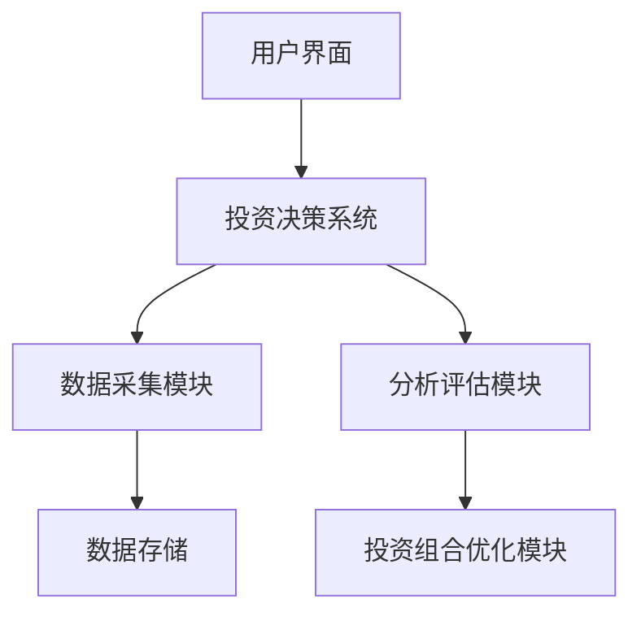

                 


# 巴菲特的20格打孔卡投资法则

## 关键词：
- 巴菲特投资法则
- 20格打孔卡
- 价值投资
- 投资决策
- 投资系统

## 摘要：
本文深入分析巴菲特的20格打孔卡投资法则，从其哲学基础、数学模型到实际应用，详细阐述其核心原则和系统设计，结合实际案例和代码实现，展示如何在投资决策中应用这一法则。

---

## 第1章: 巴菲特投资哲学的背景与核心理念

### 1.1 巴菲特的生平与投资成就

#### 1.1.1 巴菲特的成长经历
沃伦·巴菲特（Warren Buffett）出生于1930年，从小就展现出对投资和商业的浓厚兴趣。他在十几岁时就开始投资，通过阅读和实践积累了丰富的投资经验。巴菲特的投资哲学深受其导师本杰明·格雷厄姆（Benjamin Graham）的影响，格雷厄姆的价值投资理论成为巴菲特的基石。

#### 1.1.2 巴菲特的投资风格与理念
巴菲特以价值投资闻名，强调寻找被市场低估的企业，长期持有，避免频繁交易。他认为投资的本质是寻找具有持续竞争优势的企业，并在合理估值下买入并长期持有。

#### 1.1.3 巴菲特投资哲学的核心思想
巴菲特的投资哲学可以总结为“以合理的价格买入优秀的公司”。他强调企业基本面分析、安全边际、长期投资和分散风险。

---

### 1.2 巴菲特投资哲学的演变

#### 1.2.1 早期投资理念的形成
在早期的投资生涯中，巴菲特学习了格雷厄姆的价值投资理论，注重企业内在价值的计算，寻找市场价格低于内在价值的企业进行投资。

#### 1.2.2 价值投资的深化
随着经验的积累，巴菲特逐渐形成了自己的投资风格，不仅关注企业的财务指标，还关注企业的竞争优势、管理层能力和行业地位。

#### 1.2.3 巴菲特投资哲学的现代发展
在现代投资环境中，巴菲特的投资哲学进一步发展，结合了长期投资、分散风险和注重企业质量的原则。

---

## 第2章: 20格打孔卡投资法则的起源与意义

### 2.1 打孔卡投资法的定义与特点

#### 2.1.1 打孔卡投资法的定义
打孔卡投资法是巴菲特提出的投资筛选方法，通过预先设定的十二条投资原则，将每个原则视为一个“孔”，只有当企业的各个方面都满足所有原则时，才能通过“打孔卡”，成为投资标的。

#### 2.1.2 打孔卡投资法的核心特点
- **系统性**：通过多维度的原则筛选，确保投资标的的质量。
- **纪律性**：严格按照原则进行筛选，避免主观判断。
- **长期性**：注重企业的长期竞争优势和价值。

#### 2.1.3 打孔卡投资法与传统投资方法的区别
打孔卡投资法强调系统性和纪律性，避免了传统投资方法中主观判断和情绪化决策的问题。

---

### 2.2 打孔卡投资法的背景与应用

#### 2.2.1 巴菲特打孔卡投资法的起源
打孔卡投资法起源于巴菲特对价值投资原则的深入思考和实践，通过总结长期投资经验，形成了这套系统化的投资筛选方法。

#### 2.2.2 打孔卡投资法在投资决策中的地位
打孔卡投资法是巴菲特投资决策的核心工具之一，用于筛选具有长期竞争优势和安全边际的企业。

#### 2.2.3 打孔卡投资法的实际应用案例
通过具体案例分析，展示如何运用打孔卡投资法筛选出优质企业。

---

## 第3章: 巴菲特打孔卡投资法则的核心要素

### 3.1 打孔卡投资法则的十二条原则

#### 3.1.1 企业基本面分析的重要性
企业基本面分析是打孔卡投资法的核心，包括财务状况、盈利能力、成长能力和行业地位等方面。

#### 3.1.2 财务报表分析的关键指标
关键指标包括净利润率、ROE、债务水平、现金流等。

#### 3.1.3 企业竞争优势的评估
竞争优势包括成本优势、品牌优势、技术优势等。

#### 3.1.4 市场周期与投资时机的选择
考虑市场周期和投资时机，避免在市场高估时投资。

#### 3.1.5 投资组合的构建与优化
通过分散投资降低风险，优化投资组合。

#### 3.1.6 风险控制与安全边际的概念
安全边际是指买入价格低于企业内在价值的部分，用于控制风险。

#### 3.1.7 长期投资与复利效应的重要性
长期投资通过复利效应实现财富的长期增长。

#### 3.1.8 投资心态与决策纪律的培养
保持理性和纪律，避免情绪化决策。

#### 3.1.9 投资目标与长期愿景的设定
明确投资目标和长期愿景，制定合理的投资计划。

#### 3.1.10 投资工具与方法的选择
选择合适的投资工具和方法，优化投资流程。

#### 3.1.11 投资决策的逻辑与框架
通过系统的逻辑框架，确保投资决策的科学性和严谨性。

#### 3.1.12 投资过程中的持续学习与反思
通过不断学习和反思，提升投资能力和决策水平。

---

### 3.2 打孔卡投资法则的内在联系

#### 3.2.1 投资决策的系统性分析
打孔卡投资法通过多维度的原则筛选，确保投资决策的系统性和全面性。

#### 3.2.2 打孔卡投资法则的逻辑框架
通过逻辑框架图展示各原则之间的联系和相互作用。

#### 3.2.3 各项原则之间的相互作用与影响
各项原则共同作用，确保投资标的的高质量和长期稳定性。

---

## 第4章: 打孔卡投资法则的数学模型与算法原理

### 4.1 投资决策的数学模型

#### 4.1.1 价值评估模型
价值评估模型通过对企业未来现金流的折现，计算企业的内在价值。

$$ 内在价值 = \sum_{t=1}^{n} \frac{CF_t}{(1 + r)^t} $$

#### 4.1.2 风险评估模型
通过计算波动率和贝塔系数，评估企业的风险水平。

$$ \beta = \frac{\text{协方差}(r_i, r_m)}{\text{方差}(r_m)} $$

#### 4.1.3 投资组合优化模型
通过马科维茨的有效前沿理论，优化投资组合的风险和收益。

---

### 4.2 打孔卡投资法则的算法实现

#### 4.2.1 基于打孔卡原则的企业筛选算法
通过逐一检查企业的各项指标，判断是否满足所有原则。

#### 4.2.2 投资组合优化算法
通过遗传算法或模拟退火算法，优化投资组合的配置。

#### 4.2.3 风险控制算法
通过动态调整投资组合，控制整体风险。

---

## 第5章: 打孔卡投资法则的系统架构与设计

### 5.1 投资决策系统的整体架构

#### 5.1.1 系统功能模块划分
- 数据采集模块：收集企业财务数据、市场数据等。
- 分析评估模块：对企业进行多维度分析和评估。
- 决策支持模块：提供投资决策建议和优化方案。

#### 5.1.2 系统数据流设计
通过数据流图展示系统的数据流动和处理流程。

---

### 5.2 系统架构设计

#### 5.2.1 系统架构图
通过mermaid图展示系统的整体架构，包括前端、后端和数据库模块。



---

## 第6章: 项目实战

### 6.1 环境搭建

#### 6.1.1 系统环境
- 操作系统：Linux
- 开发工具：Python、Jupyter Notebook
- 数据库：MySQL

### 6.2 核心实现源代码

#### 6.2.1 数据采集模块
```python
import pandas as pd
import requests

def fetch_data(ticker):
    url = f"https://api.example.com/stock/{ticker}"
    response = requests.get(url)
    data = response.json()
    df = pd.DataFrame(data)
    return df
```

#### 6.2.2 分析评估模块
```python
def evaluate_stock(df):
    # 计算各项指标
    # ...
    return score
```

#### 6.2.3 投资组合优化模块
```python
def optimize_portfolio(scores):
    # 使用遗传算法优化
    # ...
    return optimized_portfolio
```

### 6.3 案例分析

#### 6.3.1 案例分析
通过具体案例分析，展示如何应用打孔卡投资法筛选出优质企业。

#### 6.3.2 代码解读
详细解读代码实现，分析每个模块的功能和作用。

---

## 第7章: 总结与展望

### 7.1 总结
总结打孔卡投资法则的核心内容和实际应用效果。

### 7.2 注意事项
提醒读者在实际投资中需注意的风险和事项。

### 7.3 未来展望
展望打孔卡投资法则在未来的进一步发展和应用。

---

## 作者：AI天才研究院 & 禅与计算机程序设计艺术

---

通过本文的详细分析，读者可以深入了解巴菲特的20格打孔卡投资法则，从理论到实践，全面掌握其核心思想和实际应用。希望本文能为投资者提供有价值的参考和指导。

