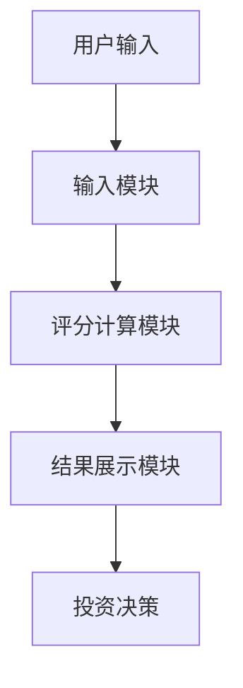

                 


```markdown
# 巴菲特的20格打孔卡：集中投资的智慧

> 关键词：巴菲特，投资，价值投资，打孔卡，决策系统，评分模型

> 摘要：本文深入探讨了巴菲特的20格打孔卡这一投资工具，从其背景、核心概念到算法原理、系统架构，再到项目实战和最佳实践，全面解析了其在投资决策中的应用。通过详细的技术分析和实例解读，揭示了这一工具如何帮助投资者实现集中投资的智慧。

---

## 第一部分：背景介绍

### 第1章：巴菲特的投资理念与打孔卡的背景

#### 1.1 投资的基本原则

- **投资的定义与核心目标**
  - 投资是指将资金投入到能够产生价值的资产中，核心目标是实现财富的保值与增值。
  - 投资不仅仅是买入资产，更是对资产未来价值的判断与管理。

- **巴菲特的价值投资理念**
  - 巴菲特的价值投资理念强调长期持有优质资产，寻找具有持续竞争优势的企业。
  - 他主张以合理的价格买入优秀的公司，而不是以便宜的价格买入平庸的公司。

- **巴菲特投资哲学的演变**
  - 从早期的烟蒂投资策略到后来的护城河投资理念，巴菲特的投资哲学不断完善。
  - 他始终强调安全边际的重要性，即买入价格远低于内在价值。

#### 1.2 20格打孔卡的起源与应用

- **打孔卡的发明背景**
  - 20格打孔卡是由巴菲特创造的一种投资决策工具，用于筛选和评估投资标的。
  - 它通过20个关键维度对目标公司进行评分，最终决定是否投资。

- **打孔卡在巴菲特投资决策中的作用**
  - 打孔卡帮助巴菲特系统化地评估公司的竞争优势、财务状况和管理团队。
  - 通过打孔卡的评分系统，巴菲特能够快速筛选出具备长期投资价值的公司。

- **打孔卡与其他投资工具的对比**
  - 与传统的财务分析不同，打孔卡更注重公司基本面的全面评估。
  - 与现代的投资模型相比，打孔卡更加简洁实用，适合长期价值投资。

---

## 第二部分：核心概念与原理

### 第2章：20格打孔卡的核心概念

#### 2.1 打孔卡的基本结构

- **20个格子的定义与分布**
  - 每个格子代表一个评估维度，如盈利能力、管理团队、财务状况等。
  - 格子的分布基于投资决策的关键因素，具有一定的逻辑关联性。

- **每个格子的属性与作用**
  - 每个格子都有明确的评分标准和权重，用于衡量公司在该维度的表现。
  - 格子之间的关系体现了投资决策的多维度考量。

- **格子之间的关系与整体结构**
  - 格子之间的关系通过评分系统的加权计算实现，最终形成一个综合评分。
  - 整体结构体现了巴菲特对长期价值投资的系统化思考。

#### 2.2 核心概念的数学模型

- **投资评分的线性加权模型**
  - 总分公式：$$ 总分 = \sum_{i=1}^{20} (权重_i \times 评分_i) $$
  - 权重_i 表示第i个格子的权重，评分_i 表示第i个格子的评分。

- **格子评分的加成模型**
  - 单个格子评分公式：$$ 评分_i = \sum_{j=1}^{n} (特征_j \times 权重_j) $$
  - 特征_j 表示第j个评估特征，权重_j 表示该特征的评分权重。

- **总分计算的公式推导**
  - 总分是各格子评分的加权和，权重之和为1。
  - 总分越高，代表公司综合表现越好，投资价值越高。

---

### 第3章：打孔卡的评分系统与算法

#### 3.1 格子评分的计算方法

- **单个格子评分的规则**
  - 每个格子的评分范围为1-10分，1分为最低，10分为最高。
  - 评分基于公司的财务数据、行业地位和管理团队等多方面因素。

- **多个格子评分的综合方法**
  - 通过加权计算，将各个格子的评分综合为一个总分。
  - 加权计算公式：$$ 总分 = \sum_{i=1}^{20} (权重_i \times 评分_i) $$

- **评分的动态调整机制**
  - 根据市场变化和公司发展，定期更新各个格子的评分。
  - 动态调整公式：$$ 新评分_i = 原评分_i \times 调整系数 $$

#### 3.2 打孔卡的决策逻辑

- **评分的权重分配**
  - 根据投资目标的不同，权重可以进行调整。
  - 权重分配原则：$$ \sum_{i=1}^{20} 权重_i = 1 $$

- **总分的阈值设定**
  - 总分阈值通常设为7分，表示投资价值较高。
  - 阈值设定：$$ 总分 \geq 7 \Rightarrow 投资 $$

- **决策的最终判断标准**
  - 总分高于阈值时，进入深入分析阶段；低于阈值时，放弃投资。

---

## 第三部分：系统架构与实现

### 第4章：打孔卡的系统架构

#### 4.1 系统功能设计

- **用户界面设计**
  - 提供友好的用户界面，方便用户输入公司数据和查看评分结果。
  - 包括输入模块、评分模块和结果展示模块。

- **评分计算模块**
  - 负责对各个格子进行评分计算，并输出总分。
  - 计算过程基于预设的权重和评分规则。

- **决策结果展示**
  - 展示总分及各个格子的评分，提供可视化结果。
  - 提供投资建议，如“投资”或“观望”。

#### 4.2 系统架构图



---

### 第5章：打孔卡的实际应用

#### 5.1 实际投资案例

- **案例一：巴菲特的经典投资**
  - 以可口可乐为例，分析其在打孔卡评分中的表现。
  - 通过打孔卡评分，巴菲果断定可口可乐具备长期投资价值。

- **案例二：普通投资者的应用**
  - 普通投资者如何使用打孔卡筛选投资标的。
  - 通过实际案例展示打孔卡在个人投资中的应用。

- **案例三：打孔卡在风险控制中的应用**
  - 分析打孔卡如何帮助投资者识别和规避投资风险。
  - 通过评分系统，投资者可以及时发现潜在风险。

#### 5.2 案例分析的数学模型

- **案例的评分计算过程**
  - 以某公司为例，详细计算各个格子的评分及总分。
  - 展示评分计算的详细步骤。

- **模型的验证与优化**
  - 对模型进行验证，确保评分结果的准确性。
  - 根据实际结果，优化评分权重和评分标准。

---

## 第四部分：最佳实践与注意事项

### 第6章：最佳实践与注意事项

#### 6.1 最佳实践指南

- **打孔卡使用的注意事项**
  - 定期更新评分标准和权重，适应市场变化。
  - 结合其他投资工具，全面评估投资标的。

- **如何优化评分系统**
  - 根据投资目标和市场环境，调整评分权重。
  - 引入新的评估维度，提升评分系统的全面性。

- **避免常见错误的方法**
  - 避免过度依赖评分系统，保持主观判断。
  - 避免忽视市场环境变化，及时调整投资策略。

#### 6.2 小结与展望

- **本书的总结**
  - 通过系统的分析和实例展示，揭示了打孔卡在投资决策中的重要作用。
  - 总结了打孔卡的核心概念、算法原理和实际应用。

- **未来研究的方向**
  - 探索打孔卡与其他投资工具的结合。
  - 研究打孔卡在不同市场环境下的表现。

- **对读者的展望**
  - 希望读者能够将打孔卡的理念应用到实际投资中，实现长期稳定的收益。
  - 希望通过本文，读者能够更好地理解巴菲特的价值投资理念。

---

## 作者信息

作者：AI天才研究院/AI Genius Institute & 禅与计算机程序设计艺术 /Zen And The Art of Computer Programming

---

本文通过系统化的分析和详细的实例解读，全面揭示了巴菲特20格打孔卡的投资智慧。从背景介绍到系统实现，从实际应用到最佳实践，为读者提供了一套完整的投资决策工具。希望本文能够帮助读者更好地理解和应用打孔卡，实现集中投资的智慧。
```

