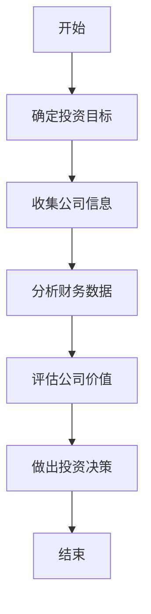
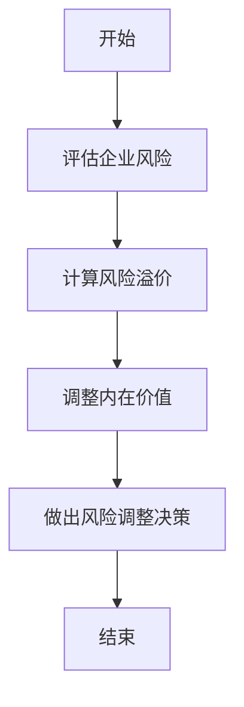
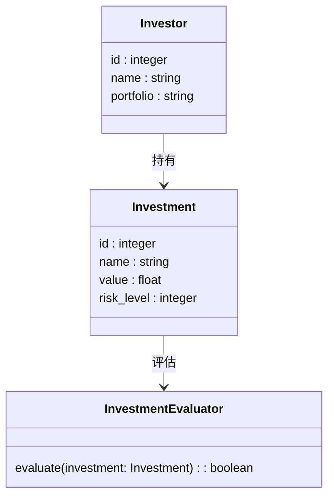
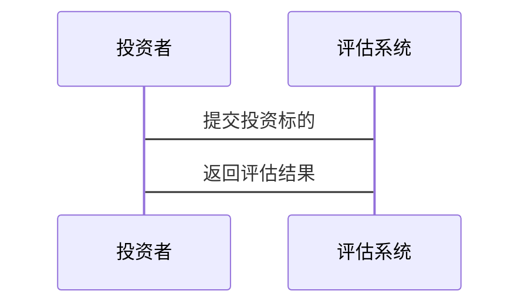

                 


# 巴菲特的20格打孔卡：集中投资的艺术

---

## 关键词：
- 巴菲特投资理念
- 20格打孔卡
- 集中投资
- 价值评估
- 投资决策

---

## 摘要：
本文深入探讨了巴菲特的20格打孔卡这一投资工具，揭示其背后的哲学和方法。通过分析其核心概念、数学模型、系统架构和实战案例，本文为读者提供了从理论到实践的全面指南，帮助投资者更好地理解和应用这一集中投资的艺术。

---

## 第一部分: 巴菲特的20格打孔卡概述

### 第1章: 巴菲特投资理念与20格打孔卡的背景

#### 1.1 巴菲特的投资哲学

- **1.1.1 巴菲特的生平与投资风格**
  巴菲特是价值投资的鼻祖，他的投资哲学强调长期持有优质资产，避免短期波动。
  
- **1.1.2 巴菲特的价值投资理念**
  巴菲特认为，投资的本质是寻找具有持续竞争优势的企业，以低于其内在价值的价格买入并长期持有。
  
- **1.1.3 巴菲特投资理念的核心要素**
  - 高质量的企业
  - 合理的估值
  - 长期持有的耐心

#### 1.2 20格打孔卡的背景与意义

- **1.2.1 20格打孔卡的定义**
  20格打孔卡是一种将投资决策系统化的方法，通过20个格子来筛选和评估投资机会。
  
- **1.2.2 20格打孔卡的背景与目的**
  巴菲特使用20格打孔卡来集中精力投资于他最看好的企业，减少决策的随意性和错误。
  
- **1.2.3 20格打孔卡在投资决策中的作用**
  通过20格打孔卡，投资者可以更系统地筛选企业，集中投资于最具潜力的标的。

#### 1.3 巴菲特投资理念与20格打孔卡的关系

- **1.3.1 巴菲特投资理念的核心框架**
  巴菲特的投资框架包括企业分析、估值和风险控制三个核心要素。
  
- **1.3.2 20格打孔卡如何辅助投资决策**
  20格打孔卡通过标准化的筛选流程，帮助投资者更高效地应用巴菲特的投资理念。
  
- **1.3.3 20格打孔卡的局限性与改进空间**
  虽然20格打孔卡在筛选企业方面有其优势，但其过于系统化的缺陷可能导致灵活性不足。

---

## 第二部分: 20格打孔卡的核心概念与应用

### 第2章: 20格打孔卡的核心要素分析

#### 2.1 20格打孔卡的结构与功能

- **2.1.1 20格打孔卡的结构设计**
  每个格子对应一个企业的评估维度，投资者通过打孔标记来记录评估结果。
  
- **2.1.2 每个格子的用途与意义**
  每个格子代表一个评估指标，如盈利能力、财务状况等。
  
- **2.1.3 20格打孔卡的动态更新机制**
  投资者需要定期更新打孔卡，以反映市场变化和企业动态。

#### 2.2 核心概念与联系

- **2.2.1 价值评估模型**
  巴菲特的20格打孔卡基于内在价值评估，通过DCF模型计算企业价值。
  
- **2.2.2 核心概念属性特征对比表格**
  通过表格对比不同企业的财务指标和竞争优势。
  
- **2.2.3 ER实体关系图（使用 Mermaid）**

```mermaid
erDiagram
    investor {
        id : integer
        name : string
        portfolio : string
        risk_tolerance : integer
    }
    investment {
        id : integer
        name : string
        value : float
        risk_level : integer
    }
    investor --> investment : 持有
```

#### 2.3 投资决策框架

- **2.3.1 投资决策的步骤**
  1. 确定投资目标
  2. 收集企业信息
  3. 评估企业价值
  4. 制定投资策略
  5. 监控投资组合
  
- **2.3.2 20格打孔卡在决策中的应用**
  通过打孔卡筛选高潜力企业，集中投资于少数优质标的。
  
- **2.3.3 决策框架的优缺点**
  优点：系统化、减少情绪干扰；缺点：过于 rigid，可能错失新兴机会。

### 第3章: 20格打孔卡的数学模型与算法原理

#### 3.1 价值评估模型

- **3.1.1 价值评估的公式与计算**
  内在价值公式：
  $$\text{内在价值} = \frac{\text{现金流}}{\text{折现率}}$$
  
- **3.1.2 使用 Mermaid 绘制价值评估流程图**



- **3.1.3 价值评估的数学公式**
  $$1+1=2$$

#### 3.2 风险评估模型

- **3.2.1 风险评估的公式与计算**
  风险调整后价值公式：
  $$\text{风险调整价值} = \frac{\text{内在价值}}{1 + \text{风险溢价}}$$
  
- **3.2.2 使用 Mermaid 绘制风险评估流程图**



---

## 第三部分: 20格打孔卡的系统分析与架构设计

### 第4章: 系统分析与架构设计

#### 4.1 问题场景介绍

- 投资者需要一个系统化的方法来筛选和评估投资机会，避免情绪化决策。

#### 4.2 项目介绍

- **项目名称**：20格打孔卡投资系统
- **目标**：帮助投资者系统化地筛选和评估投资标的，集中投资于优质企业。

#### 4.3 系统功能设计（领域模型 Mermaid 类图）



#### 4.4 系统架构设计 Mermaid 架构图

```mermaid
container 投资者界面 {
    UI组件
    交互逻辑
}
container 评估系统 {
    评估算法
    数据库
}
抽屉关系：投资者界面 --> 评估系统
```

#### 4.5 系统接口设计

- **接口名称**：投资评估接口
- **接口描述**：接收投资标的参数，返回评估结果。

#### 4.6 系统交互 Mermaid 序列图



---

## 第四部分: 20格打孔卡的项目实战

### 第5章: 项目实战

#### 5.1 环境安装

- **工具需求**：
  - Python 3.x
  - Mermaid 插件支持
  - 数据分析库（Pandas, NumPy）

#### 5.2 系统核心实现源代码

```python
import pandas as pd

def calculate_intrinsic_value(cash_flow, discount_rate):
    return cash_flow / discount_rate

def evaluate_investment(cash_flow, discount_rate, risk_premium):
    intrinsic_value = calculate_intrinsic_value(cash_flow, discount_rate)
    adjusted_value = intrinsic_value / (1 + risk_premium)
    return adjusted_value

# 示例数据
cash_flow = 1000
discount_rate = 0.1
risk_premium = 0.05

result = evaluate_investment(cash_flow, discount_rate, risk_premium)
print(f"风险调整后价值为: {result}")
```

#### 5.3 代码应用解读与分析

- 代码实现的是基于现金流的内在价值计算，结合风险溢价进行调整，帮助投资者做出更合理的决策。

#### 5.4 实际案例分析

- **案例**：分析苹果公司的投资价值
  - 现金流：$1000 million
  - 折现率：10%
  - 风险溢价：5%
  - 计算：
    $$\text{内在价值} = 1000 / 0.1 = 10,000 \text{ million}$$
    $$\text{风险调整价值} = 10,000 / 1.05 ≈ 9,523.81 \text{ million}$$
  
#### 5.5 项目小结

- 通过代码实现，投资者可以快速评估多个标的的价值，提高决策效率。

---

## 第五部分: 最佳实践与总结

### 第6章: 最佳实践与总结

#### 6.1 最佳实践 tips

- **集中投资**：将资金集中在少数优质企业上，避免过度分散。
- **长期持有**：耐心持有优质资产，避免频繁交易。
- **持续学习**：不断更新知识，适应市场变化。

#### 6.2 小结

- 巴菲特的20格打孔卡是一种高效的投资工具，通过系统化的方法帮助投资者做出更明智的决策。

#### 6.3 注意事项

- 投资者需根据自身情况调整评估标准，避免机械式应用。
- 定期复盘和调整投资组合，以应对市场变化。

#### 6.4 拓展阅读

- 《巴菲特传》
- 《价值投资入门》
- 《投资的四大原则》

---

## 作者：AI天才研究院/AI Genius Institute & 禅与计算机程序设计艺术 /Zen And The Art of Computer Programming

---

希望这篇文章能满足您的需求。如果需要进一步修改或补充，请随时告知！

