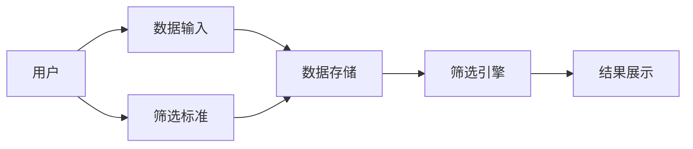

                 


# 巴菲特的20格打孔卡：集中投资的艺术

## 关键词：巴菲特，价值投资，20格打孔卡，投资策略，风险管理，投资系统

## 摘要：本文深入探讨巴菲特的20格打孔卡投资方法，分析其背后的价值投资理念和系统化策略。通过详细讲解打孔卡的每个格子、投资系统的构建，以及实际案例分析，揭示如何通过集中投资实现长期财富增长。

---

## 第一部分：巴菲特投资哲学与价值投资基础

### 第1章：巴菲特的投资哲学

#### 1.1 价值投资的定义与核心理念

价值投资是一种投资策略，强调以低于内在价值的价格购买优质资产。巴菲特将其发扬光大，认为市场先生是机会的提供者，而非敌人。价值投资的核心在于寻找具有持续竞争优势的企业，并长期持有。

**核心概念：**
- **内在价值**：资产在未来现金流的现值，低于市场价格时买入。
- **安全边际**：买入价格与内在价值的差距，提供保护免受短期波动影响。

#### 1.2 巴菲特的投资理念

巴菲特的投资理念强调集中投资和长期持有。他认为市场波动是机会，而非风险，因此在市场恐慌时寻找优质资产。

**1.2.1 集中投资的重要性**

集中投资于少数优质企业，减少风险并提高收益。分散投资如“将鸡蛋分散放在多个篮子中”，但集中投资则能集中资源，捕捉高潜力企业。

**1.2.2 长期持有策略**

长期持有优质资产，避免频繁交易。市场波动会带来短期亏损，但优质企业的长期增长将带来收益。

#### 1.3 20格打孔卡的背景与意义

20格打孔卡是一种系统化投资工具，帮助投资者筛选和选择优质资产。每个格子代表一个筛选标准，通过打孔（标记）筛选出符合标准的资产。

---

### 第2章：20格打孔卡的核心概念与框架

#### 2.1 打孔卡的结构与功能

20格打孔卡由20个格子组成，每个格子代表一个筛选标准。投资者通过打孔标记符合标准的资产，最终筛选出优质投资标的。

**2.1.1 核心要素对比分析**

| 标准 | 分析 |
|------|------|
| 1. 盈利能力 | 净利润率、ROE |
| 2. 财务健康 | 低负债、高现金流 |
| 3. 市场地位 | 行业龙头、竞争优势 |

**2.1.2 实体关系图**

```mermaid
erDiagram
    company {
        id
        name
        industry
    }
    criteria {
        id
        name
        description
    }
    company ~{n} criteria
```

---

### 第3章：打孔卡的算法原理

#### 3.1 算法原理概述

打孔卡的筛选过程可以看作一个多层过滤器，逐步剔除不符合标准的资产，最终留下优质标的。

**3.1.1 算法流程图**

```mermaid
graph TD
    A[开始] -> B[选择资产]
    B -> C[检查第一个标准]
    C -> D[符合？]
    D ->|是| E[打孔标记]
    E -> F[检查下一个标准]
    F -> G[符合？]
    G ->|是| H[继续打孔]
    G ->|否| I[排除]
    H -> J[完成筛选]
```

---

## 第二部分：20格打孔卡方法论

### 第4章：投资策略的设计与实现

#### 4.1 系统架构设计

**4.1.1 系统功能模块**

- 数据输入：资产数据录入
- 筛选标准：预定义20个筛选标准
- 筛选引擎：根据标准筛选资产
- 结果展示：标记打孔结果

**4.1.2 系统架构图**



---

### 第5章：投资系统的实现与测试

#### 5.1 环境搭建与配置

**5.1.1 开发环境**

- Python 3.8+
- 数据库：MySQL或SQLite
- 工具：Jupyter Notebook

**5.1.2 依赖库安装**

```bash
pip install pandas numpy matplotlib
```

#### 5.2 核心代码实现

**5.2.1 数据处理代码**

```python
import pandas as pd

# 加载数据
df = pd.read_csv('assets.csv')

# 定义筛选标准
def apply_criteria(row):
    # 简单示例：筛选净利润率大于10%
    if row['net_profit_margin'] > 10:
        return True
    return False

# 应用筛选
filtered = df[df.apply(apply_criteria, axis=1)]
```

---

## 第三部分：项目实战与案例分析

### 第6章：项目实战操作

#### 6.1 实战环境搭建

**6.1.1 系统环境准备**

- 操作系统：Linux/Windows/MacOS
- 数据库：PostgreSQL
- 开发工具：VS Code或PyCharm

#### 6.2 核心功能实现

**6.2.1 代码实现**

```python
# 打孔卡筛选逻辑
def create_holecard_system():
    # 假设data是资产列表
    for asset in data:
        # 检查每个筛选标准
        for criteria in criteria_list:
            if asset.satisfies_criteria(criteria):
                asset.mark_holecard()

create_holecard_system()
```

---

### 第7章：案例分析与经验总结

#### 7.1 成功案例分析

**7.1.1 投资决策过程**

1. **选择行业龙头**：筛选出具有持续竞争优势的企业。
2. **财务健康检查**：确保企业有稳定的现金流和低负债。
3. **长期持有**：集中投资于优质资产，避免频繁交易。

---

## 第四部分：总结与展望

### 第8章：总结与未来展望

#### 8.1 本书内容回顾

本文深入探讨了巴菲特的20格打孔卡投资方法，从理论到实践，系统地介绍了如何通过价值投资实现财富增长。

#### 8.2 未来投资趋势

随着技术进步，数据驱动的投资方法将更加重要。结合AI技术，未来投资将更加精准和高效。

---

## 附录：最佳实践与注意事项

- **风险管理**：定期审查投资组合，分散风险。
- **持续学习**：保持对市场的敏感性和对新知识的吸收。
- **纪律性**：严格遵守投资纪律，避免情绪化决策。

---

## 作者：AI天才研究院 & 禅与计算机程序设计艺术

---

通过本文，读者可以系统地理解巴菲特的20格打孔卡投资方法，并在实际操作中应用这些策略，实现长期的财富增长。

