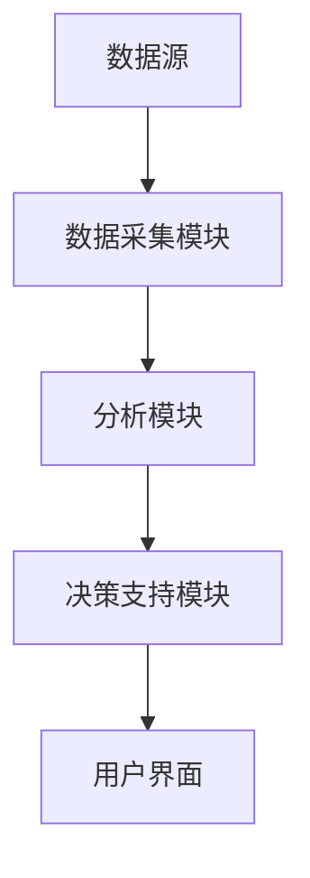

                 


# 巴菲特的产业链分析2.0：全球化背景下的供应链重构

> **关键词**：巴菲特、产业链分析、供应链重构、全球化、投资策略、系统架构、多因子模型、供应链管理、价值投资

> **摘要**：本文将深入探讨巴菲特产业链分析的最新发展，结合全球化背景下的供应链重构，分析其对投资策略的影响。通过系统化的分析框架、数学模型和实际案例，揭示产业链分析的核心概念与应用方法，为企业投资者提供全新的视角和策略。

---

## 第一部分: 巴菲特的产业链分析2.0概述

### 第1章: 巴菲特投资哲学的演变

#### 1.1 从价值投资到产业链分析的转变
巴菲特早期的投资策略以“价值投资”为核心，注重对企业内在价值的评估。然而，随着全球化进程的加速和供应链的复杂化，单纯的价值评估已不足以应对市场的动态变化。产业链分析逐渐成为巴菲特投资决策的重要工具。

#### 1.2 巴菲特产业链分析的核心思想
产业链分析的核心思想是通过对企业在全球产业链中的位置、上下游关系以及行业周期的分析，识别企业的核心竞争力和潜在风险。巴菲特认为，只有深入理解产业链的结构，才能做出明智的投资决策。

#### 1.3 产业链分析在投资决策中的地位
产业链分析不仅是对企业的微观分析，更是对宏观经济和行业趋势的宏观把握。通过产业链分析，投资者可以更好地识别行业周期、竞争优势和潜在风险。

---

### 第2章: 全球化背景下的供应链重构

#### 2.1 全球化对供应链的影响
全球化使得供应链跨越国界，企业需要在全球范围内优化资源配置。然而，全球化也带来了供应链的脆弱性，尤其是在地缘政治和经济波动的影响下，供应链的稳定性成为企业的重要考量。

#### 2.2 新兴技术和产业变革对供应链的挑战
技术的进步（如人工智能、大数据）和产业变革（如智能制造、绿色生产）正在改变传统的供应链模式。企业需要适应这些变化，才能在全球竞争中占据优势。

#### 2.3 供应链重构的驱动力与趋势
供应链重构的驱动力包括技术进步、成本优化、环保要求和地缘政治风险。未来，供应链将更加智能化、本地化和可持续化。

---

## 第二部分: 产业链分析的核心概念与联系

### 第3章: 产业链分析的基本框架

#### 3.1 产业链的构成要素
产业链由上游、中游和下游三个部分组成：
- **上游**：原材料供应商，如矿石、能源等。
- **中游**：制造企业，如加工工厂、组装企业。
- **下游**：销售终端，如零售商、分销商。

#### 3.2 产业链分析的关键维度
- **价值链分析**：从原材料到最终产品的价值传递过程。
- **竞争力分析**：企业在全球产业链中的市场地位和竞争优势。
- **风险分析**：产业链各环节的潜在风险，如原材料价格波动、政策变化等。

#### 3.3 巴菲特产业链分析的三大支柱
- **企业竞争力评估**：通过财务指标（如ROE、毛利率）和市场地位评估企业的竞争力。
- **产业链稳定性分析**：分析上下游企业的合作关系和供应链的稳定性。
- **行业周期与趋势判断**：识别行业的周期性变化和未来发展趋势。

---

## 第三部分: 产业链分析的算法与数学模型

### 第4章: 多因子模型在产业链分析中的应用

#### 4.1 多因子模型的基本原理
多因子模型通过多个因子（如收益、估值、动量等）来评估企业的投资价值。在产业链分析中，多因子模型可以用于评估企业在全球产业链中的综合竞争力。

#### 4.2 多因子模型的实现步骤
1. 数据收集：收集企业的财务数据、行业数据和市场数据。
2. 因子选择：选择关键因子（如ROE、毛利率、市盈率等）。
3. 因子权重分配：根据因子的重要性分配权重。
4. 企业评分：计算企业的综合评分，评估其投资价值。

#### 4.3 多因子模型的数学公式
$$ Z = \sum_{i=1}^{n} w_i \cdot F_i $$
其中，$Z$ 是综合评分，$w_i$ 是因子权重，$F_i$ 是因子值。

---

## 第四部分: 供应链重构的系统架构设计

### 第5章: 系统架构设计

#### 5.1 系统功能设计
- **数据采集模块**：采集企业的财务数据和市场数据。
- **分析模块**：进行产业链分析和风险评估。
- **决策支持模块**：提供投资建议和供应链优化方案。

#### 5.2 系统架构图


#### 5.3 系统接口设计
- 数据接口：与企业数据库对接，获取实时数据。
- 用户接口：提供友好的用户界面，展示分析结果。

---

## 第五部分: 项目实战与案例分析

### 第6章: 项目实战

#### 6.1 环境安装
- 安装Python和相关库（如Pandas、NumPy）。
- 安装Mermaid和系统架构设计工具。

#### 6.2 核心代码实现
```python
import pandas as pd
import numpy as np

# 数据预处理
data = pd.read_csv('产业链数据.csv')
data = data.dropna()

# 计算ROE
data['ROE'] = data['净利润'] / data['净资产']

# 筛选优质企业
优质企业 = data[data['ROE'] > data['ROE'].mean()]
```

#### 6.3 案例分析
以苹果公司为例，分析其在全球供应链中的位置。通过多因子模型评估其综合竞争力，识别潜在风险，并提出优化建议。

---

## 第六部分: 总结与展望

### 第7章: 总结与展望

#### 7.1 最佳实践
- 定期更新数据和模型，适应市场变化。
- 结合技术进步，优化供应链管理。

#### 7.2 小结
巴菲特的产业链分析2.0为企业投资者提供了全新的视角和工具，帮助他们在全球化背景下做出更明智的投资决策。

#### 7.3 注意事项
- 数据的准确性和完整性是分析的基础。
- 模型的选择和参数设置需要根据实际情况调整。

#### 7.4 拓展阅读
- 《巴菲特选股之道》
- 《供应链管理：策略与实践》

---

## 作者：AI天才研究院 & 禅与计算机程序设计艺术

---

通过本文的详细分析，读者可以全面了解巴菲特产业链分析2.0的核心思想和应用场景，并能够结合实际案例进行深入研究。希望本文能够为投资者和企业提供有价值的参考和启示。

