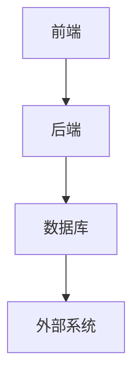
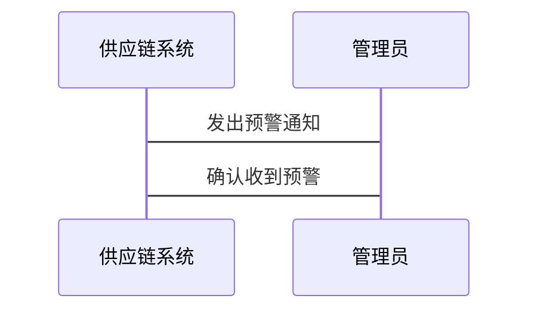

                 


# 巴菲特的产业链分析4.0：数字孪生技术在供应链中的应用

> 关键词：巴菲特产业链分析，数字孪生技术，供应链管理，数字化转型，风险管理，实时监控

> 摘要：本文深入探讨了数字孪生技术在供应链管理中的应用，结合巴菲特产业链分析4.0的方法论，分析了数字孪生技术的核心原理、应用场景及其对供应链管理的深远影响。通过实际案例和系统设计，本文展示了如何利用数字孪生技术优化供应链网络、降低风险、提升效率，并为未来供应链管理的数字化转型提供了 valuable insights.

---

# 第一章：数字孪生技术与供应链管理的背景

## 1.1 巴菲特产业链分析4.0概述

### 1.1.1 产业链分析的基本概念
产业链分析是通过对供应链中各环节的协同关系、资源分配和价值流动进行系统性研究，以优化整体效率和降低成本。巴菲特的产业链分析方法以其独特的投资哲学闻名，注重从宏观到微观的系统性分析。

### 1.1.2 巴菲特产业链分析的核心思想
巴菲特的产业链分析强调企业内部各环节的协同效应，通过优化供应链、生产、销售等环节的协同关系，实现整体价值最大化。产业链分析4.0版本进一步引入了数字化工具，将传统产业链分析与现代信息技术相结合。

### 1.1.3 巴菲特产业链分析4.0的最新发展
随着数字经济的兴起，产业链分析4.0引入了数字孪生技术，通过实时数据模拟和数字化模型，进一步提升供应链的透明度和响应能力。

---

## 1.2 数字孪生技术的定义与特点

### 1.2.1 数字孪生技术的定义
数字孪生技术（Digital Twin）是通过物理实体的数字化克隆，构建实时动态的虚拟模型，并通过数据流实现物理实体与数字模型之间的双向交互。它是一种基于数据驱动的实时仿真技术。

### 1.2.2 数字孪生技术的核心特征
- **实时性**：数字孪生模型能够实时反映物理实体的状态和变化。
- **可视化**：通过可视化技术，数字孪生模型能够直观展示供应链的运行情况。
- **预测性**：基于历史数据和实时数据，数字孪生技术可以预测未来的趋势和潜在风险。

### 1.2.3 数字孪生技术与传统供应链管理的区别
- **传统供应链管理**：依赖人工操作和静态数据，缺乏实时性和动态调整能力。
- **数字孪生技术**：基于实时数据和动态模型，实现供应链的智能化管理和优化。

---

# 第二章：数字孪生技术在供应链中的核心应用

## 2.1 供应链网络的可视化管理

### 2.1.1 供应链网络的数字孪生模型构建
数字孪生技术通过构建供应链网络的三维模型，将供应商、制造商、分销商和消费者等环节整合到一个虚拟网络中。

### 2.1.2 供应链网络的实时监控与分析
通过数字孪生模型，供应链管理者可以实时监控库存、物流、生产等关键指标，并通过数据分析优化供应链的运行效率。

### 2.1.3 供应链网络的优化与调整
数字孪生技术可以通过模拟不同场景，优化供应链的布局和流程，降低运营成本并提升效率。

---

## 2.2 供应链风险预测与应对

### 2.2.1 基于数字孪生的风险预测模型
数字孪生技术可以通过分析历史数据和实时数据，预测供应链中的潜在风险，如原材料短缺、物流延迟等。

### 2.2.2 供应链中断的实时预警与应对策略
数字孪生模型能够实时预警供应链中断的风险，并提供多种应对策略，如调整供应商、优化库存等。

### 2.2.3 数字孪生技术在供应链风险管理中的优势
- **实时性**：能够快速识别潜在风险并采取应对措施。
- **准确性**：基于大量数据和模型模拟，预测结果更加准确。
- **灵活性**：可以根据实际情况动态调整供应链策略。

---

# 第三章：数字孪生技术的核心原理与实现

## 3.1 数字孪生技术的实现机制

### 3.1.1 数据采集与处理
数字孪生技术需要采集供应链中的实时数据，包括传感器数据、物流数据、库存数据等，并通过数据清洗和预处理，为模型提供高质量的数据支持。

### 3.1.2 数字模型构建
基于采集的数据，构建供应链的数字模型，包括三维模型、数据流模型等，并通过算法对模型进行动态更新。

### 3.1.3 实时数据更新与同步
数字孪生模型需要与物理实体保持实时同步，确保模型能够准确反映供应链的实际运行状态。

---

## 3.2 数字孪生技术的关键技术

### 3.2.1 物联网技术
物联网技术通过传感器和设备连接供应链中的物理实体，采集实时数据并传输到数字模型中。

### 3.2.2 数据可视化技术
数据可视化技术通过图表、仪表盘等形式，直观展示供应链的运行状态，帮助管理者快速理解和决策。

### 3.2.3 人工智能技术
人工智能技术用于数据分析、模式识别和预测，进一步提升数字孪生技术的智能化水平。

---

# 第四章：数字孪生技术在供应链中的系统设计

## 4.1 问题场景介绍

### 4.1.1 供应链中断的风险
供应链中断可能导致生产延迟、库存积压或产品短缺，对企业造成重大损失。

### 4.1.2 供应链效率低下
传统供应链管理依赖人工操作，效率低下，难以应对复杂多变的市场环境。

### 4.1.3 数据孤岛问题
供应链中的数据分散在不同系统中，缺乏统一的平台进行整合和分析。

---

## 4.2 系统功能设计

### 4.2.1 领域模型设计
使用Mermaid类图描述供应链的领域模型，包括供应商、制造商、分销商和消费者等角色。


### 4.2.2 系统架构设计
使用Mermaid架构图描述系统的整体架构，包括前端、后端、数据库和外部系统。



### 4.2.3 系统接口设计
定义系统的API接口，包括数据采集接口、模型更新接口和用户交互接口。

---

## 4.3 系统交互设计

### 4.3.1 供应链中断的实时预警
使用Mermaid序列图描述供应链中断的实时预警流程。



---

# 第五章：数字孪生技术在供应链中的项目实战

## 5.1 环境安装

### 5.1.1 开发工具安装
安装必要的开发工具，如Python、Jupyter Notebook、Git等。

### 5.1.2 数据库安装
选择适合的数据库，如MySQL、MongoDB等，并配置好数据存储环境。

---

## 5.2 系统核心实现

### 5.2.1 数据采集模块
编写代码采集供应链中的实时数据，例如：

```python
import requests

def get_realtime_data():
    response = requests.get('http://api.supplychain.com/data')
    return response.json()
```

### 5.2.2 数字模型构建模块
使用Python的可视化库（如Plotly）构建数字模型，并动态更新数据。

### 5.2.3 风险预测模块
基于机器学习算法，实现供应链风险的预测和预警。

---

## 5.3 实际案例分析

### 5.3.1 案例背景
某制造企业面临原材料短缺的风险，希望通过数字孪生技术优化供应链管理。

### 5.3.2 系统实现
通过数字孪生技术构建供应链模型，实时监控原材料库存和供应商交货情况。

### 5.3.3 实施效果
实现了供应链的实时监控和风险预测，成功降低了原材料短缺的风险，提升了供应链的响应能力。

---

# 第六章：数字孪生技术在供应链中的最佳实践

## 6.1 最佳实践

### 6.1.1 数据质量管理
确保数据的准确性、完整性和及时性，是数字孪生技术成功应用的基础。

### 6.1.2 系统集成与兼容性
选择适合的系统架构和接口设计，确保数字孪生系统的兼容性和可扩展性。

### 6.1.3 人员培训与管理
供应链管理者需要具备数字孪生技术的基本知识，才能充分发挥其潜力。

---

## 6.2 小结

数字孪生技术为供应链管理带来了革命性的变化，通过实时数据和动态模型，实现了供应链的智能化管理和优化。结合巴菲特产业链分析4.0的方法论，数字孪生技术在供应链中的应用前景广阔，为企业提升了效率、降低了风险，并为未来的数字化转型提供了有力支持。

---

# 作者：AI天才研究院 & 禅与计算机程序设计艺术

