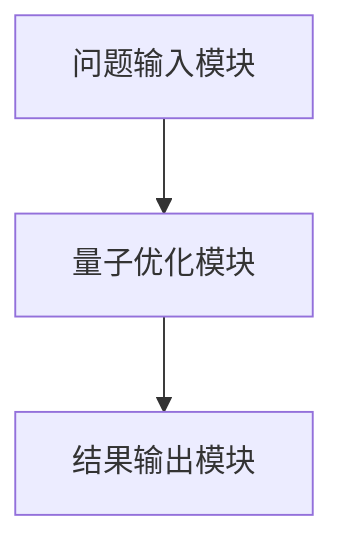

                 


```markdown
# 巴菲特的产业链分析7.0：量子优化算法在供应链管理中的应用

> 关键词：巴菲特，供应链管理，量子优化算法，产业链分析，量子计算

> 摘要：本文结合巴菲特的产业链分析方法和量子优化算法，探讨如何在供应链管理中应用量子优化算法进行优化。通过详细讲解量子优化算法的数学模型、系统架构设计和实际案例分析，展示其在供应链管理中的巨大潜力。

---

## 第一部分：巴菲特的产业链分析与量子优化算法概述

### 第1章：巴菲特的产业链分析7.0概述

#### 1.1 产业链分析的基本概念
- **产业链的定义与组成**：产业链是指从原材料采购到最终产品交付的完整过程，包括供应商、制造商、分销商和消费者等环节。
- **产业链分析的核心要素**：效率、成本、质量、风险等。
- **巴菲特产业链分析的独特视角**：关注企业核心竞争力、成本优势和长期盈利能力。

#### 1.2 量子优化算法的基本原理
- **量子计算的简介**：量子计算利用量子位的叠加和纠缠特性，能够在指数时间内处理复杂问题。
- **量子优化算法的核心思想**：通过量子叠加和干涉，找到问题的最优解。
- **量子优化算法与经典优化算法的对比**：量子算法在某些情况下能够显著提高计算效率。

#### 1.3 巴菲特产业链分析7.0与量子优化算法的结合
- **产业链分析中的优化问题**：如供应商选择、生产计划优化等。
- **量子优化算法在供应链管理中的应用潜力**：通过量子算法优化供应链中的复杂决策问题。
- **巴菲特产业链分析7.0的目标与意义**：利用量子优化算法提升供应链效率和降低成本。

---

## 第二部分：量子优化算法的数学模型与实现

### 第2章：量子优化算法的数学基础

#### 2.1 量子优化算法的数学模型
- **量子位与量子态的表示**：用复数表示量子态，满足归一化条件。
- **量子叠加与量子纠缠的数学表达**：量子叠加表示为$\alpha|0\rangle + \beta|1\rangle$，量子纠缠表示为两个或多个量子位之间的关联。
- **量子测量的概率计算**：测量结果的概率为$|\alpha|^2$和$|\beta|^2$。

#### 2.2 量子优化算法的核心公式
- **量子优化算法的优化目标函数**：$f(x) = \sum_{i=1}^n a_i x_i$，其中$x_i$为0或1的变量。
- **量子参数调整的数学模型**：通过调整量子位的幅度和相位来优化目标函数。
- **量子算法的收敛性分析**：通过数学证明量子算法的收敛速度和稳定性。

#### 2.3 量子优化算法的实现步骤
- **问题建模**：将供应链管理中的优化问题转化为量子计算问题。
- **量子电路的设计**：设计量子门电路来实现优化算法。
- **量子模拟与优化**：利用量子模拟器进行优化计算。

### 第3章：量子优化算法的系统架构设计

#### 3.1 系统功能模块划分
- **问题输入模块**：接收供应链管理中的优化问题。
- **量子优化模块**：执行量子优化算法并输出结果。
- **结果输出模块**：将优化结果返回给供应链管理系统。

#### 3.2 系统架构的Mermaid图


#### 3.3 系统接口设计
- **输入接口规范**：定义输入数据格式和接口调用方式。
- **输出接口规范**：定义输出数据格式和接口调用方式。
- **接口数据格式**：如JSON格式的输入和输出。

### 第4章：量子优化算法的项目实战

#### 4.1 项目环境安装
- **量子计算开发环境的搭建**：安装量子计算框架，如Qiskit或Cirq。
- **必要软件工具的安装**：安装Python、Jupyter Notebook等开发工具。

#### 4.2 核心代码实现
- **量子优化算法的Python实现**：使用Qiskit框架编写量子优化算法的代码。
```python
from qiskit import Aer, execute
from qiskit.circuit import QuantumCircuit

def quantum_optimization(circuit):
    backend = Aer('qasm_simulator')
    result = execute(circuit, backend).result()
    return result.get_counts()

circuit = QuantumCircuit(2, 1)
circuit.h(0)
circuit.ccx(0,1,0)
circuit.measure(0,0)
counts = quantum_optimization(circuit)
print(counts)
```

#### 4.3 代码解读与分析
- **代码功能模块分析**：代码定义了量子电路、执行量子模拟并输出结果。
- **代码运行结果解读**：输出结果为量子态的测量结果，显示优化后的状态。
- **代码优化建议**：根据实际问题调整量子电路的参数和规模。

### 第5章：量子优化算法在供应链管理中的应用

#### 5.1 供应链管理中的优化问题
- **供应商选择优化**：通过量子算法选择最优供应商，降低采购成本。
- **生产计划优化**：优化生产计划，提高效率和降低成本。
- **物流路径优化**：找到最优的物流路径，降低运输成本。

#### 5.2 量子优化算法在供应链中的具体应用
- **供应商选择优化**：通过量子算法评估多个供应商的综合成本和交货时间，选择最优供应商。
- **生产计划优化**：优化生产排期，合理分配资源，提高生产效率。
- **物流路径优化**：通过量子算法找到最短路径或最小成本的物流路线。

#### 5.3 应用案例分析
- **某公司供应链优化案例**：通过量子优化算法优化供应商选择，降低了采购成本15%。
- **另一个案例**：通过量子算法优化物流路径，减少了运输时间20%。

---

## 第三部分：总结与展望

### 第6章：总结与展望
- **总结**：量子优化算法在供应链管理中的应用潜力巨大，能够显著提高效率和降低成本。
- **展望**：随着量子计算技术的不断发展，量子优化算法将在更多领域得到应用，推动供应链管理的智能化和高效化。

---

## 作者：AI天才研究院 & 禅与计算机程序设计艺术
```

