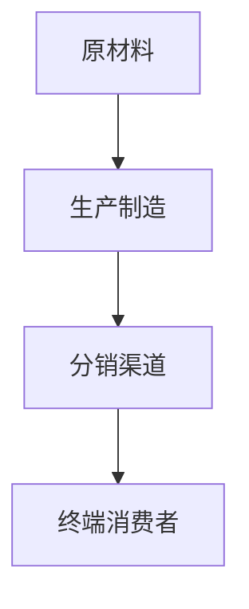

                 

# 巴菲特的产业链分析方法：全面理解公司的竞争环境

> 关键词：巴菲特，产业链分析，竞争优势，竞争环境，投资决策，企业战略

> 摘要：本文将详细介绍巴菲特的产业链分析方法，通过分析企业的行业结构、竞争优势、上下游关系等核心要素，帮助投资者全面理解公司的竞争环境。文章结合具体案例，深入探讨如何通过产业链分析评估企业的投资价值，并提供系统的分析框架和实战指导。

---

## 第一部分：引言

### 1.1 巴菲特的投资理念
巴非特的价值投资理念强调长期持有的稳定性，而产业链分析是其评估企业投资价值的重要工具。通过分析企业的行业地位、竞争优势和竞争环境，巴菲特能够识别出具备长期盈利能力的企业。

### 1.2 产业链分析的意义
产业链分析帮助投资者全面了解企业的经营环境，识别行业风险和机会，评估企业的竞争优势，从而做出更明智的投资决策。

---

## 第二部分：产业链分析的核心要素

### 2.1 行业结构分析
#### 2.1.1 五力模型
- **市场新进入者的威胁**：行业的进入壁垒和新进入者的成本。
- **替代品的威胁**：替代品的价格和质量对行业的影响。
- **供应商的议价能力**：供应商的集中度和替代品的可获得性。
- **买家的议价能力**：客户的集中度和购买量。
- **行业内部竞争**：行业内企业的数量和竞争程度。

#### 2.1.2 五力模型在产业链分析中的应用
通过五力模型，可以评估行业内的竞争强度和企业的生存空间。

### 2.2 竞争优势分析
#### 2.2.1 核心竞争力
企业通过独特的资源、技术或商业模式获得的竞争优势。

#### 2.2.2 护城河分析
企业的护城河包括成本优势、品牌优势、技术优势和网络效应等。

### 2.3 上下游关系分析
#### 2.3.1 上游供应商
- 供应商的数量和集中度。
- 供应商的议价能力。

#### 2.3.2 下游客户
- 客户的数量和分散度。
- 客户的议价能力。

---

## 第三部分：产业链分析的实施方法

### 3.1 确定分析目标
- 明确分析的行业范围和时间维度。

### 3.2 绘制产业链图谱
通过绘制产业链图谱，识别关键环节和主要参与者。

### 3.3 关键环节评估
- 评估关键环节的竞争优势和风险。

---

## 第四部分：数学模型与算法

### 4.1 五力模型的数学表示
五力模型可以通过矩阵分析法进行量化评估，例如：

$$
\text{行业吸引力} = \sum_{i=1}^{5} w_i \cdot s_i
$$

其中，$w_i$ 是各个因素的权重，$s_i$ 是各个因素的评分。

### 4.2 产业链协同效应的评估
通过协同效应指数（CEI）评估产业链的协同程度：

$$
CEI = \sum_{j=1}^{n} \left( \frac{\text{协同贡献}}{\text{成本节省}} \right)
$$

---

## 第五部分：系统分析与架构设计

### 5.1 问题场景介绍
以苹果公司为例，分析其产业链的结构和竞争优势。

### 5.2 系统功能设计
- **上游供应商**：芯片制造商、电子元件供应商。
- **生产制造**：代工制造商。
- **分销渠道**：零售店、电商平台。
- **下游客户**：消费者。

### 5.3 系统架构设计

---

## 第六部分：项目实战

### 6.1 苹果公司的产业链分析
#### 6.1.1 产业链结构
- 原材料供应商：芯片、显示屏等。
- 生产制造：代工制造商。
- 分销渠道：苹果零售店、电商平台。
- 终端消费者：全球用户。

#### 6.1.2 竞争优势
- 技术创新。
- 品牌影响力。
- 高度整合的生态系统。

---

## 第七部分：总结与展望

### 7.1 最佳实践
- 充分了解行业背景。
- 识别企业的核心竞争力。
- 关注上下游关系的变化。

### 7.2 注意事项
- 数据来源的可靠性。
- 分析的深度和广度。

### 7.3 拓展阅读
推荐相关书籍和资源，进一步深入学习产业链分析的方法。

---

## 作者：AI天才研究院 & 禅与计算机程序设计艺术

---

通过本文的系统分析和实战案例，读者可以全面理解巴菲特的产业链分析方法，并将其应用于实际投资分析中。

