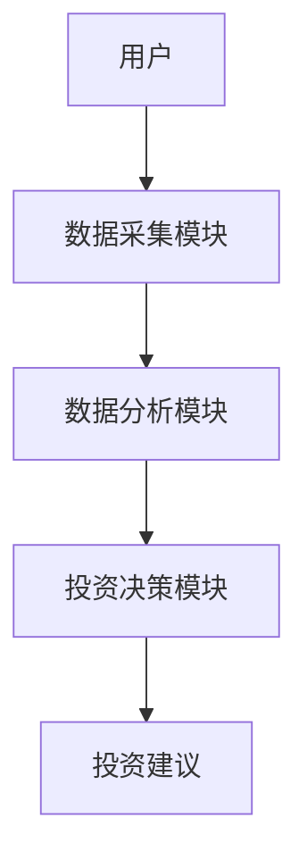
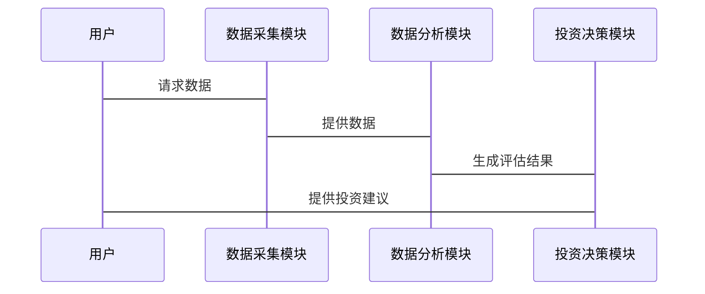

                 


# 巴菲特的价值投资在元宇宙经济中的应用

## 关键词：价值投资、元宇宙、虚拟经济、巴菲特、数字资产

## 摘要：
本文探讨了巴菲特的价值投资理念在元宇宙经济中的应用，通过分析元宇宙经济的构成、价值投资的核心要素及其在元宇宙中的映射，结合实际案例和系统设计，详细阐述了如何将传统价值投资策略应用于新兴的元宇宙经济环境。文章从背景介绍、核心概念、算法原理、系统架构到项目实战，层层深入，旨在为投资者提供新的视角和实践指导。

---

# 第一部分: 巴菲特的价值投资在元宇宙经济中的应用概述

## 第1章: 巴菲特价值投资的核心理念

### 1.1 价值投资的基本原理

#### 1.1.1 价值投资的定义与核心要素
- **定义**: 价值投资是一种长期投资策略，关注于找到市场价格低于其内在价值的资产。
- **核心要素**:
  - **内在价值**: 资产的真实价值，基于基本面分析。
  - **安全边际**: 投资价格低于内在价值的程度。
  - **长期视角**: 不关注短期市场波动，而是资产的长期增长潜力。

#### 1.1.2 巴菲特的价值投资策略
- **买入并持有**: 投资于具有强大竞争优势和良好管理的公司。
- **关注基本面**: 分析企业的财务状况、盈利能力、行业地位和管理层质量。
- **分散投资**: 通过多样化降低风险。

#### 1.1.3 价值投资与元宇宙经济的结合点
- 元宇宙经济中的虚拟资产（如NFT、虚拟货币）具有价格波动大、市场参与者多的特点，适合应用价值投资策略。

---

## 第2章: 元宇宙经济的基本框架

### 2.1 元宇宙经济的定义与特点

#### 2.1.1 元宇宙经济的定义
- 元宇宙经济是基于区块链技术构建的虚拟经济体系，参与者通过数字资产、虚拟商品和虚拟货币进行交易。

#### 2.1.2 元宇宙经济的核心特征
- **去中心化**: 由区块链技术支持，无中央机构控制。
- **可编程性**: 智能合约实现自动化交易和经济活动。
- **虚拟与现实的融合**: 元宇宙中的资产与现实世界的经济活动相互影响。

#### 2.1.3 元宇宙经济的参与者与交易机制
- **参与者**: 用户、开发者、虚拟货币交易所、NFT平台。
- **交易机制**: 包括虚拟货币的买卖、NFT的拍卖和虚拟商品的交易。

### 2.2 元宇宙经济的主要组成部分

#### 2.2.1 虚拟货币与数字资产
- **虚拟货币**: 如比特币、以太坊，用于元宇宙中的支付和交易。
- **数字资产**: 包括代币（Token）和稳定币，用于投资和交易。

#### 2.2.2 NFT与数字艺术品
- **NFT**: 非同质化代币，用于证明数字资产的唯一性。
- **数字艺术品**: 如 Beeple 的《Everydays: The First 5000 Days》，具有收藏和投资价值。

#### 2.2.3 虚拟商品与虚拟土地
- **虚拟商品**: 如游戏中的装备、虚拟货币等。
- **虚拟土地**: 如Decentraland、The Sandbox中的虚拟地块，用于开发和投资。

---

## 第3章: 巴菲特价值投资理念在元宇宙经济中的应用背景

### 3.1 元宇宙经济的繁荣与挑战

#### 3.1.1 元宇宙经济的快速发展
- **技术推动**: 区块链、AR/VR等技术的发展促进了元宇宙经济的兴起。
- **市场需求**: 用户对虚拟资产的需求激增，推动了市场的繁荣。

#### 3.1.2 元宇宙经济中的泡沫与风险
- **价格波动**: 虚拟货币和NFT的价格波动剧烈，存在市场泡沫。
- **监管不确定性**: 元宇宙经济的法律和监管框架尚未完善，存在合规风险。

#### 3.1.3 价值投资在元宇宙经济中的潜在机会
- **长期增长**: 具有强大技术支撑和良好商业模式的虚拟资产具有长期投资价值。
- **市场调整**: 泡沫破裂后，价格回归合理区间，价值投资者可以获利。

### 3.2 元宇宙经济中的投资机会分析

#### 3.2.1 虚拟货币的投资价值
- **技术优势**: 以太坊的智能合约功能使其成为元宇宙经济的核心。
- **市场地位**: BTC和ETH作为主流虚拟货币，具有较高的保值和增值潜力。

#### 3.2.2 NFT与数字艺术品的投资潜力
- **稀缺性**: NFT的唯一性和不可分割性使其具有收藏价值。
- **市场需求**: 数字艺术市场快速发展，NFT价格持续上涨。

#### 3.2.3 虚拟商品与虚拟土地的投资机会
- **虚拟土地**: 用于开发虚拟房地产，具有长期增值潜力。
- **虚拟商品**: 具备实用价值的虚拟商品（如游戏装备）具有较高的市场流动性。

---

# 第二部分: 巴菲特价值投资理念在元宇宙经济中的核心概念与联系

## 第4章: 价值投资核心要素在元宇宙经济中的映射

### 4.1 企业分析与元宇宙经济中的项目评估

#### 4.1.1 企业基本面分析与元宇宙项目评估
- **企业基本面分析**: 项目的技术实现、市场前景、团队能力和商业模式。
- **项目评估**: 包括项目的市场定位、用户活跃度和经济模型。

#### 4.1.2 企业竞争优势与元宇宙项目的市场地位
- **竞争优势**: 项目的技术创新、社区支持和品牌影响力。
- **市场地位**: 项目在元宇宙经济中的市场份额和影响力。

#### 4.1.3 企业财务状况与元宇宙项目的经济模型
- **企业财务状况**: 项目方的财务健康状况和盈利能力。
- **经济模型**: 项目中的代币发行机制、通胀机制和收益分配机制。

---

## 第5章: 安全边际与元宇宙经济中的风险管理

### 5.1 安全边际在元宇宙经济中的应用

#### 5.1.1 安全边际的定义与作用
- **定义**: 投资价格与内在价值之间的差距，用于降低投资风险。
- **作用**: 保护投资者免受市场波动和价格下跌的影响。

#### 5.1.2 元宇宙经济中的风险管理
- **市场风险**: 虚拟资产价格波动带来的投资风险。
- **技术风险**: 区块链技术和元宇宙平台的稳定性风险。
- **操作风险**: 投资者操作失误带来的损失。

### 5.2 安全边际的量化与应用

#### 5.2.1 安全边际的量化方法
- **内在价值计算**: 使用DCF模型评估项目的内在价值。
- **价格折扣**: 确定投资价格与内在价值的折扣比例。

#### 5.2.2 元宇宙经济中的安全边际应用
- **虚拟货币**: 投资于价格低于内在价值的虚拟货币。
- **NFT**: 选择价格低于其真实价值的NFT项目。

---

## 第6章: 长期投资与元宇宙经济的可持续发展

### 6.1 长期投资在元宇宙经济中的意义

#### 6.1.1 长期投资与元宇宙经济的关系
- **长期投资**: 通过持有优质虚拟资产，分享其长期增长的收益。
- **元宇宙经济的可持续性**: 元宇宙经济需要长期的技术支持和用户参与，长期投资与之相辅相成。

#### 6.1.2 元宇宙经济中的长期投资策略
- **选择优质项目**: 投资于具有强大技术支撑和良好经济模型的虚拟资产。
- **分散投资**: 通过多样化降低投资风险。

---

# 第三部分: 巴菲特价值投资理念在元宇宙经济中的算法原理

## 第7章: 价值投资算法在元宇宙经济中的应用

### 7.1 价值投资算法的数学模型

#### 7.1.1 内在价值计算模型
$$ \text{内在价值} = \frac{\text{现金流}}{\text{贴现率}} $$

#### 7.1.2 安全边际计算模型
$$ \text{安全边际} = \text{内在价值} \times (1 - \text{折扣率}) $$

### 7.2 价值投资算法在元宇宙经济中的实现

#### 7.2.1 虚拟货币的价值评估
- 使用DCF模型评估虚拟货币的内在价值。
- 结合链上数据（如交易量、活跃用户数）进行价格分析。

#### 7.2.2 NFT的价值评估
- 使用收益法评估NFT的未来现金流。
- 结合市场流动性分析NFT的交易溢价。

---

## 第8章: 元宇宙经济中的投资组合优化

### 8.1 投资组合优化的数学模型

#### 8.1.1 投资组合优化模型
$$ \text{风险} = \sqrt{\sum_{i=1}^{n} w_i^2 \times \text{资产风险}^2} $$

#### 8.1.2 投资组合优化算法
- 使用均值-方差优化算法，最小化投资组合的风险。
- 结合资产的相关性分析，优化投资组合的分散化。

### 8.2 元宇宙经济中的投资组合优化策略

#### 8.2.1 资产配置策略
- 虚拟货币、NFT、虚拟土地的配置比例。
- 根据市场变化动态调整投资组合。

#### 8.2.2 风险管理策略
- 设置止损点，避免重大损失。
- 定期评估投资组合的内在价值和安全边际。

---

# 第四部分: 元宇宙经济中的系统分析与架构设计

## 第9章: 元宇宙经济分析系统的功能设计

### 9.1 系统功能设计

#### 9.1.1 系统功能模块
- 数据采集模块：收集虚拟资产的价格、交易量等数据。
- 数据分析模块：使用价值投资算法进行资产评估。
- 投资决策模块：生成投资建议和投资组合优化方案。

#### 9.1.2 系统功能流程
1. 数据采集：获取元宇宙经济中的各种数据。
2. 数据分析：使用算法模型评估资产价值。
3. 投资决策：生成投资建议和优化方案。

---

## 第10章: 元宇宙经济分析系统的架构设计

### 10.1 系统架构设计

#### 10.1.1 系统架构图


#### 10.1.2 系统接口设计
- 数据接口：与虚拟货币交易所、NFT平台等外部系统对接。
- 用户接口：提供用户友好的投资决策建议展示。

---

## 第11章: 元宇宙经济分析系统的交互设计

### 11.1 系统交互流程图

#### 11.1.1 交互流程


---

# 第五部分: 项目实战与案例分析

## 第12章: 元宇宙经济中的项目实战

### 12.1 项目环境安装

#### 12.1.1 系统环境
- 操作系统：Windows/Mac/Linux
- 开发工具：Python、Jupyter Notebook
- 区块链钱包：MetaMask

#### 12.1.2 依赖安装
- Python库：pandas、numpy、scipy、matplotlib

### 12.2 系统核心实现

#### 12.2.1 数据采集代码
```python
import requests
import json

def get_price(symbol):
    response = requests.get(f"https://api.example.com/price/{symbol}")
    return json.loads(response.text)['price']
```

#### 12.2.2 数据分析代码
```python
import pandas as pd
import numpy as np

def calculate_intrinsic_value(free_cash_flow, discount_rate):
    return free_cash_flow / discount_rate
```

#### 12.2.3 投资决策代码
```python
def generate_recommendation(symbol, price, intrinsic_value):
    if price < intrinsic_value:
        return "买入"
    elif price > intrinsic_value * 1.2:
        return "卖出"
    else:
        return "持有"
```

### 12.3 案例分析

#### 12.3.1 虚拟货币投资案例
- **项目选择**: ETH
- **数据分析**: 使用DCF模型计算ETH的内在价值。
- **投资决策**: 价格低于内在价值，建议买入。

#### 12.3.2 NFT投资案例
- **项目选择**: Beeple的《Everydays: The First 5000 Days》
- **数据分析**: 结合市场流动性分析NFT的交易溢价。
- **投资决策**: 价格低于真实价值，建议买入。

---

## 第13章: 项目总结与经验分享

### 13.1 项目总结

#### 13.1.1 项目成果
- 成功应用价值投资理念评估元宇宙经济中的虚拟资产。
- 提供了投资建议和投资组合优化方案。

#### 13.1.2 经验总结
- 元宇宙经济具有高度的不确定性和波动性，价值投资策略需要灵活调整。
- 数据分析和模型构建是投资决策的关键。

### 13.2 小结与注意事项

#### 13.2.1 小结
- 巴菲特的价值投资理念在元宇宙经济中具有广泛的应用场景。
- 通过系统设计和算法优化，可以提高投资决策的科学性和准确性。

#### 13.2.2 注意事项
- 投资者需关注元宇宙经济的技术发展和市场变化。
- 价值投资需结合元宇宙经济的特殊性进行调整和优化。

---

# 第六部分: 最佳实践与未来展望

## 第14章: 最佳实践与投资建议

### 14.1 最佳实践

#### 14.1.1 投资策略
- **分散投资**: 降低投资风险。
- **长期持有**: 分享元宇宙经济的长期增长。
- **关注优质项目**: 投资于具有强大技术支撑和良好经济模型的虚拟资产。

#### 14.1.2 风险管理
- **设置止损**: 避免重大损失。
- **动态调整**: 根据市场变化及时调整投资组合。

### 14.2 小结

#### 14.2.1 小结
- 巴菲特的价值投资理念在元宇宙经济中具有重要的指导意义。
- 通过系统设计和算法优化，可以提高投资决策的科学性和准确性。

#### 14.2.2 未来展望
- 元宇宙经济的发展将推动价值投资理念的进一步创新和应用。
- 投资者需密切关注元宇宙经济的技术发展和市场变化，灵活调整投资策略。

---

# 作者：AI天才研究院/AI Genius Institute & 禅与计算机程序设计艺术 /Zen And The Art of Computer Programming

