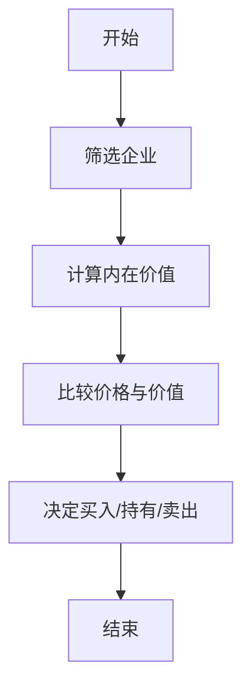
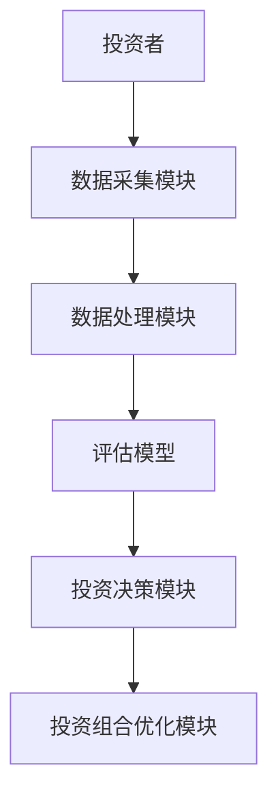

                 


# 巴菲特的价值投资在新兴市场的应用：机遇与挑战

## 关键词：巴菲特、价值投资、新兴市场、风险管理、投资策略

## 摘要：  
本文深入探讨了巴菲特的价值投资理念在新兴市场的应用，分析了新兴市场的独特特点及其带来的投资机遇与挑战。通过结合理论与实际案例，本文提出了在新兴市场中应用价值投资的具体策略，并探讨了如何通过风险管理、长期视角和安全边际等原则，实现投资的成功。文章还总结了在新兴市场中应用巴菲特投资理念的关键点和未来展望。

---

## 第一部分：背景与概念

### 第1章：背景介绍

#### 1.1 价值投资的定义与核心概念  
价值投资是一种以基本面分析为基础的投资策略，强调以低于内在价值的价格买入优质资产。巴菲特是价值投资的代表人物，其核心理念包括长期投资、安全边际、企业竞争优势等。

#### 1.2 新兴市场的定义与特点  
新兴市场是指那些经济增长迅速、市场机制逐步完善但尚未完全成熟的国家或地区的金融市场。与成熟市场相比，新兴市场具有高增长潜力、行业集中度低、政策环境复杂等特点。

#### 1.3 投资背景与问题描述  
新兴市场为企业提供了巨大的增长机会，但也伴随着较高的风险和不确定性。传统价值投资理念在新兴市场中的应用需要进行调整，以应对市场波动和政策变化等挑战。

---

## 第二部分：理论与策略

### 第2章：巴菲特价值投资的核心理论

#### 2.1 价值投资的核心原理  
价值投资的核心在于寻找具有持续竞争优势、良好治理结构和稳定现金流的企业，并以低于其内在价值的价格买入。巴菲特强调安全边际和长期持有。

#### 2.2 价值投资的关键指标  
以下是衡量企业价值的关键指标对比：

| 指标 | 描述 | 示例 |
|------|------|------|
| 市盈率（P/E） | 当前股价与每股收益的比值 | 低于行业平均水平表示被低估 |
| 市净率（P/B） | 当前股价与每股净资产的比值 | 低于1表示资产被低估 |
| 股息率 | 每股股息与股价的比值 | 高股息率可能意味着低估或收益稳定 |

#### 2.3 价值投资的风险管理  
安全边际是价值投资中风险控制的核心工具。通过购买价格与内在价值的差距，投资者可以降低市场波动带来的影响。

---

### 第3章：新兴市场中的价值投资策略

#### 3.1 新兴市场的投资机会  
新兴市场中的高增长行业（如科技、消费、医疗等）和龙头企业是价值投资的重点关注对象。

#### 3.2 企业内在价值的评估  
在新兴市场中，企业内在价值的评估需要考虑行业周期、政策环境和竞争格局。例如，可以通过以下步骤进行分析：

1. **行业分析**：评估行业的增长潜力和竞争结构。
2. **财务分析**：计算企业的盈利能力、现金流和资产负债情况。
3. **竞争优势分析**：识别企业的核心竞争优势。

#### 3.3 投资组合管理  
在新兴市场中，投资者需要通过分散投资、动态调整和风险对冲来降低投资风险。以下是投资组合的优化策略：

1. **分散投资**：将资金分配到不同行业和地区的资产，降低单一市场的风险。
2. **动态调整**：定期评估投资组合的表现，根据市场变化进行调整。
3. **风险对冲**：利用衍生工具（如期权）对冲市场波动风险。

---

## 第三部分：算法与系统分析

### 第4章：价值投资算法的实现

#### 4.1 算法原理  
以下是价值投资算法的流程图：



#### 4.2 算法实现  
以下是一个简单的Python代码示例，用于计算企业的内在价值：

```python
def calculate_intrinsic_value(eps, growth_rate, required_return):
    # 使用戈登模型计算内在价值
    g = growth_rate / 100
    r = required_return / 100
    intrinsic_value = eps * (1 + g) / (r - g)
    return intrinsic_value

# 示例数据
eps = 2.5  # 每股收益
growth_rate = 8  # 增长率
required_return = 12  # 必要回报率

value = calculate_intrinsic_value(eps, growth_rate, required_return)
print(f"企业内在价值：{value:.2f}")
```

#### 4.3 算法优化  
通过动态调整模型参数和引入更多的财务指标（如ROE、ROA等），可以提高算法的准确性和适用性。

---

### 第5章：系统架构设计

#### 5.1 系统功能设计  
以下是系统的功能模块设计：

```mermaid
classDiagram
    class 投资者 {
        +资金：float
        +投资组合：list
        +目标市场：string
        -评估模型：function
        +买入：function
        +卖出：function
    }
    class 评估模型 {
        +财务数据：dict
        +市场数据：dict
        -计算内在价值：function
        -生成报告：function
    }
    investor -> 评估模型 : 提供数据
    评估模型 --> 投资者 : 返回结果
```

#### 5.2 系统架构设计  
以下是系统的架构设计：



---

## 第四部分：项目实战

### 第6章：项目实现与案例分析

#### 6.1 环境安装  
需要安装以下工具：
- Python 3.8+
- Jupyter Notebook
- matplotlib
- pandas

#### 6.2 核心代码实现  
以下是价值投资算法的实现代码：

```python
import pandas as pd
import numpy as np

def get_market_data(tickers):
    # 获取市场数据
    return pd.DataFrame()

def calculate_intrinsic_value(financials, growth_rate, required_return):
    # 计算内在价值
    return financials * (1 + growth_rate) / (required_return - growth_rate)

# 示例代码
tickers = ['AAPL', 'MSFT', 'GOOGL']
market_data = get_market_data(tickers)
intrinsic_values = calculate_intrinsic_value(market_data['eps'], 8, 12)
print(intrinsic_values)
```

#### 6.3 案例分析  
以某新兴市场中的科技企业为例，分析其内在价值和投资策略。

---

## 第五部分：总结与展望

### 第7章：总结与最佳实践

#### 7.1 小结  
巴菲特的价值投资理念在新兴市场中具有重要的应用价值，但需要结合市场特点进行调整。

#### 7.2 最佳实践  
- **长期视角**：坚持长期投资，避免短期波动的干扰。
- **风险管理**：通过分散投资和安全边际控制风险。
- **持续学习**：关注市场变化，不断优化投资策略。

#### 7.3 注意事项  
新兴市场存在较高的政策和市场风险，投资者需要具备较高的分析能力和风险承受能力。

#### 7.4 拓展阅读  
建议阅读以下书籍：
- 《巴菲特传：一个美国资本家的成功之路》
- 《价值投资实战策略》

---

## 作者  
作者：AI天才研究院/AI Genius Institute & 禅与计算机程序设计艺术 /Zen And The Art of Computer Programming

