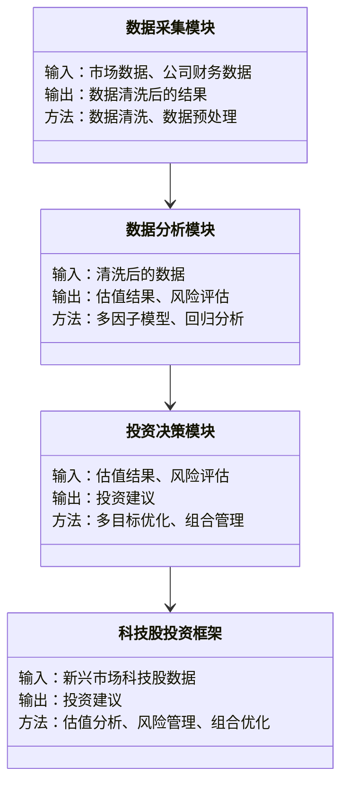
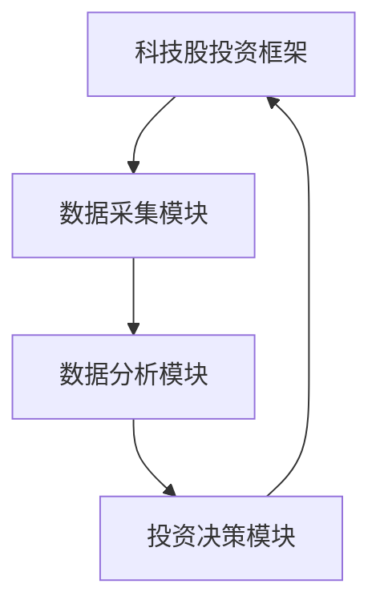
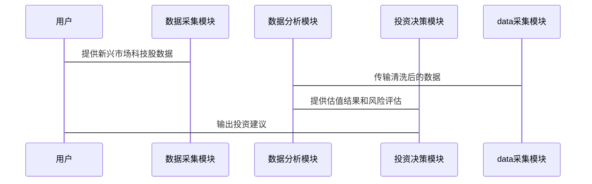

                 


```markdown
# 巴菲特的价值投资在新兴市场科技股中的调整

> 关键词：巴菲特，价值投资，新兴市场，科技股，投资策略，风险管理，财务分析

> 摘要：本文探讨了巴菲特价值投资理念在新兴市场科技股投资中的应用与调整。通过分析科技股的特点、估值方法和风险管理策略，提出了一套适用于新兴市场科技股的投资框架，帮助投资者在快速变化的市场中实现稳健收益。

---

# 引言

## 0.1 本书的目的与意义
### 0.1.1 为什么研究巴菲特价值投资在新兴市场的应用
- 巴菲特的价值投资理念以长期稳健著称，但在新兴市场中，科技股的高波动性和不确定性要求投资者进行策略调整。
- 科技股的创新性和成长性为新兴市场提供了巨大投资机会，但同时也带来了更高的风险。
- 本文旨在探讨如何将巴菲特的核心理念与新兴市场科技股的特点相结合，制定有效的投资策略。

### 0.1.2 科技股在新兴市场中的独特地位
- 科技股是新兴市场的核心驱动力，尤其是在互联网、人工智能、大数据等领域。
- 新兴市场的科技公司往往具有更高的增长潜力，但也面临更多的政策和市场风险。

### 0.1.3 调整投资策略的必要性与重要性
- 巴菲特的传统价值投资策略主要适用于成熟市场，但在新兴市场中需要考虑更多的外部因素，如政策变化、经济波动等。
- 科技股的高成长性和周期性要求投资者更加关注公司的基本面和财务健康状况。

## 0.2 本书的结构与内容概述
### 0.2.1 从基础到实战的逻辑框架
- 引言：介绍巴菲特价值投资的基本理念和新兴市场科技股的特点。
- 基础分析：详细讲解巴菲特投资策略的核心要素和科技股的估值方法。
- 系统解决方案：设计一套适用于新兴市场科技股的投资框架。
- 实战案例：通过具体案例分析投资策略的实际应用。
- 总结与展望：总结全文，展望未来投资趋势。

### 0.2.2 核心章节内容的简要介绍
- 第一部分：巴菲特价值投资的核心理念。
- 第二部分：新兴市场科技股的特殊性。
- 第三部分：巴菲特价值投资在科技股中的调整策略。
- 第四部分：新兴市场科技股的选股标准。
- 第五部分：系统架构设计与实现。
- 第六部分：实战案例分析与总结。

### 0.2.3 学习本书的建议与方法
- 建议读者在阅读前具备一定的投资基础知识。
- 结合实际案例，深入理解理论知识。
- 多次回顾重点章节，巩固核心概念。

---

# 第一部分：巴菲特价值投资的核心理念

## 第1章：巴菲特价值投资的基本原理

### 1.1 价值投资的定义与核心要素
#### 1.1.1 价值投资的定义
- 价值投资是一种以企业内在价值为基础的投资策略，强调长期持有优质资产。
- 投资者应关注企业的基本面，寻找被市场低估的投资标的。

#### 1.1.2 核心要素：企业内在价值、安全边际、长期视角
- **企业内在价值**：通过财务指标和行业分析评估企业的实际价值。
- **安全边际**：以低于内在价值的价格买入，确保投资的安全性。
- **长期视角**：关注企业的长期增长潜力，而非短期价格波动。

#### 1.1.3 价值投资与成长投资的区别
- 价值投资注重低估值和安全边际，而成长投资注重高成长性和未来潜力。
- 两者在不同市场环境下表现不同，需根据实际情况选择合适策略。

### 1.2 巴菲特投资策略的关键原则
#### 1.2.1 质量、能力、护城河的重要性
- **质量**：企业应具备稳定的盈利能力和发展前景。
- **能力**：管理层应具备优秀的能力和良好的治理结构。
- **护城河**：企业应有独特的竞争优势，如专利、品牌、技术壁垒等。

#### 1.2.2 财务健康状况的评估标准
- **收入与利润**：关注企业的收入增长和利润率。
- **现金流**：健康的现金流是企业财务健康的重要指标。
- **资产负债表**：分析企业的资产、负债和所有者权益状况。

#### 1.2.3 股价与内在价值的长期匹配
- 长期投资应关注企业内在价值与股价的匹配，而非短期价格波动。
- 在市场恐慌时，往往可以以低于内在价值的价格买入优质资产。

### 1.3 巴菲特投资决策的框架
#### 1.3.1 经济护城河的构建与分析
- **经济护城河**：企业通过成本优势、规模效应、专利等方式构建竞争优势。
- **护城河的深度**：评估护城河的可持续性和防御能力。

#### 1.3.2 管理层能力的评估方法
- **管理层素质**：关注管理层的背景、经验和决策能力。
- **治理结构**：良好的治理结构有助于保护投资者利益。

#### 1.3.3 安全边际的计算与应用
- **安全边际**：以低于内在价值的价格买入，确保投资的安全性。
- **安全边际的计算**：通过对比市场价格与内在价值，确定安全空间。

---

# 第二部分：新兴市场科技股的特殊性

## 第2章：新兴市场的特点与投资机会

### 2.1 新兴市场的定义与分类
#### 2.1.1 新兴市场的定义
- 新兴市场是指经济快速发展、基础设施逐步完善、但尚未完全成熟的国家或地区。
- 这类市场通常具有较高的增长潜力和较大的波动性。

#### 2.1.2 新兴市场的分类与特点
- **按地区分类**：亚洲、欧洲、拉丁美洲等新兴市场。
- **按发展阶段分类**：处于工业化初期、中期或后期的新兴市场。

#### 2.1.3 新兴市场与发达市场的对比
- **增长潜力**：新兴市场经济增长快，但波动性大。
- **市场规模**：新兴市场通常较小，但增长空间大。
- **政策环境**：新兴市场的政策环境往往不够稳定，存在较大的不确定性。

### 2.2 科技股在新兴市场中的发展现状
#### 2.2.1 新兴市场科技股的崛起
- 随着互联网和信息技术的快速发展，新兴市场的科技股逐渐崛起。
- 科技公司在新兴市场的快速扩张为投资者提供了更多机会。

#### 2.2.2 科技股在新兴市场的占比与趋势
- 科技股在新兴市场的占比逐步增加，成为推动市场增长的重要力量。
- 新兴市场的科技股呈现出高增长、高波动的特点。

#### 2.2.3 新兴市场科技股的波动性与风险
- 科技股的高成长性往往伴随着高波动性。
- 新兴市场的政策变化和经济波动对科技股的影响较大。

### 2.3 新兴市场科技股的投资机会
#### 2.3.1 新兴市场科技股的增长潜力
- 新兴市场的科技公司在技术创新和市场拓展方面具有较大的潜力。
- 随着数字化转型的推进，科技股的投资机会不断增加。

#### 2.3.2 新兴市场科技股的创新驱动力
- 新兴市场的科技公司往往具有较强的创新能力，能够快速适应市场需求。
- 技术创新是新兴市场科技股增长的核心驱动力。

#### 2.3.3 新兴市场科技股的政策支持
- 多数新兴市场政府对科技产业给予政策支持，推动科技创新和产业发展。
- 政策支持为科技股提供了良好的发展环境。

---

## 第3章：科技股投资的核心逻辑

### 3.1 科技股的估值方法
#### 3.1.1 科技股的估值模型与公式
- 科技股的估值通常采用市盈率（P/E）、市净率（P/B）、EV/EBITDA等指标。
- 由于科技公司的研发投入较高，传统的估值方法需要调整。

#### 3.1.2 市盈率、市净率、EV/EBITDA的适用性
- **市盈率（P/E）**：适用于盈利稳定的科技公司。
- **市净率（P/B）**：适用于资产密集型的科技公司。
- **EV/EBITDA**：综合考虑企业价值和盈利状况。

#### 3.1.3 现金流折现法在科技股中的应用
- 现金流折现法（DCF）是科技股估值的重要方法。
- 通过预测未来现金流，计算企业的内在价值。

### 3.2 科技股的风险管理
#### 3.2.1 科技股的波动性风险
- 科技股价格波动较大，投资者需注意市场风险。
- 通过分散投资和风险对冲降低波动性风险。

#### 3.2.2 技术风险与市场风险
- **技术风险**：科技公司的技术创新能力直接影响其竞争力。
- **市场风险**：市场需求变化和竞争格局影响公司的业绩。

#### 3.2.3 财务杠杆与流动性风险
- 过高的财务杠杆可能导致公司财务状况不稳定。
- 流动性风险是科技股投资中不可忽视的因素。

### 3.3 科技股的长期投资策略
#### 3.3.1 长期视角下的科技股投资
- 长期投资注重企业的基本面和长期增长潜力。
- 选择具有强大竞争优势和创新能力的科技公司。

#### 3.3.2 科技股的周期性与投资时机
- 科技股具有明显的周期性，投资者需把握投资时机。
- 在市场低谷时买入，市场高点时卖出。

#### 3.3.3 科技股组合的构建与优化
- 通过分散投资降低风险。
- 定期评估和优化投资组合，确保与市场变化同步。

---

## 第4章：新兴市场科技股的选股标准

### 4.1 新兴市场科技股的筛选标准
#### 4.1.1 企业基本面的评估
- 关注企业的收入增长、利润率和现金流。
- 分析企业的资产负债表，确保财务健康。

#### 4.1.2 管理层能力和治理结构
- 优秀的管理层是公司成功的关键。
- 良好的治理结构有助于保护投资者利益。

#### 4.1.3 市场地位与竞争优势
- 市场地位决定了公司的竞争力。
- 竞争优势包括技术壁垒、品牌影响力等。

### 4.2 新兴市场科技股的财务指标分析
#### 4.2.1 收入增长与利润率
- 收入增长是公司发展的核心指标。
- 利润率反映了公司的盈利能力。

#### 4.2.2 现金流与资产负债表健康状况
- 现金流是公司财务健康的重要指标。
- 资产负债表分析有助于评估公司的财务风险。

#### 4.2.3 研发投入与创新潜力
- 研发投入是科技公司创新的核心驱动力。
- 创新潜力决定了公司的长期增长空间。

### 4.3 新兴市场科技股的行业分析
#### 4.3.1 行业趋势与周期性
- 行业趋势反映了市场的未来发展方向。
- 科技行业具有明显的周期性，投资者需关注行业周期。

#### 4.3.2 行业集中度与竞争格局
- 行业集中度高的市场具有更强的竞争优势。
- 竞争格局分析有助于评估公司的市场地位。

#### 4.3.3 政策环境与监管风险
- 政策环境对科技行业的发展具有重要影响。
- 监管风险是科技股投资中需要关注的重要因素。

---

# 第三部分：巴菲特价值投资在科技股中的调整策略

## 第5章：系统架构设计与实现

### 5.1 问题场景介绍
- 新兴市场科技股的投资需要综合考虑多种因素。
- 传统的巴菲特投资策略需要在新兴市场中进行调整。

### 5.2 项目介绍
- 设计一套适用于新兴市场科技股的价值投资框架。
- 通过系统化的方法，帮助投资者制定科学的投资策略。

### 5.3 系统功能设计（领域模型）


### 5.4 系统架构设计


### 5.5 系统接口设计
- **数据接口**：与数据源（如股票市场数据平台）对接，获取实时数据。
- **用户接口**：提供用户友好的界面，展示分析结果和投资建议。
- **决策接口**：输出投资建议，指导投资者进行操作。

### 5.6 系统交互设计


---

## 第6章：实战案例分析与总结

### 6.1 环境安装与配置
- **工具安装**：安装数据分析工具（如Python、Pandas、Matplotlib）和系统设计工具（如Mermaid）。
- **数据源配置**：获取新兴市场科技股的市场数据和公司财务数据。

### 6.2 核心实现源代码
```python
# 示例代码：科技股估值模型
import pandas as pd
import numpy as np

def calculate_intrinsic_value(finance_data):
    # 计算自由现金流
    free_cash_flow = finance_data['operating_cash_flow'] - finance_data['capital_expenditure']
    # 计算加权平均资本成本
    wacc = 0.05  # 假设WACC为5%
    # 计算企业价值
    enterprise_value = finance_data['revenue'] * 2.5  # 示例倍数
    # 计算每股内在价值
    shares_outstanding = finance_data['shares_outstanding']
    intrinsic_value = enterprise_value / shares_outstanding
    return intrinsic_value

# 示例数据
data = {
    'revenue': 1000000000,
    'operating_cash_flow': 200000000,
    'capital_expenditure': 50000000,
    'shares_outstanding': 10000000
}
finance_data = pd.DataFrame(data)

# 计算内在价值
intrinsic_value = calculate_intrinsic_value(finance_data)
print(f"每股内在价值：{intrinsic_value}")
```

### 6.3 代码应用解读与分析
- **代码功能**：上述代码展示了如何计算科技股的内在价值。
- **关键指标**：自由现金流、加权平均资本成本、企业价值等。
- **实际应用**：通过代码分析具体科技股的内在价值，为投资决策提供依据。

### 6.4 案例分析
- **案例背景**：假设我们关注一家新兴市场的科技公司，分析其内在价值和投资风险。
- **数据收集**：收集该公司的财务数据和市场数据。
- **分析过程**：使用上述代码计算内在价值，评估公司的投资价值。
- **投资建议**：根据分析结果，制定投资策略。

### 6.5 项目小结
- 通过系统化的方法，投资者可以更科学地进行新兴市场科技股的投资。
- 系统架构设计和代码实现为投资决策提供了有力支持。

---

## 第7章：总结与展望

### 7.1 全文总结
- 巴菲特的价值投资理念在新兴市场科技股中的应用需要进行适当调整。
- 通过系统化的投资框架和科学的分析方法，投资者可以更好地把握投资机会，降低投资风险。

### 7.2 未来研究方向
- 进一步优化科技股的估值模型，提高投资决策的准确性。
- 探索新兴市场科技股的更多投资机会，如人工智能、大数据等领域。
- 研究政策变化对科技股投资的影响，制定更加灵活的投资策略。

### 7.3 最佳实践 tips
- 投资者应保持对市场的敏感性，及时调整投资策略。
- 通过分散投资和风险管理，降低投资风险。
- 定期回顾和优化投资组合，确保与市场变化同步。

### 7.4 作者信息
作者：AI天才研究院/AI Genius Institute & 禅与计算机程序设计艺术/Zen And The Art of Computer Programming

---

# 附录

## 附录A：常用投资术语解释
- **内在价值**：指企业未来现金流的现值。
- **安全边际**：指买入价格低于内在价值的部分。
- **市盈率（P/E）**：股价与每股收益的比率。

## 附录B：相关工具与资源
- 数据分析工具：Python、Pandas、Matplotlib。
- 系统设计工具：Mermaid、Lucidchart。
- 数据源：Yahoo Finance、Google Finance。

## 附录C：参考文献
- 巴菲特投资经典著作。
- 新兴市场研究相关文献。
- 科技股投资策略相关书籍。

---

# 结束语

感谢您的阅读！希望本文能够为您提供有价值的投资思路和方法。如需进一步探讨或合作，请随时联系。
</think>

```markdown
# 巴菲特的价值投资在新兴市场科技股中的调整

> 关键词：巴菲特，价值投资，新兴市场，科技股，投资策略，风险管理，财务分析

> 摘要：本文探讨了巴菲特价值投资理念在新兴市场科技股投资中的应用与调整。通过分析科技股的特点、估值方法和风险管理策略，提出了一套适用于新兴市场科技股的投资框架，帮助投资者在快速变化的市场中实现稳健收益。

---

# 引言

## 0.1 本书的目的与意义
### 0.1.1 为什么研究巴菲特价值投资在新兴市场的应用
- 巴菲特的价值投资理念以长期稳健著称，但在新兴市场中，科技股的高波动性和不确定性要求投资者进行策略调整。
- 科技股的创新性和成长性为新兴市场提供了巨大投资机会，但同时也带来了更高的风险。
- 本文旨在探讨如何将巴菲特的核心理念与新兴市场科技股的特点相结合，制定有效的投资策略。

### 0.1.2 科技股在新兴市场中的独特地位
- 科技股是新兴市场的核心驱动力，尤其是在互联网、人工智能、大数据等领域。
- 新兴市场的科技公司往往具有更高的增长潜力，但也面临更多的政策和市场风险。

### 0.1.3 调整投资策略的必要性与重要性
- 巴菲特的传统价值投资策略主要适用于成熟市场，但在新兴市场中需要考虑更多的外部因素，如政策变化、经济波动等。
- 科技股的高成长性和周期性要求投资者更加关注公司的基本面和财务健康状况。

## 0.2 本书的结构与内容概述
### 0.2.1 从基础到实战的逻辑框架
- 引言：介绍巴菲特价值投资的基本理念和新兴市场科技股的特点。
- 基础分析：详细讲解巴菲特投资策略的核心要素和科技股的估值方法。
- 系统解决方案：设计一套适用于新兴市场科技股的投资框架。
- 实战案例：通过具体案例分析投资策略的实际应用。
- 总结与展望：总结全文，展望未来投资趋势。

### 0.2.2 核心章节内容的简要介绍
- 第一部分：巴菲特价值投资的核心理念。
- 第二部分：新兴市场科技股的特殊性。
- 第三部分：巴菲特价值投资在科技股中的调整策略。
- 第四部分：新兴市场科技股的选股标准。
- 第五部分：系统架构设计与实现。
- 第六部分：实战案例分析与总结。

### 0.2.3 学习本书的建议与方法
- 建议读者在阅读前具备一定的投资基础知识。
- 结合实际案例，深入理解理论知识。
- 多次回顾重点章节，巩固核心概念。

---

# 第一部分：巴菲特价值投资的核心理念

## 第1章：巴菲特价值投资的基本原理

### 1.1 价值投资的定义与核心要素
#### 1.1.1 价值投资的定义
- 价值投资是一种以企业内在价值为基础的投资策略，强调长期持有优质资产。
- 投资者应关注企业的基本面，寻找被市场低估的投资标的。

#### 1.1.2 核心要素：企业内在价值、安全边际、长期视角
- **企业内在价值**：通过财务指标和行业分析评估企业的实际价值。
- **安全边际**：以低于内在价值的价格买入，确保投资的安全性。
- **长期视角**：关注企业的长期增长潜力，而非短期价格波动。

#### 1.1.3 价值投资与成长投资的区别
- 价值投资注重低估值和安全边际，而成长投资注重高成长性和未来潜力。
- 两者在不同市场环境下表现不同，需根据实际情况选择合适策略。

### 1.2 巴菲特投资策略的关键原则
#### 1.2.1 质量、能力、护城河的重要性
- **质量**：企业应具备稳定的盈利能力和发展前景。
- **能力**：管理层应具备优秀的能力和良好的治理结构。
- **护城河**：企业应有独特的竞争优势，如专利、品牌、技术壁垒等。

#### 1.2.2 财务健康状况的评估标准
- **收入与利润**：关注企业的收入增长和利润率。
- **现金流**：健康的现金流是企业财务健康的重要指标。
- **资产负债表**：分析企业的资产、负债和所有者权益状况。

#### 1.2.3 股价与内在价值的长期匹配
- 长期投资应关注企业内在价值与股价的匹配，而非短期价格波动。
- 在市场恐慌时，往往可以以低于内在价值的价格买入优质资产。

### 1.3 巴菲特投资决策的框架
#### 1.3.1 经济护城河的构建与分析
- **经济护城河**：企业通过成本优势、规模效应、专利等方式构建竞争优势。
- **护城河的深度**：评估护城河的可持续性和防御能力。

#### 1.3.2 管理层能力的评估方法
- **管理层素质**：关注管理层的背景、经验和决策能力。
- **治理结构**：良好的治理结构有助于保护投资者利益。

#### 1.3.3 安全边际的计算与应用
- **安全边际**：以低于内在价值的价格买入，确保投资的安全性。
- **安全边际的计算**：通过对比市场价格与内在价值，确定安全空间。

---

# 第二部分：新兴市场科技股的特殊性

## 第2章：新兴市场的特点与投资机会

### 2.1 新兴市场的定义与分类
#### 2.1.1 新兴市场的定义
- 新兴市场是指经济快速发展、基础设施逐步完善、但尚未完全成熟的国家或地区。
- 这类市场通常具有较高的增长潜力和较大的波动性。

#### 2.1.2 新兴市场的分类与特点
- **按地区分类**：亚洲、欧洲、拉丁美洲等新兴市场。
- **按发展阶段分类**：处于工业化初期、中期或后期的新兴市场。

#### 2.1.3 新兴市场与发达市场的对比
- **增长潜力**：新兴市场经济增长快，但波动性大。
- **市场规模**：新兴市场通常较小，但增长空间大。
- **政策环境**：新兴市场的政策环境往往不够稳定，存在较大的不确定性。

### 2.2 科技股在新兴市场中的发展现状
#### 2.2.1 新兴市场科技股的崛起
- 随着互联网和信息技术的快速发展，新兴市场的科技股逐渐崛起。
- 科技公司在新兴市场的快速扩张为投资者提供了更多机会。

#### 2.2.2 科技股在新兴市场的占比与趋势
- 科技股在新兴市场的占比逐步增加，成为推动市场增长的重要力量。
- 新兴市场的科技股呈现出高增长、高波动的特点。

#### 2.2.3 新兴市场科技股的波动性与风险
- 科技股的高成长性往往伴随着高波动性。
- 新兴市场的政策变化和经济波动对科技股的影响较大。

### 2.3 新兴市场科技股的投资机会
#### 2.3.1 新兴市场科技股的增长潜力
- 新兴市场的科技公司在技术创新和市场拓展方面具有较大的潜力。
- 随着数字化转型的推进，科技股的投资机会不断增加。

#### 2.3.2 新兴市场科技股的创新驱动力
- 新兴市场的科技公司往往具有较强的创新能力，能够快速适应市场需求。
- 技术创新是新兴市场科技股增长的核心驱动力。

#### 2.3.3 新兴市场科技股的政策支持
- 多数新兴市场政府对科技产业给予政策支持，推动科技创新和产业发展。
- 政策支持为科技股提供了良好的发展环境。

---

## 第3章：科技股投资的核心逻辑

### 3.1 科技股的估值方法
#### 3.1.1 科技股的估值模型与公式
- 科技股的估值通常采用市盈率（P/E）、市净率（P/B）、EV/EBITDA等指标。
- 由于科技公司的研发投入较高，传统的估值方法需要调整。

#### 3.1.2 市盈率、市净率、EV/EBITDA的适用性
- **市盈率（P/E）**：适用于盈利稳定的科技公司。
- **市净率（P/B）**：适用于资产密集型的科技公司。
- **EV/EBITDA**：综合考虑企业价值和盈利状况。

#### 3.1.3 现金流折现法在科技股中的应用
- 现金流折现法（DCF）是科技股估值的重要方法。
- 通过预测未来现金流，计算企业的内在价值。

### 3.2 科技股的风险管理
#### 3.2.1 科技股的波动性风险
- 科技股价格波动较大，投资者需注意市场风险。
- 通过分散投资和风险对冲降低波动性风险。

#### 3.2.2 技术风险与市场风险
- **技术风险**：科技公司的技术创新能力直接影响其竞争力。
- **市场风险**：市场需求变化和竞争格局影响公司的业绩。

#### 3.2.3 财务杠杆与流动性风险
- 过高的财务杠杆可能导致公司财务状况不稳定。
- 流动性风险是科技股投资中不可忽视的因素。

### 3.3 科技股的长期投资策略
#### 3.3.1 长期视角下的科技股投资
- 长期投资注重企业的基本面和长期增长潜力。
- 选择具有强大竞争优势和创新能力的科技公司。

#### 3.3.2 科技股的周期性与投资时机
- 科技股具有明显的周期性，投资者需把握投资时机。
- 在市场低谷时买入，市场高点时卖出。

#### 3.3.3 科技股组合的构建与优化
- 通过分散投资降低风险。
- 定期评估和优化投资组合，确保与市场变化同步。

---

## 第4章：新兴市场科技股的选股标准

### 4.1 新兴市场科技股的筛选标准
#### 4.1.1 企业基本面的评估
- 关注企业的收入增长、利润率和现金流。
- 分析企业的资产负债表，确保财务健康。

#### 4.1.2 管理层能力和治理结构
- 优秀的管理层是公司成功的关键。
- 良好的治理结构有助于保护投资者利益。

#### 4.1.3 市场地位与竞争优势
- 市场地位决定了公司的竞争力。
- 竞争优势包括技术壁垒、品牌影响力等。

### 4.2 新兴市场科技股的财务指标分析
#### 4.2.1 收入增长与利润率
- 收入增长是公司发展的核心指标。
- 利润率反映了公司的盈利能力。

#### 4.2.2 现金流与资产负债表健康状况
- 现金流是公司财务健康的重要指标。
- 资产负债表分析有助于评估公司的财务风险。

#### 4.2.3 研发投入与创新潜力
- 研发投入是科技公司创新的核心驱动力。
- 创新潜力决定了公司的长期增长空间。

### 4.3 新兴市场科技股的行业分析
#### 4.3.1 行业趋势与周期性
- 行业趋势反映了市场的未来发展方向。
- 科技行业具有明显的周期性，投资者需关注行业周期。

#### 4.3.2 行业集中度与竞争格局
- 行业集中度高的市场具有更强的竞争优势。
- 竞争格局分析有助于评估公司的市场地位。

#### 4.3.3 政策环境与监管风险
- 政策环境对科技行业的发展具有重要影响。
- 监管风险是科技股投资中需要关注的重要因素。

---

# 第三部分：巴菲特价值投资在科技股中的调整策略

## 第5章：系统架构设计与实现

### 5.1 问题场景介绍
- 新兴市场科技股的投资需要综合考虑多种因素。
- 传统的巴菲特投资策略需要在新兴市场中进行调整。

### 5.2 项目介绍
- 设计一套适用于新兴市场科技股的价值投资框架。
- 通过系统化的方法，帮助投资者制定科学的投资策略。

### 5.3 系统功能设计（领域模型）


### 5.4 系统架构设计


### 5.5 系统接口设计
- **数据接口**：与数据源（如股票市场数据平台）对接，获取实时数据。
- **用户接口**：提供用户友好的界面，展示分析结果和投资建议。
- **决策接口**：输出投资建议，指导投资者进行操作。

### 5.6 系统交互设计


---

## 第6章：实战案例分析与总结

### 6.1 环境安装与配置
- **工具安装**：安装数据分析工具（如Python、Pandas、Matplotlib）和系统设计工具（如Mermaid）。
- **数据源配置**：获取新兴市场科技股的市场数据和公司财务数据。

### 6.2 核心实现源代码
```python
# 示例代码：科技股估值模型
import pandas as pd
import numpy as np

def calculate_intrinsic_value(finance_data):
    # 计算自由现金流
    free_cash_flow = finance_data['operating_cash_flow'] - finance_data['capital_expenditure']
    # 计算加权平均资本成本
    wacc = 0.05  # 假设WACC为5%
    # 计算企业价值
    enterprise_value = finance_data['revenue'] * 2.5  # 示例倍数
    # 计算每股内在价值
    shares_outstanding = finance_data['shares_outstanding']
    intrinsic_value = enterprise_value / shares_outstanding
    return intrinsic_value

# 示例数据
data = {
    'revenue': 1000000000,
    'operating_cash_flow': 200000000,
    'capital_expenditure': 50000000,
    'shares_outstanding': 10000000
}
finance_data = pd.DataFrame(data)

# 计算内在价值
intrinsic_value = calculate_intrinsic_value(finance_data)
print(f"每股内在价值：{intrinsic_value}")
```

### 6.3 代码应用解读与分析
- **代码功能**：上述代码展示了如何计算科技股的内在价值。
- **关键指标**：自由现金流、加权平均资本成本、企业价值等。
- **实际应用**：通过代码分析具体科技股的内在价值，为投资决策提供依据。

### 6.4 案例分析
- **案例背景**：假设我们关注一家新兴市场的科技公司，分析其内在价值和投资风险。
- **数据收集**：收集该公司的财务数据和市场数据。
- **分析过程**：使用上述代码计算内在价值，评估公司的投资价值。
- **投资建议**：根据分析结果，制定投资策略。

### 6.5 项目小结
- 通过系统化的方法，投资者可以更科学地进行新兴市场科技股的投资。
- 系统架构设计和代码实现为投资决策提供了有力支持。

---

## 第7章：总结与展望

### 7.1 全文总结
- 巴菲特的价值投资理念在新兴市场科技股中的应用需要进行适当调整。
- 通过系统化的投资框架和科学的分析方法，投资者可以更好地把握投资机会，降低投资风险。

### 7.2 未来研究方向
- 进一步优化科技股的估值模型，提高投资决策的准确性。
- 探索新兴市场科技股的更多投资机会，如人工智能、大数据等领域。
- 研究政策变化对科技股投资的影响，制定更加灵活的投资策略。

### 7.3 最佳实践 tips
- 投资者应保持对市场的敏感性，及时调整投资策略。
- 通过分散投资和风险管理，降低投资风险。
- 定期回顾和优化投资组合，确保与市场变化同步。

### 7.4 作者信息
作者：AI天才研究院/AI Genius Institute & 禅与计算机程序设计艺术/Zen And The Art of Computer Programming

---

# 附录

## 附录A：常用投资术语解释
- **内在价值**：指企业未来现金流的现值。
- **安全边际**：指买入价格低于内在价值的部分。
- **市盈率（P/E）**：股价与每股收益的比率。

## 附录B：相关工具与资源
- 数据分析工具：Python、Pandas、Matplotlib。
- 系统设计工具：Mermaid、Lucidchart。
- 数据源：Yahoo Finance、Google Finance。

## 附录C：参考文献
- 巴菲特投资经典著作。
- 新兴市场研究相关文献。
- 科技股投资策略相关书籍。

---

# 结束语

感谢您的阅读！希望本文能够为您提供有价值的投资思路和方法。如需进一步探讨或合作，请随时联系。
```

