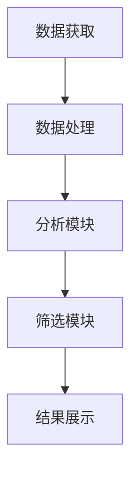

                 


# 巴菲特的价值投资理念：如何识别被低估的股票

> 关键词：巴菲特，价值投资，股票分析，内在价值，安全边际，基本面分析，投资策略

> 摘要：本文深入探讨了巴菲特的价值投资理念，分析了如何通过基本面分析和内在价值评估识别被低估的股票。文章从价值投资的背景出发，详细讲解了巴菲特的投资哲学、选股标准和安全边际的概念，结合实际案例分析，为投资者提供了系统化的投资策略。

---

# 目录

1. 巴菲特价值投资理念的背景与基础
   1.1 价值投资的起源与发展
   1.2 巴菲特的投资策略
   1.3 价值投资的核心分析方法

2. 价值投资的核心分析方法
   2.1 基本面分析
   2.2 财务报表分析
   2.3 内在价值评估

3. 市场分析与安全边际
   3.1 市场周期分析
   3.2 安全边际的评估
   3.3 市场波动中的投资机会

4. 价值投资的选股标准
   4.1 选股的基本原则
   4.2 公司治理与竞争优势
   4.3 行业选择与市场定位

5. 价值投资的系统化实践
   5.1 系统架构设计
   5.2 数据获取与处理
   5.3 股票筛选算法实现
   5.4 实际案例分析

6. 投资实战与最佳实践
   6.1 投资组合管理
   6.2 风险控制与复盘
   6.3 价值投资的长期策略

---

## 正文

### 1. 巴菲特价值投资理念的背景与基础

#### 1.1 价值投资的起源与发展

价值投资是一种长期投资策略，强调以低于内在价值的价格购买优质股票。其核心理念是通过深入分析企业的基本面，识别市场中被低估的投资标的。这一理念起源于20世纪初，本杰明·格雷厄姆和戴维·多德是这一理论的奠基人。

巴菲特作为格雷厄姆的学生，继承并发展了价值投资的理念。他强调企业内在价值的重要性，认为市场先生（市场情绪）往往会导致股票价格偏离其真实价值。投资者应该利用市场的非理性，寻找那些价格低于内在价值的股票。

#### 1.2 巴菲特的投资策略

巴菲特的价值投资策略可以总结为以下几点：

- **长期投资**：巴菲特倡导长期持有优质股票，避免频繁交易，以降低交易成本并享受复利效应。
- **安全边际**：在买入股票时，确保价格远低于内在价值，以应对市场波动和企业经营中的不确定性。
- **选股标准**：选择具有强大竞争优势、良好财务状况和优秀管理层的企业。

### 2. 价值投资的核心分析方法

#### 2.1 基本面分析

基本面分析是价值投资的核心，涉及对企业财务状况、行业地位和竞争优势的全面评估。

- **财务报表分析**：通过利润表、资产负债表和现金流量表，评估企业的盈利能力、资产结构和现金流状况。
- **财务指标分析**：计算关键指标如市盈率（P/E）、市净率（P/B）、股息率等，帮助判断股票的估值水平。

#### 2.2 财务报表分析

财务报表是评估企业基本面的关键工具。以下是对主要财务报表的分析：

- **利润表**：显示企业的收入和利润情况，重点关注净利润、营业收入和毛利率。
- **资产负债表**：反映企业的资产、负债和所有者权益，关注资产结构和负债水平。
- **现金流量表**：记录企业现金流入和流出，评估企业的流动性。

#### 2.3 内在价值评估

内在价值是企业未来现金流的现值，计算通常使用现金流量折现模型（DCF）。公式如下：

$$
\text{内在价值} = \sum_{t=1}^{n} \frac{\text{现金流}_t}{(1 + r)^t} + \frac{\text{残值}}{(1 + r)^n}
$$

其中，\( r \) 是折现率，\( n \) 是估计的永续年份。

### 3. 市场分析与安全边际

#### 3.1 市场周期分析

市场周期分为牛市和熊市，投资者需识别周期变化，避免在市场高点买入，而在低点布局。

- **牛市**：市场情绪乐观，股价可能高估，适合价值投资者寻找低估标的。
- **熊市**：市场情绪悲观，股价可能被低估，是布局优质股票的良机。

#### 3.2 安全边际的评估

安全边际是买入价格与内在价值的差距，提供缓冲以应对市场波动和企业风险。

- **计算方法**：安全边际 = 内在价值 - 市场价格
- **应用原则**：巴菲特定价买入时，安全边际应至少为20%-30%。

### 4. 价值投资的选股标准

#### 4.1 选股的基本原则

- **行业选择**：选择稳定的行业，如消费、金融和公用事业，避免波动性大的行业。
- **竞争优势**：企业应具备强大的护城河，如专利、品牌或成本优势。

#### 4.2 公司治理与竞争优势

- **管理层素质**：优秀管理层能持续创造价值。
- **竞争优势**：企业应具备可持续的竞争优势，如成本优势或品牌忠诚度。

### 5. 价值投资的系统化实践

#### 5.1 系统架构设计

价值投资系统包括数据获取、分析、筛选和结果展示四个模块。架构图如下：



#### 5.2 数据获取与处理

- **数据获取**：从金融数据源获取股票信息，包括财务报表和市场数据。
- **数据清洗**：处理缺失值和异常值，确保数据质量。

#### 5.3 股票筛选算法实现

以下是一个简单的股票筛选算法：

```python
def calculate_intrinsic_value(company_financials):
    # 假设 company_financials 包含净利润、现金流等数据
    cash_flow = company_financials.cash_flow
    discount_rate = 0.10  # 假设折现率为10%
    # 计算DCF
    intrinsic_value = sum(cash_flow / (1 + discount_rate)**t for t in range(10)) 
    return intrinsic_value

def screen_stocks(stocks, threshold):
    undervalued_stocks = []
    for stock in stocks:
        iv = calculate_intrinsic_value(stock.financials)
        market_price = stock.price
        if iv > market_price * threshold:
            undervalued_stocks.append(stock)
    return undervalued_stocks
```

#### 5.4 实际案例分析

以苹果公司为例：

- **财务数据**：净利润1000亿美元，现金流稳定。
- **市场数据**：假设市场价为每股300美元，计算其内在价值远高于当前价格，因此被视为低估。

### 6. 投资实战与最佳实践

#### 6.1 投资组合管理

- **分散投资**：避免过度集中，降低风险。
- **定期复盘**：定期评估投资组合的表现，调整持仓。

#### 6.2 风险控制与复盘

- **止损策略**：设定止损点，避免重大损失。
- **复盘分析**：分析投资决策的正确性，总结经验教训。

#### 6.3 价值投资的长期策略

- **耐心持有**：长期持有优质股票，享受复利效应。
- **持续学习**：不断更新知识，适应市场变化。

---

## 作者：AI天才研究院 & 禅与计算机程序设计艺术

本文由AI天才研究院撰写，结合了巴菲特的价值投资理念与技术分析方法，为投资者提供了系统化的投资策略。如需深入探讨或获取更多资源，请访问我们的网站或联系研究团队。

