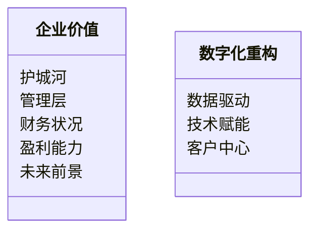
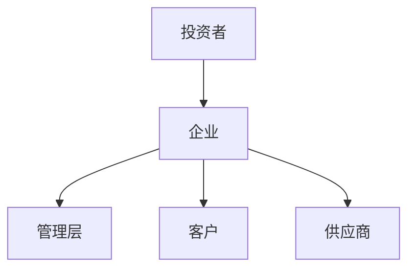

                 


# 巴菲特的价值链分析：数字化转型中的价值重构

> 关键词：巴菲特，价值链分析，数字化转型，价值重构，企业价值，投资策略，数字技术

> 摘要：本文从巴菲特的价值链分析理论出发，结合数字化转型的背景，探讨如何在数字技术的推动下重构企业的价值体系。通过分析数字化转型对企业价值链的影响，提出价值重构的核心要素、实现路径及最佳实践，为企业在数字化浪潮中实现价值最大化提供理论支持和实践指导。

---

## 引言

在数字化转型的浪潮中，企业的价值创造和价值实现方式正在发生深刻变化。传统的价值评估方法已难以适应新的商业模式和技术环境。本文将结合巴菲特的价值链分析理论，探讨如何在数字化转型中重构企业的价值体系，为企业在数字经济时代提供新的价值增长点。

---

## 第一部分：巴菲特的价值链分析基础

### 第1章：巴菲特的价值链分析概述

#### 1.1 巴菲特的价值链理论

##### 1.1.1 价值投资的核心理念
巴菲特的价值投资理念基于“长期持有一只优秀的企业，比短期频繁交易更能创造财富”。他认为企业的核心价值来源于其盈利能力和竞争优势。

- 核心要素：企业的护城河、盈利能力、管理团队、财务健康状况。
- 价值评估：通过对企业未来现金流的折现，评估其内在价值。

##### 1.1.2 企业价值的五要素模型
巴菲特提出了企业价值的五要素模型，包括：

1. **护城河**：企业的竞争优势，即难以被竞争对手复制的能力。
2. **管理层**：管理层的诚信、能力和决策能力。
3. **财务状况**：企业的财务健康状况，包括负债水平、现金流情况。
4. **企业盈利**：企业的盈利能力及其可持续性。
5. **未来前景**：企业未来的增长潜力。

##### 1.1.3 巴菲特投资策略的演变
从早期的“烟屁股”策略到后来的“雪球式”投资，巴菲特的投资策略始终围绕着寻找具有持续竞争优势和稳定现金流的企业。

---

#### 1.2 价值链分析的基本框架

##### 1.2.1 价值链的概念与定义
价值链是指企业从原材料采购、生产加工、销售到最终交付给客户的一系列价值创造活动。

- 核心环节：采购、生产、销售、研发、物流、售后。
- 价值创造：通过优化价值链中的关键环节，提升企业的整体价值。

##### 1.2.2 价值链的构成要素
1. **输入**：原材料、资金、人力资源。
2. **过程**：研发、生产、销售。
3. **输出**：产品或服务、现金流、品牌价值。

##### 1.2.3 价值链分析的意义与作用
- 优化资源配置：通过分析价值链，找出价值创造的关键环节。
- 提升效率：通过流程优化，降低企业成本。
- 战略规划：通过价值链分析，制定企业发展的长期战略。

---

### 第2章：数字化转型的背景与趋势

#### 2.1 数字化转型的背景与趋势

##### 2.1.1 数字化转型的概念与特征
- **定义**：数字化转型是指企业利用数字技术（如人工智能、大数据、云计算等）重构业务模式、组织架构和价值体系的过程。
- **特征**：数据驱动、智能化、个性化、敏捷性。

##### 2.1.2 数字化转型的核心特征
1. **数据驱动**：通过数据的采集、分析和应用，提升决策的科学性。
2. **智能化**：利用人工智能技术，实现业务的自动化和智能化。
3. **个性化**：通过数据分析，满足客户的个性化需求。
4. **敏捷性**：通过数字化工具，快速响应市场变化。

##### 2.1.3 数字化转型对企业的影响
- **竞争优势**：企业通过数字化转型，提升产品和服务的竞争力。
- **运营效率**：通过数字化工具，降低运营成本，提高效率。
- **客户体验**：通过数据分析，提升客户体验，增强客户忠诚度。

---

#### 2.2 数字化转型的驱动力

##### 2.2.1 技术驱动：人工智能与大数据
- 人工智能：通过机器学习算法，优化企业的决策过程。
- 大数据：通过海量数据的分析，为企业提供数据支持。

##### 2.2.2 业务驱动：客户需求变化
- 客户需求的变化促使企业不断调整产品和服务策略。

##### 2.2.3 竞争驱动：行业格局变化
- 数字化转型使得行业竞争格局发生变化，企业需要快速适应新的竞争环境。

---

### 第3章：价值重构的理论基础

#### 3.1 价值重构的概念与内涵

##### 3.1.1 价值重构的定义
价值重构是指在数字化转型的背景下，通过技术手段优化企业的价值链，重构企业的价值体系。

##### 3.1.2 价值重构的核心要素
1. **数据驱动**：通过数据的采集、分析和应用，重构企业的价值链条。
2. **技术赋能**：利用人工智能、大数据等技术，提升企业的价值创造能力。
3. **客户中心**：以客户为中心，重构企业的价值体系。

##### 3.1.3 价值重构的实现路径
- **数据采集**：通过物联网、传感器等技术，采集企业的生产、销售数据。
- **数据分析**：通过大数据分析，找出价值创造的关键环节。
- **流程优化**：通过优化流程，提升企业的运营效率。
- **技术应用**：通过人工智能技术，实现业务的自动化和智能化。

---

## 第二部分：核心概念与联系

### 第4章：核心概念的原理与对比

#### 4.1 巴菲特价值链分析的原理

##### 4.1.1 企业价值的五要素模型
通过分析企业的护城河、管理层、财务状况、盈利能力以及未来前景，评估企业的内在价值。

##### 4.1.2 价值创造的关键环节
通过优化价值链中的关键环节，提升企业的整体价值。

##### 4.1.3 价值评估的核心方法
通过对企业未来现金流的折现，评估其内在价值。

---

#### 4.2 数字化转型中的价值重构原理

##### 4.2.1 数字化对价值链的影响
- 通过数字化技术，重构企业的价值链，提升企业的价值创造能力。

##### 4.2.2 数字化重构的价值链模型
- 数据驱动：通过数据的采集、分析和应用，重构企业的价值链。
- 技术赋能：通过人工智能、大数据等技术，提升企业的价值创造能力。

##### 4.2.3 数字化重构的核心驱动力
- 技术创新：人工智能、大数据等技术的快速发展，为企业的价值重构提供了技术支持。
- 客户需求变化：客户对个性化、智能化产品和服务的需求，推动企业进行价值重构。

---

### 第5章：核心概念的对比与ER实体关系图

#### 5.1 巴菲特价值链分析与数字化重构的对比

##### 5.1.1 核心概念的对比分析
| 比较维度 | 巴菲特价值链分析 | 数字化重构 |
|----------|-----------------|------------|
| 核心要素 | 企业价值五要素 | 数据驱动、技术赋能 |
| 实现路径 | 优化价值链 | 技术驱动、流程优化 |
| 驱动力 | 企业内在价值 | 技术创新、客户需求 |

##### 5.1.2 价值重构的对比特征
- 巴菲特的价值链分析更注重企业内在价值的评估。
- 数字化重构更注重通过技术手段优化企业的价值链。

---

#### 5.2 ER实体关系图

##### 5.2.1 巴菲特价值链分析的ER图
```mermaid
erdiagram
actor 投资者
actor 企业
actor 管理层
actor 客户
actor 供应商
```

##### 5.2.2 数字化重构的ER图
```mermaid
erdiagram
actor 企业
actor 管理层
actor 客户
actor 供应商
```

---

## 第三部分：算法原理与系统架构设计

### 第6章：算法原理讲解

#### 6.1 价值链分析的算法流程

##### 6.1.1 数据清洗
```python
import pandas as pd
data = pd.read_csv('data.csv')
data_clean = data.dropna()
```

##### 6.1.2 特征提取
```python
from sklearn.preprocessing import StandardScaler
features = data_clean[['revenue', 'profit', 'growth']]
scaler = StandardScaler()
features_scaled = scaler.fit_transform(features)
```

##### 6.1.3 模型训练
```python
from sklearn.cluster import KMeans
model = KMeans(n_clusters=3, random_state=42)
model.fit(features_scaled)
```

##### 6.1.4 结果验证
```python
from sklearn.metrics import silhouette_score
score = silhouette_score(features_scaled, model.labels_)
print(f' silhouette score: {score}')
```

---

### 第7章：系统架构设计

#### 7.1 问题场景介绍
在数字化转型中，企业需要通过优化价值链中的关键环节，提升企业的整体价值。通过构建一个基于人工智能的数字化转型系统，帮助企业实现价值重构。

#### 7.2 系统功能设计

##### 7.2.1 领域模型


#### 7.3 系统架构设计

##### 7.3.1 系统架构图


---

## 第四部分：项目实战

### 第8章：环境安装与代码实现

#### 8.1 环境安装
- 安装Python和必要的库：
  ```bash
  pip install numpy pandas scikit-learn
  ```

#### 8.2 代码实现

##### 8.2.1 数据分析
```python
import pandas as pd
import numpy as np
from sklearn.cluster import KMeans
from sklearn.metrics import silhouette_score

data = pd.read_csv('data.csv')
data_clean = data.dropna()

features = data_clean[['revenue', 'profit', 'growth']]
scaler = StandardScaler()
features_scaled = scaler.fit_transform(features)

model = KMeans(n_clusters=3, random_state=42)
model.fit(features_scaled)

score = silhouette_score(features_scaled, model.labels_)
print(f' silhouette score: {score}')
```

---

### 第9章：案例分析与总结

#### 9.1 案例分析
以某制造企业为例，通过数字化转型重构其价值链，提升企业的整体价值。

#### 9.2 总结
数字化转型不仅是技术的变革，更是企业价值重构的过程。通过优化价值链中的关键环节，企业可以在数字经济时代实现持续增长。

---

## 第五部分：最佳实践与注意事项

### 第10章：最佳实践

#### 10.1 价值重构的策略
- **数据驱动**：通过数据的采集、分析和应用，优化企业的价值链。
- **技术赋能**：利用人工智能、大数据等技术，提升企业的价值创造能力。
- **客户中心**：以客户为中心，重构企业的价值体系。

#### 10.2 数字化转型中的注意事项
- **数据安全**：在数字化转型中，企业需要重视数据的安全性。
- **技术选型**：选择适合企业需求的技术方案，避免盲目跟风。

---

### 第11章：小结与展望

#### 11.1 小结
通过巴菲特的价值链分析，结合数字化转型的背景，探讨了如何在数字技术的推动下重构企业的价值体系。通过优化价值链中的关键环节，企业可以在数字经济时代实现持续增长。

#### 11.2 展望
未来，随着人工智能和大数据技术的不断发展，企业价值重构将更加依赖于技术的力量。企业需要不断优化其价值链，以适应新的竞争环境。

---

## 结语

数字化转型不仅是技术的变革，更是企业价值重构的过程。通过优化价值链中的关键环节，企业可以在数字经济时代实现持续增长。未来，随着人工智能和大数据技术的不断发展，企业价值重构将更加依赖于技术的力量。企业需要不断优化其价值链，以适应新的竞争环境。

作者：AI天才研究院/AI Genius Institute & 禅与计算机程序设计艺术 /Zen And The Art of Computer Programming

