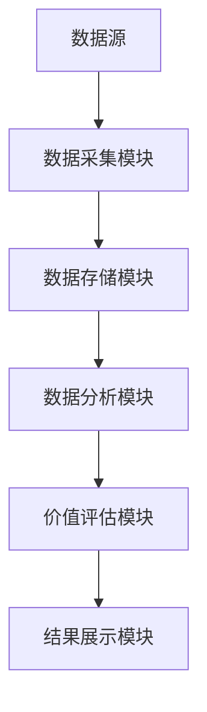

                 


# 巴菲特的价格与价值区分

> 关键词：巴菲特，价值投资，价格与价值，现金流折现法，价值评估系统，Python实现

> 摘要：本文深入探讨了巴菲特的价值投资理念，重点分析了价格与价值之间的区别及其在投资决策中的应用。通过详细讲解价值评估的算法原理、系统架构设计和实际案例分析，帮助读者理解如何在实际操作中应用这些方法。本文还提供了基于Python的代码实现，帮助读者更好地掌握价值评估的技巧。

---

## 第1章：价值投资的背景与基础

### 1.1 价值投资的定义与核心理念
1.1.1 价值投资的基本概念  
1.1.2 巴菲特的价值投资哲学  
1.1.3 价格与价值区别的意义  

### 1.2 巴菲特的投资策略
1.2.1 股票分析的基本框架  
1.2.2 购买优秀企业而非便宜的股票  
1.2.3 长期持有与价值发现  

---

## 第2章：价格与价值的核心概念

### 2.1 价格与价值的定义
2.1.1 价格的定义与影响因素  
2.1.2 价值的定义与衡量标准  
2.1.3 价格与价值的关系  

### 2.2 价格与价值的差异分析
2.2.1 表现形式的差异  
2.2.2 计算方法的对比  
2.2.3 影响因素的对比  

### 2.3 区分价格与价值的重要性
2.3.1 投资决策中的应用  
2.3.2 风险控制的意义  
2.3.3 长期收益的保障  

---

## 第3章：价值评估的算法原理

### 3.1 价值评估的基本方法
3.1.1 市盈率法  
3.1.2 市净率法  
3.1.3 现金流折现法（DCF）  

### 3.2 现金流折现法的详细讲解
3.2.1 DCF模型的数学公式  
$$DCF = \frac{CF_1}{(1+r)^1} + \frac{CF_2}{(1+r)^2} + \dots + \frac{CF_n}{(1+r)^n} + \frac{TV}{(1+r)^n}$$  
3.2.2 模型的实现步骤  
3.2.3 案例分析：某公司的DCF计算  

---

## 第4章：价值评估系统的架构设计

### 4.1 系统功能模块划分
4.1.1 数据采集模块  
4.1.2 数据分析模块  
4.1.3 价值评估模块  
4.1.4 结果展示模块  

### 4.2 系统架构设计
4.2.1 系统架构图（使用mermaid）  


---

## 第5章：项目实战：基于DCF模型的公司价值评估

### 5.1 项目背景与目标
5.1.1 项目背景  
5.1.2 项目目标  

### 5.2 数据收集与预处理
5.2.1 数据来源  
5.2.2 数据清洗与整理  

### 5.3 系统实现
5.3.1 数据分析模块的实现  
5.3.2 价值评估模块的实现  

### 5.4 实际案例分析
5.4.1 案例选择  
5.4.2 DCF模型的计算过程  
5.4.3 结果解读与分析  

### 5.5 代码实现
```python
def calculate_dcf(cash_flows, discount_rate, terminal_value):
    dcf = 0
    for i in range(len(cash_flows)):
        dcf += cash_flows[i] / (1 + discount_rate) ** i
    dcf += terminal_value / (1 + discount_rate) ** len(cash_flows)
    return dcf

# 示例数据
cash_flows = [100, 150, 200]
discount_rate = 0.1
terminal_value = 500

# 计算DCF
dcf_value = calculate_dcf(cash_flows, discount_rate, terminal_value)
print(f"DCF Value: {dcf_value}")
```

---

## 第6章：最佳实践与注意事项

### 6.1 小结
6.1.1 核心要点回顾  
6.1.2 技术总结  

### 6.2 注意事项
6.2.1 数据来源的可靠性  
6.2.2 模型假设的合理性  
6.2.3 结果的验证与调整  

### 6.3 拓展阅读
6.3.1 推荐书籍  
6.3.2 相关文献  

---

## 作者信息

作者：AI天才研究院/AI Genius Institute  
联系邮箱：contact@aicourse.com  
GitHub：github.com/aicourse  

---

通过以上目录大纲，文章将详细讲解巴菲特的价格与价值区分，结合理论与实践，帮助读者深入理解价值投资的核心理念和实际操作方法。

