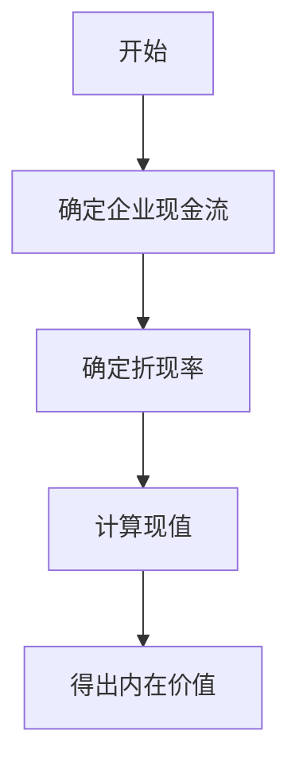
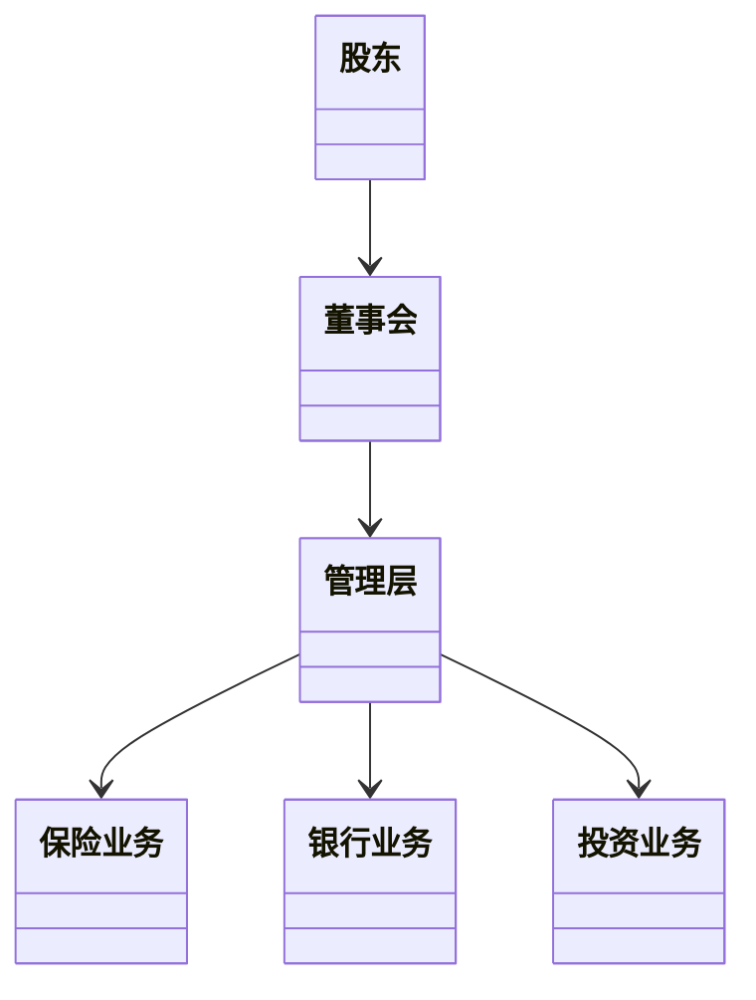

                 


# 巴菲特的伯克希尔哈撒韦模式：控股公司的优势

## 关键词：
- 巴菲特、伯克希尔哈撒韦、控股公司、价值投资、投资策略、风险管理

## 摘要：
本文深入分析了巴菲特的伯克希尔哈撒韦模式，探讨了其作为控股公司的优势。通过详细阐述巴菲特的投资哲学、控股公司的结构、价值评估方法以及风险管理策略，本文为读者提供了全面的理解。同时，通过实际案例分析和数学模型，本文展示了如何将理论应用于实践，帮助读者掌握巴菲特的成功之道。

---

# 第一部分: 巴菲特与伯克希尔哈撒韦的背景

## 第1章: 巴菲特的生平与投资哲学

### 1.1 巴菲特的早年经历与职业发展
沃伦·巴菲特，1934年出生于美国内布拉斯州的奥马哈。他在童年时期展现出对数字的天赋，12岁时完成了第一笔投资，购买了6股Cities Service的股票，这为他后来的投资生涯奠定了基础。巴菲特在内布拉斯大学获得了学士学位，并在哥伦比亚大学获得了经济学硕士学位。他的导师本杰明·格雷厄姆对他的投资理念影响深远，特别是价值投资的概念。

巴菲特的职业生涯始于纽约证券交易所，他在1956年筹集了100万美元资金，开始管理合伙公司。1965年，他收购了伯克希尔哈撒韦公司，将其从一家濒临破产的纺织公司转变为一家多元化的控股公司。

### 1.2 巴菲特的投资理念与价值投资原则
巴菲特的价值投资理念基于格雷厄姆的理论，强调寻找具有内在价值的股票，这些股票通常被市场低估。他的投资原则包括：
1. **长期投资**：巴菲特主张长期持有优质股票，而非频繁交易。
2. **安全边际**：在购买股票时，确保价格远低于其内在价值。
3. **竞争优势**：投资那些具有持续竞争优势的企业。
4. **分散投资**：通过投资多个行业来降低风险。

### 1.3 巴菲特的慈善与社会贡献
巴菲特以其巨额财富投入慈善事业，尤其是通过“Giving Pledge”承诺将至少一半的财富捐给慈善事业。他的慈善理念强调教育、医疗和减少贫富差距。

## 第2章: 伯克希尔哈撒韦的历史与发展

### 2.1 伯克希尔哈撒韦的成立与早期业务
伯克希尔哈撒韦最初是一家纺织公司，成立于1839年。1965年，巴菲特收购了该公司，并将其转型为一家控股公司。早期，伯克希尔主要投资于纺织、保险和银行业务。

### 2.2 巴菲特时代的核心转型
在巴菲特的领导下，伯克希尔从一家纺织公司转变为多元化的控股公司。他通过收购多家优秀企业，如 GEICO（政府雇员保险公司）和喜诗糖果，构建了一个强大的企业帝国。

### 2.3 伯克希尔哈撒韦的全球化扩展
随着业务的扩展，伯克希尔进入多个领域，包括保险、银行、能源、铁路和零售。全球化战略使伯克希尔成为一家真正的跨国公司，业务遍布全球。

---

# 第二部分: 巴菲特的多元业务模式

## 第3章: 巴菲特的控股公司架构

### 3.1 控股公司的定义与特点
控股公司是指通过持有其他公司一定比例的股份，从而控制这些公司运营的实体。其特点包括：
- **多元化业务**：控股公司通常涉及多个行业，分散风险。
- **股权结构**：控股公司通常通过少数股权实现控制，而非全资控股。
- **协同效应**：通过不同业务的协同，提高整体效率。

### 3.2 巴菲特的控股公司治理
伯克希尔的治理结构以股东为中心，强调透明化和长期主义。巴菲特通过股东大会与股东保持密切沟通，确保股东利益最大化。

---

# 第三部分: 巴菲特的价值投资原则

## 第4章: 巴菲特的价值投资原则

### 4.1 股票的内在价值计算
巴菲特使用现金流折现模型（DCF）评估股票的内在价值。公式如下：

$$
\text{内在价值} = \sum_{t=1}^{\infty} \frac{\text{现金流}_t}{(1 + r)^t}
$$

其中，\( r \) 是折现率，\( \text{现金流}_t \) 是第 \( t \) 年的现金流。

### 4.2 投资项目的筛选与评估
巴菲特注重企业的财务健康状况、管理层能力和行业地位。他通过分析企业的ROE（净资产收益率）和ROA（资产回报率）来评估企业的盈利能力。

---

# 第四部分: 巴菲特控股公司治理

## 第5章: 巴菲特的控股公司治理

### 5.1 股东大会的作用与意义
伯克希尔的股东大会是巴菲特与股东沟通的重要平台。通过每年的股东大会，巴菲特向股东汇报公司的经营状况，并回答股东的问题。

### 5.2 管理层的激励与约束机制
伯克希尔的管理层通过长期激励计划（如股票期权）与公司利益绑定，确保管理层与股东利益一致。

### 5.3 独立董事的职责与作用
伯克希尔的董事会由独立董事和管理层组成，独立董事负责监督管理层，确保公司治理的透明性和公正性。

---

# 第五部分: 巴菲特控股模式的数学模型与算法

## 第6章: 巴菲特的价值投资数学模型

### 6.1 现金流折现模型（DCF）
使用Mermaid流程图展示DCF模型的步骤：



### 6.2 投资组合优化算法
使用Python代码实现投资组合优化：

```python
import numpy as np
import pandas as pd

# 示例数据
returns = pd.DataFrame({
    '股票A': [0.1, 0.05, -0.02],
    '股票B': [0.08, 0.03, 0.05],
    '股票C': [0.06, 0.1, -0.03]
})

# 计算最优投资组合
def compute_portfolio_optimization(returns, risk_aversion=0.01):
    n = returns.shape[1]
    returns_mean = returns.mean()
    covariance_matrix = returns.cov()
    
    # 计算权重
    weights = np.linalg.solve(risk_aversion * covariance_matrix, returns_mean)
    weights = weights / np.sum(weights)
    return weights

weights = compute_portfolio_optimization(returns)
print("最优权重:", weights)
```

---

# 第六部分: 系统分析与架构设计

## 第7章: 伯克希尔哈撒韦的业务架构

### 7.1 领域模型
使用Mermaid类图展示伯克希尔的业务结构：



### 7.2 系统架构
使用Mermaid架构图展示伯克希尔的系统架构：


---

# 第七部分: 项目实战

## 第8章: 实战案例分析

### 8.1 案例：可口可乐的投资
伯克希尔于1988年投资可口可乐，持有多年后获利丰厚。案例分析展示了巴菲特如何通过长期投资获得超额收益。

### 8.2 案例：苹果的入股
2019年，伯克希尔斥资350亿美元收购苹果公司超过5%的股份，成为其第二大股东。这一案例展示了巴菲特对科技行业潜力的认可。

---

# 第八部分: 最佳实践与小结

## 第9章: 巴菲特的成功经验总结

### 9.1 长期投资的重要性
巴菲特强调长期投资，避免短期市场的波动干扰。

### 9.2 分散投资的风险管理
通过多元化投资降低风险，同时集中投资于优质企业。

### 9.3 管理层激励与企业治理
良好的公司治理和管理层激励机制是企业长期发展的关键。

---

# 结语

## 作者：AI天才研究院 & 禅与计算机程序设计艺术

通过本文的分析，我们可以看到巴菲特的伯克希尔哈撒韦模式的成功之处在于其长期投资、价值发现和卓越的公司治理。这些原则不仅适用于投资，也可以应用于企业的管理与运营。希望本文能为读者提供有价值的见解，帮助他们在投资和管理领域取得成功。

