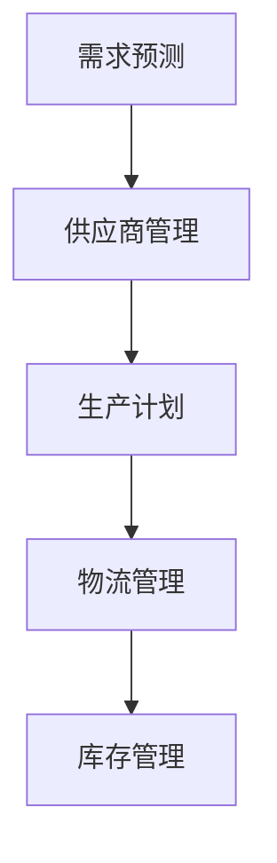
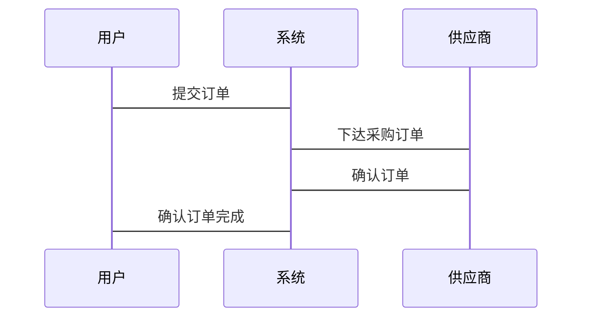

                 


# 巴菲特的供应链韧性分析：全球化挑战下的应对之策

## 关键词：供应链韧性、巴菲特、全球化挑战、供应链优化、供应链管理、风险评估

## 摘要：本文通过分析巴菲特的供应链管理策略，探讨在全球化挑战下如何提升供应链韧性。从供应链的基本概念到具体的优化方法，结合实际案例，详细阐述供应链韧性分析的核心框架与实践应用，为企业应对全球化挑战提供策略支持。

---

## 第一部分: 供应链韧性的概念与背景

### 第1章: 供应链韧性的概念与背景

#### 1.1 供应链的基本概念

供应链是指从原材料采购到产品交付给最终用户的整个过程中的所有参与方和活动。它包括供应商、制造商、分销商、零售商以及消费者等环节。供应链的有效运作依赖于各环节之间的协调与合作。

供应链韧性是指在面对 disruptions（如自然灾害、疫情、地缘政治冲突等）时，供应链能够维持运作、快速恢复并适应变化的能力。一个有韧性的供应链能够在危机中保持稳定，减少对业务的影响。

#### 1.2 全球化挑战下的供应链问题

全球化使得供应链更加复杂和全球化，但也带来了更多的风险。例如，新冠疫情导致的供应链中断、地缘政治冲突引发的物流问题、自然灾害造成的生产中断等。这些因素使得供应链韧性成为企业战略的重要组成部分。

#### 1.3 巴菲特视角下的供应链管理

巴菲特作为世界著名投资家，他的投资哲学和管理理念对企业供应链管理有着重要的启示。他注重长期投资、价值投资和企业的稳健运营，这些理念同样适用于供应链管理。巴菲特的供应链管理注重风险控制、成本优化和长期稳定性。

---

## 第二部分: 巴菲特的供应链管理实践

### 第2章: 巴菲特的供应链管理实践

#### 2.1 巴菲特供应链管理的核心理念

巴菲特的供应链管理核心理念包括：

1. **长期主义**：注重供应链的长期稳定，而非短期利益。
2. **价值投资**：选择具有强大供应链能力和良好财务状况的企业。
3. **风险管理**：识别和管理供应链中的潜在风险，确保供应链的韧性。

#### 2.2 巴菲特的经典供应链案例分析

1. **可口可乐的供应链管理**：
   - 巴菲特投资可口可乐后，推动其供应链优化，包括全球布局和区域化管理。
   - 通过与供应商建立长期合作关系，确保原材料供应的稳定性。

2. **卡夫亨氏供应链的优化**：
   - 巴菲特通过投资卡夫亨氏，推动其供应链的区域化和本地化，减少物流成本。
   - 通过数据分析优化库存管理，提高供应链效率。

3. **海外供应链布局**：
   - 巴菲特注重在多个国家建立供应链网络，以分散风险，确保在某一地区出现问题时，其他地区的供应链能够弥补。

#### 2.3 巴菲特供应链管理的哲学总结

1. **长期主义**：巴菲特认为供应链的稳定性需要长期投入和建设。
2. **价值投资**：选择具有强大供应链能力和良好财务状况的企业。
3. **风险管理**：识别和管理供应链中的潜在风险，确保供应链的韧性。

---

## 第三部分: 供应链韧性分析的框架与方法

### 第3章: 供应链韧性分析的框架与方法

#### 3.1 供应链韧性分析的核心要素

1. **复杂性**：供应链涉及的环节越多，复杂性越高，韧性越难管理。
2. **脆弱性**：供应链中的薄弱环节可能导致中断。
3. **恢复能力**：供应链在中断后快速恢复的能力。

#### 3.2 供应链韧性分析的定量方法

1. **供应链网络模型**：通过网络流算法分析供应链的瓶颈和关键节点。
2. **供应链风险评估指标**：包括供应中断风险、成本波动风险、物流风险等。
3. **供应链韧性评分系统**：通过综合评估各指标，给供应链韧性打分。

#### 3.3 供应链韧性分析的定性方法

1. **供应链韧性评估的维度**：包括灵活性、冗余性、透明度等。
2. **供应链韧性分析的流程**：包括识别风险、评估影响、制定应对策略。
3. **供应链韧性优化的策略**：包括多元化供应商、本地化生产、建立应急储备等。

---

## 第四部分: 供应链网络优化与韧性提升

### 第4章: 供应链网络优化与韧性提升

#### 4.1 供应链网络优化的核心算法

1. **网络流算法**：用于优化供应链中的物流和信息流，减少成本和时间。
2. **库存优化算法**：通过动态规划优化库存水平，降低库存成本。
3. **博弈论模型**：分析供应链中的博弈关系，优化各方利益。

#### 4.2 供应链优化的策略

1. **节点优化**：优化供应链中的关键节点，提高效率。
2. **路径优化**：优化物流路径，降低运输成本。
3. **库存优化**：通过数据分析优化库存水平，减少浪费。

#### 4.3 供应链韧性提升的策略

1. **多元化供应商**：通过多元化供应商降低供应风险。
2. **本地化生产**：在多个地区建立生产基地，分散风险。
3. **建立应急储备**：在关键节点建立应急储备，确保供应链中断时的稳定性。

---

## 第五部分: 供应链系统架构与技术实现

### 第5章: 供应链系统架构与技术实现

#### 5.1 供应链系统的模块划分

1. **需求预测模块**：基于历史数据和市场趋势预测需求。
2. **供应商管理模块**：管理供应商信息，评估供应商绩效。
3. **生产计划模块**：制定生产计划，协调生产与供应链各环节。
4. **物流管理模块**：优化物流路径，管理运输过程。
5. **库存管理模块**：监控库存水平，优化库存策略。

#### 5.2 供应链系统的数据流设计



#### 5.3 供应链系统的接口设计

1. **供应商接口**：与供应商系统对接，获取供应信息。
2. **客户接口**：与客户系统对接，获取订单信息。
3. **物流接口**：与物流公司系统对接，获取物流信息。

#### 5.4 供应链系统的交互设计



---

## 第六部分: 项目实战——基于巴菲特供应链优化的行业案例分析

### 第6章: 项目实战——基于巴菲特供应链优化的行业案例分析

#### 6.1 项目背景与目标

1. **项目背景**：选择一个行业（如制造业）进行供应链优化。
2. **项目目标**：通过优化供应链，提高供应链韧性，降低成本。

#### 6.2 项目实施步骤

1. **环境搭建**：选择一个具体企业，收集相关数据。
2. **数据收集**：收集供应链各环节的数据，包括供应商信息、生产数据、物流数据等。
3. **模型构建**：基于网络流算法构建供应链网络模型。
4. **优化实施**：根据模型结果优化供应链各环节，如供应商选择、物流路径优化等。
5. **结果分析**：分析优化后的供应链效果，评估供应链韧性。

#### 6.3 项目代码实现

```python
import networkx as nx
from networkx.algorithms import max_flow
from networkx.algorithms.flow import ford_fulkerson

# 创建供应链网络模型
G = nx.DiGraph()
G.add_nodes_from(['Source', 'A', 'B', 'C', 'Sink'])

G.add_edge('Source', 'A', capacity=10)
G.add_edge('Source', 'B', capacity=15)
G.add_edge('A', 'C', capacity=8)
G.add_edge('B', 'C', capacity=10)
G.add_edge('C', 'Sink', capacity=20)

# 计算最大流
flow_value, flow_dict = ford_fulkerson(G, 'Source', 'Sink')
print("最大流:", flow_value)
print("流网络:", flow_dict)
```

---

## 第七部分: 总结与展望

### 第7章: 总结与展望

#### 7.1 总结

本文通过分析巴菲特的供应链管理策略，探讨了在全球化挑战下如何提升供应链韧性。从供应链的基本概念到具体的优化方法，结合实际案例，详细阐述了供应链韧性分析的核心框架与实践应用。

#### 7.2 展望

未来，随着人工智能和大数据技术的发展，供应链管理将更加智能化和数据驱动。企业可以通过预测分析、实时监控和智能优化来进一步提升供应链韧性。同时，区块链技术的应用也将提高供应链的透明度和安全性，为企业提供更强大的供应链管理工具。

---

## 作者：AI天才研究院/AI Genius Institute & 禅与计算机程序设计艺术 /Zen And The Art of Computer Programming

---

以上是基于用户需求设计的文章目录和内容结构，涵盖了供应链韧性分析的核心内容，从理论到实践，结合巴菲特的供应链管理策略，为企业应对全球化挑战提供了有益的指导和参考。

