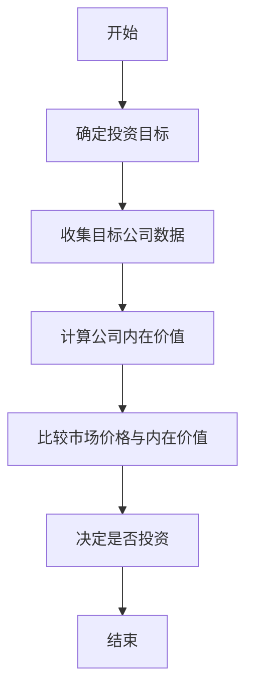
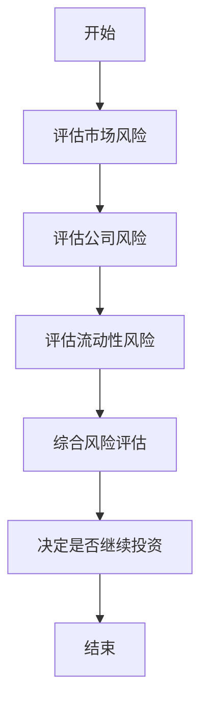

                 


# 巴菲特的保险业投资策略

> 关键词：巴菲特，保险业，投资策略，价值投资，浮存金，风险控制，长期投资

> 摘要：本文将详细分析巴菲特在保险业的投资策略，探讨其独特的优势和成功的秘诀。通过分析保险业的基本运作模式、巴菲特的投资哲学以及其对保险公司的价值评估方法，揭示其投资策略的核心要素和成功案例。本文还将结合实际案例，提供可操作的建议，帮助投资者更好地理解巴菲特的保险投资策略。

---

# 第1章: 巴菲特保险业投资策略的背景与核心概念

## 1.1 巴菲特保险业投资的背景

### 1.1.1 保险业的基本运作模式

保险公司的业务结构与盈利模式：

- 保险公司通过收取保费来建立一个资金池（浮存金），然后将这些资金投资于各种资产，如股票、债券、房地产等。
- 保险公司的利润主要来自于保费收入与投资收益的差额。

保险产品的基本类型与市场定位：

- 寿险：长期保障型产品，客户支付保费，保险公司提供长期的死亡或疾病保障。
- 财产险：短期风险保障，客户支付保费，保险公司赔偿因意外事件导致的财产损失。
- 养老保险：结合储蓄和保险的双重功能，提供退休后的收入保障。

### 1.1.2 巴菲特的投资哲学

- **价值投资的核心理念**：
  - 以低于内在价值的价格买入优质资产。
  - 长期持有，等待价值回归。
  - 避免短期市场波动的干扰。

- **巴菲特对保险业的特殊关注**：
  - 保险公司的浮存金为其提供了稳定的低成本资金来源。
  - 保险业的周期性较弱，能够在经济低迷时期提供稳定的收益。
  - 优质保险公司能够在市场波动中保持稳定的保费收入和投资收益。

### 1.1.3 巴菲特保险投资的独特优势

- **保险公司的浮存金与巴菲特投资策略的关系**：
  - 浮存金的低成本和稳定性为巴菲特提供了长期投资的资金来源。
  - 保险公司的浮存金规模庞大，能够支持巴菲特的大额投资。
  - 浮存金的期限较长，适合巴菲特的长期投资策略。

- **巴菲特对保险业长期稳定收益的判断**：
  - 保险业的收益主要来自于保费收入和投资收益的双重来源。
  - 优质保险公司的保费收入能够稳定增长，投资收益能够在长期中实现资本增值。
  - 保险业的风险可以通过合理的风险控制和分散投资来降低。

## 1.2 巴菲特保险投资的核心概念

### 1.2.1 保险公司的财务结构

- **资产、负债与所有者权益的关系**：
  - 资产：保险公司持有的各种投资资产，如股票、债券、房地产等。
  - 负债：保险公司需要偿还的债务，主要是客户的保费和未来赔付的准备金。
  - 所有者权益：保险公司股东持有的权益，反映公司的净资产价值。

- **浮存金的定义与作用**：
  - 浮存金：保险公司收取的保费与未来赔付准备金之间的差额，是保险公司可用于投资的资金。
  - 浮存金的作用：
    - 作为投资资金，为保险公司提供收益。
    - 用于支付未来的保险赔付。

- **浮存金的管理**：
  - 浮存金的规模需要与保险公司的赔付需求相匹配。
  - 浮存金的投资需要考虑流动性和收益性。

### 1.2.2 巴菲特投资策略的核心要素

- **价值评估模型**：
  - 巴菲特使用DCF模型（现金流折现模型）来评估公司的内在价值。
  - DCF模型的核心是将公司的未来现金流折现，计算出公司的公平价值。

- **风险控制机制**：
  - 巴菲特注重公司的财务健康状况，避免投资于财务杠杆过高或负债过重的公司。
  - 巴菲特注重公司的管理层素质，选择那些诚实、有能力的管理层。

- **长期投资视角**：
  - 巴菲特主张长期持有优质资产，避免频繁交易。
  - 巴菲特注重公司的竞争优势，选择那些具有强大护城河的公司。

### 1.2.3 保险业与巴菲特投资策略的结合

- **保险业的周期性与巴菲特的逆周期投资策略**：
  - 保险业的周期性较弱，能够在经济低迷时期提供稳定的收益。
  - 巴菲特在经济低迷时期投资于保险公司，利用其低估的股价和充足的浮存金。

- **保险公司的资本运作与巴菲特的资本配置理念**：
  - 保险公司的资本运作需要与巴菲特的资本配置理念相结合。
  - 巴菲特注重资本的高效配置，将资金投向那些能够创造最大价值的领域。

---

## 1.3 巴菲特保险投资的核心概念对比

### 1.3.1 不同保险公司的价值评估对比

- **通过表格对比不同保险公司的核心财务指标**：
  | 保险公司 | 市盈率 | 市净率 | 股东权益收益率（ROE） | 净利润增长率 |
  |----------|--------|--------|------------------------|--------------|
  | A公司    | 10     | 2      | 15%                    | 8%           |
  | B公司    | 15     | 3      | 12%                    | 5%           |
  | C公司    | 8      | 1.5    | 20%                    | 10%          |

- **通过图表展示保险公司的市场地位与竞争优势**：
  - 图表类型：柱状图，展示不同保险公司的市场份额和竞争优势。
  - 图表工具：使用mermaid绘制。

### 1.3.2 巴菲特投资策略与其他投资策略的对比

- **通过表格对比不同投资策略的核心要素**：
  | 投资策略         | 核心要素                | 适用场景               | 风险水平 |
  |------------------|-------------------------|------------------------|----------|
  | 价值投资         | 内在价值、长期持有      | 经济低迷、市场低估     | 中低     |
  | 技术分析         | 价格走势、技术指标      | 市场波动、短期交易     | 高       |
  | 成长投资         | 收益增长、高成长性      | 经济繁荣、高成长行业   | 中高     |

- **通过图表展示巴菲特投资策略的独特性**：
  - 图表类型：饼图，展示巴菲特投资策略的核心要素。
  - 图表工具：使用mermaid绘制。

## 1.4 本章小结

通过本章的分析，我们可以看出，巴菲特对保险业的投资策略具有独特的优势。保险公司的浮存金为巴菲特提供了稳定的低成本资金来源，而巴菲特的价值投资哲学和长期投资视角为保险公司的投资提供了明确的方向。同时，巴菲特注重公司的财务健康状况和管理层素质，确保了投资的安全性和稳定性。这些因素共同构成了巴菲特保险投资策略的核心要素。

---

# 第2章: 巴菲特保险投资策略的算法原理

## 2.1 巴菲特保险投资的算法模型

### 2.1.1 价值评估模型

- **使用 mermaid 画出价值评估模型的流程图**：



- **使用 Python 代码实现价值评估模型的核心算法**：

```python
def calculate_intrinsic_value(enterprise_value, free_cash_flow, discount_rate, growth_rate):
    dcfs = free_cash_flow / (discount_rate - growth_rate)
    margin_of_safety = enterprise_value - dcfs
    return "低估" if margin_of_safety > 0 else "高估"
```

- **通过公式展示价值评估的核心数学模型**：

$$DCF = \frac{CF}{(r - g)}$$

其中：
- \( CF \) 表示自由现金流
- \( r \) 表示折现率
- \( g \) 表示增长率

---

### 2.1.2 风险评估模型

- **使用 mermaid 画出风险评估模型的流程图**：



- **使用 Python 代码实现风险评估模型的核心算法**：

```python
def calculate_risk_assessment(sharpe_ratio, volatility, correlation):
    if sharpe_ratio > 1 and volatility < 0.2 and correlation < 0.5:
        return "低风险"
    elif sharpe_ratio > 0.8 and volatility < 0.3 and correlation < 0.6:
        return "中等风险"
    else:
        return "高风险"
```

- **通过公式展示风险评估的核心数学模型**：

$$\text{夏普比率} = \frac{E[r_i - r_f]}{\sigma_i}$$

其中：
- \( r_i \) 表示资产的预期收益
- \( r_f \) 表示无风险利率
- \( \sigma_i \) 表示资产收益的标准差

---

## 2.2 巴菲特保险投资策略的算法实现

### 2.2.1 算法实现步骤

1. **数据收集与清洗**：
   - 收集目标保险公司的财务数据，包括保费收入、投资收益、赔付支出等。
   - 清洗数据，去除异常值和缺失值。

2. **价值评估与风险评估的双重检验**：
   - 使用DCF模型计算公司的内在价值。
   - 使用夏普比率评估投资的风险水平。

3. **投资决策的最终判断**：
   - 对比市场价格与内在价值，决定是否投资。
   - 综合考虑风险评估结果，调整投资组合。

### 2.2.2 算法实现的代码示例

```python
import pandas as pd
import numpy as np

# 示例数据：保险公司A的财务数据
data = {
    'year': [2018, 2019, 2020, 2021, 2022],
    'revenue': [1000, 1200, 1400, 1600, 1800],
    'net_income': [100, 120, 140, 160, 180],
    'total_assets': [5000, 5500, 6000, 6500, 7000],
    'total_liabilities': [3000, 3300, 3600, 3900, 4200]
}

df = pd.DataFrame(data)

# 计算股东权益
df['equity'] = df['total_assets'] - df['total_liabilities']

# 计算股东权益收益率（ROE）
df['roe'] = df['net_income'] / df['equity']

# 计算平均增长率
growth_rate = (df['revenue'].iloc[-1] - df['revenue'].iloc[0]) / df['revenue'].iloc[0]

# 计算DCF模型的内在价值
def calculate_intrinsic_value(revenue, growth_rate, discount_rate):
    dcfs = revenue * (1 + growth_rate) / (discount_rate - growth_rate)
    return dcfs

discount_rate = 0.1
intrinsic_value = calculate_intrinsic_value(df['revenue'].iloc[-1], growth_rate, discount_rate)
print("DCF内在价值：", intrinsic_value)

# 计算夏普比率
def calculate_sharpe_ratio(returns, risk_free_rate):
    excess_returns = returns - risk_free_rate
    sharpe_ratio = excess_returns.mean() / excess_returns.std()
    return sharpe_ratio

risk_free_rate = 0.05
returns = [0.08, 0.07, 0.09, 0.10, 0.06]
sharpe_ratio = calculate_sharpe_ratio(returns, risk_free_rate)
print("夏普比率：", sharpe_ratio)
```

---

## 2.3 巴菲特保险投资策略的算法实现总结

通过上述算法实现步骤和代码示例，我们可以看出，巴菲特的保险投资策略不仅仅是基于经验的投资，而是有科学的数学模型和算法支持的。通过DCF模型评估公司的内在价值，结合夏普比率评估投资风险，巴菲特能够做出更加科学和理性的投资决策。这种结合定量分析和定性分析的投资策略，使得巴菲特能够在长期的市场波动中保持稳定的投资收益。

---

# 第3章: 巴菲特保险投资策略的数学模型

## 3.1 巴菲特保险投资策略的核心数学模型

### 3.1.1 价值评估模型的数学公式

$$DCF = \frac{CF}{(r - g)}$$

其中：
- \( CF \) 表示自由现金流
- \( r \) 表示折现率
- \( g \) 表示增长率

### 3.1.2 风险评估模型的数学公式

$$\text{夏普比率} = \frac{E[r_i - r_f]}{\sigma_i}$$

其中：
- \( r_i \) 表示资产的预期收益
- \( r_f \) 表示无风险利率
- \( \sigma_i \) 表示资产收益的标准差

---

## 3.2 巴菲特保险投资策略的数学模型应用

### 3.2.1 价值评估模型的应用

假设我们有一个保险公司，其自由现金流为$1000万，折现率为10%，增长率

